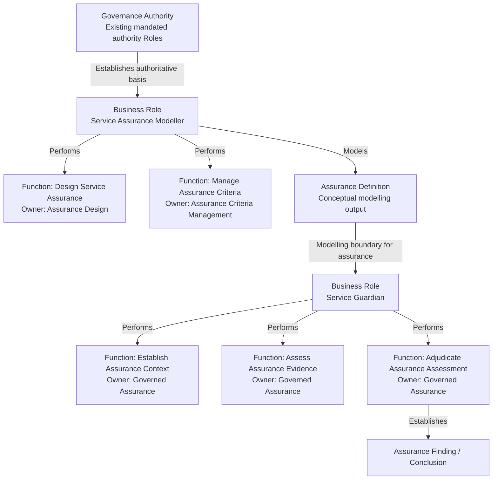
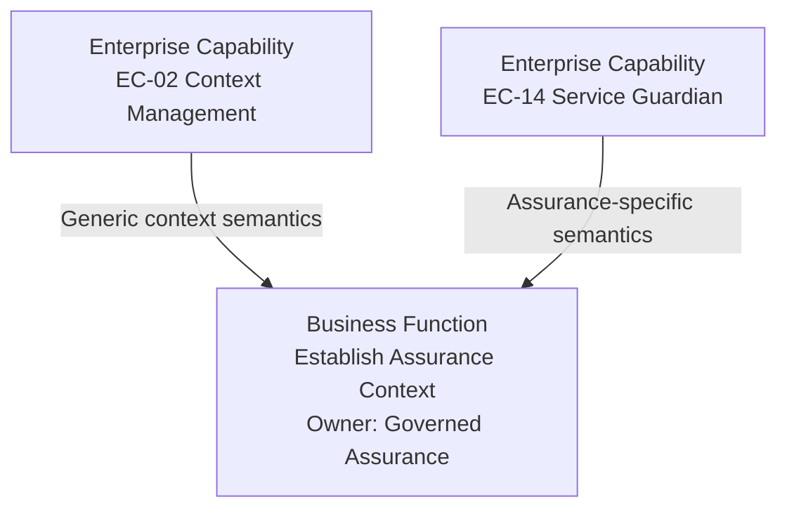

# Health Service Assurance — Bounded Business Architecture Derivation

## 1. Authority and Derivation Scope

This view carries the [approved Domain02 Health Service Assurance derivation](../../02-strategy/capability-maps/health-service-assurance-derivation.md) into Domain03. Its upstream responsibility chain is [REQ-FND-005 — Independent Assurance of Governed Activity](../../01-motivation/requirements-constraints/foundational-requirements.md#req-fnd-005-independent-assurance-of-governed-activity) → [BC-18 Health Service Assurance](../../02-strategy/capabilities/business-capabilities.md#18-health-service-assurance) → **Assurance Design**, **Assurance Criteria Management** and **Governed Assurance**, with the approved collaborative Enterprise Capability contributions including **EC-14 Service Guardian**.

[AX-14](../../../architectural-axioms.md#ax-14--semantic-distinctions-are-preserved) requires the responsibility distinctions below to remain explicit. [AX-17](../../../architectural-axioms.md#ax-17--architectural-authority-and-explicit-uncertainty) and the [Domain03 metamodel](../metamodel/business-architecture-metamodel.md) require established responsibility to be distinguished from unestablished naming, decomposition, exposure, progression and authority relationships. AX-06, AX-07, AX-08 and AX-09 continue to govern information authority, governed access, meaningful evidence and contextual evidence selection. AX-15 governs operational uncertainty without making it equivalent to insufficient assurance evidence.

The approved human review decisions on 2026-10-08 extend the previous bounded derivation with **[Service Assurance Modeller](../actors-roles/roles.md#service-assurance-modeller)** and **[Service Guardian](../actors-roles/roles.md#service-guardian)** Business Roles and exactly five Business Functions: **Design Service Assurance**, **Manage Assurance Criteria**, **Establish Assurance Context**, **Assess Assurance Evidence** and **Adjudicate Assurance Assessment**. Their capability ownership and Role performance are documented in §3. The assurance Role previously named Guardian is now Service Guardian; legal/personal-welfare Guardian remains unchanged. These naming and Function-decomposition decisions are resolved; further decomposition is not approved.

The three assurance capabilities remain established responsibility contexts with unresolved contextual-view placement, Capability Tier, complete ancestry, Feature decomposition and structural Canonical IDs. This document is a capability-scoped view, not a sixth contextual view or an identifier ancestor. It allocates no specific Actors, exposed Business Services, Processes, Interactions or Collaborations.

**EC-14 Service Guardian is an Enterprise Capability. Service Guardian is also the intentional canonical name of a distinct Business Role.** Shared terminology does not equate their architectural types or make either a software component. The approved Role/Function decisions supply the new Business Architecture relationships; they are not inferred from the EC contribution model or its explanatory sequence. The previous completion report supplies execution context only and is not architectural authority.

## 2. Governance, Management, Guardianship and Clinical Authority

```text
Governance defines
       ↓
Management performs
       ↓
Guardianship assures
```

This expresses semantic responsibilities, not organisational structure, a compulsory execution sequence or technical topology.

| Responsibility | Business meaning | Preserved boundary |
| :--- | :--- | :--- |
| **Governance** | Defines applicable requirements, obligations, authority, constraints, controls, reporting requirements and checkpoints. | Establishes the normative envelope without taking over the operational means or progression of the governed activity. Subject-specific governance remains intrinsic to its established subject capability. |
| **Operational management** | Performs or manages the subject activity within its constraints, including monitoring for progression, assignment, delegation, operational escalation, response, remediation and expected failure/recovery. | Monitoring for operational completion or deciding what happens next does not establish independent assurance. |
| **Service Assurance modelling** | Service Assurance Modeller determines and models how satisfaction of governed requirements, constraints and expected behaviours is to be assured within Assurance Design and Assurance Criteria Management. | Modelling does not inherently approve the governing requirement, Assurance Definition or Assurance Criteria, perform independent assurance, or manage the subject. |
| **Guardianship / governed assurance** | Service Guardian independently evaluates governed activity, information, state or outcomes against applicable criteria and establishes findings and conclusions from sufficient trustworthy evidence. | Service Guardian may manage its own assurance activity; it does not thereby perform or manage the subject, direct its operational response or confer clinical authority. |
| **Clinical review / clinical assurance** | Exercises the applicable clinical process and authority's responsibility for clinical evaluation and professional judgement. | Neither assurance Role establishes clinical adequacy, clinical correctness or professional clinical judgement. Clinical quality, safety and improvement retain their existing responsibilities. |

**Governance Authority establishes what is authoritative. Service Assurance Modeller models how satisfaction will be assured. Service Guardian independently establishes what the applicable evidence demonstrates.** Governance Authority references the [existing mandated authority Roles](../actors-roles/roles.md#37-governance-authority-and-assurance-modelling), including Policy Authority for policy and Regulator for statutory authority, with existing steward mandates preserved. No new Governance Authority Role or extension of those mandates is established. Modelling does not grant approval authority for the governing requirement, Assurance Definition or Assurance Criteria; exact approval allocation/workflows remain unresolved.



This is a responsibility/semantic model, not mandatory execution topology, organisational or application structure, deployment topology or a complete Business Process. The output labels do not introduce Information Objects or a formal information model. The diagram distinguishes performance through a Role from Function ownership by a Capability and does not define process ordering or an assurance initiation/approval exchange.

A real-world Actor may fulfil different Roles in different contexts where governance permits. That possibility does not relax REQ-FND-005: assurance progression and conclusion must remain independently governed rather than controlled by the performer or manager of the subject. The subject may contribute evidence but must not solely determine, suppress, manufacture or retrospectively alter its assurance conclusion. Evidence dependency and control dependency remain distinct.

Neither Service Assurance Modeller nor Service Guardian inherently possesses clinical authority or replaces professional clinical judgement, clinical peer review or clinical governance. Information and behaviour concerning clinical activity may be subject to governed assurance where an explicit applicable requirement establishes that concern. This does not constitute **Clinical Services Delivery Assurance** or transfer clinical-care responsibility to Guardianship or Harmonia. The [approved clinical boundary](../../02-strategy/capabilities/business-enabling-capabilities.md#clinical-services-delivery-assurance-boundary), [Service Delivery care-enablement principle](03-service-delivery.md#the-fundamental-care-enablement-principle), and existing clinical review responsibilities remain controlling. No generic clinical-assurance authority Role is derived.

Neither assurance Role manages the subject merely because it designs or performs assurance. Service Guardian may manage progression of its own assurance activity without assuming progression of its subject. Findings may cause another responsible party to initiate management, escalation, remediation or other operational action; no such response responsibility is allocated to Service Guardian.

## 3. Direct Capability-Scoped Responsibility Consequences

The following five Functions are approved Business Architecture. Each is behaviour within its established owning Capability, performed through the stated Business Role. **Element Type: Business Function (FN)** applies to each. **Canonical IDs remain unresolved** because Capability Tier, complete ancestry and local identifier allocation are unestablished. **Feature association is not established** for any of these Functions; no Feature or structural ID is invented to anchor them. Function ownership does not transfer source-information ownership to an assurance Role or Capability.

### 3.1 Assurance Design — Service Assurance Modeller

- **Owning Capability**: [Assurance Design](../../02-strategy/capabilities/business-enabling-capabilities.md#assurance-design).
- **Performing Business Role**: [Service Assurance Modeller](../actors-roles/roles.md#service-assurance-modeller).

<a id="design-service-assurance"></a>

#### Design Service Assurance

- **Canonical Name**: `Design Service Assurance`.
- **Definition**: Defines how satisfaction of a governed requirement, constraint or expected behaviour is to be independently established, including the applicable assurance disposition, assurance criteria, required evidence and evaluation expectations.
- **Boundary**: Concerns assurance design. It does not establish the underlying governance requirement, grant authority to it, perform the resulting assurance, manage the subject activity or prescribe application or implementation mechanisms. Modelling the resulting Assurance Definition does not grant approval authority. The Strategy peer relationship to behaviour design and failure/recovery design creates no additional Capability or Function.

### 3.2 Assurance Criteria Management — Service Assurance Modeller

- **Owning Capability**: [Assurance Criteria Management](../../02-strategy/capabilities/business-enabling-capabilities.md#assurance-criteria-management).
- **Performing Business Role**: [Service Assurance Modeller](../actors-roles/roles.md#service-assurance-modeller).

<a id="manage-assurance-criteria"></a>

#### Manage Assurance Criteria

- **Canonical Name**: `Manage Assurance Criteria`.
- **Definition**: Establishes and manages reusable, governed and temporally identifiable assurance criteria through which governed subjects may be evaluated.
- **Scope**: Criteria may express governance rule boundaries, quality constraints, performance expectations, compliance criteria, temporal criteria, evidence requirements or completeness expectations. These examples are not an exhaustive taxonomy. Criteria may have lifecycle, version and temporal applicability.
- **Boundary**: Managing a criterion does not transfer authority for the governing requirement from which it may derive. Criteria may operationalise a requirement without silently altering, weakening, strengthening or replacing it; not every criterion must derive from formal Governance. Modelling/managing criteria does not inherently confer approval authority. Detailed criterion lifecycle states and approval workflows remain unresolved.

### 3.3 Governed Assurance — Service Guardian

- **Owning Capability**: [Governed Assurance](../../02-strategy/capabilities/business-enabling-capabilities.md#governed-assurance).
- **Performing Business Role**: [Service Guardian](../actors-roles/roles.md#service-guardian).

<a id="establish-assurance-context"></a>

#### Establish Assurance Context

- **Canonical Name**: `Establish Assurance Context`.
- **Definition**: Establishes the governed subject, applicable assurance purpose and criteria, relevant temporal context, and contextual association of sufficient trustworthy source information as evidence required for an assurance activity.
- **Scope**: Includes the evidence-assembly responsibility previously described as Assurance Evidence Assembly; no separate evidence-assembly Function is established. Sufficiency is required for conclusion, not assumed merely because context is established; unavailable or insufficient evidence remains explicit.
- **Information Boundary**: Source information remains owned by its responsible source Capability. Its use as evidence does not transfer ownership or originating authority. Governed Assurance owns the contextual association that particular information constitutes evidence for a particular assurance purpose. Evidence association and applicable criteria may each be temporal and version-specific; association distinguishes the information state relevant to assurance from its current state.
- **Realisation Boundary**: Uses generic EC-02 context-management capability together with EC-14 assurance-specific semantics as documented in [§4.1](#41-context-management-contribution). Establishment of Assurance Context prescribes no copying, persistence, aggregation, caching or other technical mechanism.

<a id="assess-assurance-evidence"></a>

#### Assess Assurance Evidence

- **Canonical Name**: `Assess Assurance Evidence`.
- **Definition**: Evaluates the available trustworthy evidence against the applicable assurance criteria and establishes what that evidence demonstrates for each relevant criterion or assessment concern.
- **Boundary**: Assessment remains distinct from adjudication. It may identify satisfaction, exception, insufficiency or other criterion-level results where applicable; no universal result taxonomy is established. Quantitative, qualitative, compound, temporal and confidence-bearing assessment remain possible. **Insufficient evidence is not equivalent to either satisfaction or non-satisfaction.**

<a id="adjudicate-assurance-assessment"></a>

#### Adjudicate Assurance Assessment

- **Canonical Name**: `Adjudicate Assurance Assessment`.
- **Definition**: Determines the assurance finding or conclusion that follows from the assessed evidence and applicable assurance criteria.
- **Boundary**: Establishment of the finding/conclusion is part of adjudication. It remains distinct from evidence assessment, operational response, remediation, escalation, workflow progression and clinical judgement. No separate conclusion-establishment or reporting Function is introduced merely because a conclusion is established or may be communicated.

### 3.4 Preserved Assurance Obligations

The approved [assurance dispositions](../../02-strategy/capabilities/business-enabling-capabilities.md#assurance-disposition) remain explicit governed decisions. **Not Assurable** does not remove the requirement; **Not Worth Assuring** does not make it optional. Disposition does not require specific assurance of every individual activity, information item or outcome.

The approved [generic processing assurance obligation](../../02-strategy/capabilities/business-enabling-capabilities.md#generic-processing-assurance-and-system-operations) constrains Harmonia-managed workflow behaviour. Evaluating business progression, completion, timeliness, pathways, failure/recovery and outcomes for assurance is distinct from monitoring to progress that work. The existing operational Processes and Functions retain their owners; neither successful completion nor an operationally healthy environment establishes an assurance conclusion. No final criterion catalogue or applicability model is supplied by these examples.

Assessment asks what the evidence demonstrates against applicable criteria; adjudication establishes what finding or conclusion follows. The approved decisions now establish these as distinct Functions performed through Service Guardian; they do not require separate Roles or process stages. Assurance is not universally reducible to PASS / FAIL / UNKNOWN. An assurance activity may execute correctly while lacking enough evidence to conclude. That insufficiency is distinct from its own execution failure or indeterminate execution outcome and must not imply satisfaction or non-satisfaction.

## 4. Information and Dependency Consequences

The [Business Information Responsibility material](../information-responsibility/information-responsibility.md#4-assurance-related-business-information-responsibilities) records the directly supported demarcations: Assurance Design defines how satisfaction will be assured; Assurance Criteria Management manages criteria; Governed Assurance owns contextual evidentiary association and its findings/conclusions. Underlying source information remains owned and managed by its established capability. Evaluating it does not acquire its originating authority.

Evidence association must distinguish the relevant information state from its current state where temporal/version-specific inclusion matters. Evaluation must use temporally appropriate evidence and criteria. Evidence collection, provenance, audit information and operational completion are not themselves assurance conclusions. No assurance Information Object, outcome taxonomy, representation, custody, retention rule or persistence structure is defined here.

An evidence need does not identify a Business Service/provider or authorise a new consumption edge. The [dependency assessment](../dependencies/cross-capability-dependencies.md#4-assurance-dependency-derivation-boundary) preserves that distinction, including the prohibition on subject control of assurance progression or conclusion. The approved Enterprise Capability contribution matrix remains a Strategy contribution model, not a Business Service consumption matrix.

### 4.1 Context Management Contribution

[EC-02 Context Management](../../02-strategy/capabilities/enterprise-capabilities.md#ec-02-context-management) supplies generic establishment, validation, propagation and preservation of meaningful context. [EC-14 Service Guardian](../../02-strategy/capabilities/enterprise-capabilities.md#ec-14-service-guardian) supplies assurance-specific subject/purpose, criterion applicability and contextual evidentiary-association semantics. Their contributions together support **Establish Assurance Context**, owned by Governed Assurance and performed through the Service Guardian Business Role.



This documents the approved semantic contribution relationship. In the [Domain02 collaborative contribution matrix](../../02-strategy/capability-maps/health-service-assurance-derivation.md#collaborative-enterprise-capability-contribution-matrix), EC-02 and EC-14 each contribute directly to Governed Assurance. Neither is a sole realiser or Function owner; the other approved capability contributions remain intact. This view is not an exhaustive Function-to-EC allocation matrix, a new Business Service consumption edge or an application/runtime allocation. How context establishment is realised belongs to later architecture; no loader/unloader mechanism or implementation pattern is derived.

### 4.2 Assurance Definition — Conceptual Modelling Output

**Assurance Definition** describes the conceptual output/boundary between Service Assurance modelling and governed assurance: how satisfaction is to be assured, including assurance disposition, applicable criteria, required evidence and evaluation expectations. This output description follows directly from **Design Service Assurance** within **Assurance Design**, performed through **Service Assurance Modeller**; governed assurance uses that modelling boundary without transferring governance authority or establishing an exposed Service or approval exchange.

The existing Domain03 rules permit documenting this business output and its responsibility context. They do not establish its formal information structure, identity, lifecycle, representation or approval model. The term therefore remains a conceptual responsibility/output description, not a newly allocated formal Business Information element, Information Object or Data Object. Formal information modelling is deferred. Modelling an Assurance Definition does not make it authoritative or grant its modeller approval authority; applicable governance authority must establish that standing.

## 5. Additional Business Elements Not Yet Established

The approved Role names, Role responsibilities and five Function names/decomposition in §§1–3 are established. The following additional candidate concerns remain explicitly **unresolved and non-authoritative**; their inclusion does not add them to a catalogue.

| Candidate concern assessed | What approved architecture establishes | Architectural decision required before adding an element |
| :--- | :--- | :--- |
| **Further Function decomposition / Feature association** | Exactly the five approved Functions in §3, including evidence assembly within context establishment and conclusion establishment within adjudication. | Additional Functions and Feature associations require a further decision. No separate applicability/criteria-resolution, evidence-assembly, conclusion-establishment, reporting, remediation or escalation Function is approved. |
| **Exposed Business Services** for criteria, evidence association, evaluation or findings/conclusions | Reusable criteria, evidence needs and reportable conclusions; findings may inform operational response. | Identify the behaviour actually exposed, an identifiable consumer outside its owner, the exposing owner and the Business Service contract. Reportability and reusability alone establish none of these. |
| **Business Processes** for assurance activity or criteria lifecycle | Independently governed assurance progression and potentially temporal criteria; management of assurance's own activity is permitted. | Establish the activity instance, bounded process responsibility, initiation/completion conditions, meaningful states, dispositions, transitions and insufficiency treatment. EC-14's explanatory sequence and existing coordination lifecycles are not assurance process specifications. |
| **Business Interactions** for evidence contribution, assurance initiation or communicating findings | Subjects may contribute evidence and conclusions are reportable. | Establish participating Actors/Roles, exchange purpose and commitments, initiation/response/outcome semantics and a canonical Interaction name. Clinical Review Request/Outcome and operational alerts cannot supply these through similarity. |
| **Assurance Role collaborations** | Service Assurance Modeller and Service Guardian have established responsibilities; capability realisation is collaborative. | Establish an enduring, structured Actor/Role association with a defined purpose and permitted control relationships. Enterprise Capability collaboration does not establish a Business Collaboration or membership of an existing one for either Role. |
| **Further responsibility relationships** | Modelling and independent assurance Roles/Functions, existing governance-authority mandates, source ownership, operational management and clinical authority remain separate. | Decide detailed Actor eligibility, assurance mandates, coverage/applicability, initiation semantics, exact requirement/disposition/definition/criterion approval authority and workflows, and findings-to-operational-response handover. No operational response or clinical responsibility is assigned to either assurance Role. |
| **Further Business Information responsibilities** | The responsibility demarcations and temporal/contextual evidence obligations in §4; Assurance Definition as a conceptual modelling output. | Formal Assurance Definition modelling/representation, further information concepts, asset identity/decomposition, authority/approval, custody, lifecycle, criterion catalogues, outcome taxonomies, confidence models and retention remain unresolved. No source-information reassignment or exhaustive assurance-information catalogue is inferred. |

### 5.1 Previous Questions Resolved by Approved Human Review

| Previous question | Approved resolution |
| :--- | :--- |
| Legal Guardian / assurance Guardian naming collision | **Resolved:** legal/personal-welfare Guardian remains intact; governed assurance uses the unambiguous **Service Guardian** Business Role. EC-14 retains the intentional shared name as a distinct Enterprise Capability. |
| Who models how satisfaction will be assured? | **Resolved:** **Service Assurance Modeller** performs Design Service Assurance within Assurance Design and Manage Assurance Criteria within Assurance Criteria Management, without inherent governance/approval authority. |
| Function names and bounded decomposition | **Resolved for this stage:** exactly five Functions are established in §3. Evidence assembly is included in Establish Assurance Context; finding/conclusion establishment is included in Adjudicate Assurance Assessment. No separate reporting Function is established. |
| Generic context management / assurance-specific context relationship | **Resolved to the approved extent:** EC-02 and EC-14 contribute together to Establish Assurance Context; sole realisation, Service exposure and implementation allocation are not implied. |

Capability Tier, complete ancestry, contextual-view placement, Feature placement and structural Canonical IDs remain unresolved. Assurance Definition's formal information modelling remains deferred; documenting its conceptual output does not resolve those decisions. Role and Function approval does not complete Business Architecture or freeze/refreeze Domain03.

## 6. Bounded Outcome and Navigation

The two assurance Roles and exactly five Functions are established with capability ownership, authority, clinical, operational and information boundaries; further Business elements remain unresolved as recorded above. Existing metamodel abbreviations **CT1 / CT2 / CT3 / FT** and **FN / SV / PR**, established Feature identifiers and the Qualified Architectural Reference Grammar remain unchanged. No unresolved tier, ancestry, Feature placement or structural identifier is filled to accommodate assurance.

This derivation stops in Business Architecture. Information Architecture and all application, runtime, execution, representation, persistence and deployment allocation remain downstream. The completion report is execution evidence and confers no architectural authority.

- [Domain03 orientation](../README.md)
- [Capability-scoped behaviour index](index.md)
- [Service Assurance Modeller Role](../actors-roles/roles.md#service-assurance-modeller)
- [Service Guardian Role and boundaries](../actors-roles/roles.md#service-guardian)
- [Collaboration derivation boundary](../collaborations-interactions/collaborations.md#44-assurance-role-collaboration-derivation-boundary)
- [Interaction derivation boundary](../collaborations-interactions/interactions.md#4-guardianship-and-clinical-review-boundary)
- [Process derivation boundary](../processes/business-processes.md#6-governed-assurance-process-derivation-boundary)
