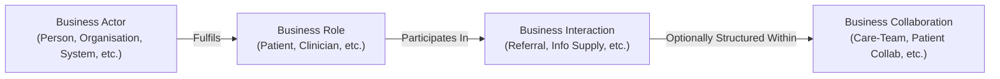

# Business Collaboration Model

## 1. Definition & Architectural Purpose

In the Harmonia Business Architecture, a **Business Collaboration** represents a defined, collective association of Business Actors acting in specific Business Roles who cooperate over time to achieve shared healthcare, clinical, operational, or information governance outcomes.

A Collaboration answers the architectural question:
> **What collective collaborative structure or ongoing relationship governs the interactions between these participants?**

A Collaboration is **not** created merely because two Actors interact transiently. A Collaboration exists *only* where participants collectively constitute a meaningful, structured, and enduring business relationship.

---

## 2. The Actor-Role-Interaction-Collaboration Relationship

Harmonia enforces a strict relationship model governing how participants, capacities, and events relate:



$$\text{Actor} \longrightarrow \text{fulfils Role} \longrightarrow \text{participates in Business Interaction} \longrightarrow \text{optionally within Business Collaboration}$$

- An **Actor** fulfils one or more **Roles**.
- A **Role** participates directly in one or more **Business Interactions**.
- Business Interactions may execute independently as discrete transactions or be structured within an overarching **Business Collaboration**.

---

## 3. The 7 Canonical R1 Business Collaborations

Harmonia recognises exactly seven canonical Business Collaborations in R1:

```text
Business Collaboration
├── Patient Collaboration
├── Practitioner Collaboration
├── Service Provider Collaboration
├── Care-Team Collaboration
├── Service-Delivery Collaboration
├── Operational Collaboration
└── Information-Sharing Collaboration
```

### 3.1 Patient Collaboration
- **Purpose**: Governs the structured, longitudinal relationship between a patient (or their authorised carer/representative) and their primary care network, health navigators, and participating health services.
- **Participating Roles**: `Patient`, `Carer`, `Support Person`, `Advocate`, `Representative`, `Clinician`, `Care Coordinator`.
- **Governed Activities**: Shared goal setting, patient-reported outcome tracking, consent directive establishment, and preference communication.

### 3.2 Practitioner Collaboration
- **Purpose**: Governs professional peer-to-peer clinical engagement, informal secondary consultations, multidisciplinary review panels, and clinical knowledge sharing across practitioner networks.
- **Participating Roles**: `Practitioner`, `Clinician`, `Care Coordinator`, `Terminology Steward`.
- **Governed Activities**: Peer review, diagnostic consultation, case conferencing, and shared clinical governance discussions.

### 3.3 Service Provider Collaboration
- **Purpose**: Governs formal inter-organisational healthcare service partnerships, diagnostic service level agreements, shared service networks, and regional commissioning alliances.
- **Participating Roles**: `Service Provider`, `Organisation`, `Organisational Unit`, `Service Coordinator`.
- **Governed Activities**: Service directory coordination, regional capacity sharing, diagnostic panel contracting, and cross-organisational service eligibility alignment.

### 3.4 Care-Team Collaboration
- **Purpose**: Governs the active, multidisciplinary clinical team assembled around a specific patient for an acute episode, chronic disease management programme, or inpatient stay.
- **Participating Roles**: `Clinician` (Lead & Consulting), `Care Coordinator`, `Patient`, `Carer`, `Performer`.
- **Governed Activities**: Shared care planning, real-time longitudinal health record (LHR) review, multidisciplinary ward rounds, clinical messaging, and transition-of-care handovers.

### 3.5 Service-Delivery Collaboration
- **Purpose**: Governs the operational and clinical partnership between requesting clinicians and service-fulfilment teams during the active execution of a complex clinical procedure, diagnostic pathway, or surgical episode.
- **Participating Roles**: `Requester`, `Performer`, `Clinician`, `Service Coordinator`, `Ward Coordinator`.
- **Governed Activities**: Theatre list progression, procedural preparation, perioperative care coordination, and diagnostic order closed-loop fulfilment.

### 3.6 Operational Collaboration
- **Purpose**: Governs facility-wide operational logistics, resource balancing, bed management, patient flow coordination, and dispatch between clinical units and non-clinical support services.
- **Participating Roles**: `Patient Flow Coordinator`, `Bed Manager`, `Ward Coordinator`, `Work Coordinator`, `Wardsperson`.
- **Governed Activities**: Daily operational huddles, emergency department bed pull, ward turnover coordination, porter dispatch, and discharge transport scheduling.

### 3.7 Information-Sharing Collaboration
- **Purpose**: Governs formal, trusted regional health information exchange, cross-custodian clinical data syndication, and statutory reporting networks.
- **Participating Roles**: `Information Supplier`, `Information Client`, `Information Steward`, `Information Custodian`, `Policy Authority`, `Regulator`.
- **Governed Activities**: Federated health information exchange, public health surveillance reporting, registry submission, and privacy policy compliance monitoring.

---

## 4. Collaboration Governance Guardrails and Invariants

### 4.1 Collaboration Existence Threshold
- Do **not** create a Business Collaboration merely because two Actors interact.
- Discrete interactions (such as querying an identifier, sending a single lab result, or verifying a credential) execute directly as Business Interactions. Collaborations are reserved for persistent, multi-party business structures.

### 4.2 Prohibited Collaboration Concepts (Non-Recreation Guardrail)
Harmonia explicitly prohibits recreating the following deprecated or redundant collaboration concepts:
- `Patient Update Collaboration` *(Subsumed under discrete interactions within Patient Collaboration)*;
- `Practitioner Update Collaboration` *(Subsumed under Practitioner Administration interactions)*;
- `Service Provider Update Collaboration` *(Subsumed under Service Provider Collaboration)*;
- `Governance Collaboration` *(Governance is exercised via authoritative interactions, not peer collaborations)*;
- `Incident Management Collaboration` *(Incidents are governed via formal incident lifecycle processes)*.

### 4.3 Centrality of Patient, Practitioner, and Service Provider
`Patient`, `Practitioner`, and `Service Provider` are foundational architectural entities and subjects within the Harmonia ecosystem:
- `Practitioner` is **not** synonymous with `Service Provider`.
- A `Practitioner` represents an individual clinician, whereas a `Service Provider` represents an organisation or facility offering health services (which a practitioner may fulfil).

<a id="44-guardian-collaboration-derivation-boundary"></a>

### 4.4 Assurance Role Collaboration Derivation Boundary

The approved [Service Assurance Modeller](../actors-roles/roles.md#service-assurance-modeller) and [Service Guardian](../actors-roles/roles.md#service-guardian) Roles, five Functions and three assurance Processes/Services/Interactions do not establish a new Business Collaboration or membership of any of the seven existing Collaborations. Participation in the [approved assurance Interactions](interactions.md#5-approved-service-assurance-interactions) does not mechanically imply an enduring structured collective. The approved Strategy's collaborative Enterprise Capability realisation describes capability contributions, not an enduring Actor/Role association. A collaboration involving either assurance Role requires an explicit purpose, participants and governed control relationships, preserving assurance independence, before it can meet the existence threshold in §4.1; those decisions remain unresolved in the [bounded assurance derivation](../behaviours/health-service-assurance.md#6-additional-business-elements-not-yet-established).

Practitioner Collaboration retains clinical peer review, diagnostic consultation and clinical governance discussions; Care-Team and Service-Delivery Collaborations retain their existing clinical responsibilities. These activities do not become Guardianship through review or assurance terminology. Information-Sharing Collaboration's compliance monitoring does not automatically establish independent assurance. No existing collaboration composition or prohibited collaboration concept is changed.
