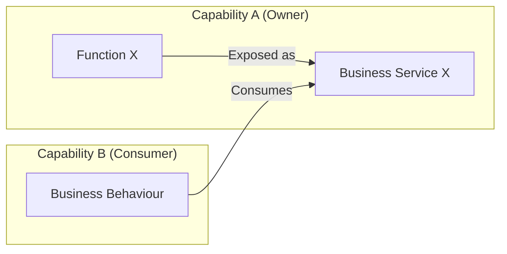
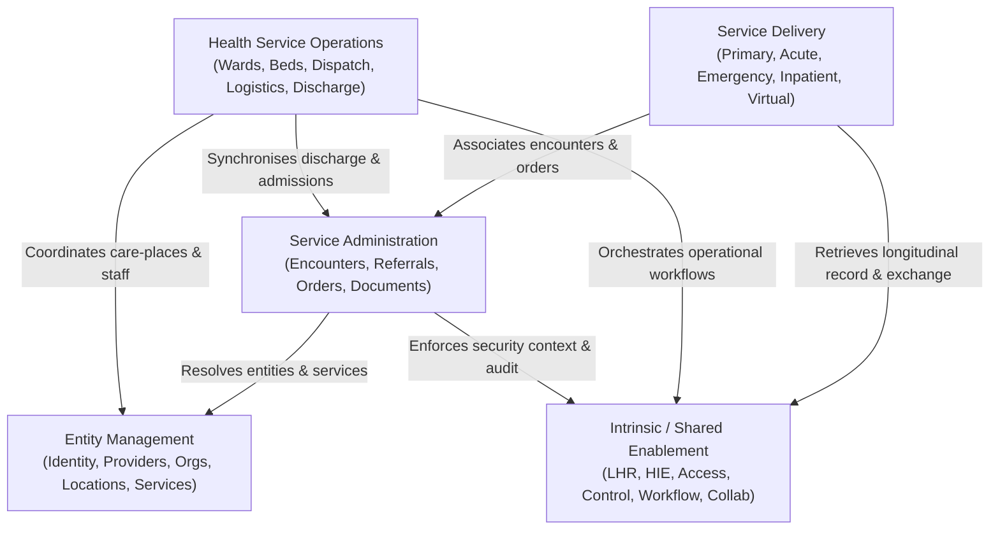

# Cross-Capability Dependencies & Service Exposure Matrix

## 1. Architectural Principles of Cross-Capability Dependencies

In the Harmonia Business Architecture, capabilities do not operate as isolated silos. Healthcare workflows require coordinated collaboration across bounded capabilities.

### 1.1 Service Exposure and Ownership Boundary Pattern

When Capability A delivers behaviour needed by Capability B, Capability A exposes that behaviour through a formal **Business Service**. Capability B consumes the Service without acquiring ownership of the underlying Function or information:

### 1.2 High-Level Cross-Capability Dependency Topology

The diagram below illustrates the major inter-capability dependency relationships across the five healthcare contextual views:

These nodes are contextual views, not typed Capabilities or identifier ancestors. The arrows summarise established responsibility needs; they do not allocate particular Services, participating Interactions or Collaborations.

---

## 2. Cross-Capability Service Consumption Matrix

The matrix below documents the primary inter-capability service dependencies across Harmonia:

| Consuming Capability Context | Exposed Business Service Consumed | Exposing / Owning Capability | Business Purpose |
| :--- | :--- | :--- | :--- |
| **Referral Administration** | `Person Identifier Resolution` | **Person Identity** *(Client Administration)* | Validates source-attributed identifiers against their authoritative issuing information; does not determine a master person. |
| **Referral Administration** | `Service Provision Resolution` | **Health Service Administration** | Resolves target clinical specialty clinics, receiving providers, and referral catchment rules. |
| **Episode & Encounter Administration** | `Care-Place Specification Lookup` | **Location Administration** | Resolves physical ward, room, and bed structural attributes for encounter bed placement. |
| **Episode & Encounter Administration** | `Bed Availability Query` | **Bed & Care-Place Management** | Checks real-time operational bed readiness before confirming patient bed moves. |
| **Order Administration** | `Service Provision Resolution` | **Health Service Administration** | Determines performing diagnostic laboratory or imaging centre routing destinations. |
| **Diagnostic Administration** | `Terminology Mapping Service` | **Clinical Knowledge Services** | Normalises local laboratory and radiology test codes to canonical SNOMED-CT/LOINC concepts. |
| **Clinical Record Administration** | `Healthcare Subject Context Resolution` | **Healthcare Subject** | Validates patient demographic context and indigenous/interpreter requirements for document headers. |
| **Clinical Record Administration** | `Semantic Conformance Verification Service` | **Information Design Governance** | Verifies clinical document structural and semantic compliance against governed interchange profiles. |
| **Primary Care** | `Longitudinal Clinical Record Query` | **Patient Clinical Record** | Retrieves regional patient history, past discharge summaries, and medication timelines for GP consultations. |
| **Acute Care** | `Consent Enforcement Service` | **Health Information Control** | Evaluates patient consent directives and break-glass emergency access permissions during acute admissions. |
| **Emergency Care** | `Person Identifier Correlation` | **Person Identity** *(Client Administration)* | Resolves established, source-authoritative identity associations for emergency presentations; does not originate probabilistic matching or person-merge decisions. |
| **Inpatient Care** | `Discharge Readiness Telemetry` | **Discharge Management** | Coordinates multidisciplinary ward discharge checklists and pharmacy reconciliation. |
| **Bed & Care-Place Management** | `Care-Place Specification Lookup` | **Location Administration** | Resolves physical care-place capabilities (e.g., negative pressure, telemetry wiring) for isolation placement. |
| **Work Allocation & Dispatch** | `Staff Presence Telemetry Query` | **Mobile Staff Management** | Allocates portering and cleaning work orders to active on-duty staff in the nearest physical zone. |
| **Patient Transport** | `Encounter Location History Query` | **Episode & Encounter Administration** | Validates current patient ward location and target diagnostic department before dispatching porters. |
| **Clinical Logistics Coordination** | `Secure Clinical Message Dispatch` | **Clinical Communication Administration** | Sends automated electronic specimen tracking notifications and urgent critical result dispatch alerts. |
| **Workflow & Activity Coordination**| `Policy Evaluation & Authorisation Service` | **Health Information Control** | Evaluates actor task-claiming permissions before allowing work order acceptance or document countersignature. |
| **Presentation Services** | `Clinical Information Search Service` | **Health Information Access** | Executes search queries across longitudinal clinical records for display in clinical portals. |

---

## 3. Dependency Governance Rules

The former Clinical Collaboration consumption of `Collaboration Clinical Summary Resolution` from Patient Clinical Record is withdrawn as unsupported under approved G1 K12. Clinical Collaboration retains ownership of that exposed Service through `FEAT-ISE-17` and `Resolve LHR Query within Collaboration`. Its precise source Service/provider, direct or mediated retrieval, formal Service consumer and the incorrect row’s intended referent remain unresolved. No replacement dependency is established.

Patient Clinical Record retains longitudinal assembly, active record maintenance, durable preservation and canonical integrated synthesis; Clinical Collaboration retains spaces, membership, discourse, in-conversation resolution and contextual clinical-summary projection; Health Information Access retains search, retrieval, access-qualified filtering, query execution context and result projection state. Information ownership, Function ownership, Service ownership, consumption, use and presentation remain distinct.

The Order Administration → Practitioner Role Resolution row is withdrawn: the Service resolves Role/capacity information, not Clinical Privilege or Operational Privilege. The Diagnostic Administration → Order Requisition Ingress row is withdrawn: that Service ingests requisitions, not the asserted correlation of incoming reports. Both Services retain their owners and valid exposed behaviour. Required privilege/correlation behaviour remains valid, but precise consuming Service relationships remain unestablished; no replacement edge is inferred.

Clinical Privilege concerns a practitioner's authority/credentials for applicable clinical activity; Operational Privilege concerns an actor's authority for applicable operational activity. Either or both may be required. Practitioner Role information may contribute context but establishes neither.

The former Discharge Management → Clinical Document Lifecycle Service “publication upon departure” assertion is withdrawn. That Service exposes authoring addenda/corrections; the alleged discharge-publication consumption is not established. Discharge Management retains a capability dependency on Clinical Record Administration for applicable discharge information, with the precise Service/provider contract unresolved. Preparation, information availability/publication, discharge authorisation and physical departure remain distinct. Applicable information may be prepared/communicated before departure; `FEAT-HSO-29` dispatch preserves confirmed physical exit as its trigger. No universal publication sequence, additional publication event or replacement Service edge is inferred.

Typed references distinguish Capability dependency, Service consumption, Interaction participation and Collaboration involvement. Abbreviated/descriptive wording is not an alias. Where identity or relationship is not established, retain the reference as unresolved rather than convert it into an edge.

1. **Unidirectional Service Coupling**: Dependency arrows point strictly from the consuming capability to the exposed Business Service. The exposing capability remains completely agnostic of which downstream capabilities consume its services.
2. **Encapsulated Implementation**: Consuming capabilities depend exclusively upon the abstract service contract and its business semantics, never upon internal algorithms or persistence structures.
3. **Fail-Closed Security Context**: All cross-capability service invocations must carry a valid, immutable `Security Context` evaluated by *Health Information Control*.

---

## 4. Assurance Dependency Derivation Boundary

The [approved Strategy contribution matrix](../../02-strategy/capability-maps/health-service-assurance-derivation.md#collaborative-enterprise-capability-contribution-matrix) establishes contributions to Assurance Design, Assurance Criteria Management and Governed Assurance. It is not a Business Service consumption matrix: neither Direct nor Supporting identifies an exposed Service, its owning Function or an identifiable Business Service consumer. No assurance row or topology edge is added to §2 or §1.2 from those contributions.

Governed Assurance needs applicable criteria and trustworthy evidence. Source-information ownership and subject management remain with their established capabilities. The subject may supply evidence, but that dependency must not give it control of assurance progression or conclusion: **evidence dependency does not compromise assurance independence; control dependency does**. [Service Guardian](../actors-roles/roles.md#service-guardian) does not acquire assignment, delegation, escalation or remediation responsibility through a finding. [Service Assurance Modeller](../actors-roles/roles.md#service-assurance-modeller) also does not manage the subject merely by designing assurance concerning it.

The approved [EC-02 / EC-14 contribution relationship](../behaviours/health-service-assurance.md#41-context-management-contribution) supports **Establish Assurance Context** through generic context-management capability and assurance-specific semantics together. It does not identify an exposed Business Service, a Service consumer, sole realisation, a technical mechanism or an implementation allocation. The five approved Functions establish internal capability-owned behaviour; they do not mechanically create exposed Services or consumption rows.

The approved human review separately establishes the following three [Governed Assurance Services](../behaviours/health-service-assurance.md#5-approved-governed-assurance-business-services) and their Role-level consumption/communication relationships. These are approved relationships across the owning responsibility boundary, not inferred from EC contributions or Role-name similarity. No consuming Capability is allocated solely from a Role's name; these assurance relationships do not determine §2's other Capability rows or §1.2's contextual-view topology.

| Approved Business Service | Exposing / Owning Capability | Approved consumer / potential recipient Roles | Associated Business Interaction |
| :--- | :--- | :--- | :--- |
| **Request Service Assurance** | **Governed Assurance** | Care Coordinator, Service Coordinator, Regulator, Policy Authority, System Steward — authorised requesters | [Service Assurance Request](../collaborations-interactions/interactions.md#service-assurance-request) |
| **Request Service Assurance Status** | **Governed Assurance** | **System Steward only** — stewardship of activity progression | [Service Assurance Status](../collaborations-interactions/interactions.md#service-assurance-status) |
| **Communicate Service Assurance Outcome** | **Governed Assurance** | Care Coordinator, Service Coordinator, Regulator, Policy Authority, System Steward — applicable authorised recipients | [Service Assurance Outcome Communication](../collaborations-interactions/interactions.md#service-assurance-outcome-communication) |

Requesting does not grant control of assurance assessment/adjudication or authority to alter the applicable Assurance Definition/Criteria. Status concerns assurance activity progression and does not expose unadjudicated findings/conclusions or provide general requester tracking. Outcome communication is not mandatory broadcast; requester, status consumer and recipient need not coincide. Recipients retain their own clinical, operational, governance/compliance and improvement responsibilities; communication transfers none of their subsequent action to Service Guardian.

Assurance Definition use is a responsibility/information dependency between modelling and execution; no Modeller-to-Guardian Interaction or Service is inferred. Source information may be available through existing governed access; evidence association does not create an Evidence Contribution Interaction. Exact evidence/criteria providers, additional exposed behaviour/Services, detailed contracts, consuming Capability allocation, evidence exchange and findings-to-operational-response mechanisms remain [unresolved](../behaviours/health-service-assurance.md#6-additional-business-elements-not-yet-established).

[Financial Governance is deliberately excluded](../behaviours/health-service-assurance.md#financial-governance-exclusion), while exact authorised external recipients of financially relevant outcomes remain unresolved. [Governed Assurance does not recursively assure its own execution](../behaviours/health-service-assurance.md#assurance-non-recursion-boundary); System Steward's status observation is stewardship / management monitoring. Neither boundary establishes an implementation allocation. Existing Service ownership, consumption relationships, security rules and recorded uncertainties remain intact. Role participation alone does not grant information-access authority or bypass governed access.
