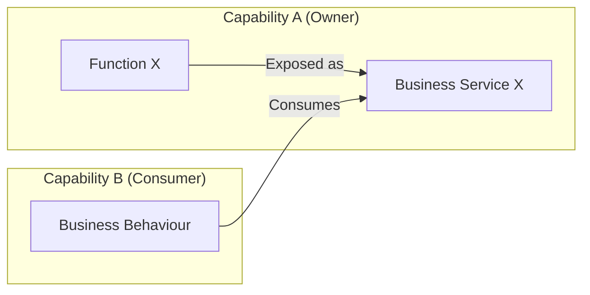
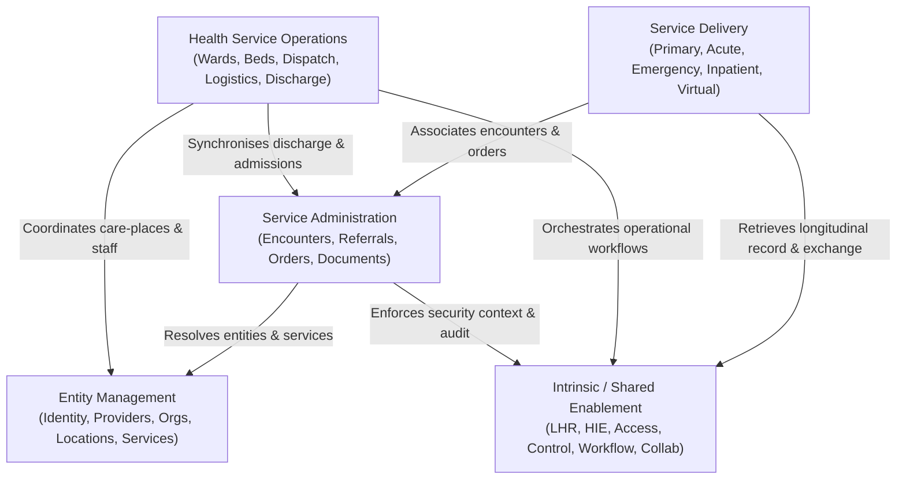

# Cross-Capability Dependencies & Service Exposure Matrix

## 1. Architectural Principles of Cross-Capability Dependencies

In the Harmonia Business Architecture, capabilities do not operate as isolated silos. Healthcare workflows require coordinated collaboration across bounded capabilities.

### 1.1 Service Exposure and Ownership Boundary Pattern

When Capability A delivers behaviour needed by Capability B, Capability A exposes that behaviour through a formal **Business Service**. Capability B consumes the Service without acquiring ownership of the underlying Function or information:

### 1.2 High-Level Cross-Capability Dependency Topology

The diagram below illustrates the major inter-capability dependency relationships across the five healthcare contextual views:

---

## 2. Cross-Capability Service Consumption Matrix

The matrix below documents the primary inter-capability service dependencies across Harmonia:

| Consuming Capability Context | Exposed Business Service Consumed | Exposing / Owning Capability | Business Purpose & Collaboration Interaction |
| :--- | :--- | :--- | :--- |
| **Referral Administration** | `Person Identifier Resolution` | **Person Identity** *(Client Admin)* | Disambiguates and validates referred patient identity against master registries. |
| **Referral Administration** | `Service Provision Resolution` | **Health Service Administration** | Resolves target clinical specialty clinics, receiving providers, and referral catchment rules. |
| **Episode & Encounter Administration** | `Care-Place Specification Lookup` | **Location Administration** | Resolves physical ward, room, and bed structural attributes for encounter bed placement. |
| **Episode & Encounter Administration** | `Bed Availability Query` | **Bed & Care-Place Management** | Checks real-time operational bed readiness before confirming patient bed moves. |
| **Order Administration** | `Practitioner Role Resolution` | **Provider Administration** | Validates requesting and attending clinician credentials and ordering privileges. |
| **Order Administration** | `Service Provision Resolution` | **Health Service Administration** | Determines performing diagnostic laboratory or imaging centre routing destinations. |
| **Diagnostic Administration** | `Order Requisition Ingress` | **Order Administration** | Correlates incoming diagnostic observations with active closed-loop order requisitions. |
| **Diagnostic Administration** | `Terminology Mapping Service` | **Clinical Knowledge Services** | Normalises local laboratory and radiology test codes to canonical SNOMED-CT/LOINC concepts. |
| **Clinical Record Administration** | `Healthcare Subject Context Resolution` | **Healthcare Subject Context** | Validates patient demographic context and indigenous/interpreter requirements for document headers. |
| **Clinical Record Administration** | `Semantic Conformance Verification Service` | **Information Design Governance** | Verifies clinical document structural and semantic compliance against governed interchange profiles. |
| **Primary Care** | `Longitudinal Clinical Record Query` | **Patient Clinical Record** | Retrieves regional patient history, past discharge summaries, and medication timelines for GP consultations. |
| **Acute Care** | `Consent Enforcement Service` | **Health Information Control** | Evaluates patient consent directives and break-glass emergency access permissions during acute admissions. |
| **Emergency Care** | `Person Identifier Correlation` | **Person Identity** *(Client Admin)* | Rapidly links trauma and ambulance presentations to regional hospital records using fast-match correlation. |
| **Inpatient Care** | `Discharge Readiness Telemetry` | **Discharge Management** | Coordinates multidisciplinary ward discharge checklists and pharmacy reconciliation. |
| **Bed & Care-Place Management** | `Care-Place Specification Lookup` | **Location Administration** | Resolves physical care-place capabilities (e.g., negative pressure, telemetry wiring) for isolation placement. |
| **Work Allocation & Dispatch** | `Staff Presence Telemetry Query` | **Mobile Staff Management** | Allocates portering and cleaning work orders to active on-duty staff in the nearest physical zone. |
| **Patient Transport** | `Encounter Location History Query` | **Episode & Encounter Administration** | Validates current patient ward location and target diagnostic department before dispatching porters. |
| **Clinical Logistics Coordination** | `Secure Clinical Message Dispatch` | **Clinical Communication Administration** | Sends automated electronic specimen tracking notifications and urgent critical result dispatch alerts. |
| **Discharge Management** | `Clinical Document Lifecycle Service` | **Clinical Record Administration** | Triggers publication of signed clinical discharge summaries upon patient departure. |
| **Workflow & Activity Coordination**| `Policy Evaluation & Authorisation Service` | **Health Information Control** | Evaluates actor task-claiming permissions before allowing work order acceptance or document countersignature. |
| **Presentation Services** | `Clinical Information Search Service` | **Health Information Access** | Executes search queries across longitudinal clinical records for display in clinical portals. |

---

## 3. Dependency Governance Rules

The former Clinical Collaboration consumption of `Collaboration Clinical Summary Resolution` from Patient Clinical Record is withdrawn as unsupported under approved G1 K12. Clinical Collaboration retains ownership of that exposed Service through `FEAT-ISE-17` and `Resolve LHR Query within Collaboration`. Its precise source Service/provider, direct or mediated retrieval, formal Service consumer and the incorrect row’s intended referent remain unresolved. No replacement dependency is established.

Patient Clinical Record retains longitudinal assembly, active record maintenance, durable preservation and canonical integrated synthesis; Clinical Collaboration retains spaces, membership, discourse, in-conversation resolution and contextual clinical-summary projection; Health Information Access retains search, retrieval, access-qualified filtering, query execution context and result projection state. Information ownership, Function ownership, Service ownership, consumption, use and presentation remain distinct.

Discharge publication timing remains unresolved: the dependency row describes publication upon departure while the Process describes publication before departure. Neither assertion is silently chosen as the resolution.

1. **Unidirectional Service Coupling**: Dependency arrows point strictly from the consuming capability to the exposed Business Service. The exposing capability remains completely agnostic of which downstream capabilities consume its services.
2. **Encapsulated Implementation**: Consuming capabilities depend exclusively upon the abstract service contract and its business semantics, never upon internal algorithms or persistence structures.
3. **Fail-Closed Security Context**: All cross-capability service invocations must carry a valid, immutable `Security Context` evaluated by *Health Information Control*.

---

## 4. Assurance Dependency Derivation Boundary

The [approved Strategy contribution matrix](../../02-strategy/capability-maps/health-service-assurance-derivation.md#collaborative-enterprise-capability-contribution-matrix) establishes contributions to Assurance Design, Assurance Criteria Management and Governed Assurance. It is not a Business Service consumption matrix: neither Direct nor Supporting identifies an exposed Service, its owning Function or an identifiable Business Service consumer. No assurance row or topology edge is added to §2 or §1.2 from those contributions.

Governed Assurance needs applicable criteria and trustworthy evidence. Source-information ownership and subject management remain with their established capabilities. The subject may supply evidence, but that dependency must not give it control of assurance progression or conclusion: **evidence dependency does not compromise assurance independence; control dependency does**. [Guardian](../actors-roles/roles.md#guardian-governed-assurance) does not acquire assignment, delegation, escalation or remediation responsibility through a finding.

Exact evidence/criteria providers, exposed behaviour, Business Service names, contracts, consumers and any findings-to-operational-response interaction remain [unresolved](../behaviours/health-service-assurance.md#5-additional-business-elements-not-yet-established). Existing Service ownership, consumption relationships, security rules and recorded uncertainties remain unchanged. Guardian's Role alone does not grant information-access authority or bypass governed access.
