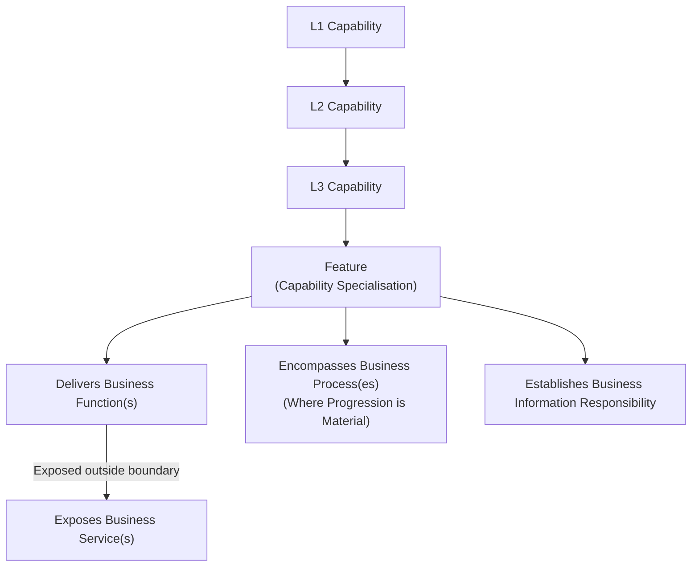

# Business Architecture Metamodel & Modelling Rules

## 1. Overview & Metamodel Hierarchy

The Harmonia Business Architecture metamodel defines the structural and behavioural relationships governing how healthcare capabilities are operationalised into functions, exposed services, stateful processes, and information responsibilities.



### 1.1 Four-Tier Capability Hierarchy

Harmonia structures capabilities in a strict four-tier hierarchy:

$$\text{L1 Capability} \longrightarrow \text{L2 Capability} \longrightarrow \text{L3 Capability} \longrightarrow \text{Feature}$$

- **L1 Capability**: High-level healthcare operational domain (e.g., Client Administration, Order Administration).
- **L2 Capability**: Coherent grouping of functional responsibilities within an L1 domain (e.g., Person Identity, Diagnostic Orders).
- **L3 Capability**: Bounded system-enabled capability boundary (e.g., Identifier Resolution, Closed-Loop Order Progression).
- **Feature**: A **Feature** is a finer-grained specialisation of Capability beneath the L3 Capability hierarchy and inherits Capability semantics.

### 1.2 Hierarchy Naming & Uniqueness Rules
1. **Global Uniqueness**: L1, L2, and L3 Capability names are globally unique across the entire Harmonia architecture.
2. **Feature Scoping**: Feature names must be unique within their owning L1 Capability hierarchy.
3. **No Disconnected Elements**: Business Functions, Business Services, and Business Processes must **never** be modelled as free-standing global catalogues disconnected from an owning Capability or Feature context.

---

## 2. Capability & Feature Semantics

A Capability or Feature establishes:
- **Context & Scope**: Sets the boundary of healthcare operational relevance.
- **Architectural Responsibility**: Establishes unambiguous ownership of behaviour and state.
- **Business Functions**: Defines the internal behaviour delivered within the boundary.
- **Exposed Business Services**: Declares behaviour made available to external or cross-capability consumers.
- **Business Processes**: Encompasses progression lifecycles where activity state tracking is material.
- **Information Responsibility**: Owns the conceptual information created or governed by its functions.
- **Dependencies**: Explicitly records consumption of services provided by other capabilities.

---

## 3. Function and Service Semantics

Harmonia enforces strict semantic rules governing Functions and Services to prevent architectural ambiguity:

### 3.1 Business Function Rule
> **A Business Function represents behaviour delivered within the responsibility boundary of its owning Capability or Feature.**

A Business Function describes *what* the capability does internally to discharge its architectural mandate. A Business Function may operate upon:
- information owned by its Capability / Feature;
- information obtained through Services exposed by another Capability / Feature;
- information used under an explicit cross-capability dependency.

Therefore, **ownership of a Function does not imply ownership of every information item upon which that Function operates**.

### 3.2 Business Service Exposure Rule
> **When Function behaviour is exposed for consumption outside the owning Capability or Feature responsibility boundary, that behaviour is exposed through a Business Service.**

```text
Capability A (Owner)
  └── Function X
        └── exposed as Service X
                  │
                  ▼ [Consumed by]
Capability B (Consumer)
```

### 3.3 Ownership and Non-Equivalence Invariants
1. **Ownership Preservation**: When Capability A exposes `Function X` as `Business Service X`, and Capability B consumes `Business Service X`, **Capability A retains sole architectural ownership of Function X and its underlying state**. Capability B is merely a consumer.
2. **No 1:1 Mechanical Generation**: A Business Service is **not** created mechanically for every Business Function. A Service is modelled *only* when an identifiable consumer exists outside the owning responsibility boundary.
3. **Consumption Scope**:
   - **Harmonia-Internal Consumption**: Services consumed by other Harmonia capabilities (e.g., Service Administration consuming Person Identifier Resolution from Entity Management).
   - **Enterprise/External Consumption**: Services consumed by external healthcare participants, client systems, or national registries (e.g., Referral Submission exposed to external GP practices).

---

## 4. Business Process Semantics

A Business Process represents progressing business behaviour encompassed within a Capability or Feature responsibility boundary.

### 4.1 Process Justification Rule
> **Model a Business Process only where the business materially cares about the progression of an activity instance through meaningful states, dispositions, or outcomes.**

Not all functions require a process. Generic operations such as:
- Identifier resolution and search;
- Data mapping and transformation;
- Cryptographic or credential verification;
- Terminology and code lookup;
- UI presentation and rendering;

do **not** constitute Business Processes. They are discrete Business Functions.

### 4.2 Cross-Capability Process Guardrail
If a proposed Business Process appears to span multiple Capability responsibility boundaries:
1. Examine whether the process has been scoped incorrectly (conflating independent sequential activities with a single process); or
2. Examine whether an architectural responsibility is missing or misassigned.

**Cross-capability processes must never be used to erase or blur Capability ownership boundaries.** Cross-boundary coordination is achieved via event notifications and service invocations between bounded capabilities.

---

## 5. Cross-Cutting Responsibility Rule

Harmonia establishes an essential architectural guardrail to maintain component cohesion and prevent boundary erosion:

> **Cross-cutting concern does not imply cross-cutting responsibility. A concern becomes cross-cutting because Capabilities depend upon Services or Functions delivered by other Capabilities whose responsibilities remain explicitly bounded.**

### Concrete Guardrails:
- **Security & Control**: Security does not become partly owned by every capability that consumes security services. Authorisation evaluation and security context propagation are owned exclusively by *Health Information Control*.
- **Semantic Governance**: Terminology and canonical model definitions do not become owned by capabilities that use them. They are owned by *Information Design Governance* and *Clinical Knowledge Services*.
- **Workflow & Activity Coordination**: Coordinating tasks and to-dos does not grant ownership of the underlying clinical or operational activities. Coordination semantics are owned by *Workflow & Activity Coordination*.
- **Presentation**: Presentation capabilities do not acquire ownership of the clinical information they render.
- **Information Exchange**: Transporting or mediating messages across networks does not grant ownership of the clinical payloads transported. Exchange state is owned by *Health Information Exchange*, while clinical document ownership remains with *Clinical Record Administration*.

---

## 6. Business Information Responsibility

> **Business information ownership derives strictly from Capability responsibility and the Functions/Processes through which that responsibility is discharged.**

- **No Ownership Transfer**: Access, use, transformation, transport, search, presentation, caching, persistence, or coordination of information does not transfer architectural ownership.
- **Pure Business Semantics**: Business information concepts must retain authentic clinical/business definitions. They must **never** be prematurely translated into:
  - FHIR Resource structures (e.g., `Patient`, `Observation`, `Task`);
  - Database schemas, tables, or DDL;
  - JSON schemas, DTOs, or wire payloads;
  - Java classes or programming interfaces.
  
*(Such technology mappings belong exclusively to downstream Information Architecture Domain 04 and Application Architecture Domain 05).*

---

## 7. Qualified Architectural Reference Grammar

To unambiguously express participants, their acting capacity, and situational context without inventing transient metamodel entities, Harmonia uses the **Qualified Architectural Reference Grammar**:

```text
<EntityType>#<Entity>-as-<Role>[#<ContextQualifier>]
```

### 7.1 Grammar Structure
- `<EntityType>`: The authoritative Business Actor category (`Person`, `Group`, `Organisation`, `Organisational Unit`, `GovernmentRegulatoryBody`, `System`, `Device`).
- `<Entity>`: The specific business instance identifier or name.
- `<Role>`: The canonical Business Role representing the stable business/functional capacity being fulfilled.
- `[#<ContextQualifier>]`: *(Optional)* The contextual function or situational qualifier in a specific interaction or collaboration.

### 7.2 Canonical Examples

| Qualified Expression | Actor Category | Entity Name | Fulfilled Role | Context Qualifier |
| :--- | :--- | :--- | :--- | :--- |
| `Organisation#ACT Pathology-as-InformationSupplier` | `Organisation` | ACT Pathology | `InformationSupplier` | *(none)* |
| `Organisation#ACT Health-as-ServiceProvider#ReferralSource` | `Organisation` | ACT Health | `ServiceProvider` | `ReferralSource` |
| `System#ACT Pathology LIS-as-InformationSupplier#DiagnosticResultSource` | `System` | ACT Pathology LIS | `InformationSupplier` | `DiagnosticResultSource` |
| `Person#Fred-as-Patient` | `Person` | Fred | `Patient` | *(none)* |
| `Person#Dr Smith-as-Clinician#Reviewer` | `Person` | Dr Smith | `Clinician` | `Reviewer` |
| `OrganisationalUnit#Finance Directorate-as-InformationCustodian` | `Organisational Unit` | Finance Directorate | `InformationCustodian` | *(none)* |
| `GovernmentRegulatoryBody#AHPRA-as-Regulator` | `Government / Regulatory Body` | AHPRA | `Regulator` | *(none)* |

### 7.3 Governance Guardrails
1. The **Role** identifies stable architectural/business capacity.
2. The **Context Qualifier** identifies situational nuance; it does **not** create a new Role.
3. This notation is a **reference grammar**, not a new architectural metamodel class.
