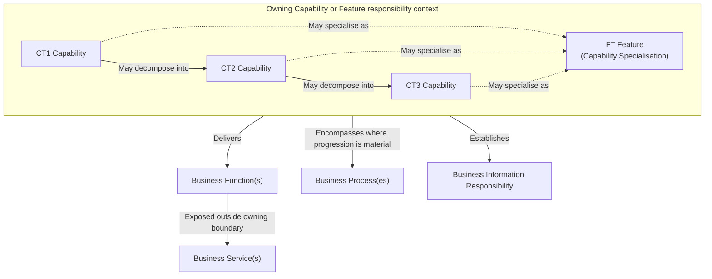

# Business Architecture Metamodel & Modelling Rules

## 1. Overview & Metamodel Hierarchy

The Harmonia Business Architecture metamodel defines the structural and behavioural relationships governing how healthcare capabilities are operationalised into functions, exposed services, stateful processes, and information responsibilities.



The diagram groups the permissible responsibility contexts; it does not require every branch to materialise every Capability Tier or a Feature before delivering behaviour.

### 1.1 Capability Decomposition and Terminology

The following terminology SHALL be used canonically:

| Term | Meaning |
| :--- | :--- |
| **Layer / Architectural Layer** | Architectural layering within the TOGAF / ArchiMate architecture model. |
| **Capability Tier** | Hierarchical decomposition within a Capability Model. |
| **Derivation / Derivation Progression** | Progression between different architectural constructs or models. A Derivation Stage is a stage in that progression. |
| **CT1** | Capability Tier 1. |
| **CT2** | Capability Tier 2. |
| **CT3** | Capability Tier 3. |
| **FT** | Feature. |

`Layer ≠ Capability Tier ≠ Derivation Stage`. `L1`, `L2` and `L3` are deprecated as canonical capability classifications.

Capability decomposition MAY proceed as follows:

$$\text{CT1 Capability} \longrightarrow \text{CT2 Capability} \longrightarrow \text{CT3 Capability} \longrightarrow \text{FT Feature}$$

Not every branch is required to materialise every possible lower tier. A Feature remains a finer-grained specialisation of Capability and inherits Capability semantics; FT SHALL NOT be classified as CT3. Intermediate Capabilities or Features SHALL NOT be invented to complete a hierarchy or to anchor behaviour.

Where a lower Capability Tier is materialised, its established higher-tier Capability ancestry SHALL be represented in its Canonical ID. An unidentified ancestor SHALL NOT be treated as permission to omit that tier. Required but unresolved ancestry SHALL leave the Canonical ID unresolved, as specified in §8.

The five-stage [Domain02 derivation progression](../../02-strategy/capability-maps/capability-tier-model.md) SHALL NOT be reinterpreted as CT1 / CT2 / CT3 / FT. Enablement, derivation and contextual-view membership do not, by themselves, establish a Capability Tier assignment.

### 1.2 Hierarchy Naming & Uniqueness Rules
1. **Global Uniqueness**: Capability names across CT1, CT2 and CT3 are globally unique across the entire Harmonia architecture.
2. **Feature Scoping**: Feature names must be unique within their owning CT1 Capability hierarchy. An unresolved CT1 ancestor SHALL be recorded as unresolved rather than assigned speculatively.
3. **No Disconnected Elements**: Business Functions, Business Services, and Business Processes must **never** be modelled as free-standing global catalogues disconnected from an owning Capability or Feature context.

---

## 2. Capability & Feature Semantics

A Capability or Feature establishes:
- **Context & Scope**: Sets the boundary of healthcare operational relevance.
- **Architectural Responsibility**: Establishes unambiguous ownership of behaviour and state.
- **Business Functions**: Defines the internal behaviour delivered within the boundary.
- **Exposed Business Services**: Declares behaviour made available to external or cross-capability consumers.
- **Business Processes**: Encompasses progression lifecycles where activity state tracking is material.
- **Information Responsibility**: Owns the conceptual information created or governed by its functions.
- **Dependencies**: Explicitly records consumption of services provided by other capabilities.

---

## 3. Function and Service Semantics

Domain03 SHALL NOT establish a Feature identity that Strategy has not established. A Strategy Feature may be associated with Business behaviour only where that behaviour materially realises the semantic responsibility expressed by the Feature. Shared subject matter, terminology, information, Actor, Capability context or clinical purpose is insufficient. Where semantic realisation is not established, preserve the Feature, Function, Service and established owning Capability, and record **Feature association not established** without assigning a replacement Feature.

Harmonia enforces strict semantic rules governing Functions and Services to prevent architectural ambiguity:

### 3.1 Business Function Rule
> **A Business Function represents behaviour delivered within the responsibility boundary of its owning Capability or Feature.**

A Business Function describes *what* the capability does internally to discharge its architectural mandate. A Business Function may operate upon:
- information owned by its Capability / Feature;
- information obtained through Services exposed by another Capability / Feature;
- information used under an explicit cross-capability dependency.

Therefore, **ownership of a Function does not imply ownership of every information item upon which that Function operates**.

### 3.2 Business Service Exposure Rule
> **When Function behaviour is exposed for consumption outside the owning Capability or Feature responsibility boundary, that behaviour is exposed through a Business Service.**

```text
Capability A (Owner)
  └── Function X
        └── exposed as Service X
                  │
                  ▼ [Consumed by]
Capability B (Consumer)
```

### 3.3 Ownership and Non-Equivalence Invariants
1. **Ownership Preservation**: When Capability A exposes `Function X` as `Business Service X`, and Capability B consumes `Business Service X`, **Capability A retains sole architectural ownership of Function X and its underlying state**. Capability B is merely a consumer.
2. **No 1:1 Mechanical Generation**: A Business Service is **not** created mechanically for every Business Function. A Service is modelled *only* when an identifiable consumer exists outside the owning responsibility boundary.
3. **Consumption Scope**:
   - **Harmonia-Internal Consumption**: Services consumed by other Harmonia capabilities (e.g., Service Administration consuming Person Identifier Resolution from Entity Management).
   - **Enterprise/External Consumption**: Services consumed by external healthcare participants, client systems, or national registries (e.g., Referral Submission exposed to external GP practices).

### 3.4 Significance-Driven Relationships and Typed Dependencies

Role, Actor, Function, Service, Interaction, Collaboration and Process relationships SHALL be established where they materially explain responsibility, participation, exposure, collaboration or Business progression. Their absence alone does not establish missing architecture. Exhaustive Function-to-Role, Function-to-Service, Interaction-to-Service or Actor-to-Function matrices are not required.

A Service dependency requires consuming behaviour that needs behaviour actually exposed by that Service. Related information or subject matter is insufficient. Capability dependency, Service consumption, Interaction participation and Collaboration involvement SHALL retain their distinct types and meanings. Descriptive or abbreviated references do not create aliases. An unestablished element or relationship SHALL remain explicitly unresolved; no replacement dependency is inferred.

### 3.5 Clinical and Operational Privilege

**Clinical Privilege** concerns whether a practitioner is authorised/credentialed to undertake applicable clinical activity. **Operational Privilege** concerns whether an actor is authorised to undertake applicable operational activity. They are distinct responsibilities; an activity may require both.

Practitioner Role information may contextualise or contribute to a privilege determination, but Practitioner Role Resolution establishes neither Clinical Privilege nor Operational Privilege. These distinctions do not allocate new Roles, Services or policy mechanisms.

### 3.6 Business Responsibility and Reusable Composition

Business Architecture SHALL describe responsibility meaningful to the Business at its declared architectural layer. Shared downstream machinery does not establish a shared Business Function. In service-delivery operational contexts, **Capacity Management** concerns understanding and managing available, committed and utilised service capacity. Contexts may have materially different capacity semantics. A generalised operational-state capture mechanism is a downstream derivation concern and SHALL NOT replace those Business responsibilities. The [HSO capacity responsibility boundary](../behaviours/04-health-service-operations.md#capacity-management-responsibility-boundary) distinguishes context-specific capacity from resource state and higher-order consumers.

A domain-specific Business Enabling Feature MAY be realised through composition of established reusable capabilities and configured workflow/Praxis without a correspondingly specialised Business Function. The composition must sufficiently express the required responsibility; clinical purpose or setting alone does not establish another Harmonia information-management responsibility. Do not create a Feature-to-Function relationship where only a composition-level sufficiency decision is established.

### 3.7 Clinical Work Integration Boundary

**Harmonia may integrate and coordinate around clinical work; it does not thereby manage clinical work.** It may exchange work information, receive externally established requirements, route operational activity, observe progression, coordinate Harmonia-managed consequences and apply established qualification, privilege and policy constraints. It SHALL NOT thereby determine clinical work, manage clinical handover, acquire clinical allocation or decision authority, own clinical worklists or assume EMR workflow ownership. Information assembly for handover is distinct from performing or managing the handover.

Clinical facts retain their originating authority when consumed by patient-flow, capacity or discharge coordination. Clinical progression and operational patient progression SHALL remain distinct. A clinical/professional clearance may affect discharge readiness without the operational consumer acquiring authority to establish that clearance. Clinical Privilege and Operational Privilege retain §3.5's distinct meanings.

Harmonia terminology remains **Work Order = human doing**, **To Do = human review/update/approval**, and **Task = synthetic task**. External work/task vocabulary does not redefine Harmonia Task. Coordination of a To Do supports an authorised review or approval; it does not confer clinical-work management authority.

---

## 4. Business Process Semantics

A Business Process represents progressing business behaviour encompassed within a Capability or Feature responsibility boundary.

### 4.1 Process Justification Rule
> **Model a Business Process only where the business materially cares about the progression of an activity instance through meaningful states, dispositions, or outcomes.**

Not all functions require a process. Generic operations such as:
- Identifier resolution and search;
- Data mapping and transformation;
- Cryptographic or credential verification;
- Terminology and code lookup;
- UI presentation and rendering;

do **not** constitute Business Processes. They are discrete Business Functions.

### 4.2 Cross-Capability Process Guardrail
If a proposed Business Process appears to span multiple Capability responsibility boundaries:
1. Examine whether the process has been scoped incorrectly (conflating independent sequential activities with a single process); or
2. Examine whether an architectural responsibility is missing or misassigned.

**Cross-capability processes must never be used to erase or blur Capability ownership boundaries.** Cross-boundary coordination is achieved via event notifications and service invocations between bounded capabilities.

### 4.3 Behaviour and Process Consistency

A Business Process may elaborate progression for a defined activity within its owning Capability or Feature without reproducing the Behaviour stage list. It SHALL preserve established responsibility, ownership, authority boundaries and supported obligations. Scoped applicability, compound checkpoints and alternative dispositions SHALL remain explicit; additional Process detail SHALL NOT silently become a universal requirement or redefine owning responsibility.

Omission of a Process checkpoint from a Behaviour summary does not invalidate that checkpoint; omission of Behaviour responsibility from a Process does not remove that responsibility. Stage-count equality is not required. Greater Process detail does not override established responsibility.

### 4.4 Illustrative Progression and Material Outcome Uncertainty

Illustrative progression SHALL NOT imply an authoritative transition model. Only established states/transitions may be normative. Where alternatives, terminal behaviour or post-completion relationships remain unresolved, both the surrounding text and the affected diagram SHALL visibly identify the uncertainty.

Where Harmonia manages or governs an activity with a materially significant outcome and available evidence cannot establish that outcome, the uncertainty SHALL remain explicit. Absence of acknowledgement, response, observation or evidence does not by itself establish success or failure. This follows [REQ-FND-004](../../01-motivation/requirements-constraints/foundational-requirements.md#req-fnd-004-explicit-indeterminate-outcome) and AX-15; it creates no universal INDETERMINATE Process state or downstream execution-state machinery.

---

## 5. Cross-Cutting Responsibility Rule

Harmonia establishes an essential architectural guardrail to maintain component cohesion and prevent boundary erosion:

> **Cross-cutting concern does not imply cross-cutting responsibility. A concern becomes cross-cutting because Capabilities depend upon Services or Functions delivered by other Capabilities whose responsibilities remain explicitly bounded.**

### Concrete Guardrails:
- **Security & Control**: Security does not become partly owned by every capability that consumes security services. Authorisation evaluation and security context propagation are owned exclusively by *Health Information Control*.
- **Semantic Governance**: Terminology and canonical model definitions do not become owned by capabilities that use them. They are owned by *Information Design Governance* and *Clinical Knowledge Services*.
- **Workflow & Activity Coordination**: Coordinating tasks and to-dos does not grant ownership of the underlying clinical or operational activities. Coordination semantics are owned by *Workflow & Activity Coordination*.
- **Presentation**: Presentation capabilities do not acquire ownership of the clinical information they render.
- **Information Exchange**: Transporting or mediating messages across networks does not grant ownership of the clinical payloads transported. Exchange state is owned by *Health Information Exchange*, while clinical document ownership remains with *Clinical Record Administration*.

---

## 6. Business Information Responsibility

> **Business information ownership derives strictly from Capability responsibility and the Functions/Processes through which that responsibility is discharged.**

- **No Ownership Transfer**: Access, use, transformation, transport, search, presentation, caching, persistence, or coordination of information does not transfer architectural ownership.
- **Pure Business Semantics**: Business information concepts must retain authentic clinical/business definitions. They must **never** be prematurely translated into:
  - FHIR Resource structures (e.g., `Patient`, `Observation`, `Task`);
  - Database schemas, tables, or DDL;
  - JSON schemas, DTOs, or wire payloads;
  - Java classes or programming interfaces.
  
Domain04 formalises conceptual information meaning, semantic relationships and responsibility traceability. Realised representations are downstream: application logical/software representation in Domain05; exchange contracts, interoperability profiles, wire payloads and transformations in Domain06; physical platform/runtime/product/deployment realisation in Domain07. Persistence realisation may involve Domain05 and Domain07; a more precise allocation is not established. Representation does not define upstream business or conceptual meaning.

### 6.1 Management, Originating Authority and Historical Truth

Managing, preserving, governing access to, communicating, contextualising or maintaining the history of information SHALL NOT imply originating authority for the represented facts.

Within Harmonia's operational boundaries, Harmonia may maintain durable, immutable, append-only historical truth concerning what it received, knew, asserted, managed, decided, communicated or did. Subsequent correction, supersession or changed knowledge SHALL NOT retrospectively alter that historical record. Current authoritative state and historical operational truth remain distinct. This does not make every transient observation durable evidence or weaken the active/durable-state separation.

### 6.2 Business Terminology and Context

Interpret an element according to its declared architectural layer and Business meaning. Cache, index, routing, topic, session and similar terms do not prescribe a technology or product merely because those words also have technical uses. Preserve clear Business meanings; implementation structures or bindings require explicit downstream authority.

Where Healthcare Service context is material to an activity's meaning, authority, coordination, progression or accountability, that context SHALL remain identifiable through relevant Business behaviour and information responsibility. Organisation, Location, Practitioner or Role association does not imply that context. The obligation is contextual, not universal, and defines no representation, identifier structure, persistence mechanism, FHIR representation or implementation binding.

---

## 7. Qualified Architectural Reference Grammar

To unambiguously express participants, their acting capacity, and situational context without inventing transient metamodel entities, Harmonia uses the **Qualified Architectural Reference Grammar**:

```text
<EntityType>#<Entity>-as-<Role>[#<ContextQualifier>]
```

### 7.1 Grammar Structure
- `<EntityType>`: A rendering of the canonical Business Actor category (`Person`, `Group`, `Organisation`, `Organisational Unit`, `Government / Regulatory Body`, `System`, `Device`).
- `<Entity>`: The specific business instance identifier or name.
- `<Role>`: The canonical Business Role representing the stable business/functional capacity being fulfilled.
- `[#<ContextQualifier>]`: *(Optional)* The contextual function or situational qualifier in a specific interaction or collaboration.

Qualified references resolve to canonical architectural identities. For compact rendering, CamelCase SHOULD be used where possible: Information Supplier → `InformationSupplier`, Service Provider → `ServiceProvider`, Organisational Unit → `OrganisationalUnit`. This is syntactic rendering, not an alias or independent element. Preserve meaning and disambiguate where a compact expression could resolve to more than one identity; compact spelling alone SHALL NOT establish identity.

### 7.2 Canonical Examples

| Qualified Expression | Actor Category | Entity Name | Fulfilled Role | Context Qualifier |
| :--- | :--- | :--- | :--- | :--- |
| `Organisation#ACT Pathology-as-InformationSupplier` | `Organisation` | ACT Pathology | `Information Supplier` | *(none)* |
| `Organisation#ACT Health-as-ServiceProvider#ReferralSource` | `Organisation` | ACT Health | `Service Provider` | `ReferralSource` |
| `System#ACT Pathology LIS-as-InformationSupplier#DiagnosticResultSource` | `System` | ACT Pathology LIS | `Information Supplier` | `DiagnosticResultSource` |
| `Person#Fred-as-Patient` | `Person` | Fred | `Patient` | *(none)* |
| `Person#Dr Smith-as-Clinician#Reviewer` | `Person` | Dr Smith | `Clinician` | `Reviewer` |
| `OrganisationalUnit#Finance Directorate-as-InformationCustodian` | `Organisational Unit` | Finance Directorate | `Information Custodian` | *(none)* |
| `GovernmentRegulatoryBody#AHPRA-as-Regulator` | `Government / Regulatory Body` | AHPRA | `Regulator` | *(none)* |

### 7.3 Governance Guardrails
1. The **Role** identifies stable architectural/business capacity.
2. The **Context Qualifier** identifies situational nuance; it does **not** create a new Role.
3. This notation is a **reference grammar**, not a new architectural metamodel class.

---

## 8. Architectural Element Identity and Canonical Identification

### 8.1 Common Identity Properties

Every governed Business Architecture element SHALL have the following identity properties:

| Property | Cardinality | Meaning |
| :--- | :--- | :--- |
| **Element Type** | Exactly one | The element's architectural semantic type. |
| **Canonical Name** | Exactly one | The current authoritative architectural name. |
| **Canonical ID** | Exactly one current value | The Canonical Architectural Identifier expressing current architectural responsibility context. |
| **Name Alias** | Zero or more | A retained alternative or historical name for the same element. |
| **ID Alias** | Zero or more | A retained non-canonical identifier resolving directly to the same current element. |

These properties SHALL preserve the semantic distinctions between Capability, Feature, Business Function, Business Service and Business Process. Existing canonical-name uniqueness and ownership rules remain applicable.

This convention establishes the identification requirement; it does not assert that the existing architecture corpus already conforms. Where required ancestry or identifier allocation is not established, the Canonical ID SHALL remain explicitly unresolved. A placeholder or speculative identifier SHALL NOT be treated as an allocated Canonical ID.

### 8.2 Typed Canonical Identifier Grammar

The general form is `<architectural-context>.<element-identifier>`. A root CT1 Capability has no preceding context. For Capability, Feature, Business Function, Business Service and Business Process elements, the structural grammar is:

```text
canonical-id =
    capability-path
  | capability-path "." feature-token
  | capability-path "." behaviour-token
  | capability-path "." feature-token "." behaviour-token

capability-path = ct1-token [ "." ct2-token [ "." ct3-token ] ]

ct1-token = "CT1-" <approved-local-code>
ct2-token = "CT2-" <approved-local-code>
ct3-token = "CT3-" <approved-local-code>
feature-token = "FEAT-" <approved-feature-code>
behaviour-token =
    "FN-" <approved-local-code>
  | "SV-" <approved-local-code>
  | "PR-" <approved-local-code>
```

Codes SHALL be approved, nonempty tokens without the context separator `.`. This grammar establishes no code allocation or numeric width. Existing established Feature identifiers SHALL retain their canonical spelling, including `FEAT-EM-01`; `FEAT-EM01` SHALL NOT be substituted or assumed equivalent.

Capability tokens SHALL explicitly carry their Capability Tier type. Untyped forms such as `CT01`, `CT02` and `CT03` SHALL NOT be used as canonical Capability tokens. The FN / SV / PR prefixes identify behaviour types and SHALL NOT constitute additional Capability Tiers.

The following are syntax examples only; they SHALL NOT assign identifiers or Capability Tiers to existing architectural elements:

```text
CT1-01
CT1-01.CT2-02
CT1-01.CT2-02.CT3-03
CT1-01.CT2-02.CT3-03.FEAT-EM-01
CT1-01.FN-01
CT1-01.CT2-02.PR-01
CT1-01.CT2-02.CT3-03.SV-01
CT1-01.CT2-02.CT3-03.FEAT-EM-01.FN-01
```

Every ancestor prefix in a current Canonical ID SHALL identify the corresponding current Capability or Feature in the established responsibility ancestry. `CT1-01.CT3-02` SHALL NOT be generated merely because CT2 ancestry has not been identified. Unresolved ancestry SHALL remain unresolved rather than being omitted or manufactured.

The common identity properties apply to other governed Business Architecture element types, but this decision does not establish their token vocabularies or structural contexts. Those SHALL NOT be inferred from this grammar. The Qualified Architectural Reference Grammar in §7 remains distinct and unchanged.

### 8.3 Behavioural Anchoring and Contextual Containment

Business Functions, Business Services and Business Processes MAY be anchored directly at any Capability Tier or Feature establishing responsibility for that behaviour. CT2, CT3 or FT elements SHALL NOT be invented merely to provide behavioural anchoring.

Canonical identifier containment SHALL express architectural responsibility context. It SHALL NOT redefine semantic relationships or Element Type, and SHALL NOT be interpreted as implementation containment. A Function beneath CT2 remains a Function; a Service beneath CT1 remains a Service; a Process beneath a Feature remains a Process. Function delivery, Service exposure and justified Process progression retain the rules in §§2–4.

The complete Canonical ID SHALL preserve contextual architectural standing in flat documents, generated diagrams, models, traceability matrices, cross-document references and AI contexts without depending on Markdown nesting. A flat representation retaining that context is permitted; disconnected ownership is not.

### 8.4 Rename, Relocation and Alias Rules

A Canonical Name change alone SHALL NOT change architectural identity or require a Canonical ID change. A previous name MAY be retained as a Name Alias for historical or search purposes.

The approved rename `Clinical Credential Management → Clinical Qualification Management` preserves the existing practitioner professional / clinical qualification and competency responsibility. `Clinical Credential Management` MAY be retained as a Name Alias only for that same element. It SHALL remain distinct from Domain03 `Credential Management`, whose separately established responsibility concerns operational badges and physical access. The rename SHALL NOT establish equivalence or aliasing between those elements.

Where an element changes architectural responsibility context, its Canonical ID SHALL change to express current structural truth. The previous Canonical ID SHALL be retained as an ID Alias. This rule also applies to descendant elements whose responsibility paths change. The following relocation is a syntax example only:

```text
Previous Canonical ID: CT1-01.CT2-02.FN-01
Current Canonical ID:  CT1-01.CT2-02.CT3-03.FN-01
ID Alias:              CT1-01.CT2-02.FN-01
```

An ID Alias SHALL:

- refer to the same architectural element;
- be searchable and resolvable;
- be non-canonical;
- resolve directly to the current architectural element, without requiring an alias chain;
- never be used for a new authoritative architectural reference.

Canonical IDs and ID Aliases SHALL occupy one globally unique, non-reusable identifier namespace. Once an identifier has referred to an element, canonically or as a historical Canonical ID, it SHALL NOT subsequently identify another element. An ID Alias SHALL NOT collide with a current Canonical ID or an ID Alias assigned to another element. All retained aliases SHALL continue resolving directly after subsequent relocations. New authoritative references SHALL use the current Canonical ID.

Name Aliases are names, not members of the identifier namespace. Neither Name nor ID Aliases SHALL establish equivalence merely from similar wording or nested behaviour. The [approved G1 K5 rules](../../04-information-architecture/reviews/package2-g1-review.md#65-metamodel-guardrail) remain controlling: finer-grained Functions or Services SHALL NOT be promoted to Features, or assigned a broader Feature's identity, solely to obtain traceability symmetry.

### 8.5 Machine-Validation and Generation Intent

This convention is intended to support future automated architectural navigation, diagram generation, model generation, traceability matrices, cross-document references and AI-assisted architecture interpretation. It SHALL permit validation of at least:

- Canonical ID uniqueness;
- ID Alias uniqueness;
- Canonical ID / ID Alias collisions;
- ancestor existence and complete, correctly typed ancestry;
- valid element-type suffix or terminal token;
- valid Capability / Feature responsibility context;
- resolvable references;
- direct, unambiguous alias resolution;
- orphaned identifiers.

This decision implements no validators, schemas or classes. Generation intent does not require the exhaustive capability matrices excluded by Domain02's modelling position.

<a id="86-k9-prerequisite-and-reconciliation-boundary"></a>

### 8.6 Approved K9 Derivation and Uncertainty Rules

[Approved G1 K9](../../04-information-architecture/reviews/package2-g1-review.md#11-k9--capability-metamodel-typing) found no affected legacy owner assignment sufficiently validated to authorise mechanical conversion to CT1 / CT2 / CT3. Established identities and responsibilities remain valid; affected Capability Tier, complete ancestry and root status remain unresolved.

Unresolved Capability Tier or ancestry SHALL NOT prevent downstream derivation from an otherwise established owning Capability or Feature and its relevant responsibility. Downstream traceability SHALL reference that element without manufacturing structural ancestry. Document structure, catalogue grouping, numbering, indentation and decomposition presentation SHALL NOT by themselves establish Architectural Element identity.

`Client Administration → Person Identity → Identifier Resolution [FT / FEAT-EM-01]` is an established partial responsibility chain and SHALL be preserved. Its full structural Canonical ID remains unresolved until actual Capability Tier ancestry and identifier allocation are architecturally established. The former incorrect L3 example SHALL NOT supply that ancestry.

These rules preserve AX-01/AX-04 business meaning, AX-14 distinctions, AX-15 uncertainty and [AX-17 architectural authority and explicit uncertainty](../../../architectural-axioms.md#ax-17--architectural-authority-and-explicit-uncertainty). They allocate no structural IDs, manufacture no ancestry and do not authorise Package2 Information Family derivation.

## 9. R1.x/R2.x Semantic Sufficiency Boundary

The human architectural adjudication of 2026-10-09 establishes semantic sufficiency rather than graph density. Domain03 must express the Business behaviour required by Strategy without mirroring Strategy's structure. Complete identifier allocation is not a prerequisite for semantic completeness; deterministic corrections preserve established identities, while unresolved ancestry, tiers and code allocations remain explicit.

Semantic completeness requires sufficient Business expression to derive Strategy's required behaviour. It requires neither one Function per Feature, one Service per Function, exhaustive Role/Function or Feature/Function mappings, identical decomposition nor structural symmetry. A composition/workflow realisation under §3.6 may suffice without a specialised Function; unestablished individual relationships remain unestablished. The residual SD-03, SD-08 and SD-14 decisions are recorded in the [Service Delivery catalogue](../behaviours/03-service-delivery.md#residual-feature-sufficiency), while HSO-09 and HSO-16 are reconciled within their [operational responsibilities](../behaviours/04-health-service-operations.md).

The current approved assurance authority boundary and the three assurance Process purposes/progression descriptions are sufficient for this baseline. Detailed approval allocation and lifecycle transitions remain unestablished and may be revisited if later architecture demonstrates a genuine Business requirement. Evidentiary use alone establishes no Service, Interaction or dependency. The approved assurance catalogue remains two Roles, five Functions, three Processes, three Services and three Interactions; financial governance exclusion and non-recursion remain intact.

The approved G1 capability-scoped corrections and unresolved Feature/dependency relationships remain valid unless a separately authorised semantic decision establishes more. No exhaustive Value Stream derivation, participant/exposure matrix, Twin Business Actor or workflow, or organisational risk-management responsibility is required for structural completeness.
