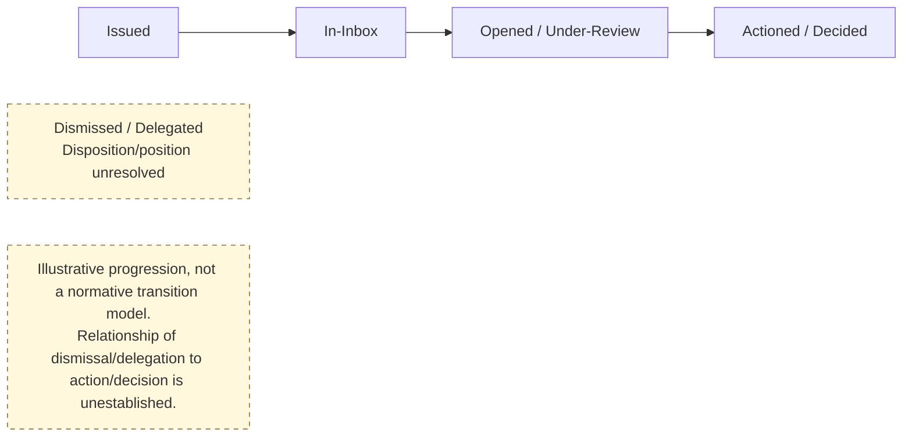
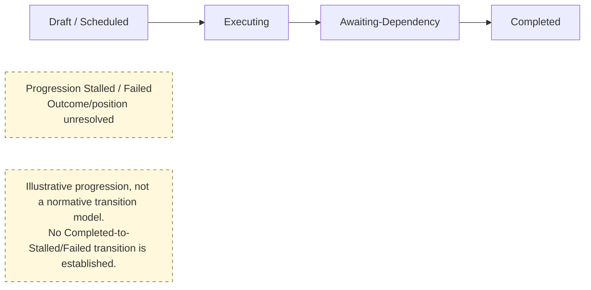
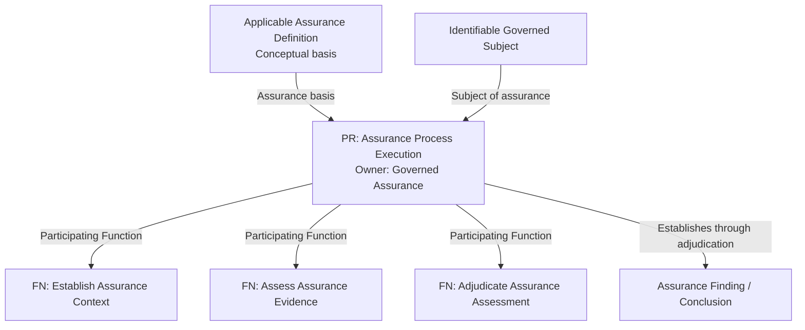
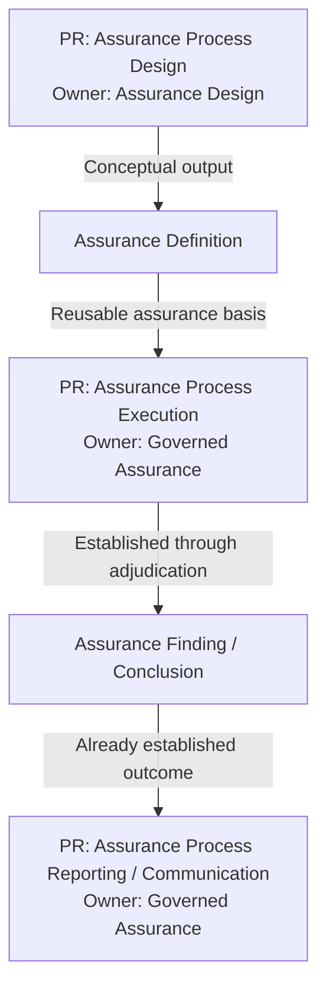

# Principal Business Processes

## 1. Process Demarcation & Justification Rules

The named owning Capabilities retain their established responsibilities. Affected Capability Tier, complete ancestry, root status and full structural Canonical IDs remain unresolved under approved G1 K9. The explicit `Client Administration → Person Identity` relationship remains a partial chain, not a tier allocation.

Processes may elaborate scoped progression without reproducing Behaviour stage lists. Established ownership, responsibility, authority boundaries and supported obligations remain controlling. Omitted Process checkpoints are not invalidated by a Behaviour summary; omitted Behaviour responsibilities are not removed by a Process. Stage-count equality is not required, and extra detail does not establish universal applicability.

Illustrations are not complete normative transition models. Their scoped applicability and visible uncertainty annotations retain independent Business meaning; detailed execution-state machinery remains downstream. For a materially significant managed outcome that available evidence cannot establish, preserve uncertainty rather than infer success or failure from an absent acknowledgement, response or observation. No universal additional Process state is prescribed.

Where Healthcare Service context is material to the activity's meaning, authority, coordination, progression or accountability, retain that context in the relevant activity/information responsibility. Location, Organisation, Practitioner or Role cannot substitute for it; no representation or implementation binding follows.

In the Harmonia Business Architecture, a **Business Process** represents the governed progression of a healthcare activity instance through a defined lifecycle of meaningful states, dispositions, and operational outcomes within an owning Capability or Feature boundary.

### 1.1 Process Inclusion Rule
> **Model a Business Process only where the business materially cares about the progression of an activity instance through meaningful states, dispositions, or outcomes.**

Generic, stateless, or purely retrieval-oriented operations do **not** constitute Business Processes:
- Search and query execution;
- Data resolution and translation;
- Format transformation and mapping;
- Cryptographic verification and hash validation;
- Terminology and code lookup;
- User interface presentation and rendering.

<a id="12-the-16-canonical-r1-business-processes"></a>

### 1.2 Canonical Business Process Catalogue

The sixteen pre-existing Business Processes remain in the current R1.x/R2.x baseline with the authorised identity/discharge reconciliations and explicit lifecycle qualifications. Three approved Health Service Assurance Processes extend this catalogue to **nineteen Business Processes**; their existing authority/progression boundaries are sufficient for this baseline while detailed lifecycle states and transitions remain unestablished.

```text
Principal Business Processes
├── Entity & Administrative Processes
│   ├── 1. Governed Person Identity Correction
│   └── 2. Practitioner Verification
├── Clinical Lifecycle & Service Administration Processes
│   ├── 3. Referral Progression
│   ├── 4. Encounter Lifecycle
│   ├── 5. Closed-Loop Order Progression
│   └── 6. Clinical Document Lifecycle
├── Healthcare Facility & Logistics Operations Processes
│   ├── 7. Theatre Case Progression
│   ├── 8. Clinic / Operational Queue Progression
│   ├── 9. Bed Turnover
│   ├── 10. Operational Work Progression
│   ├── 11. Patient Transport
│   ├── 12. Specimen Transport
│   └── 13. Discharge Progression
├── Horizontal Workflow Coordination Processes
│   ├── 14. Work Order Progression (Human Doing)
│   ├── 15. To Do Progression (Human Reviewing / Deciding)
│   └── 16. Synthetic Task Progression (Automated System Work)
└── Health Service Assurance Processes
    ├── 17. Assurance Process Design
    ├── 18. Assurance Process Execution
    └── 19. Assurance Process Reporting / Communication
```

---

## 2. Entity & Administrative Processes

### 2.1 Governed Person Identity Correction Process
- **Owning Capability**: `Person Identity` (under `Client Administration`)
- **Process Purpose**: Processes externally authoritative identity corrections and merge/unlink outcomes, applies their consequences to Harmonia-managed identity information and identifier associations, and communicates resulting changes with an audit history.
- **Authority boundary**: Person correction/merge decisions originate externally. Internal triage, evidence verification and approval concern applicability and governed processing of that authoritative outcome, not person matching, golden-record determination, master-person selection or originating merge adjudication.
- **State Progression Lifecycle**:
  $$\text{Correction Requested} \longrightarrow \text{HIM Triage} \longrightarrow \text{Evidence Verified} \longrightarrow \text{Correction Approved} \longrightarrow \text{Merge/Unlink Executed} \longrightarrow \text{Change Broadcasted} \longrightarrow \text{Closed}$$
- **Key State Dispositions**:
  - `Correction Requested`: Externally authoritative correction or merge/unlink outcome received for governed application.
  - `HIM Triage`: Health Information Manager reviews the received decision/outcome and its applicability.
  - `Evidence Verified`: Authoritative source decision and supporting provenance/documentation verified.
  - `Correction Approved`: Governed application of the externally authoritative outcome approved; this does not originate a person-merge decision.
  - `Merge/Unlink Executed`: External merge/unlink consequences applied to Harmonia's managed identifier associations and audit history.
  - `Change Broadcasted`: Downstream clinical systems notified of merged or rectified identity.

---

### 2.2 Practitioner Verification Process
- **Owning Capability**: `Provider Administration`
- **Process Purpose**: Governs the lifecycle of validating, certifying, and periodically re-verifying a healthcare practitioner's professional credentials, registration status, and clinical scope of practice.
- **State Progression Lifecycle**:
  $$\text{Verification Initiated} \longrightarrow \text{Regulatory Registry Queried} \longrightarrow \text{Credentials Validated} \longrightarrow \text{Privileges Endorsed} \longrightarrow \text{Active Verified} \longrightarrow \text{Expired / Suspended}$$
- **Key State Dispositions**:
  - `Verification Initiated`: New practitioner registration or periodic re-credentialing triggered.
  - `Regulatory Registry Queried`: Real-time query executed against national registry (e.g., AHPRA).
  - `Credentials Validated`: Primary qualifications, specialist endorsements, and sanctions checked.
  - `Privileges Endorsed`: Health service medical administration endorses admitting/procedural scope.
  - `Active Verified`: Practitioner verified for clinical ordering and electronic communication.
  - `Expired / Suspended`: Verification lapses or regulatory sanction triggers privilege suspension.

---

## 3. Clinical Lifecycle & Service Administration Processes

### 3.3 Referral Progression Process
- **Owning Capability**: `Referral Administration`
- **Process Purpose**: Governs the end-to-end operational progression of an incoming clinical referral from receipt through specialist clinical triage, booking, and final service acceptance.
- **Scope qualification**: This illustrates a specialist booking/attendance pathway; Referral does not universally require acceptance, scheduling, attendance or discharge, or establish delivery, responsibility actually assumed or Transfer of Care. Decline, rejection and redirection remain valid dispositions without invented transition paths. `Accepted / Waitlisted` is a local compound checkpoint, not universal equivalence between acceptance and waitlisting.
- **State Progression Lifecycle**:
  $$\text{Submitted} \longrightarrow \text{Intake Validated} \longrightarrow \text{Clinically Triaged} \longrightarrow \text{Accepted / Waitlisted} \longrightarrow \text{Scheduled} \longrightarrow \text{Consultation Attended} \longrightarrow \text{Discharged / Rejected} \qquad \text{(Illustrative specialist pathway; dispositions vary)}$$
- **Key State Dispositions**:
  - `Submitted`: Electronic referral received from GP or external facility.
  - `Intake Validated`: Administrative validation of patient details, mandatory fields, and tests.
  - `Clinically Triaged`: Senior clinician assigns urgency category (e.g., Cat 1 urgent within 30 days).
  - `Accepted / Waitlisted`: Referral accepted and placed onto the specialty waitlist.
  - `Scheduled`: Outpatient appointment allocated and patient notified.
  - `Consultation Attended`: Patient seen; initial specialist assessment completed.
  - `Discharged / Rejected`: Referral completed and discharged back to primary care, or formally rejected with clinical rationale.

---

### 3.4 Encounter Lifecycle Process
- **Owning Capability**: `Episode & Encounter Administration`
- **Process Purpose**: Governs the clinical and administrative lifecycle of an acute, emergency, inpatient, or outpatient encounter between a patient and healthcare services.
- **State Progression Lifecycle**:
  $$\text{Planned / Booked} \longrightarrow \text{Arrived} \longrightarrow \text{Triaged / Ingested} \longrightarrow \text{Active In-Progress} \longrightarrow \text{Discharged} \longrightarrow \text{Completed / Encoded} \qquad \text{(Scoped illustration; ON_LEAVE relationship unresolved)}$$
- **Key State Dispositions**:
  - `Planned / Booked`: Elective admission or clinic appointment scheduled.
  - `Arrived`: Patient presents at facility or emergency desk.
  - `Triaged / Ingested`: Clinical triage category assigned; encounter record activated.
  - `Active In-Progress`: Inpatient care, bedside monitoring, and clinical orders actively underway.
  - `Discharged`: Patient clinically discharged; care-place vacated.
  - `Completed / Encoded`: Clinical documentation finalized, ICD/DRG coding completed, and encounter legally closed.
- **Scope qualification**: These completion criteria retain their locally described applicability; they do not establish universal signing, legal closure or originating authority over clinical information. Finalisation, signing and legal qualification remain distinct. The relationship with Strategy `ON_LEAVE`, including applicability and transitions, remains unresolved.

---

### 3.5 Closed-Loop Order Progression Process
- **Owning Capability**: `Order Administration`
- **Process Purpose**: Governs the rigorous, closed-loop tracking of diagnostic pathology, radiology, and procedural orders from requisition to result correlation, preventing dropped or unfulfilled investigations.
- **Scope qualification**: These examples describe a diagnostic/procedural progression and do not exclude medication from the broader Order Administration responsibility. Specimen and result checkpoints are scoped. The signed requisition/report requirements remain within this illustrated scope; signing is not universally equivalent to finalisation or authority. Result consumption/binding does not define originating validity, authority, authorship or legal status.
- **State Progression Lifecycle**:
  $$\text{Requisition Placed} \longrightarrow \text{Order Dispatched} \longrightarrow \text{Specimen Collected / Scheduled} \longrightarrow \text{In-Execution} \longrightarrow \text{Preliminary Result Bound} \longrightarrow \text{Final Result Bound} \longrightarrow \text{Closed / Verified} \qquad \text{(Scoped diagnostic/procedural illustration)}$$
- **Key State Dispositions**:
  - `Requisition Placed`: Electronic order created and signed by requesting clinician.
  - `Order Dispatched`: Order routed and accepted by performing diagnostic service. This local compound checkpoint retains routing and recipient acceptance as distinct facts; dispatch alone establishes neither receipt nor acceptance. Behaviour `Received` is not equated with this checkpoint without evidence.
  - `Specimen Collected / Scheduled`: Bio-specimen collected or imaging appointment booked.
  - `In-Execution`: Laboratory analysis or diagnostic scanning underway.
  - `Preliminary Result Bound`: Critical or interim observations published and linked to order.
  - `Final Result Bound`: Authoritative diagnostic report signed and bound to order.
  - `Closed / Verified`: Requesting clinician acknowledges result; order closed. This Order-closure checkpoint does not establish diagnostic-content verification, approval or clinical incorporation.

---

### 3.6 Clinical Document Lifecycle Process
- **Owning Capability**: `Clinical Record Administration`
- **Process Purpose**: Governs the versioning, clinical sign-off, addenda, superseding, and legal status of clinical documents (discharge summaries, specialist letters, advance care directives).
- **State Progression Lifecycle**:
  $$\text{Draft} \longrightarrow \text{Preliminary} \longrightarrow \text{Final Signed} \longrightarrow \text{Amended / Addended} \longrightarrow \text{Superseded} \longrightarrow \text{Entered-in-Error} \qquad \text{(Scoped illustration; no universal document lifecycle)}$$
- **Key State Dispositions**:
  - `Draft`: Incomplete clinical document saved during consultation.
  - `Preliminary`: Document authored pending senior registrar or consultant countersignature.
  - `Final Signed`: Authoritative clinical document legally signed and published.
  - `Amended / Addended`: Governed supplementary clinical addendum appended to signed document.
  - `Superseded`: Entire document replaced by a newer revision; prior version retained for audit.
  - `Entered-in-Error`: Document formally retracted due to wrong patient or invalid content; content struck through with retraction notice.
- **Scope qualification**: `Final ≠ automatically Final Signed`. The described signing/countersigning and legal qualifications remain local requirements, not a universal document lifecycle. Authorship, attestation, approval, authentication, verification, signature, finalisation, authority and legal qualification remain distinct. Amendment, supersession and entered-in-error are not mandatory stages for every document, and consumer processing does not establish originating authority or legal status.

---

## 4. Healthcare Facility & Logistics Operations Processes

### 4.7 Theatre Case Progression Process
- **Owning Capability**: `Theatre Operations`
- **Process Purpose**: Governs the perioperative operational milestones of a surgical procedure within the operating theatre suite.
- **State Progression Lifecycle**:
  $$\text{Case Called} \longrightarrow \text{In Anaesthetic Bay} \longrightarrow \text{Anaesthesia Commenced} \longrightarrow \text{Patient in Theatre} \longrightarrow \text{Knife-to-Skin} \longrightarrow \text{Procedure Finished} \longrightarrow \text{In PACU Recovery} \longrightarrow \text{Ward Handover Complete}$$
- **Key State Dispositions**:
  - `Case Called`: Theatre team requests ward to send patient for surgery.
  - `In Anaesthetic Bay`: Patient arrives in theatre holding and identity/consent verified.
  - `Anaesthesia Commenced`: Anaesthetic induction underway.
  - `Patient in Theatre`: Patient transferred onto operating table.
  - `Knife-to-Skin`: Surgical incision initiated (operative start).
  - `Procedure Finished`: Wound closure completed and dressings applied.
  - `In PACU Recovery`: Patient monitored in post-anaesthesia care unit.
  - `Ward Handover Complete`: Post-operative clinical handover to inpatient ward completed.

---

### 4.8 Clinic / Operational Queue Progression Process
- **Owning Capability**: `Clinic & Practice Operations`
- **Process Purpose**: Governs the movement and state tracking of outpatients through an ambulatory specialty clinic session.
- **State Progression Lifecycle**:
  $$\text{Scheduled} \longrightarrow \text{Patient Arrived} \longrightarrow \text{Checked-In} \longrightarrow \text{Roomed / Pre-Consult} \longrightarrow \text{Consultation In-Progress} \longrightarrow \text{Consultation Concluded} \longrightarrow \text{Departed}$$
- **Key State Dispositions**:
  - `Scheduled`: Appointment booked on session list.
  - `Patient Arrived`: Patient enters waiting area.
  - `Checked-In`: Reception verifies demographics and marks patient ready.
  - `Roomed / Pre-Consult`: Nursing staff record baseline vitals and room patient.
  - `Consultation In-Progress`: Clinician actively conducting consultation.
  - `Consultation Concluded`: Clinical discussion finished; follow-up orders placed.
  - `Departed`: Patient checks out and departs clinic facility.

---

### 4.9 Bed Turnover Process
- **Owning Capability**: `Bed & Care-Place Management`
- **Process Purpose**: Governs the rapid physical turnover, cleaning, sanitisation, and re-allocation of inpatient and emergency care-places.
- **State Progression Lifecycle**:
  $$\text{Bed Vacated} \longrightarrow \text{Cleaning Dispatched} \longrightarrow \text{Sanitisation In-Progress} \longrightarrow \text{Terminal Cleaning Verified} \longrightarrow \text{Bed Ready / Available} \longrightarrow \text{Bed Allocated / Occupied}$$
- **Key State Dispositions**:
  - `Bed Vacated`: Prior patient discharged or transferred.
  - `Cleaning Dispatched`: Cleaning job allocated to environmental services team.
  - `Sanitisation In-Progress`: Ward cleaning or isolation decontamination underway.
  - `Terminal Cleaning Verified`: Ward coordinator or supervisor verifies care-place readiness.
  - `Bed Ready / Available`: Bed marked available for incoming patient allocation.
  - `Bed Allocated / Occupied`: Incoming patient allocated and physically placed in bed.

---

### 4.10 Operational Work Progression Process
- **Owning Capability**: `Work Allocation & Dispatch`
- **Process Purpose**: Governs the dispatch, assignment, execution, and completion of facility operational jobs (e.g., equipment moves, waste removal, linen supply).
- **State Progression Lifecycle**:
  $$\text{Work Requested} \longrightarrow \text{Queued in Dispatch} \longrightarrow \text{Assigned to Worker} \longrightarrow \text{Job Accepted} \longrightarrow \text{Work In-Progress} \longrightarrow \text{Work Completed / Aborted}$$
- **Key State Dispositions**:
  - `Work Requested`: Facility support task submitted by clinical unit.
  - `Queued in Dispatch`: Job prioritized in operational queue.
  - `Assigned to Worker`: Job allocated to specific staff member or team.
  - `Job Accepted`: Worker acknowledges dispatch on mobile device.
  - `Work In-Progress`: Task actively being executed.
  - `Work Completed / Aborted`: Job marked finished or formally cancelled with reason.

---

### 4.11 Patient Transport Process
- **Owning Capability**: `Patient Transport`
- **Process Purpose**: Governs the physical portering and transport of patients between hospital departments, wards, diagnostic suites, and external facilities.
- **State Progression Lifecycle**:
  $$\text{Transport Requested} \longrightarrow \text{Porter Dispatched} \longrightarrow \text{Patient Collected} \longrightarrow \text{In-Transit} \longrightarrow \text{Delivered at Destination} \longrightarrow \text{Clinical Handover Complete}$$
- **Key State Dispositions**:
  - `Transport Requested`: Clinical unit books wheelchair, bed, or ambulance transport.
  - `Porter Dispatched`: Wardsperson assigned and en route to pickup location.
  - `Patient Collected`: Patient identity verified and transfer initiated.
  - `In-Transit`: Patient actively moving through facility corridors or ambulance transit.
  - `Delivered at Destination`: Patient arrives at target diagnostic suite or ward.
  - `Clinical Handover Complete`: Safe custody and clinical briefing transferred to receiving staff.

---

### 4.12 Specimen Transport Process
- **Owning Capability**: `Clinical Logistics Coordination`
- **Process Purpose**: Governs the physical courier chain-of-custody, transport, and delivery of pathology bio-specimens, blood products, and surgical biopsies.
- **State Progression Lifecycle**:
  $$\text{Specimen Packaged} \longrightarrow \text{Courier Dispatched} \longrightarrow \text{Chain-of-Custody Signed} \longrightarrow \text{In-Transit (Monitored)} \longrightarrow \text{Lab Ingress Received} \longrightarrow \text{Specimen Accepted}$$
- **Key State Dispositions**:
  - `Specimen Packaged`: Clinical unit packages bio-sample with barcode manifest.
  - `Courier Dispatched`: Courier route assigned for pickup.
  - `Chain-of-Custody Signed`: Courier scans barcode and accepts legal custody.
  - `In-Transit (Monitored)`: Specimen in transit under temperature/time constraints.
  - `Lab Ingress Received`: Central pathology specimen reception logs physical receipt.
  - `Specimen Accepted`: Specimen integrity verified and passed to analytical track.

---

### 4.13 Discharge Progression Process
- **Owning Capability**: `Discharge Management`
- **Process Purpose**: Governs the multidisciplinary coordination of patient discharge planning, pharmacy reconciliation, transport, and community handover.
- **State Progression Lifecycle**:
  $$\text{Discharge Planning Initiated} \longrightarrow \text{Clinical Readiness Confirmed} \longrightarrow \text{Medications Reconciled} \longrightarrow \text{Transport & Services Booked} \longrightarrow \text{Discharge Summary Signed} \longrightarrow \text{Physically Departed} \qquad \text{(Illustrative preparation; publication, authorisation and exit distinct)}$$
- **Key State Dispositions**:
  - `Discharge Planning Initiated`: Estimated Date of Discharge (EDD) set on admission.
  - `Clinical Readiness Confirmed`: Attending medical team declares patient fit for discharge.
  - `Medications Reconciled`: Hospital pharmacy reconciles and dispenses discharge medications.
  - `Transport & Services Booked`: Community nursing, home equipment, and patient transport booked.
  - `Discharge Summary Signed`: Applicable signed summary is available/published and may be communicated before departure where the Business behaviour requires it; signing, finalisation, publication and discharge authorisation remain distinct.
  - `Physically Departed`: Confirmed physical exit triggers departure notifications, updated bed-state communication and finalised-summary dispatch to external care providers under `FEAT-HSO-29`; care-place turnover follows its own responsibility.
- **Timing reconciliation**: Preparation, information availability/publication, applicable discharge authorisation and physical exit are distinct. Earlier preparation/communication is permitted; it does not realise a Feature triggered by confirmed exit. This illustrated local pathway establishes neither universal publication timing nor a universal discharge state machine, and adds no inferred publication event or authorisation state.
- **Preserved uncertainty**: Summary signing and finalisation are not universal equivalents. Detailed applicability, discharge-authority workflows and timing beyond the established preparation/confirmed-exit distinction remain unestablished.

---

## 5. Horizontal Workflow Coordination Processes

### 5.14 Work Order Progression Process
- **Owning Capability**: `Workflow & Activity Coordination`
- **Activity Archetype**: **Human Doing** — physical or operational task executed by healthcare staff.
- **State Progression Lifecycle**:
  $$\text{Created} \longrightarrow \text{Ready} \longrightarrow \text{Dispatched} \longrightarrow \text{Accepted} \longrightarrow \text{In-Progress} \longrightarrow \text{Completed / Failed / Cancelled}$$
- **Key State Dispositions**:
  - `Created`: Work order instantiated with scope, target, and required skills.
  - `Ready`: Preconditions satisfied; available for assignment.
  - `Dispatched`: Sent to target individual or worker group queue.
  - `Accepted`: Worker claims task.
  - `In-Progress`: Execution underway.
  - `Completed`: Task finished with recorded completion telemetry.

---

### 5.15 To Do Progression Process
- **Owning Capability**: `Workflow & Activity Coordination`
- **Activity Archetype**: **Human Reviewing / Updating / Deciding** — clinical review, document countersignature, or administrative authorization task.
- **State Progression Lifecycle**:


- **Key State Dispositions**:
  - `Issued`: To Do generated (e.g., review abnormal potassium result).
  - `In-Inbox`: Displayed in practitioner's actionable task list.
  - `Opened / Under-Review`: Clinician inspecting relevant clinical context.
  - `Actioned / Decided`: Decision executed (e.g., signed off, order placed, acknowledged).
  - `Dismissed / Delegated`: Task reassigned to registrar or dismissed with comment.
- **Preserved uncertainty**: Whether dismissal/delegation is an alternative disposition, a subsequent action or a scoped variant remains unresolved; its disconnected diagram node establishes no transition or position in the illustrative progression.

---

### 5.16 Synthetic Task Progression Process
- **Owning Capability**: `Workflow & Activity Coordination`
- **Activity Archetype**: **Non-Human Executable Work** — automated system workflows, batch syndications, or policy evaluation tasks.
- **State Progression Lifecycle**:


- **Key State Dispositions**:
  - `Draft / Scheduled`: Automated task instantiated and scheduled for processing.
  - `Executing`: System actively processing task.
  - `Awaiting-Dependency`: Paused awaiting asynchronous external reply or event.
  - `Completed`: Automated execution succeeded and output artifact produced.
  - `Progression Stalled / Failed`: Transient fault triggers scheduled recovery attempt; permanent failure records failure evidence.
- **Preserved uncertainty**: Whether stalled/failed is an alternative outcome, reopening/post-completion behaviour or a presentation defect remains unresolved. Its disconnected diagram node does not make success and failure equivalent or establish post-completion transitions.

---

<a id="6-governed-assurance-process-derivation-boundary"></a>

## 6. Health Service Assurance Processes

The approved human review decisions on 2026-10-08 establish exactly the following three assurance Processes, building on the [assurance Strategy](../../02-strategy/capability-maps/health-service-assurance-derivation.md) and the two established assurance Roles and five Functions. **Element Type: Business Process (PR)** applies to each. Capability ownership below follows the established responsibility; **Feature association is not established** and **Canonical IDs remain unresolved** because Capability Tier, complete ancestry and local identifier allocation remain unestablished. Catalogue numbering is navigation, not identifier allocation.

<a id="assurance-process-design"></a>

### 6.1 Assurance Process Design

- **Canonical Name**: `Assurance Process Design`.
- **Owning Capability**: [Assurance Design](../../02-strategy/capabilities/business-enabling-capabilities.md#assurance-design).
- **Process Purpose**: Establishes and maintains how satisfaction of a governed requirement, constraint or expected behaviour is to be assured.
- **Principal Performing Role**: [Service Assurance Modeller](../actors-roles/roles.md#service-assurance-modeller).
- **Participating Functions**: [Design Service Assurance](../behaviours/health-service-assurance.md#design-service-assurance) and [Manage Assurance Criteria](../behaviours/health-service-assurance.md#manage-assurance-criteria). Manage Assurance Criteria retains ownership within Assurance Criteria Management; its participation does not subsume that Capability's criteria lifecycle or transfer its information responsibility to Assurance Design.
- **Conceptual Output**: [Assurance Definition](../behaviours/health-service-assurance.md#42-assurance-definition--conceptual-modelling-output), retaining its conceptual Business Architecture output/boundary treatment.
- **Boundary**: Governance Authority establishes what is authoritative. Design does not grant Service Assurance Modeller approval authority. Detailed Assurance Definition lifecycle, approval/publication workflows, criteria lifecycle and information modelling remain unresolved. Participation of the two Functions does not establish a cross-capability lifecycle or a new exchange/Service between their owners.

<a id="assurance-process-execution"></a>

### 6.2 Assurance Process Execution

- **Canonical Name**: `Assurance Process Execution`.
- **Owning Capability**: [Governed Assurance](../../02-strategy/capabilities/business-enabling-capabilities.md#governed-assurance).
- **Process Purpose**: Performs defined assurance for an identifiable governed subject in accordance with an applicable Assurance Definition and establishes an Assurance Finding / Conclusion from applicable trustworthy evidence.
- **Principal Performing Role**: [Service Guardian](../actors-roles/roles.md#service-guardian).
- **Participating Functions**: [Establish Assurance Context](../behaviours/health-service-assurance.md#establish-assurance-context), [Assess Assurance Evidence](../behaviours/health-service-assurance.md#assess-assurance-evidence) and [Adjudicate Assurance Assessment](../behaviours/health-service-assurance.md#adjudicate-assurance-assessment), all retaining Governed Assurance ownership.
- **Conceptual Basis and Output**: Applicable Assurance Definition plus identifiable governed subject; Assurance Finding / Conclusion established through adjudication where sufficient trustworthy evidence permits. Correct execution with insufficient evidence does not imply satisfaction or non-satisfaction or force a conclusion.
- **Boundary**: Function completion does not define Process lifecycle states. No Context Established, Evidence Assessed, Adjudicated or Concluded states are inferred. Detailed lifecycle states, transitions and initiation mechanics remain unresolved. Requesting this Process does not grant control of evidence assessment, adjudication or the resulting finding/conclusion.



<a id="assurance-process-reporting-communication"></a>

### 6.3 Assurance Process Reporting / Communication

- **Canonical Name**: `Assurance Process Reporting / Communication`.
- **Owning Capability**: [Governed Assurance](../../02-strategy/capabilities/business-enabling-capabilities.md#governed-assurance).
- **Process Purpose**: Communicates applicable established Assurance Findings and Conclusions to legitimate recipients according to their responsibilities, authority and information requirements, without altering the established assurance outcome or assuming responsibility for the recipient's subsequent action.
- **Starting Basis**: An already established Assurance Finding / Conclusion. This Process does not perform assessment or adjudication, alter or reinterpret the established outcome.
- **Communication Participation**: Service Guardian participates through [Service Assurance Outcome Communication](../collaborations-interactions/interactions.md#service-assurance-outcome-communication), associated with [Communicate Service Assurance Outcome](../behaviours/health-service-assurance.md#communicate-service-assurance-outcome). No additional Function is introduced to populate this Process.
- **Boundary**: Reporting / Communication is not limited to documentary report production; an appropriate Business Interaction may communicate the outcome without a report document. It assumes no operational response, remediation, escalation, policy/compliance response, process improvement, clinical management, clinical judgement or other recipient action. Detailed communication progression and completion semantics remain unresolved.

### 6.4 Process-Family Relationship and Preserved Boundaries



Both diagrams express semantic Business Architecture relationships, not lifecycle states, mandatory runtime topology, application orchestration, deployment sequence, component structure, message flow or a complete implementation workflow. An applicable Assurance Definition may be reused by multiple Execution instances; each assurance activity does not require a newly executed Design instance. Using the modelling output establishes a responsibility/information dependency, not a Modeller-to-Guardian Interaction or Collaboration.

> **Governed Assurance does not recursively assure its own execution. Assurance activity execution integrity is provided by the established activity execution framework.**

Managed progression of assurance activity does not make that execution another Service Assurance subject. No recursive assurance Process, Function, Service or conclusion is established; the activity execution framework reference allocates no solution component. System Steward's status observation is management/stewardship of progression, not assurance of assurance. See the [non-recursion boundary](../behaviours/health-service-assurance.md#assurance-non-recursion-boundary).

The sixteen pre-existing Processes retain their owners, definitions and state models. Clinical review, sign-off, countersignature and clinical decisions remain with applicable clinical processes/authorities; To Do completion is not an independent assurance conclusion. Generic Work Order, To Do and Synthetic Task progression do not supply assurance lifecycle states or an assurance execution allocation.

Service Guardian may manage its own assurance progression without managing its subject. Neither assurance Role acquires the subject's progression, assignment, delegation, failure/recovery, operational escalation, remediation or improvement responsibility. Execution failure/indeterminate outcome remain distinct from correctly executed assurance with insufficient evidence. [Remaining decisions](../behaviours/health-service-assurance.md#6-additional-business-elements-not-yet-established) include lifecycle states/transitions, initiation mechanics, detailed information semantics and response mechanisms; the three Process names and purposes are resolved.
