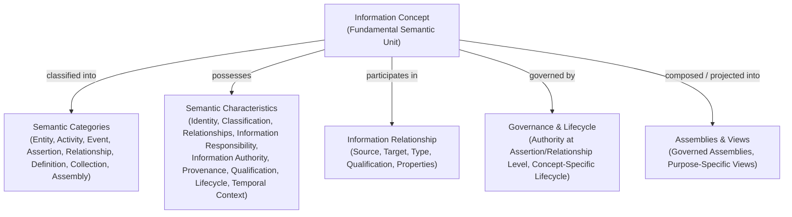

# Domain 04 — Information Architecture

## Overview & Pedagogical Guide

Domain 04 — Information Architecture defines the canonical information models, semantic structures, and conceptual relationships required by the Harmonia Health Integration Environment (HIE). It bridges the business semantics established in **[Domain 03 (Business Architecture)](../03-business-architecture/README.md)** with downstream technical architectures (Application Architecture Domain 05, Integration Architecture Domain 06, and physical storage implementations).

The primary purpose of Domain 04 is to answer the fundamental architectural question:
> **What information does Harmonia need to understand, govern, and manage in order to discharge the responsibilities established by the Business Architecture, and what are the semantic relationships between those information concepts?**

```text
       WHY?
        │  [Domain 01: Motivation]
        ▼  Axioms, Strategic Drivers, Enduring Principles
WHAT CAPABILITIES ARE NEEDED?
        │  [Domain 02: Strategy]
        ▼  Value Streams, Capability Tiers (L1 → L2 → L3 → Feature)
HOW DOES THE BUSINESS OPERATE?
        │  [Domain 03: Business Architecture]
        ▼  Actors, Roles, Collaborations, Interactions, Functions, Services, Processes, Information Ownership
WHAT INFORMATION IS GOVERNED & MANAGED?
        │  [Domain 04: Information Architecture] (This Domain)
        ▼  Information Concepts, Semantic Relationships, Governance, Assemblies, Lifecycle Models
HOW IS SOFTWARE BEHAVIOUR ALLOCATED?
        │  [Domain 05: Application Architecture]
        ▼  Subsystems, Components, Services, Application State Demarcations
HOW ARE SYSTEMS INTEGRATED?
        │  [Domain 06: Integration Architecture]
        ▼  Integration Fabrics, Protocol Adapters, Message Routing, Wire Profiles
```

---

## 1. Scope & Architectural Purpose

Domain 04 establishes a technology-neutral, implementation-independent, and vendor-agnostic Information Architecture. It formalises the conceptual information responsibilities identified in Domain 03 without prematurely binding to software class structures, database schemas, messaging wire formats, or external standards (such as HL7® or FHIR®).

### Core Semantic Principle
> **Information architecture is derived from business meaning and responsibility. Representation does not define meaning.**

Preserving this principle prevents technical frameworks, wire protocols, or database schemas from distorting health integration semantics. Domain 04 maintains the fundamental distinction:

```text
Business Information Concept
    ≠ Application Data Object
    ≠ FHIR Resource
    ≠ Persistence Entity
    ≠ Java Class
    ≠ Database Table
    ≠ API Payload
```

### Upstream Authority & Immutability Context
- **Domain 01 (Motivation)**, **Domain 02 (Strategy)**, and **Domain 03 (Business Architecture)** are **CLOSED and FROZEN** authoritative baselines. They must remain untouched.
- Domain 04 derives strictly from the business meaning, capabilities, functions, services, processes, and conceptual information responsibilities established in Domain 03 (specifically `docs/markdown/03-business-architecture/information-responsibility/information-responsibility.md`).
- Domain 04 defines semantic models, NOT implementation structures.

### What Belongs in Domain 04
- The canonical Information Architecture Metamodel and core semantic concept definitions.
- Reusable information modelling patterns (e.g. Information Relationships, Qualified Containment, Collections, and Definition-to-Accountability progressions).
- Information governance principles: assertions, granular authority, custody, responsibility, and provenance.
- Concept-specific information lifecycle governance.
- Governed information assemblies and purpose-specific information views.
- The 16 canonical Information Architecture modelling guardrails.
- Traceability frameworks demonstrating explicit derivation from Domain 03 Business Architecture.

### What Is Explicitly Excluded from Domain 04
- **Application Components & Subsystems**: Software component boundaries, Spring beans, or service boundaries (governed under Domain 05).
- **Physical Persistence Schemas**: PostgreSQL DDL, JPA/Hibernate entities, table indexing, or caching topologies.
- **Wire Formats & Interoperability Profiles**: FHIR R4/R5 resource profiles, JSON Schemas, HL7 v2 segment specifications, or REST endpoint definitions (governed under Domain 06 and implementation modules).
- **Exhaustive Clinical Value Sets & Code Systems**: Fine-grained terminology value sets or physical code enumerations (governed under Clinical Knowledge Services and implementation catalogues).
- **Modifications to Upstream Baselines**: Any changes to Domains 01, 02, or 03.

---

## 2. Information Architecture Metamodel Overview

Harmonia adopts an explicit, non-hierarchical metamodel rooted in the **Information Concept**:



### Key Conceptual Highlights
1. **Non-Hierarchical Semantic Categories**: Categories (*Entity, Activity, Event, Assertion, Relationship, Definition, Collection, Assembly*) are conceptual classifications, not an object-oriented class inheritance tree.
2. **Reified Relationships**: Relationships are first-class semantic constructs with fundamental elements (`Source`, `Target`, `Type`) and available characteristics (`Roles`, `Qualification`, `Effective Period`, `Authority / Evidence`, `Primacy`, `Validity / Status`, `Provenance`) used where meaningful.
3. **Role Separation**: `Relationship Role` (e.g. *Parent, Child, Attending*) is the semantic role within a specific relationship and SHALL NOT imply or create a Domain 03 `Business Role`.
4. **Distinct Containment and Membership**: `Object.contains(Object)` represents hierarchical containment. Collection Membership uses the common relationship pattern without implying containment, composition, hierarchy, or ownership (`Containment ≠ Membership`). Person-oriented concepts do not use recursive containment merely to represent relationships.
5. **Definition-to-Accountability Progression**: The 5-stage pattern (`Definition → Contextualisation / Binding → Fulfilment → Outcome → Accountability`) represents independent semantic concepts with distinct identities, authorities, and lifecycles (encompassing clinical, operational, and administrative outcomes)—not lifecycle states of a single record.
6. **Granular Assertion-Level Authority**: Information Authority can attach directly to individual assertions and relationships, enabling multi-author composite health records.
7. **Authority Preservation in Assemblies**: Assemblies and Views project and coordinate information without acquiring originating authority over constituent data.

---

## 3. Pedagogical Reading Path & Navigation

Domain 04 is organised into modular topic sections:

```text
docs/markdown/04-information-architecture/
├── README.md                                    # This domain overview, governing question, and roadmap
├── metamodel/
│   └── information-architecture-metamodel.md   # Metamodel, concept model, core distinctions
├── patterns/
│   ├── information-relationships.md             # Reusable relationship pattern, role separation
│   ├── containment-and-collections.md           # Qualified containment, recursion, collections vs containment
│   └── definition-to-accountability.md          # 5-stage pattern, Healthcare Service & Task/Work reference models
├── governance/
│   ├── authority-custody-provenance.md          # Assertion, responsibility, authority, custody, provenance
│   └── information-lifecycle.md                 # Concept-specific lifecycles, transition governance
├── assemblies-views/
│   └── assemblies-and-views.md                  # Assembly vs View, candidate context definitions
├── guardrails/
│   └── modelling-guardrails.md                  # The 16 canonical Information Architecture guardrails
└── traceability/
    └── domain03-traceability.md                 # Derivation framework and representative examples
```

### Navigating the Documentation Suite

1. **[Metamodel & Concept Model](metamodel/information-architecture-metamodel.md)**: Establishes the foundational `Information Concept`, semantic categories, characteristics, and the boundary separating semantic models from technical representations.
2. **Reusable Information Patterns**:
   - **[Information Relationships](patterns/information-relationships.md)**: The canonical relationship structure, fundamental elements, available characteristics, and strict separation between Relationship Roles and Business Roles.
   - **[Containment and Collections](patterns/containment-and-collections.md)**: Qualified forward recursive containment (`Object.contains(Object)`), entity recursion boundaries, and distinct collection membership semantics.
   - **[Definition to Accountability](patterns/definition-to-accountability.md)**: The 5-stage semantic progression, illustrated via *Healthcare Service* (`OfferedHealthcareService` to `AssuredHealthcareService` with `Order` as an associated direction mechanism) and *Task / Work* (`ActionableTask` to `ReportedTask`).
3. **Information Governance & Lifecycles**:
   - **[Authority, Custody & Provenance](governance/authority-custody-provenance.md)**: Definitions of `Assertion`, granular authority at assertion/relationship level, custody, and provenance models.
   - **[Information Lifecycle](governance/information-lifecycle.md)**: Concept-specific lifecycle principles and transition provenance.
4. **[Assemblies & Views](assemblies-views/assemblies-and-views.md)**: Governance of semantic compositions (`Information Assembly`) and projections (`Information View`) with illustrative candidate context definitions (Healthcare Subject Context, Longitudinal Clinical Record, Encounter Context, etc.).
5. **[Modelling Guardrails](guardrails/modelling-guardrails.md)**: The 16 authoritative repository-wide guardrails for Information Architecture.
6. **[Domain 03 Traceability](traceability/domain03-traceability.md)**: The 4-tier derivation chain (`Capability/Feature → Function/Process → Information Responsibility → Domain 04 Concept`) and representative reference mappings.
