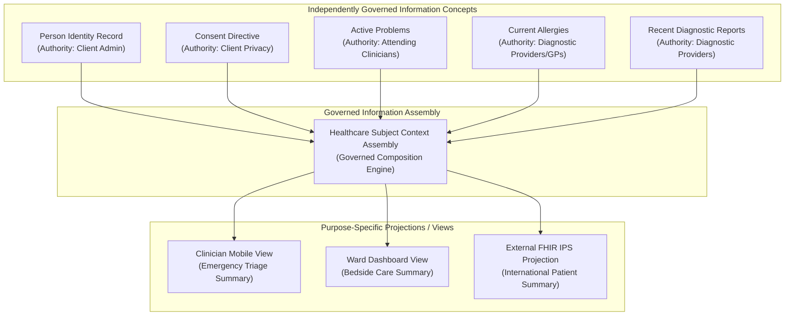

# Governed Information Assemblies & Purpose-Specific Views

## 1. Information Assembly vs. Information View

Healthcare integration requires aggregating information across disparate clinical, operational, and administrative domains to support contextual care delivery and workflow execution.

Harmonia formalises the distinction between an **Information Assembly** and an **Information View**:

> **Information Assembly**: A governed semantic composition of independently meaningful Information Concepts assembled under explicit business rules for a defined operational or clinical purpose.
>
> **Information View**: A purpose- or consumer-oriented projection of information from one or more Information Concepts or Assemblies tailored for a specific actor, role, presentation display, or external integration contract.

### 1.1 The Authority Preservation Invariant
> **Assemblies and Views SHALL NOT acquire originating authority over their constituent information merely through composition, aggregation, or presentation.**

- Every clinical or demographic fact within an assembly or view retains its **original Information Authority**, **original Information Responsibility**, and **original Provenance**.
- An assembly owns only the *governance rules and metadata of the composition itself* (e.g. assembly snapshot timestamp, inclusion criteria applied, correlation algorithm version).
- A view owns only the *presentation projection configuration* (e.g. field selection, sorting, redaction masks, display templates).

---

## 2. Illustrative Candidate Context Assemblies & Views

Domain 04 identifies candidate Context Assemblies that illustrate how Information Concepts can be composed across the Harmonia capability suite (detailed structure and boundaries are refined during information-family modelling):

| Context Assembly | Architectural Scope & Candidate Governed Composition | Constituent Source Concepts | Primary Consuming Contexts |
| :--- | :--- | :--- | :--- |
| **Healthcare Subject Context** | The operational and demographic identity profile of a healthcare subject within a care context. | Person Identity Record, Healthcare Subject Profile, Identifier Correlations, Support Contacts, Consent Directives, Active Vital Status. | Clinical Workstations, Patient Portals, Ingress Message Contextualisation. |
| **Practitioner Context** | The professional, credentialing, and organizational profile of a clinician. | Practitioner Record, National Identifiers, Specialty Accreditations, Role Bindings, Messaging Endpoints, Organizational Affiliations. | Care Team Assignment, Provider Directory Lookups, Authorization Policy Evaluation. |
| **Service Provision Context** | The operational availability and delivery configuration of a healthcare service at a facility. | OfferedHealthcareService, DeliverableHealthcareService, Healthcare Organisation, Location / Ward, Rostered Practitioners, Operating Hours. | Referral Triage, Appointment Scheduling, Order Routing. |
| **Encounter Context** | The bounded operational and clinical context for a specific encounter or episode of care. | Encounter Record, Admitting Diagnosis, Attending Care Team, Current Bed / Care-Place, Care Movements, Encounter Status. | Bed Management, Ward Round Lists, Discharge Planning, Clinical Handover. |
| **Longitudinal Clinical Record** | The synthesized, chronological clinical history of a healthcare subject across participating health services. | Governed Problem Lists, Verified Allergies & Adverse Reactions, Immunisation History, Medication Timeline, Diagnostic Findings, Clinical Documents. | Shared Care Coordination, Clinical Review, Health Analytics. |
| **Operational Work Context** | The consolidated worklist and execution queue for facility logistics and support activities. | FulfillmentTasks, Work Orders, Portering Requests, Cleaning Queue Items, Transit Milestones, Assigned Mobile Workers. | Dispatch Consoles, Mobile Worker Handhelds, Operational Logistics Dashboards. |
| **Bed / Ward Operational Context** | The real-time physical occupancy, environmental status, and logistics state of a hospital ward or clinical unit. | Care-Place Definitions, Real-Time Bed States (*Occupied*, *Available*, *Cleaning*, *Locked*), Bed Turnover Logs, Assigned Patients. | Patient Placement Consoles, Environmental Services, Bed Operations Flowboards. |
| **Collaboration Context** | The multi-party communication and coordination channel for an episode or care team. | Collaboration Space Metadata, Care Team Membership Registry, Discussion Thread Indices, Clinical Summary Projection Links. | Secure Collaboration Channels, Multidisciplinary Meeting Consoles. |

---

## 3. Assembly Lifecycle vs. Constituent Lifecycle

1. **Independent Lifecycle Progression**: An assembly instance (e.g. an active `Encounter Context`) has an operational lifecycle that progresses independently of the lifecycles of the entities it binds (e.g. the patient, the attending doctor, or the physical bed).
2. **Dynamic Aggregation vs. Static Snapshot**:
   - **Dynamic Assembly**: Continuously evaluates constituent facts to reflect the current active state across the HIE.
   - **Historical Snapshot / Document Assembly**: Freezes constituent facts at a specific moment in time (e.g. a *Clinical Discharge Summary* assembly) for legal non-repudiation.
3. **Fail-Closed Privacy Projections**: When projecting an assembly into an Information View for a specific consumer, privacy directives and access control policies (governed by *Client Privacy* and *Health Information Control*) must be evaluated at projection time.
