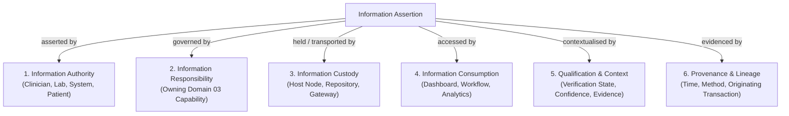
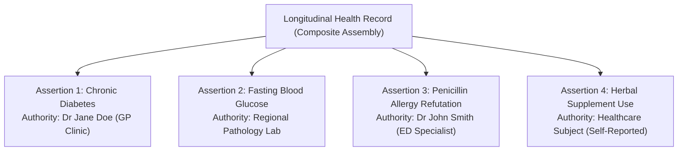

# Information Governance: Assertion, Authority, Custody & Provenance

## 1. Information Assertion

In healthcare integration, clinical and demographic facts are rarely absolute, detached truths. Rather, they are statements made by specific practitioners, diagnostic systems, administrative staff, or patients at specific points in time.

> **Information Assertion**: A formal statement about an entity, relationship, activity, event, or circumstance made by an identifiable source within a qualified context.



### Pragmatic Assertion Modelling
While the assertion concept provides rigorous semantic governance, **Domain 04 does not require every single atomic attribute to be modeled as a distinct, reified Assertion object**.
- Where a fact carries its own independent legal liability, clinical attestation, or disputed confidence (e.g. an *Allergy Intolerance Finding*, a *Diagnostic Pathology Finding*, or a *Death Notification*), it is explicitly governed as an Assertion.
- Where attributes form an indivisible, cohesive demographic or descriptive unit asserted under a single common authority (e.g. standard address elements on a profile), they are governed collectively under the parent concept.

---

## 2. The Four Pillars of Information Governance

Harmonia enforces strict separation across four distinct governance dimensions:

```text
Information Responsibility
    ≠ Information Authority
    ≠ Information Custody
    ≠ Information Consumption
```

| Governance Dimension | Definition | Owning Context | Key Architectural Guardrails |
| :--- | :--- | :--- | :--- |
| **Information Responsibility** | Architectural ownership, semantic definition, and lifecycle governance of an information asset. | Derived strictly from **Domain 03 Capability responsibility**. | Non-transferable. Transits, queries, or presentations never shift responsibility. Architectural responsibility is distinct from the `Information Steward` role. |
| **Information Authority** | The legal, clinical, professional, or organisational actor that authoritatively makes, signs, or attests to a specific assertion or relationship. | The **asserting/attesting legal entity, clinician, or registered system**. | May attach at granular assertion and relationship levels. |
| **Information Custody** | The operational holding, durable persistence, caching, or physical storage of information instances. | The **Harmonia subsystem, database node, or cache cluster** hosting the data. | Custody implies security and preservation obligations, never semantic ownership. |
| **Information Consumption** | The reading, querying, evaluating, aggregating, or rendering of information by a consuming service or user. | The **consuming Capability, presentation tier, or external subscriber**. | Consumption grants no authority to alter originating facts or re-author source semantics. |

---

## 3. Granular Assertion-Level and Relationship-Level Authority

A major limitation of traditional health informatics models is assigning authority exclusively at the composite document or aggregate record level.

In a regional integration environment, a patient's **Longitudinal Health Record** or **Encounter Summary** is an aggregated composite containing clinical assertions and relationships originating from dozens of distinct authorities:
- An attending general practitioner asserts a chronic condition (*Type 2 Diabetes*).
- An independent pathology laboratory asserts an abnormal blood glucose result.
- An emergency physician refutes a previously suspected drug allergy.
- A patient asserts an OTC herbal supplement intake.



### Core Invariant
> **Information Authority SHALL be capable of attaching directly to individual assertions and relationships rather than requiring an entire composite object to share a single monolithic authority.**

---

## 4. Provenance & Lineage Framework

Provenance captures the immutable audit and evidentiary chain for every governed concept, assertion, and relationship.

### 4.1 Provenance Scope
Provenance attaches to:
- **Assertions**: Who asserted what fact, based on what diagnostic or observational evidence, at what recorded timestamp.
- **Relationships**: Who created, confirmed, or severed an association between concepts.
- **Corrections & Retractions**: The authorising party, rationale, and timestamp for an erratum or status refutation.
- **Transformations & Derivations**: The algorithm, translation map, or synthetic rule that derived a secondary concept from source inputs.
- **Fulfilments & Outcomes**: The performing practitioner and device recording a clinical delivery or result.
- **Assemblies**: The assembly definition, generating system, and snapshot timestamp of a composite view.

---

## 5. Semantic Qualification Dimensions

An Information Assertion or Relationship may be qualified across several semantic dimensions:

1. **Verification State**: The epistemic certainty of the assertion (*Confirmed*, *Provisional*, *Refuted*, *Entered-in-Error*).
2. **Confidence / Epistemic Strength**: The degree of clinical or algorithmic confidence (*Definite*, *Probable*, *Suspected*, *Uncertain*).
3. **Quality & Completeness Assessment**: Metadata assessing source record completeness, calibration status, or image resolution.
4. **Evidentiary Basis / Reason**: The diagnostic test, clinical observation, legal certificate, or patient report providing the foundation for the assertion.
5. **Qualifying Authority**: The credentialed supervisor or secondary sign-off authority validating the assertion.
6. **Effective Context**: Clinical setting or situational bounds under which the assertion applies (e.g. *Post-Operative Recovery*, *Fasting State*).
