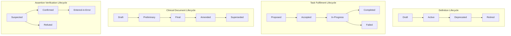
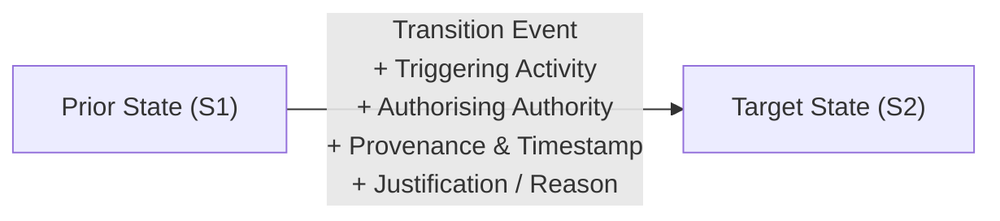

# Information Lifecycle Principles & Transition Governance

## 1. Rejection of Universal Lifecycles

A foundational principle of the Harmonia Information Architecture is the explicit rejection of an artificial, universal lifecycle applied indiscriminately across all information assets:

> **Harmonia does NOT impose a single universal lifecycle across Information Concepts. Lifecycles are concept-specific and governed by the business meaning and responsibilities of the owning Capability.**

Different categories of healthcare and operational information progress through fundamentally different states:
- A **Catalogue Definition** progresses through publication and versioning lifecycles (*Draft* $\to$ *Active* $\to$ *Deprecated* $\to$ *Retired*).
- An **Active Task Fulfilment** progresses through real-time operational execution (*Proposed* $\to$ *Accepted* $\to$ *In-Progress* $\to$ *Completed* / *Failed*).
- A **Clinical Document** progresses through legal authoring states (*Draft* $\to$ *Preliminary* $\to$ *Final* $\to$ *Amended* $\to$ *Superseded*). This is a scoped lifecycle illustration: `Final ≠ automatically Final Signed`. Signing, finalisation, authorship, attestation, approval, authentication, verification, authority and legal qualification remain distinct; locally established signing requirements are preserved without making them universal. Amendment and supersession are not mandatory for every document, and consumer processing does not define originating validity or authority.
- A **Clinical Assertion / Finding** progresses through epistemic verification (*Suspected* $\to$ *Confirmed* $\to$ *Refuted* / *Entered-in-Error*).
- An **Encounter** progresses through admission, movement, and discharge stages (*Planned* $\to$ *Arrived* $\to$ *In-Care* $\to$ *Discharged*).

---

## 2. Lifecycle Transition Governance

Where an Information Concept is stateful, transitions between states are **governed semantic events**:

### 2.1 Transition Requirements
Every material lifecycle transition SHALL support:
1. **Triggering Context**: The business interaction, clinical activity, or workflow rule that initiated the transition.
2. **Authorising Authority**: The clinician, system, or administrative authority empowered to effect the change.
3. **Transition Provenance**: Timestamp, location, and non-repudiation audit capture.
4. **Justification / Reason**: Explicit rationale, especially for abnormal, exceptional, or erratum transitions (e.g. *Entered-in-Error*, *Emergency Cancellation*).

---

## 3. Immutability of History & Non-Destructive Progression

In accordance with healthcare safety and legal compliance:
- **No Physical Destruction / Deletion**: Information Concepts, once asserted or recorded into durable truth, are never subjected to physical destructive deletion.
- **State Invalidation via Explicit Supersession / Error Status**: Corrections and retractions are represented as new, append-only assertion events (*Superseded*, *Entered-in-Error*, *Refuted*) that preserve the historical record alongside the rationale for correction.
- **Bi-Temporal Integrity**: Information architecture supports reconstructing what was known at any specific past historical point in time (*as-of query*), distinguishing when an event occurred from when it was recorded or amended.

---

## 4. Information Unit Context and Managed-State Boundary

Lifecycle and Temporal Context are conceptual management concerns within an
[Information Unit's Context](../metamodel/information-architecture-metamodel.md#65-context).
The Unit boundary does not impose a universal lifecycle, new lifecycle states or
temporal model. Authoritative representation/Version progression remains
distinct from valid Active Generation under AX-05. Documenting these concerns
does not complete managed-state, history, snapshot or evidence/retention
reconciliation, or equate information lifecycle with real-world activity or
workflow progression.
