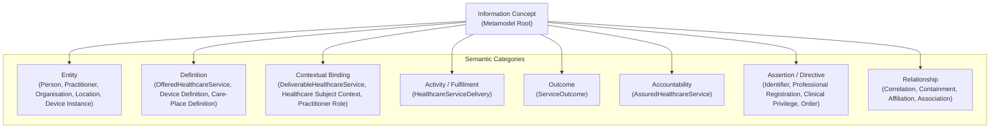

# Information Families

## Overview & Purpose

The **Information Families** directory contains the canonical semantic definitions, information governance models, conceptual relationships, and Domain 03 traceability mappings for the detailed information domains governed by Harmonia.

While the foundational documentation under `04-information-architecture/` defines the governing metamodel, reusable design patterns, governance rules, and guardrails, the files within this directory apply those foundational structures to concrete families of healthcare, administrative, operational, and clinical information.

---

## Pedagogical Navigation & Information Family Structure

The foundational **Entity, Identity, and Service Information Families** established in this package provide the core semantic entities, identities, service definitions, contextual bindings, and devices upon which subsequent clinical, operational, activity, and workflow information families depend:

1. **[Person and Healthcare Subject](person-healthcare-subject.md)**: Models physical human identity, identifier decomposition, cross-authority correlation graphs, governed identity correction, healthcare subject context, and personal/support relationships.
2. **[Practitioner](practitioner.md)**: Models healthcare workforce professionals, professional identities, registration assertions, qualifications, clinical privileges, and contextual role bindings.
3. **[Organisation](organisation.md)**: Models healthcare enterprises and administrative organisations, organisational identifiers, classification hierarchies, contact information, and recursive structural containment.
4. **[Healthcare Location / Care Place](healthcare-location.md)**: Models physical and functional care sites, geospatial addresses, care-place specifications, and spatial containment hierarchies.
5. **[Healthcare Service](healthcare-service.md)**: Models the 5-stage service progression (`OfferedHealthcareService` → `DeliverableHealthcareService` → `HealthcareServiceDelivery` → `ServiceOutcome` → `AssuredHealthcareService`), order direction mechanisms, and the multi-dimensional Service Provision mapping.
6. **[Device](device.md)**: Models the distinction between `Device Definition` (specifications/type) and `Device Instance` (physical asset), dynamic temporal associations, and communication endpoints.

---

## Relationship to the Domain 04 Metamodel & Foundational Patterns

Every concept within an Information Family is an instance of an **Information Concept** classified into one of the canonical metamodel semantic categories:

### Key Foundational Rules Applied in Information Families

1. **Strict Upward Traceability**: Every concept for which Harmonia claims architectural responsibility traces directly to an owning Domain 03 Business Information Responsibility and the Functions/Processes through which it is discharged (Guardrail 6).
2. **Pure Business Semantics**: Concepts represent genuine healthcare, workforce, organisational, and physical entities and activities. They are not defined by or constrained by downstream implementation classes, database tables, or FHIR resources (Guardrails 1, 2, 3).
3. **Conceptual Distinction ≠ Physical Storage Separation**: Distinct Information Concepts may downstream be persisted into shared physical structures without forfeiting their conceptual demarcation in Domain 04 (Guardrail 4).
4. **Separation of Semantic Stages**: Definitions, contextual bindings, fulfilments, outcomes, and accountability models are distinct semantic concepts with independent identities and lifecycles—never collapsed into lifecycle status values of a single record (Guardrail 11).
5. **Separation of Relationship Roles from Business Roles**: A `Relationship Role` (e.g. *Parent*, *Attending*, *Supervising*) describes a participant's local function within an Information Relationship. It does not create or imply a Domain 03 `Business Role` (e.g. *Service Provider*, *Practitioner*, *Clinician*, *Patient*) (Guardrail 8).
6. **Qualified Forward Authoritative Containment**: Hierarchical containment (`Object.contains(Object)`) is authored and validated in the natural forward direction. Containment does not imply membership, affiliation, or service provision (Guardrails 9, 10).
7. **No Forced Binary Simplification**: Inherently contextual multi-party relationships (such as Service Provision) are preserved in their full contextual/n-ary semantic structure rather than artificially collapsed into binary foreign key pairs (Guardrail 15).

---

## Architectural Authority & Ownership Demarcation

An essential principle governing Domain 04 is the clear distinction between **owned/managed concepts** and **referenced/external/contextual concepts**:

| Information Classification | Semantic Meaning | Architectural Ownership | Authority & Provenance |
| :--- | :--- | :--- | :--- |
| **Owned / Managed Information Concept** | Information for which a Harmonia capability holds direct creation, governance, state progression, and lifecycle responsibility. | Traced directly to an owning Domain 03 Information Responsibility (e.g., `Person Identity Record`, `Practitioner Registry & Role Bindings`, `Location & Care-Place Definitions`). | Harmonia manages the authoritative lifecycle and records the originating assertion provenance. |
| **Referenced / External Information Concept** | Information originating from an external authority (e.g. national identity authority, statutory professional registration board, external terminology catalogue, manufacturer). | Harmonia does NOT claim originating authority or architectural ownership. | Originated by the external authority; Harmonia acts as custodian or consumer and preserves external authority bindings. |
| **Contextual / Reified Association** | Information capturing the binding of multiple independent entities within a specific operational or healthcare context (e.g. `DeliverableHealthcareService`, `Practitioner Role Binding`). | Owned by the Harmonia capability responsible for governing the binding or configuration. | Authority resides in the governing enterprise/organisation asserting the contextual relationship. |

> **Architectural Guardrail**: Querying, assembling, correlating, caching, or transporting information across Harmonia never transfers architectural ownership or originating authority from the source capability or external authority (Guardrail 7).

---

## Assertion-Level Authority & Provenance Preservation

Healthcare information in an integration environment is inherently multi-author, federated, and temporally variable. Therefore, across all information families:

1. **Granular Assertion Governance**: Authority, validity, and evidence attach directly to individual assertions and relationships (e.g., a specific identifier, alias, registration, or privilege), not merely to whole aggregate composite documents (Guardrail 12).
2. **Non-Destructive History**: Identity corrections, profile updates, and relationship state changes preserve full audit provenance and historical continuity rather than destructively overwriting previous states.
3. **Jurisdiction-Agnostic Conceptual Architecture**: Canonical concepts use generic semantic terminology (`Identifier Authority`, `Registration Authority`, `Regulatory Classification`, `Device Identifier`) rather than jurisdiction-specific acronyms or statutory bodies. Real-world schemes may be cited as non-normative illustrative examples.
