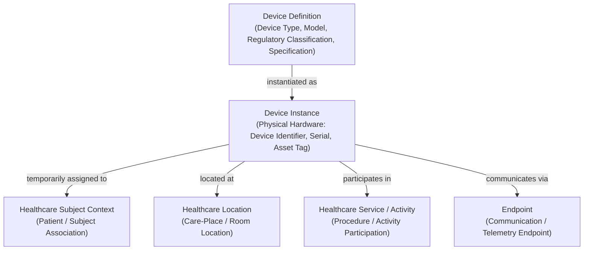

# Device Information Family

## 1. Purpose & Semantic Boundary

The **Device** information family formalises the semantic models for medical equipment, diagnostic instruments, therapeutic appliances, and point-of-care telemetry devices.

This family establishes the critical architectural distinction between **Device Definitions** (governed device types and technical specifications) and **Device Instances** (physical hardware assets), their dynamic temporal associations with patients, locations, and services, and their communication endpoints.



---

## 2. Domain 03 Responsibility & Traceability

Owner names and evidenced responsibilities remain established. Affected Capability Tier, complete ancestry, root status and full structural Canonical IDs remain unresolved under [approved G1 K9](../reviews/package2-g1-review.md#11-k9--capability-metamodel-typing); this traceability does not manufacture missing hierarchy.

This information family derives directly from Domain 03 Business Information Responsibilities under `Clinical Device Administration`:

| Domain 03 Capability | Domain 03 Function / Feature | Domain 03 Information Responsibility | Realised Domain 04 Concepts |
| :--- | :--- | :--- | :--- |
| **`Clinical Device Administration`** | `Maintain Device Definition`, `Maintain Device Instance Identity`, `Maintain Device Association`, `Maintain Device Communication Endpoints` | `Device Registry & Association Ledger`, `Medical Device Type Registry`, `Physical Device Instance Directory`, `Device Association Ledger`, `Device Communication Endpoint Map` | `Device Definition`, `Device Instance`, `Device Association`, `Endpoint` |

---

## 3. Principal Information Concepts

### 3.1 Device Definition
- **Semantic Classification**: `Definition`
- **Definition**: The governed type, manufacturer catalogue model, regulatory classification, and technical specification of a medical device (e.g. *Infusion Pump Model XYZ*, *12-Lead ECG Monitor Model ABC*).
- **Key Characteristics**: Manufacturer name, model identifier, commercial name, regulatory classification (e.g. medical device risk class), calibration requirements, and operational capabilities.

### 3.2 Device Instance
- **Semantic Classification**: `Entity`
- **Definition**: An identifiable, physical hardware asset manufactured as an instance of a `Device Definition`.
- **Key Characteristics**: Device Identifier (such as physical serial number or asset identification), manufacturing date, device version / configuration assertion, and asset operational status (with schemes such as Unique Device Identifier [UDI] and enterprise asset tags serving as illustrative examples).

### 3.3 Device Association
- **Semantic Classification**: `Contextual / Temporal Relationship`
- **Definition**: A dynamic, time-bounded association binding a `Device Instance` to a patient, physical care-place, or clinical service.
- **Key Characteristics**: Association type, effective start and end timestamps, commissioning authority, and clinical context.

### 3.4 Endpoint
- **Semantic Classification**: `Assertion / Coordinate`
- **Definition**: An identifiable electronic telemetry, network port, or communication address bound to a device instance.
- **Architectural Scope**: Captures communication destination coordinates without incorporating physical transport protocols, serial drivers, or network adapter implementations.

---

## 4. Architectural Invariant: Definition vs. Instance

Harmonia strictly separates the governed specification of a device from the physical asset:

$$\text{Device Definition [Specification]} \xrightarrow{\text{instantiated as}} \text{Device Instance [Physical Hardware]}$$

| Dimension | `Device Definition` | `Device Instance` |
| :--- | :--- | :--- |
| **Semantic Nature** | Abstract catalogue definition and engineering specification. | Concrete physical asset in clinical circulation. |
| **Identity Token** | Manufacturer Model Code / Regulatory Classification Identifier. | Device Identifier / Serial Number / Configuration Assertion (e.g. UDI, Asset Tag). |
| **Lifecycle** | Governed catalogue lifecycle (model introduction to obsolescence). | Physical equipment lifecycle (procurement, calibration, deployment, maintenance, decommissioning). |
| **Multiplicity** | 1 Device Definition. | $N$ Device Instances. |

---

## 5. Temporal Associations & Lifecycles

Medical devices dynamically move across patients, wards, and clinical procedures. Device associations are **inherently temporal**:

```text
Device Instance
  ├── temporarily associated-with → Healthcare Subject Context (e.g., bedside patient monitor)
  ├── temporarily located-at → Healthcare Location (e.g., stationed in ICU Bay 4)
  ├── temporarily participates-in → Healthcare Service / Activity (e.g., surgical laparoscope in Theatre 2)
  └── communicates-via → Endpoint (e.g., telemetry gateway address)
```

### Invariants for Temporal Associations
1. **Time-Bounded Validity**: Every association carries an explicit effective period (`validFrom` → `validTo`).
2. **Dynamic Reassignment**: A device moving to a new patient or room closes the active association and creates a new association with complete provenance.
3. **Observation Demarcation**: The device association ledger records *which* device was attached to *whom* and *where*; it does **NOT** thereby own the physiological observations or telemetry waveforms generated by the device. Under the [Business information-responsibility boundary](../../03-business-architecture/information-responsibility/information-responsibility.md#12-non-transfer-of-ownership-guardrail) and [AX-18](../../governance/architectural-axioms.md#ax-18), observation meaning and originating authority remain attributable to their established source and governing responsibility. Service Delivery may consume, process, correlate or make observations available; the LHR is a governed patient-centred view. Consumption, inclusion in that view, presentation and durable persistence do not transfer originating responsibility or authority. Upstream architecture does not establish one universal originating owner for all Observations; broader Observation/Finding semantics remain unresolved.

---

## 6. Key Information Relationships

| Relationship | Source & Role | Target & Role | Type / Qualification | Governed Evidence & Semantics |
| :--- | :--- | :--- | :--- | :--- |
| **Device Instantiation** | `Device Definition` (*Model Spec*) | `Device Instance` (*Physical Asset*) | *Type Instantiation* | Links physical device hardware to its governed catalogue specification. |
| **Patient Binding** | `Device Instance` (*Assigned Device*) | `Healthcare Subject Context` (*Monitored Subject*) | *Temporal Subject Association* | Records point-of-care patient monitoring or therapeutic device attachment with timestamps. |
| **Location Stationing** | `Device Instance` (*Stationed Asset*) | `Healthcare Location` (*Station Location*) | *Temporal Location Association* | Tracks current physical location or storage bay of the device asset. |
| **Service Participation** | `Device Instance` (*Equipment*) | `Healthcare Service` (*Clinical Activity*) | *Activity Participation* | Associates specialized diagnostic/therapeutic instruments with service delivery. |
| **Endpoint Binding** | `Device Instance` (*Device Source*) | `Endpoint` (*Telemetry Coordinate*) | *Communication Binding* | Binds telemetry data streams to verified physical device instances. |

---

## 7. Assertion-Level Governance & Provenance

1. **Manufacturer & Asset Authority**: Device definitions originate from manufacturer specifications and regulatory bodies; device instance identities originate from enterprise biomedical asset registries.
2. **Association Provenance**: Device bindings to patients or locations record the authorizing practitioner or biomedical engineer and assertion timestamps.

---

## 8. Candidate Information Assembly Participation

The concepts in this family participate in downstream candidate Information Assemblies:

1. **Encounter Context Assembly**: Identifies all medical devices currently bound to the patient during an encounter.
2. **Bed / Ward Operational Context Assembly**: Aggregates physical room locations with stationary telemetry equipment and portable monitors.
3. **Diagnostic / Procedure Assembly**: Captures the exact device instance (serial number, calibration status) used to perform a diagnostic scan or surgical procedure.
