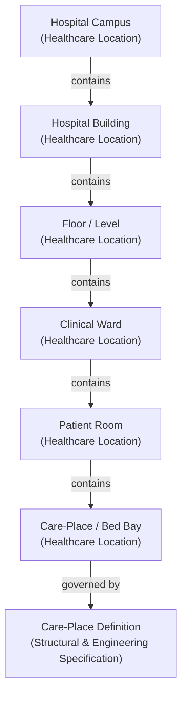

# Healthcare Location / Care Place Information Family

## 1. Purpose & Semantic Boundary

The **Healthcare Location / Care Place** information family formalises the semantic models for physical, geospatial, and functional care environments, including hospital campuses, buildings, floors, clinical wards, patient rooms, treatment bays, and bed care-places.

This family defines the spatial and physical structures where healthcare services are delivered, clinical encounters occur, devices are stationed, and patients are accommodated.



---

## 2. Domain 03 Responsibility & Traceability

This information family derives directly from Domain 03 Business Information Responsibilities under `L1: Location Administration`:

| Domain 03 Capability | Domain 03 Function / Feature | Domain 03 Information Responsibility | Realised Domain 04 Concepts |
| :--- | :--- | :--- | :--- |
| **`L1: Location Administration`** | `Maintain Healthcare Location`, `Maintain Physical Location Hierarchy`, `Maintain Care-Place Definition` | `Location & Care-Place Definitions`, `Physical Hierarchy Graph`, `Care-Place Specifications` | `Healthcare Location`, `Location Identity`, `Location Classification`, `Geospatial Address`, `Care-Place Definition` |

---

## 3. Principal Information Concepts

### 3.1 Healthcare Location
- **Semantic Classification**: `Entity`
- **Definition**: An identifiable physical, geospatial, or functional place where healthcare is delivered, managed, or supported.
- **Architectural Scope**: Represents physical sites (e.g. *Main Hospital Campus*), buildings, wards, rooms, and specific bed bays, as well as mobile care units (e.g. *Mobile Outreach Clinic*).

### 3.2 Location Identity & Location Identifier
- **Semantic Classification**: `Assertion / Identity Bundle`
- **Definition**: The governed set of enterprise and local identifiers that uniquely distinguish the location within an enterprise or regional jurisdiction.
- **Key Semantic Decomposition**:
  - `Identifier Value`: The location code or name (e.g. *CAMPUS-NORTH*, *WARD-3B*, *BED-304-A*).
  - `Identifier Authority / Namespace`: The health enterprise, government department, or facilities management namespace.

### 3.3 Location Classification
- **Semantic Classification**: `Assertion / Classification`
- **Definition**: The structural and functional categorisation of the location (e.g. *Campus*, *Building*, *Floor*, *Ward / Wing*, *Patient Room*, *Care-Place / Bed Bay*, *Operating Theatre*, *Consulting Suite*, *Mobile Unit*).

### 3.4 Geospatial Address
- **Semantic Classification**: `Assertion / Spatial Coordinate`
- **Definition**: The physical address, geospatial coordinates (latitude/longitude), building elevation, and GIS geofence defining the physical location on Earth.

### 3.5 Care-Place Definition
- **Semantic Classification**: `Definition`
- **Definition**: The static engineering, physical infrastructure, and architectural specification of a bed bay or clinical treatment point.
- **Key Characteristics**: Physical capacity, isolation classification (e.g. *Negative Pressure*, *Positive Pressure*, *Standard*), medical gas outlet provisions (e.g. *Oxygen*, *Suction*, *Medical Air*), emergency power backup, and fixed telemetry wiring.
- **Architectural Boundary**: Captures what the physical care-place **is** built to support, independent of its transient operational occupancy.

---

## 4. Recursive Forward Spatial Containment

In accordance with the frozen Domain 04 foundational patterns (Guardrail 9 and Guardrail 10), physical hierarchies are represented via qualified forward recursive containment:

$$\text{Location}.\text{contains}(\text{Location})$$

### Illustrative Physical Containment Hierarchy
```text
Campus
  └── contains → Building
        └── contains → Floor
              └── contains → Ward
                    └── contains → Room
                          └── contains → Bed Care-Place
```

### Containment Invariants
1. **Spatial & Physical Containment Only**: Containment represents physical encapsulation within the built environment.
2. **Containment $\neq$ Service Provision**: The physical presence of a ward within a building does not define the healthcare services delivered there.
3. **No Direct Inference from Department to Location**: An administrative department (e.g., *Department of Cardiology*) is distinct from the physical ward it occupies (e.g., *Ward 4 East*). The link between department and ward is an Information Relationship (`located-at`), not containment.

---

## 5. Architectural Invariant: Static Definition vs. Operational State

Harmonia enforces an essential architectural demarcation between static location definitions and transient operational management:

$$\text{Care-Place Definition [Location Admin]} \neq \text{Care-Place Operational State [Bed Management]}$$

| Dimension | `Care-Place Definition` *(Domain 04)* | `Care-Place Operational State` *(Operational Family)* |
| :--- | :--- | :--- |
| **Owning Capability** | `L1: Location Administration` | `L1: Bed & Care-Place Management` |
| **Semantic Nature** | Static architectural and engineering specifications. | Dynamic, real-time operational status. |
| **Typical Assertions** | Bed type, negative pressure capability, oxygen outlet, fixed telemetry port. | *Available*, *Occupied*, *Reserved*, *Blocked*, *Dirty*, *Cleaning In-Progress*, *Maintenance Lock*. |
| **Lifecycle** | Long-term facility lifecycle (months / years). | Transient operational lifecycle (minutes / hours). |

> **Guardrail**: Operational bed occupancy, patient placement, cleaning turnover, and environmental locks are **NOT** modelled in this family; they belong to subsequent operational information families.

---

## 6. Key Information Relationships

| Relationship | Source & Role | Target & Role | Type / Qualification | Governed Evidence & Semantics |
| :--- | :--- | :--- | :--- | :--- |
| **Spatial Containment** | `Healthcare Location` (*Parent Location*) | `Healthcare Location` (*Contained Location*) | *Physical Containment* | Qualified forward spatial containment in the physical built environment. |
| **Operational Allocation / Area Management** | `Organisational Unit` (*Managing Unit*) | `Healthcare Location` (*Managed Area*) | *Operational Allocation* | Assigns physical wards or clinic suites to managing administrative departments. |
| **Service Delivery Site** | `Healthcare Service` (*Bound Service*) | `Healthcare Location` (*Delivery Site*) | *Service Site Binding* | Associates a deliverable service with the location where it is provided. |

---

## 7. Assertion-Level Governance & Provenance

1. **Facility Management Authority**: Physical structures, geospatial coordinates, and care-place specifications are governed under health enterprise facilities management.
2. **Structural Change Auditing**: Modifications to physical capacity, ward reconfigurations, and decommissioning of care-places preserve historical spatial logs to ensure retrospective clinical encounters trace to the exact physical context of care.

---

## 8. Candidate Information Assembly Participation

The concepts in this family participate in downstream candidate Information Assemblies:

1. **Service Provision Context Assembly**: Resolves the delivery site and facility coordinates for an offered service.
2. **Encounter Context Assembly**: Captures the admission location, current ward, and bed care-place occupied by a patient.
3. **Device Association Assembly**: Tracks the current physical station or storage location of a medical device.
4. **Bed / Ward Operational Context Assembly**: Aggregates the static `Care-Place Definition` with real-time operational turnover and cleaning states.
