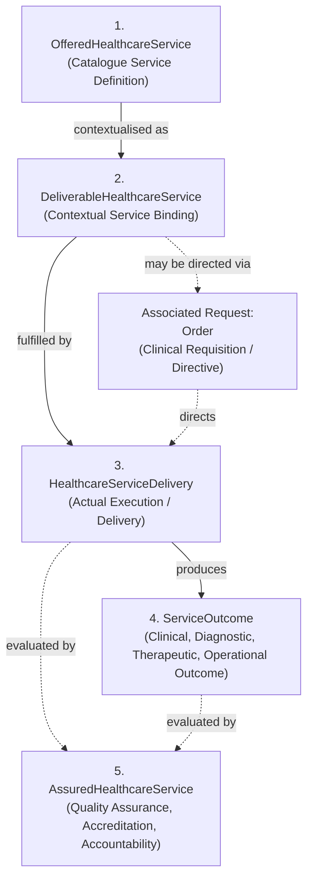
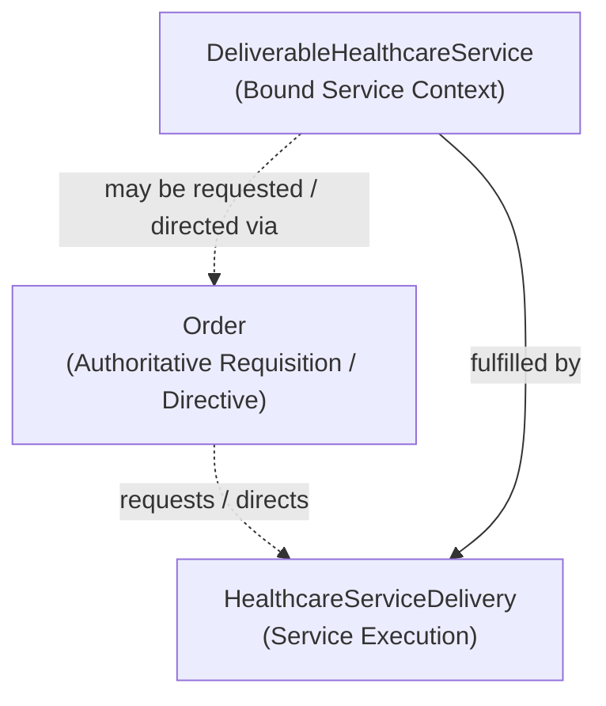
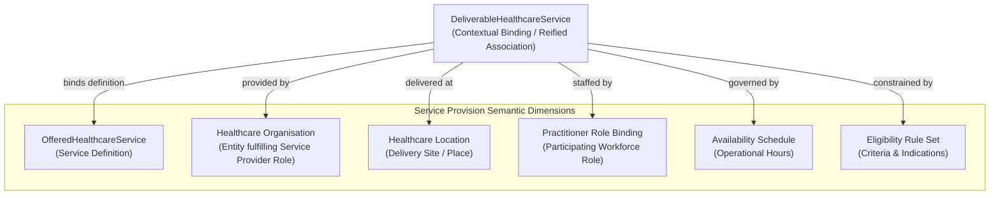

# Healthcare Service Information Family

## 1. Purpose & Semantic Boundary

The **Healthcare Service** information family formalises the semantic models for healthcare service definitions, contextual service bindings (Service Provision), service delivery execution, resulting outcomes, and quality/assurance accountability models.

This family exercises the frozen Domain 04 **Definition-to-Accountability Progression** across five distinct semantic stages, models clinical requisition directives (`Order`) as an associated request mechanism, and formalises the multi-dimensional Service Provision mapping derived from Domain 03 Business Information Responsibilities.

---

## 2. Domain 03 Responsibility & Traceability

This information family derives directly from Domain 03 Business Information Responsibilities:

| Domain 03 Capability | Domain 03 Function / Feature | Domain 03 Information Responsibility | Realised Domain 04 Concepts |
| :--- | :--- | :--- | :--- |
| **`L1: Health Service Administration`** | `Maintain Healthcare Service Definition`, `Maintain Service / Location / Provider Map`, `Maintain Service Availability`, `Maintain Service Eligibility Rules` | `Service Catalogue & Service/Location/Provider Map`, `Service Availability Schedules`, `Service Eligibility Rule Sets` | `OfferedHealthcareService`, `DeliverableHealthcareService`, `Availability Schedule`, `Eligibility Rule Set` |
| **Performing Clinical / Operational Capabilities** *(e.g. `L1: Inpatient Care Enablement`, `L1: Diagnostic Administration`)* | Service execution and clinical delivery functions | Execution records and clinical activity outputs | `HealthcareServiceDelivery` |
| **Diagnostic / Clinical Capabilities** | Result reporting, diagnostic interpretation, and outcome logging | Clinical findings, diagnostic reports, and operational outputs | `ServiceOutcome` |
| **Clinical Governance / Quality & Assurance** *(Reference / Contextual)* | Audit review and quality compliance monitoring | Compliance audit ledgers, assurance certifications, and funding reconciliation | `AssuredHealthcareService` *(Reference / Contextual)* |
| **`L1: Order Administration`** | `Receive Order Request`, `Resolve Order Destination`, `Manage Order Progression`, `Coordinate Order Modification / Cancellation`, `Associate Order Outcome` | `Clinical Order Master Record`, `Closed-Loop Tracking Ledger`, `Order-Result Correlation Matrix` | `Order` *(Associated Request / Direction Mechanism)* |

---

## 3. The 5-Stage Healthcare Service Lifecycle Progression

### Stage 1: OfferedHealthcareService (Definition)
- **Semantic Classification**: `Definition`
- **Definition**: The canonical service offering defined within a healthcare enterprise or jurisdictional catalogue (e.g. *12-Lead Electrocardiography*, *Acute Inpatient Haemodialysis*, *Wound Debridement Protocol*, *Ward Sanitisation Protocol*).
- **Key Characteristics**: Service classification, specialty taxonomy, clinical indications, contraindications, required workforce competencies, supported delivery modalities, and permitted composition structures.
- **Recursive Composition**: An `OfferedHealthcareService` may contain other `OfferedHealthcareService` definitions (e.g. *Cardiology Service* contains *Echocardiography* and *Stress ECG*).

### Stage 2: DeliverableHealthcareService (Contextualisation / Binding)
- **Semantic Classification**: `Contextual Binding`
- **Definition**: The contextual binding of an `OfferedHealthcareService` to a specific providing organisation, delivery location, participating practitioner roles, operational availability schedules, and eligibility rule sets.
- **Key Characteristics**: Bound service definition, performing organisation, delivery site, participating practitioner role bindings, intake schedule, and catchment criteria.

### Stage 3: HealthcareServiceDelivery (Fulfilment)
- **Semantic Classification**: `Activity / Fulfilment`
- **Definition**: The real-world execution and performance of a healthcare service for a specific target subject (or facility target) at a concrete point in time.
- **Key Characteristics**: Actual start/end timestamps, performing practitioners, delivery location, executing devices/equipment, and execution status progression.
- **Healthcare Subject Invariant**: While clinical service deliveries typically associate with a `Healthcare Subject Context`, broader service semantics (e.g., *Facility Sanitisation*, *Water Quality Testing*, *Equipment Calibration*) do not universally require a Healthcare Subject.

### Stage 4: ServiceOutcome (Outcome)
- **Semantic Classification**: `Outcome`
- **Definition**: The demonstrable clinical finding, diagnostic observation, therapeutic change, operational result, or administrative artifact produced by a service delivery.
- **Key Scope**: Spans across:
  - **Clinical Outcomes**: Diagnoses, physiological improvements, symptom resolutions;
  - **Diagnostic Outcomes**: Pathology findings, radiology reports, ECG interpretations;
  - **Therapeutic Outcomes**: Medication administration confirmations, surgical revisions;
  - **Operational Outcomes**: Sanitised bed bay certification, repaired asset state;
  - **Administrative Outcomes**: Completed intake assessments, eligibility confirmations.

### Stage 5: AssuredHealthcareService (Accountability)
- **Semantic Classification**: `Accountability / Audit Record`
- **Definition**: The formal retrospective quality evaluation, clinical audit, accreditation review, or funding/billing reconciliation assessed against delivered services and outcomes.
- **Architectural Scope & Ownership Assessment**: Evaluates single service deliveries or aggregated cohorts across an episode of care. Because Harmonia's core operational capabilities do not claim R1 architectural ownership for statutory health insurance billing reconciliation or external accreditation governance, `AssuredHealthcareService` is designated as a **Reference / Contextual Concept** where Harmonia consumes or supports assurance interfaces without owning the external statutory authority.

---

## 4. Associated Request Mechanism: Order

Harmonia enforces an essential architectural rule regarding clinical requisitions and service delivery:

$$\text{Order} \neq \text{Healthcare Service}$$

### Key Semantics & Invariants
1. **Associated Request Mechanism**: An `Order` is an authoritative clinical requisition, directive, or prescription requesting the delivery of a service. It is **NOT** a mandatory lifecycle stage of `Healthcare Service`.
2. **Delivery Without an Order**: Service delivery may legitimately occur without an `Order` where business or clinical semantics permit (e.g. *Emergency Resuscitation*, *Triage Assessment*, *Direct Routine Nursing Care*, *Scheduled Facility Maintenance*).
3. **Independent Lifecycles**: An `Order` possesses its own lifecycle states (*Requested*, *Accepted*, *In-Progress*, *Completed*, *Discontinued*), owned by `L1: Order Administration`, distinct from the lifecycle of the service delivery itself.

---

## 5. Service Provision Modelling Evaluation & Decision

### 5.1 Contextual Problem
Domain 03 establishes the responsibility `Maintain Service / Location / Provider Map` with the conceptual asset `Service / Location / Provider Mapping Matrix`. 

Service Provision is inherently an n-ary, multi-dimensional semantic association:

$$\text{Service Definition} \times \text{Provider Entity} \times \text{Delivery Location} \times \text{Practitioner Roles} \times \text{Schedule} \times \text{Eligibility}$$

### 5.2 Evaluation of Structural Options

| Candidate Option | Description | Evaluation & Architectural Trade-offs | Decision |
| :--- | :--- | :--- | :--- |
| **Option A: Pure Binary Relationships** | Disconnected binary links (`Service-Location`, `Service-Provider`, `Provider-Location`). | **Rejected (Lossy Simplification)**. Collapsing Service Provision into binary pairs violates Guardrail 15 (*No Forced Binary Simplification*). It fails to express that Provider A delivers Service X *at* Location Y *under* Schedule Z with Role R, rather than delivering all services at all locations. | **REJECTED** |
| **Option B: Separate Reified Concept from Service Model** | Creating a separate `ServiceProvisionMapping` entity alongside `DeliverableHealthcareService`. | **Rejected (Redundant Structural Duplication)**. Introducing two distinct concepts for the exact same semantic binding adds structural overhead without semantic differentiation. | **REJECTED** |
| **Option C: Unified Contextual Binding (`DeliverableHealthcareService`)** | `DeliverableHealthcareService` natively serves as the Stage 2 Contextualisation concept and reifies the multi-dimensional Service Provision mapping. | **Adopted**. Perfectly aligns with the 5-stage metamodel pattern (Stage 2: Contextualisation / Binding), directly discharges the Domain 03 responsibility `Maintain Service / Location / Provider Map`, and preserves all multi-party semantic dimensions without loss. | **ADOPTED** |

### 5.3 Formal Semantic Model for Service Provision
`DeliverableHealthcareService` is the canonical Information Concept representing the reified Service Provision mapping. It binds:
- **`OfferedHealthcareService`**: The governing definition of what service is offered;
- **`Healthcare Organisation`**: The providing enterprise fulfilling the Domain 03 **Business Role** `Service Provider`;
- **`Healthcare Location`**: The physical care site, clinic, or ward where delivery occurs;
- **`Practitioner Role Binding`**: The clinical workforce roles qualified and assigned to deliver the service;
- **`Availability Schedule`**: The operating hours, intake periods, and appointment booking windows;
- **`Eligibility Rule Set`**: The clinical indications, catchment areas, and patient age/acuity constraints.

---

## 6. Key Information Relationships

| Relationship | Source & Role | Target & Role | Type / Qualification | Governed Evidence & Semantics |
| :--- | :--- | :--- | :--- | :--- |
| **Service Definition Containment** | `OfferedHealthcareService` (*Parent Service*) | `OfferedHealthcareService` (*Sub-Service*) | *Service Composition Containment* | Qualified forward containment modelling catalogue service hierarchies. |
| **Service Contextualisation** | `OfferedHealthcareService` (*Catalogue Definition*) | `DeliverableHealthcareService` (*Local Binding*) | *Contextual Binding* | Binds a generic service definition into a concrete deliverable facility context. |
| **Service Provision** | `DeliverableHealthcareService` (*Bound Service*) | `Healthcare Organisation` (*Delivering Provider*) | *Service Provision* | Direct service provision binding (`DeliverableHealthcareService provided-by Healthcare Organisation`) where the organisation fulfils the Domain 03 `Service Provider` Business Role. |
| **Service Execution** | `DeliverableHealthcareService` (*Service Model*) | `HealthcareServiceDelivery` (*Execution Instance*) | *Fulfilment* | Instantiates the delivery of a deliverable service in practice. |
| **Outcome Generation** | `HealthcareServiceDelivery` (*Delivery Activity*) | `ServiceOutcome` (*Result Artifact*) | *Outcome Production* | Records the clinical findings, diagnostic reports, or operational outputs yielded by delivery. |

---

## 7. Assertion-Level Governance & Provenance

1. **Service Definition Governance**: Catalogue service definitions are governed by health service administration and clinical governance boards.
2. **Delivery Attestation**: Every `HealthcareServiceDelivery` carries the assertion provenance of the performing practitioner(s), start/stop timestamps, and delivery location.
3. **Outcome Provenance**: Diagnostic and clinical outcomes preserve the attesting author, laboratory instrument/device identifiers, and diagnostic verification timestamps.

---

## 8. Candidate Information Assembly Participation

The concepts in this family participate in downstream candidate Information Assemblies:

1. **Service Provision Context Assembly**: Aggregates `DeliverableHealthcareService`, `OfferedHealthcareService`, providing `Healthcare Organisation`, `Healthcare Location`, `Practitioner Role Bindings`, and availability schedules.
2. **Encounter Context Assembly**: Captures all `HealthcareServiceDelivery` instances and associated `ServiceOutcome` records delivered during an admission or outpatient visit.
3. **Longitudinal Clinical Record Assembly**: Synthesises clinical `ServiceOutcome` findings (e.g. diagnoses, diagnostic reports, surgical records) into the patient's longitudinal timeline.
4. **Order Context Assembly**: Links an `Order` directive to the resulting `HealthcareServiceDelivery` and produced `ServiceOutcome` artifacts.
