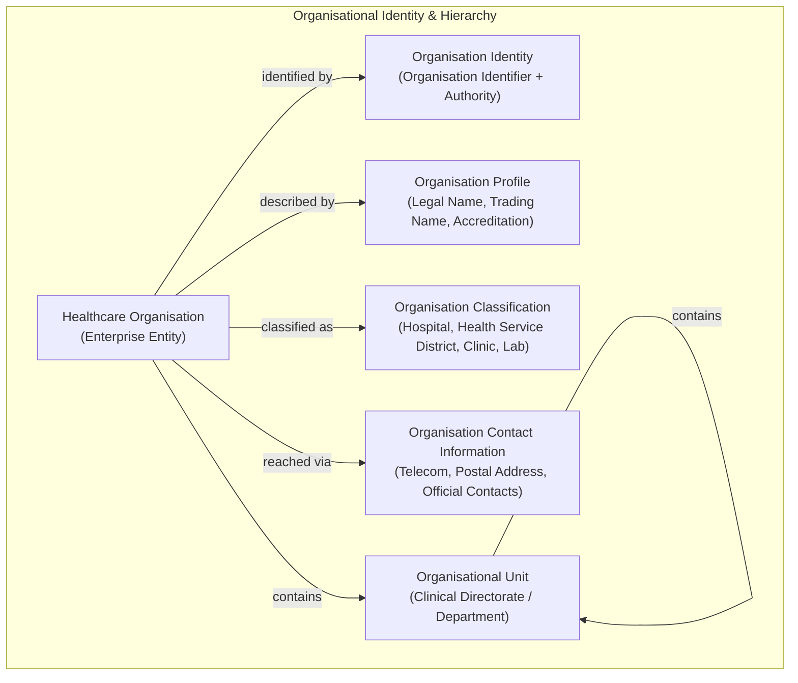
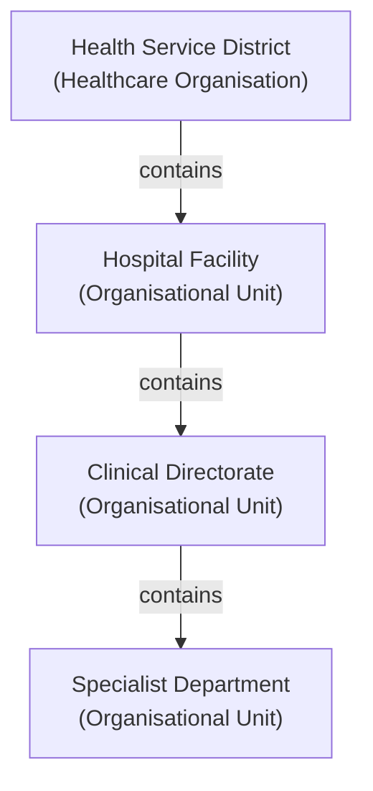

# Organisation Information Family

## 1. Purpose & Semantic Boundary

The **Organisation** information family formalises the semantic models for healthcare enterprises, hospital networks, administrative organisations, clinical directorates, and departmental subdivisions.

This family defines the organisational entities that hold legal accountability, govern clinical facilities, employ healthcare practitioners, deliver healthcare services, and manage care locations across Harmonia.

---

## 2. Domain 03 Responsibility & Traceability

This information family derives directly from Domain 03 Business Information Responsibilities under `L1: Organisation Administration`:

| Domain 03 Capability | Domain 03 Function / Feature | Domain 03 Information Responsibility | Realised Domain 04 Concepts |
| :--- | :--- | :--- | :--- |
| **`L1: Organisation Administration`** | `Verify Healthcare Organisation`, `Govern Organisation Profile`, `Maintain Organisational Structure`, `Maintain Organisation Contacts` | `Healthcare Organisation Registry`, `National Facility Identifier Bindings`, `Department Hierarchy Graph`, `Organisation Contact Directory` | `Healthcare Organisation`, `Organisation Identity`, `Organisation Identifier`, `Organisation Profile`, `Organisation Classification`, `Organisation Contact Information`, `Organisational Unit` |

---

## 3. Principal Information Concepts

### 3.1 Healthcare Organisation
- **Semantic Classification**: `Entity`
- **Definition**: An identifiable legal, corporate, or administrative organisation operating within the healthcare domain (e.g. Health Service District, Hospital Network, Private Healthcare Provider, Diagnostic Laboratory Enterprise).
- **Architectural Scope**: Represents the overarching enterprise entity possessing legal identity, operational mandate, and administrative responsibility.

### 3.2 Organisation Identity & Organisation Identifier
- **Semantic Classification**: `Assertion / Identity Bundle`
- **Definition**: The governed set of official enterprise identifiers, registry bindings, and external directory identifiers establishing the identity of the organisation.
- **Key Semantic Decomposition**:
  - `Identifier Value`: The token or registration number identifying the organisation.
  - `Identifier Authority / Namespace`: The statutory authority, national healthcare directory, or enterprise namespace issuing the identifier.

### 3.3 Organisation Profile
- **Semantic Classification**: `Assertion / Profile Bundle`
- **Definition**: The verified set of administrative and corporate attributes describing the organisation, including registered legal name, public trading names, corporate registration numbers, and formal accreditation status.

### 3.4 Organisation Classification
- **Semantic Classification**: `Assertion / Classification`
- **Definition**: The categorisation of the organisation according to its structural, operational, and clinical mandate (e.g. *Tertiary Hospital*, *Regional Health District*, *Ambulatory Primary Care Clinic*, *Specialist Pathology Service*).

### 3.5 Organisation Contact Information
- **Semantic Classification**: `Assertion / Contact Bundle`
- **Definition**: The official administrative communication details, registered physical and postal addresses, corporate telephone/electronic points of contact, and nominated official representatives.

### 3.6 Organisational Unit
- **Semantic Classification**: `Entity / Administrative Subdivision`
- **Definition**: An identifiable internal division, clinical directorate, operational department, or specialty unit within a healthcare organisation (e.g. *Division of Surgery*, *Department of Cardiology*, *Pharmacy Department*).
- **Architectural Scope**: Represents structured administrative subdivisions that manage resources, staff, and services under the umbrella of the parent organisation.

---

## 4. Recursive Forward Organisational Containment

In accordance with the frozen Domain 04 foundational patterns (Guardrail 9 and Guardrail 10), organisational hierarchies are represented via qualified forward recursive containment:

$$\text{Organisation}.\text{contains}(\text{OrganisationalUnit})$$
$$\text{OrganisationalUnit}.\text{contains}(\text{OrganisationalUnit})$$

### Containment Invariants
1. **Administrative Boundary Only**: Containment represents structural, administrative, and governance hierarchy within the enterprise.
2. **Containment $\neq$ Service Provision**: An organisation containing a department does not automatically define which specific deliverable health services that department provides. Service provision is established via distinct Service Provision relationships.
3. **Containment $\neq$ Practitioner Affiliation**: Containment does not imply individual practitioner employment or clinical credentialing. Practitioner affiliations are modelled via explicit `Practitioner Role Binding` and affiliation relationships.

---

## 5. Canonical Role Taxonomy & Semantic Demarcations

### 5.1 Organisation Identity vs. Service Provider Role
Harmonia maintains a strict separation between an entity and the business roles it fulfills:

$$\text{Healthcare Organisation [Entity]} \xrightarrow{\text{fulfills}} \text{Service Provider [Business Role]}$$

1. **`Healthcare Organisation`**: The enduring organisational entity.
2. **`Service Provider`**: A Domain 03 **Business Role** assumed by an organisation (or independent practitioner entity) when offering healthcare services within a collaboration. `Service Provider` is **NOT** a Domain 04 entity class.

### 5.2 Independence of Organisational Semantics
Harmonia strictly avoids conflating distinct organisational dimensions:
- **Organisational Identity** $\neq$ **Service Provision**;
- **Organisational Identity** $\neq$ **Physical Location Ownership**;
- **Organisational Identity** $\neq$ **Regulatory Authority**;
- **Organisational Unit** $\neq$ **Physical Ward / Care Place**.

---

## 6. Key Information Relationships

| Relationship | Source & Role | Target & Role | Type / Qualification | Governed Evidence & Semantics |
| :--- | :--- | :--- | :--- | :--- |
| **Organisational Containment** | `Organisation` / `Organisational Unit` (*Parent*) | `Organisational Unit` (*Child*) | *Administrative Containment* | Qualified forward containment establishing administrative reporting lines. |
| **Regulatory Accreditation** | `Healthcare Organisation` (*Accredited Entity*) | `Regulatory Authority` (*Accrediting Body*) | *Accreditation Assertion* | Records statutory accreditation status, clinical standards compliance, and audit validity periods. |
| **Facility Operation / Site Allocation** | `Healthcare Organisation` (*Managing Entity*) | `Healthcare Location` (*Managed Site*) | *Operational Facility Management* | Associates an organisation with the physical facilities and campuses it operates. |

---

## 7. Assertion-Level Governance & Provenance

1. **External Directory Synchronization**: Enterprise identifiers and external directory bindings maintain explicit links to external statutory directories with timestamped verification records.
2. **Audit History of Structural Reorganisations**: Organisational restructures, mergers, department reassignments, and closures preserve historical continuity without destructively modifying historical records.

---

## 8. Candidate Information Assembly Participation

The concepts in this family participate in downstream candidate Information Assemblies:

1. **Service Provision Context Assembly**: Identifies the delivering organisation and responsible departmental unit providing a health service.
2. **Practitioner Context Assembly**: Identifies the employing and affiliating organisation for practitioner role bindings.
3. **Encounter Context Assembly**: Identifies the managing organisation and clinical department responsible for an admission or episode of care.
