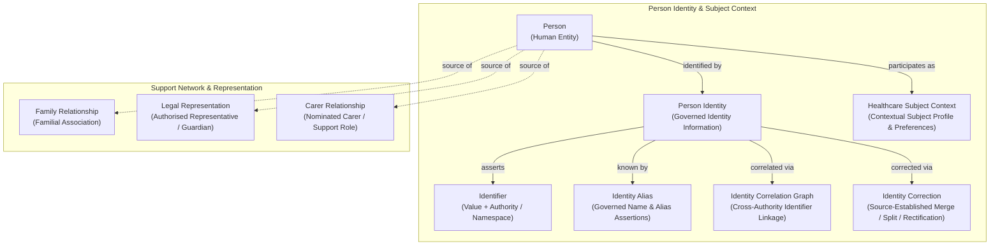

# Person and Healthcare Subject Information Family

## 1. Purpose & Semantic Boundary

The **Person and Healthcare Subject** information family formalises the semantic models for human identity, identifier management, cross-authority identity correlation, governed identity corrections, healthcare subject context, and personal support/representation networks.

This family establishes the core human entities and contextual subject profiles that participate across all clinical, diagnostic, operational, and administrative workflows in Harmonia.

---

## 2. Domain 03 Responsibility & Traceability

Owner names and evidenced responsibilities remain established. Affected Capability Tier, complete ancestry, root status and full structural Canonical IDs remain unresolved under [approved G1 K9](../reviews/package2-g1-review.md#11-k9--capability-metamodel-typing); this traceability does not manufacture missing hierarchy.

This information family derives directly from Domain 03 Business Information Responsibilities:

| Domain 03 Capability | Domain 03 Function / Feature | Domain 03 Information Responsibility | Realised Domain 04 Concepts |
| :--- | :--- | :--- | :--- |
| **`Person Identity`** *(established parent: `Client Administration`; complete ancestry unresolved)* | `Resolve Person Identifier`, `Correlate Person Identifiers`, `Maintain Person Identity Aliases`, `Apply Governed Person Identity Correction` | `Person Identity & Identifier Correlation Graph`, `Identity Aliases`, `Identity Merge/Split Audit Log` | `Person`, `Person Identity`, `Identifier`, `Identity Alias`, `Identity Correlation Graph`, `Identity Correction` |
| **`Healthcare Subject`** *(catalogued in the Client Administration grouping; complete ancestry unresolved)* | `Establish Healthcare Subject Context`, `Govern Subject Demographic Context` | `Healthcare Subject Profile`, `Demographic History`, `Communication Preferences` | `Healthcare Subject Context`, `Demographic Trait Assertion`, `Communication Preference` |
| **`Client Relationship`** *(catalogued in the Client Administration grouping; complete ancestry unresolved)* | `Maintain Client Relationships`, `Govern Client Relationship Validity` | `Client Support Network & Legal Mandates`, `Representative Legal Mandate`, `Carer Contact Directory` | `Family Relationship`, `Carer Relationship`, `Legal Representation`, `Support Person Relationship` |

The [Person Identity authority boundary](../../03-business-architecture/behaviours/01-entity-management.md#21-person-identity), [Strategy R1.x/R2.x identity scope](../../02-strategy/capabilities/business-enabling-capabilities.md#architectural-scope-statement-harmonia-1x2x-vs-3x-roadmap) and [REQ-FND-003](../../01-motivation/requirements-constraints/foundational-requirements.md#req-fnd-003-subject-referential-integrity) govern this family. Harmonia ingests and maintains source-authoritative identifiers, aliases, established relationships and correlation/federation information, applies source-established corrections/merge outcomes and preserves its operational history. It does not originate probabilistic person/patient matching, golden-record determination, master-person/master-patient selection, authoritative MPI/EMPI reconciliation or identity-merge decisions. Correlation alone does not authorise a merge.

---

## 3. Principal Information Concepts

### 3.1 Person
- **Semantic Classification**: `Entity`
- **Definition**: The identifiable biological and legal human entity.
- **Architectural Scope**: Represents the enduring human being independently of any specific clinical encounter, healthcare facility, or operational role. A `Person` exists prior to and outside of any interaction with the healthcare system.

### 3.2 Person Identity
- **Semantic Classification**: `Assertion / Identity Bundle`
- **Definition**: The governed set of identity traits, identifiers, names, and demographic assertions that establish the recognised identity of a `Person`.
- **Architectural Scope**: Governed by the `Person Identity` capability. Acts as the governed identity anchor linking identifiers, aliases, and correlation graphs.

### 3.3 Identifier
- **Semantic Classification**: `Assertion`
- **Definition**: A distinct identifier token issued within a specific namespace authority to identify a person.
- **Key Semantic Decomposition**:
  - `Identifier Value`: The lexical string or token representing the identity code.
  - `Identifier Authority / Namespace`: The issuing organisation, national scheme, or local domain establishing the uniqueness and validity of the value.
- **Architectural Rule**: An identifier is NEVER modelled as an unqualified, opaque string. It is always qualified by its originating authority/namespace.

### 3.4 Identity Alias
- **Semantic Classification**: `Assertion`
- **Definition**: A name, title, or alias by which a person is known in a specific legal, cultural, or operational context.
- **Key Characteristics**: Alias type (e.g. *Legal Name*, *Preferred Name*, *Former Name*, *Emergency Alias*), name components, effective period, and verification status.

### 3.5 Identity Correlation Graph
- **Semantic Classification**: `Relationship / Correlation Graph`
- **Definition**: The network of qualified associations linking distinct identifiers originating from different authority namespaces to the same underlying `Person`.
- **Key Characteristics**: Source-established linkage type, supplied confidence/verification evidence, originating decision authority, and effective period. These describe attributable received information; they do not assign matching or merge-decision authority to Harmonia. Detailed linkage/evidence semantics remain unresolved.
- **Authority Invariant**: Cross-authority correlation links distinct identifier namespaces without merging or transferring their originating authorities, and without implying destructive consolidation into a single authoritative source identity.

### 3.6 Identity Correction
- **Semantic Classification**: `Activity / Governance Record`
- **Definition**: The audited record and managed consequences of source-established identity corrections, including merge, split/unlink outcomes and demographic rectification within established administrative scope. Harmonia does not adjudicate the originating person-merge decision.
- **Key Characteristics**: Source-established correction type (*Merge*, *Split*, *Rectification*), target identities, supplied rationale, originating authorising party, and timestamp. Exact correction/evidence semantics beyond the established authority boundary remain unresolved.
- **Governance Invariant**: Identity corrections preserve full provenance and audit logs. They do not destructively overwrite historical assertions or break historical provenance chains. Source authorities remain distinct and intact.

### 3.7 Healthcare Subject Context
- **Semantic Classification**: `Contextual Binding`
- **Definition**: The subject-oriented context in which health information, clinical activity, or care delivery concerns a `Person`.
- **Key Characteristics**: Demographic history, language/interpreter requirements, cultural and spiritual preferences, communication preferences, and vital status assertions (e.g., verified birth date, death notification).
- **Architectural Scope**: Captures the individual's profile as a consumer of health services without assuming active patient status in a specific facility.

---

## 4. Canonical Role Taxonomy & Semantic Demarcations

### 4.1 Strict Conceptual Distinctions
Harmonia enforces a strict three-way conceptual demarcation:

$$\text{Person} \neq \text{Patient [Business Role]} \neq \text{Healthcare Subject Context}$$

1. **`Person`**: The enduring human entity.
2. **`Healthcare Subject Context`**: The contextual profile of the person as a subject of health care. `Healthcare Subject` is **NOT** a Domain 03 Business Role.
3. **`Patient`**: A Domain 03 **Business Role** assumed by a `Person` when actively receiving care within a specific healthcare collaboration or encounter. Not every Person is currently a Patient.

### 4.2 Separation of Relationship Roles from Business Roles
- Roles within personal and family relationships (e.g. *Parent*, *Child*, *Sibling*, *Nominated Carer*, *Guardian*, *Authorised Proxy*) are **Relationship Roles** belonging to specific Information Relationships.
- They SHALL NOT be conflated with or used to create Domain 03 **Business Roles** (Guardrail 8).

### 4.3 Distinct Authority & Relationship Types
Harmonia strictly prohibits inferring one type of relationship or authority from another. The following remain independent semantic assertions:
- **Care Team Membership** $\neq$ **Caring Responsibility**;
- **Caring Responsibility** $\neq$ **Advocacy / Support**;
- **Advocacy** $\neq$ **Legal Representation / Guardianship**;
- **Legal Representation** $\neq$ **Information Access Authority**;
- **Information Access Authority** $\neq$ **Consent Directive Authority**;
- **Consent Directive Authority** $\neq$ **Clinical Decision-Making Authority**.

---

## 5. Personal Relationships & Containment Guardrail

### 5.1 Person Containment Rule
In accordance with the frozen Domain 04 foundational guardrail (Guardrail 9):

> **Person-oriented concepts SHALL NOT use recursive containment merely to represent familial, social, care, representation or authority relationships. Those semantics SHALL use appropriate Information Relationships or Collections.**

### 5.2 Key Information Relationships

| Relationship | Source & Role | Target & Role | Type / Qualification | Governed Evidence & Semantics |
| :--- | :--- | :--- | :--- | :--- |
| **Family Relationship** | `Person` (*Family Member*) | `Person` (*Family Member*) | *Familial Association* (e.g. Parent, Child, Sibling, Spouse) | Biological, legal, or social relationship with optional effective period and verification. |
| **Carer Relationship** | `Person` (*Carer / Support*) | `Person` (*Care Recipient*) | *Carer Association* | Nominated primary/secondary carer supporting the individual's daily living and care needs. |
| **Legal Representation** | `Person` (*Authorised Representative*) | `Person` (*Represented Subject*) | *Legal Mandate* (e.g. Guardian, Appointed Proxy, Substitute Decision Maker) | Verified statutory or judicial mandate specifying scope of legal authority, validity period, and evidence documentation. |
| **Support Person** | `Person` (*Nominated Support*) | `Person` (*Supported Subject*) | *Informal Support* | Nominated contact or advocate for communication and emotional support. |

---

## 6. Assertion-Level Governance & Provenance

1. **Federated Identifier Authorities**: Each `Identifier` retains its link to its originating authority (e.g., national identifier scheme, hospital medical record administration, pathology laboratory). Harmonia does not become the originating authority by holding or correlating identifiers.
2. **Demographic Assertions & Provenance**: Individual demographic assertions (e.g., date of birth, home address, indigenous status) carry their own source provenance, assertion timestamp, and verification status.
3. **Audit Continuity for Merges/Splits**: When Harmonia applies a source-authoritative merge/split outcome, both historical identifiers and assertion records remain linked through the `Identity Correction` audit log, allowing historical reconstruction of data states at any prior point in time. Application and preservation of that outcome do not make Harmonia its originating decision authority.

---

## 7. Candidate Information Assembly Participation

The concepts in this family participate in several downstream candidate Information Assemblies without transferring originating authority:

1. **Healthcare Subject Context Assembly**: Combines `Person Identity`, `Healthcare Subject Context`, active `Identity Aliases`, communication preferences, and primary contact details.
2. **Client Support Network Assembly**: Aggregates verified `Carer Relationships`, `Legal Representation` mandates, and emergency contacts for a subject.
3. **Encounter Context Assembly**: Embeds the `Healthcare Subject Context` into the operational admission/encounter context.
4. **Longitudinal Clinical Record Assembly**: Organises clinical history, observations, and care activities around the governed `Person Identity`.
