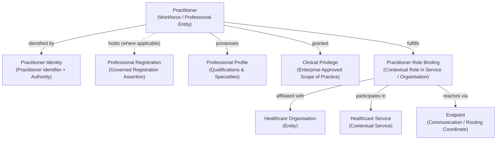

# Practitioner Information Family

## 1. Purpose & Semantic Boundary

The **Practitioner** information family formalises the semantic models for individual practitioners and workforce entities, professional identities, registration assertions, clinical qualifications, organisational affiliations, contextual role bindings, and granted clinical privileges.

This family defines the identifiable workforce entities who deliver clinical care, execute healthcare services, author medical assertions, and exercise clinical decision-making authority across Harmonia.

---

## 2. Domain 03 Responsibility & Traceability

This information family derives directly from Domain 03 Business Information Responsibilities under `L1: Provider Administration`:

| Domain 03 Capability | Domain 03 Function / Feature | Domain 03 Information Responsibility | Realised Domain 04 Concepts |
| :--- | :--- | :--- | :--- |
| **`L1: Provider Administration`** | `Verify Practitioner Registration`, `Govern Practitioner Profile`, `Maintain Practitioner Roles`, `Bind Practitioner Electronic Endpoints`, `Maintain Practitioner Affiliations`, `Maintain Clinical Privileges` | `Practitioner Registry & Role Bindings`, `Professional Registration Status`, `Practitioner Role Bindings`, `Electronic Communication Endpoints`, `Scope of Practice Privileges` | `Practitioner`, `Practitioner Identity`, `Practitioner Identifier`, `Professional Registration`, `Professional Profile`, `Clinical Privilege`, `Practitioner Role Binding`, `Endpoint` |

---

## 3. Principal Information Concepts

### 3.1 Practitioner
- **Semantic Classification**: `Entity`
- **Definition**: An identifiable individual healthcare workforce or professional entity.
- **Architectural Scope**: Represents the individual professional independently of statutory registration status. A `Practitioner` may be known to Harmonia prior to verification, when registration is pending or not applicable (e.g. unregistered healthcare workers, support staff), or when registration is externally authoritative.
- **Boundary Rule**: $\text{Practitioner} \neq \text{Professional Registration}$. Registration is a governed assertion concerning a Practitioner, not the definition of the Practitioner entity itself.

### 3.2 Practitioner Identity & Practitioner Identifier
- **Semantic Classification**: `Assertion / Identity Bundle`
- **Definition**: The governed set of professional identifiers, credential assertions, and demographic traits establishing the professional identity of a `Practitioner`.
- **Key Semantic Decomposition**:
  - `Identifier Value`: The token or registration number identifying the practitioner.
  - `Identifier Authority / Namespace`: The statutory body, national authority, or enterprise issuing the identifier.

### 3.3 Professional Registration
- **Semantic Classification**: `Assertion / Governed Relationship`
- **Definition**: A formal, externally governed assertion attesting that a practitioner is registered with a statutory registration board or regulatory authority.
- **Key Characteristics**: Registration authority, registration category, endorsed specialties, condition/restriction status, and validity period.
- **Authority Invariant**: Originates from an external regulatory authority. Harmonia records verification provenance without claiming originating registration authority.

### 3.4 Professional Profile
- **Semantic Classification**: `Assertion / Profile Bundle`
- **Definition**: The verified set of educational qualifications, clinical competencies, certified subspecialties, and academic credentials possessed by a practitioner.

### 3.5 Clinical Privilege
- **Semantic Classification**: `Assertion / Entitlement Directive`
- **Definition**: An enterprise-approved scope of clinical practice, procedural authorization, admission entitlement, or prescribing privilege granted by a healthcare organisation.
- **Key Characteristics**: Granting organisation, authorized clinical scope / procedure codes, supervision requirements, effective validity period, and approving clinical governance authority.

### 3.6 Practitioner Role Binding
- **Semantic Classification**: `Contextual Binding`
- **Definition**: The contextual binding of a `Practitioner` to a specific clinical capacity, service, facility, or department within an organisation (e.g. *Specialist Physician in Cardiology Department*, *On-Call Registrar*).
- **Key Characteristics**: Contextual title/role, participating organisation, participating healthcare service, physical practice locations, active schedule, and linked communication endpoints.

### 3.7 Endpoint
- **Semantic Classification**: `Assertion / Coordinate Coordinate`
- **Definition**: An identifiable electronic communication, routing, or messaging address bound to a practitioner or practitioner role.
- **Architectural Scope**: Captures destination coordinates (e.g., secure messaging directory address, electronic mailbox identifier) without incorporating network protocol or integration adapter implementations.

---

## 4. Canonical Role Taxonomy & Semantic Demarcations

### 4.1 Strict Conceptual Distinctions
Harmonia enforces clear boundaries across workforce concepts:

$$\text{Practitioner} \neq \text{Practitioner Role} \neq \text{Service Provider [Business Role]}$$

1. **`Practitioner`**: The individual human professional entity.
2. **`Practitioner Role Binding`**: The contextual capacity in which a practitioner delivers care within a specific service, organisation, or setting.
3. **`Service Provider`**: A Domain 03 **Business Role** fulfilled by an entity (such as a `Healthcare Organisation` or independent practitioner enterprise) that offers health services. `Service Provider` is **NOT** a Domain 04 entity class.

### 4.2 Separation of Relationship Roles from Business Roles
- Roles within clinical interactions (e.g. *Attending Clinician*, *Referring Clinician*, *Supervising Consultant*, *Performing Surgeon*) are **Relationship Roles** within specific Information Relationships.
- They SHALL NOT be conflated with Domain 03 **Business Roles** (Guardrail 8).

### 4.3 Independence of Professional Semantics
Harmonia strictly avoids inferring one workforce semantic from another. The following are distinct assertions:
- **Professional Registration** $\neq$ **Organisational Affiliation**;
- **Organisational Affiliation** $\neq$ **Clinical Privilege**;
- **Clinical Privilege** $\neq$ **Service Participation**;
- **Service Participation** $\neq$ **Supervisory Authority**.

---

## 5. Key Information Relationships

| Relationship | Source & Role | Target & Role | Type / Qualification | Governed Evidence & Semantics |
| :--- | :--- | :--- | :--- | :--- |
| **Registration Assertion** | `Practitioner` (*Registrant*) | `Registration Authority` (*Issuer*) | *Statutory Registration* | Attests legal registration status, conditions, and expiry dates. |
| **Organisational Affiliation** | `Practitioner` (*Appointee / Employee*) | `Healthcare Organisation` (*Employing / Affiliated Facility*) | *Affiliation Binding* | Captures employment, honorary appointment, or admitting rights with effective periods. |
| **Privileging Grant** | `Practitioner` (*Privileged Clinician*) | `Healthcare Organisation` (*Granting Enterprise*) | *Clinical Privilege Mandate* | Establishes approved procedural and prescribing scope of practice. |
| **Service Participation** | `Practitioner Role Binding` (*Workforce Participant*) | `Healthcare Service` (*Delivering Service*) | *Service Staffing* | Associates a practitioner role with a deliverable health service. |
| **Endpoint Association** | `Practitioner Role Binding` (*Recipient*) | `Endpoint` (*Communication Coordinate*) | *Electronic Endpoint Binding* | Directs clinical reports, notifications, and directives to the practitioner's verified endpoint. |

---

## 6. Assertion-Level Governance & Provenance

1. **External Regulatory Verification**: Verification of professional registration links directly to external statutory registries with timestamped evidence.
2. **Enterprise Governance for Privileges**: Clinical privileges are governed by enterprise credentialing bodies and maintain audit history of approvals, suspensions, and revisions.
3. **Contextual Role Independence**: A practitioner may concurrently hold multiple distinct `Practitioner Role Bindings` across different facilities or clinical services without creating conflicting identity states.

---

## 7. Candidate Information Assembly Participation

The concepts in this family participate in downstream candidate Information Assemblies:

1. **Practitioner Context Assembly**: Aggregates `Practitioner`, active `Professional Registration`, verified `Clinical Privileges`, all current `Practitioner Role Bindings`, and secure `Endpoints`.
2. **Service Provision Context Assembly**: Binds `Practitioner Role Bindings` to the delivering organisation, location, and healthcare service definition.
3. **Encounter Context Assembly**: Identifies attending, referring, and admitting practitioners fulfilling specific relationship roles during an encounter.
4. **Clinical Document / Order Assembly**: Captures author, verifier, and recipient practitioner roles with full provenance.
