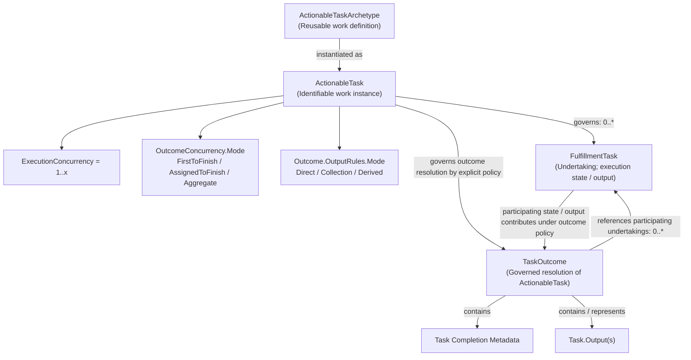

# Task / Work — Bounded Information Model

## 1. Authority and Scope

The authorised 2026-10-10 Domain04 reconciliation and subsequent bounded
TaskOutcome refinement establish the semantics of
`ActionableTaskArchetype`, `ActionableTask`, `FulfillmentTask` and `TaskOutcome`
below. It replaces the earlier Task example's conflation of work definition,
work instance and undertaking. This is a bounded adjudication, not completion
of the Task / Work family or Domain04, and establishes no Application
Architecture, implementation mapping or domain freeze/refreeze.

The model applies [AX-14](../../governance/architectural-axioms.md#ax-14) by
preserving these meaningful distinctions, and
[AX-17](../../governance/architectural-axioms.md#ax-17) by retaining the
remaining unadjudicated outcome and accountability questions.
[AX-04](../../governance/architectural-axioms.md#ax-04) keeps these information
semantics independent of execution machinery;
[AX-18](../../governance/architectural-axioms.md#ax-18) preserves the existing
domain-authority boundary. The
[Information Architecture metamodel](../metamodel/information-architecture-metamodel.md)
and [modelling guardrails](../guardrails/modelling-guardrails.md) govern its
conceptual, representation-independent meaning.

## 2. Established Task Concepts

### 2.1 ActionableTaskArchetype — Reusable Work Definition

**ActionableTaskArchetype** is the reusable definition/archetype for a kind of
actionable work. It describes the meaning and constraints of work that may
subsequently be instantiated. It SHALL NOT be treated as an instance of work.

Its semantics may include, where applicable:

- the expected nature of the work;
- permissible parameters and constraints;
- prerequisites and performer requirements;
- completion or satisfaction expectations; and
- expectations concerning information/content consumed, manipulated or
  produced by the work.

An archetype may establish expectations concerning encapsulated content
without defining that content's structural representation or requiring
Harmonia to comprehend its domain semantics. The
[observable-information boundary](../guardrails/observable-information-and-domain-meaning.md#2-observability-and-encapsulated-domain-meaning)
applies.

### 2.2 ActionableTask — Identifiable Work Instance

**ActionableTask** is an identifiable instance of work that can or should be
undertaken: the particular thing-to-be-done. It is instantiated from and
governed by an applicable `ActionableTaskArchetype`.

For example, the archetype **"Climb a ladder"** describes a kind of work;
**"ladder-climb-0023"** identifies a particular `ActionableTask` of that kind.
These are conceptual examples, not an identifier scheme.

An `ActionableTask` SHALL NOT mean the reusable definition or the execution /
undertaking of the work. Its contextual work meaning remains distinct from
information about particular undertakings.

An `ActionableTask` explicitly governs execution concurrency, which
undertakings participate in resolving its outcome, and how their outputs
establish its `Task.Output(s)`. The following three controls are independent
semantic properties, not an implementation structure or execution mechanism.

#### 2.2.1 ActionableTask.ExecutionConcurrency

```text
ActionableTask.ExecutionConcurrency = [1..x]
```

`ExecutionConcurrency` establishes how many `FulfillmentTask` undertakings of
the `ActionableTask` may execute concurrently. It concerns execution
concurrency only; it does not determine which undertakings establish the
`TaskOutcome`. This permitted concurrency range does not require an
undertaking to exist or execute: an ActionableTask may still have zero
undertakings. No universal value for `x` or concurrency execution mechanism
is established here.

#### 2.2.2 ActionableTask.OutcomeConcurrency.Mode

```text
ActionableTask.OutcomeConcurrency.Mode =
    FirstToFinish | AssignedToFinish | Aggregate
```

This property determines **which FulfillmentTask undertaking or undertakings
participate in resolving the ActionableTask outcome**.

| Mode | Participation semantics |
| :--- | :--- |
| **FirstToFinish** | The applicable first finishing/qualifying `FulfillmentTask` establishes participation in resolution of the outcome. This defines neither detailed terminal-state qualification nor cancellation or execution mechanics for other undertakings. |
| **AssignedToFinish** | A particular assigned `FulfillmentTask` has responsibility for establishing the outcome. Other undertakings may exist or execute concurrently; their existence or completion does not independently establish the ActionableTask outcome. The assignment mechanism is not defined here. |
| **Aggregate** | Multiple applicable `FulfillmentTask` undertakings participate in resolving the ActionableTask outcome. This selects the participating undertakings; it does not require recursive TaskOutcome composition or determine how their outputs form the resulting output. |

#### 2.2.3 ActionableTask.Outcome.OutputRules.Mode

```text
ActionableTask.Outcome.OutputRules.Mode = Direct | Collection | Derived
```

This independent property determines **how the outputs of the participating
FulfillmentTasks establish the ActionableTask's Task.Output(s)**.

| Mode | Output semantics | Conceptual path |
| :--- | :--- | :--- |
| **Direct** | The applicable participating `FulfillmentTask` output is used directly as the ActionableTask output. | `FulfillmentTask.Output` → `TaskOutcome` → `Task.Output`. |
| **Collection** | The applicable participating `FulfillmentTask` outputs collectively form the ActionableTask output, preserving them as the relevant collection/set. Collection does not itself imply derivation of new domain meaning. | `FulfillmentTask.Output [0..*]` → Collection → `TaskOutcome` → `Task.Output(s)`. |
| **Derived** | A new ActionableTask output is derived from the applicable participating `FulfillmentTask` outputs according to explicitly defined rules. | `FulfillmentTask.Output(s)` → Explicit Rules → `TaskOutcome` → `Task.Output(s)`. |

`Derived` is an information semantic. It prescribes no implementation
mechanism for executing the explicit rules. Harmonia need not infer the
encapsulated domain meaning of participating outputs in order to apply those
rules; the
[observable-information/domain-meaning boundary](../guardrails/observable-information-and-domain-meaning.md#2-observability-and-encapsulated-domain-meaning)
continues to apply. Developer-defined Ergo logic and optional runtime AI
retain their existing boundaries; neither is prescribed as the means of
derivation.

#### 2.2.4 Orthogonality of the Three Controls

| ActionableTask concern | Question answered |
| :--- | :--- |
| **ExecutionConcurrency** | How many FulfillmentTasks may execute concurrently? |
| **OutcomeConcurrency.Mode** | Which FulfillmentTask undertaking(s) participate in resolving the ActionableTask outcome? |
| **Outcome.OutputRules.Mode** | How are the participating FulfillmentTask outputs used to establish the ActionableTask Task.Output(s)? |

These controls SHALL remain orthogonal and SHALL NOT be collapsed into one
lifecycle, state or concurrency mechanism. Multiple undertakings may execute
concurrently while only one participates in the TaskOutcome. Multiple may
participate while their outputs are collected or used to derive another
output. No universal mode combination, default or execution algorithm is
inferred from these examples.

### 2.3 FulfillmentTask — Identifiable Undertaking

**FulfillmentTask** represents an identifiable undertaking of an
`ActionableTask`: doing or attempting to do that particular work. It carries
the execution-related information necessary to represent the undertaking,
including, where applicable:

- performer / executing actor and execution context;
- commencement and timing;
- progression and execution state;
- completion, failure, suspension or other applicable execution information;
  and
- other execution metadata/scaffolding needed to represent the undertaking.

It has its own execution state and may produce output. It does **not
independently own TaskOutcome**. One or more undertakings may contribute to
resolution of the parent ActionableTask according to that ActionableTask's
explicitly defined outcome policy.

An `ActionableTask` may have **zero, one or multiple `FulfillmentTasks`**.
Multiple undertakings MAY execute concurrently where the ActionableTask's
`ExecutionConcurrency` permits them. Execution state SHALL NOT be collapsed into
`ActionableTask` on the assumption that each work instance has exactly one
execution.

Completion of one `FulfillmentTask` does **not inherently establish
satisfaction or completion of its parent `ActionableTask`**. Satisfaction
depends on the definition and context of the work, with outcome resolution
governed by the ActionableTask's explicit outcome policy. No universal
execution state machine or satisfaction rule is established here. Information
representing an undertaking remains distinct from the undertaking itself.

### 2.4 TaskOutcome — Governed ActionableTask Resolution

> **TaskOutcome is the governed resolution of an ActionableTask according to
> that ActionableTask's explicitly defined outcome policy.**

TaskOutcome belongs to and resolves the ActionableTask. It does not
independently belong to a FulfillmentTask. Conceptually it:

- **references FulfillmentTask [0..*]**: identifies the undertaking or
  undertakings that participated in establishing the outcome, as determined
  by `OutcomeConcurrency.Mode`;
- **contains Task Completion Metadata**: Harmonia-governed information
  concerning resolution/completion of the ActionableTask; no complete
  metadata schema is defined here; and
- **contains / represents Task.Output(s)**: the resulting ActionableTask
  output established from the participating undertakings' outputs according
  to `Outcome.OutputRules.Mode`.

The encapsulated domain content of a `Task.Output` may remain semantically
opaque to Harmonia. Neither output information nor TaskOutcome becomes the
physical, clinical or other phenomenon represented. No detailed Task.Output
payload structure is established here.

**Recursive TaskOutcome containment is excluded from this model.** Multiple
execution results are represented through references from the single
governed TaskOutcome to the relevant participating FulfillmentTask
undertakings, rather than through recursive outcome aggregation hierarchies.
Aggregate participation does not imply recursive composition. The remaining
questions in §5 remain unresolved.

## 3. Established Conceptual Relationships



The `0..*` annotations concern undertakings governed by the ActionableTask
and participating-undertaking references held by TaskOutcome. They do not
denote contained TaskOutcomes. The three controls govern permitted execution,
participation and output handling independently. The arrows express
conceptual information relationships, not a lifecycle, storage structure,
inheritance tree or execution mechanism. References, completion metadata and
resulting outputs are established as above; other mandatory cardinalities,
payload structures and detailed lifecycle rules are not inferred.

The [Definition-to-Accountability pattern](../patterns/definition-to-accountability.md#3-reference-example-2-task--work-progression)
places the archetype at Definition, the work instance at Contextualisation,
the undertaking at Fulfilment and governed ActionableTask resolution at
Outcome. The pattern does not supply unresolved `TaskOutcome` identity or
lifecycle rules, or settle the Accountability / `ReportedTask` question.

## 4. Relationship to Domain03 Business Work Classifications

The generic Task information semantics SHALL be capable of representing work
arising from all three established Domain03 classifications:

| Domain03 business classification | Preserved business meaning | Existing progression authority |
| :--- | :--- | :--- |
| **Work Order** | Human doing. | [Work Order Progression](../../03-business-architecture/processes/business-processes.md#514-work-order-progression-process). |
| **To Do** | Human review, update, validation, judgment, decision or approval. | [To Do Progression](../../03-business-architecture/processes/business-processes.md#515-to-do-progression-process). |
| **Synthetic Task** | Automated / non-human executable work. | [Synthetic Task Progression](../../03-business-architecture/processes/business-processes.md#516-synthetic-task-progression-process). |

These remain meaningful **Business Architecture classifications**, not new
Information Architecture concepts or subclasses. Domain03's
[clinical-work integration boundary](../../03-business-architecture/metamodel/business-architecture-metamodel.md#37-clinical-work-integration-boundary)
uses **Task = synthetic task** in its business vocabulary; the generic Task
information model here does not rename or broaden that business term.

[Workflow & Activity Coordination](../../03-business-architecture/behaviours/05-intrinsic-enablement.md#29-workflow--activity-coordination)
provides the established `Coordinate Work Order`, `Coordinate To Do`,
`Coordinate Synthetic Task` and timeout/escalation Functions and the generic
Activity Instance Registry, Task State Progression Graph and SLA Deadline &
Timer Ledger information responsibilities. The
[Business information-responsibility matrix](../../03-business-architecture/information-responsibility/information-responsibility.md#2-canonical-business-information-ownership-matrix)
bounds that ownership to generic coordination semantics, without acquiring
business meaning, clinical outcome or externally held work/decision authority.

The model records that existing responsibility basis; it allocates no
unestablished archetype-authoring or outcome-authority owner. Existing Business
progressions remain in their owning contexts. In particular, the To Do
dismissal/delegation ordering and Synthetic Task stalled/failed ordering
remain unresolved at source; no universal Information Architecture transition
model is inferred from them.

Shared information or execution machinery SHALL NOT collapse the three
business classifications. This task introduces no `WorkOrderArchetype`,
`ToDoArchetype`, `SyntheticTaskArchetype`, or separate `FulfillmentTask` or
`TaskOutcome` subclasses, and maps none of these concepts to Pragma, Praxis,
Ponos, Ergo/Ergon, Digital Twin, FHIR resources or implementation classes.

## 5. Explicitly Unresolved Architecture

Under [AX-17](../../governance/architectural-axioms.md#ax-17), the following
remaining Task / Work matters require subsequent architectural adjudication
or separately governed detailed definition:

- TaskOutcome identity rules;
- detailed cardinalities beyond the established relationships, including
  whether an outcome is mandatory;
- detailed TaskOutcome lifecycle/state semantics;
- detailed Task Completion Metadata and Task.Output payload structures, and
  their representation mechanisms;
- detailed finishing/qualification rules, assignment mechanisms and
  concurrency execution mechanics; and
- task-specific explicit output rules and their downstream execution
  mechanisms.

Outcome ownership, participation modes, output-rule modes, their orthogonality
and exclusion of recursive TaskOutcome composition are adjudicated above;
they SHALL NOT be presented as still provisional or unresolved. This
refinement allocates no previously unestablished archetype-authoring or
outcome-authority owner.

**ReportedTask remains unresolved.** Its existing intersection with
Definition → Contextualisation → Fulfilment → Outcome → Accountability does
not reaffirm its previous definition or require a separate accountable report.
Its necessity and semantics may overlap accountability, assurance, audit,
historical representation and evidence, and require separate adjudication.
It is neither removed nor normalised into one of those concerns here. No
ReportedTask relationships, identity, immutability or lifecycle are settled.

The metamodel, reusable pattern and general lifecycle/containment guidance
SHALL NOT be used to fill these reserved questions by inference. The bounded
semantics above are established; the remaining Task / Work family and Domain04
are not declared complete.
