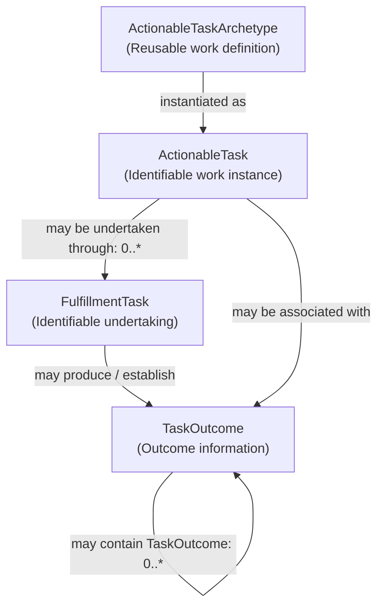

# Task / Work — Bounded Information Model

## 1. Authority and Scope

The authorised 2026-10-10 Domain04 reconciliation establishes the semantics of
`ActionableTaskArchetype`, `ActionableTask`, `FulfillmentTask` and `TaskOutcome`
below. It replaces the earlier Task example's conflation of work definition,
work instance and undertaking. This is a bounded adjudication, not completion
of the Task / Work family or Domain04, and establishes no Application
Architecture, implementation mapping or domain freeze/refreeze.

The model applies [AX-14](../../governance/architectural-axioms.md#ax-14) by
preserving these meaningful distinctions, and
[AX-17](../../governance/architectural-axioms.md#ax-17) by retaining the
unadjudicated outcome and accountability questions. The
[Information Architecture metamodel](../metamodel/information-architecture-metamodel.md)
and [modelling guardrails](../guardrails/modelling-guardrails.md) govern its
conceptual, representation-independent meaning.

## 2. Established Task Concepts

### 2.1 ActionableTaskArchetype — Reusable Work Definition

**ActionableTaskArchetype** is the reusable definition/archetype for a kind of
actionable work. It describes the meaning and constraints of work that may
subsequently be instantiated. It SHALL NOT be treated as an instance of work.

Its semantics may include, where applicable:

- the expected nature of the work;
- permissible parameters and constraints;
- prerequisites and performer requirements;
- completion or satisfaction expectations; and
- expectations concerning information/content consumed, manipulated or
  produced by the work.

An archetype may establish expectations concerning encapsulated content
without defining that content's structural representation or requiring
Harmonia to comprehend its domain semantics. The
[observable-information boundary](../guardrails/observable-information-and-domain-meaning.md#2-observability-and-encapsulated-domain-meaning)
applies.

### 2.2 ActionableTask — Identifiable Work Instance

**ActionableTask** is an identifiable instance of work that can or should be
undertaken: the particular thing-to-be-done. It is instantiated from and
governed by an applicable `ActionableTaskArchetype`.

For example, the archetype **"Climb a ladder"** describes a kind of work;
**"ladder-climb-0023"** identifies a particular `ActionableTask` of that kind.
These are conceptual examples, not an identifier scheme.

An `ActionableTask` SHALL NOT mean the reusable definition or the execution /
undertaking of the work. Its contextual work meaning remains distinct from
information about particular undertakings.

### 2.3 FulfillmentTask — Identifiable Undertaking

**FulfillmentTask** represents an identifiable undertaking of an
`ActionableTask`: doing or attempting to do that particular work. It carries
the execution-related information necessary to represent the undertaking,
including, where applicable:

- performer / executing actor and execution context;
- commencement and timing;
- progression and execution state;
- completion, failure, suspension or other applicable execution information;
  and
- other execution metadata/scaffolding needed to represent the undertaking.

An `ActionableTask` may have **zero, one or multiple `FulfillmentTasks`**.
Multiple undertakings MAY exist concurrently where the applicable work
semantics permit or require them. Execution state SHALL NOT be collapsed into
`ActionableTask` on the assumption that each work instance has exactly one
execution.

Completion of one `FulfillmentTask` does **not inherently establish
satisfaction or completion of its parent `ActionableTask`**. Satisfaction
depends on the definition and context of the work. No universal execution
state machine or satisfaction rule is established here. Information
representing an undertaking remains distinct from the undertaking itself.

### 2.4 TaskOutcome — Outcome Information

**TaskOutcome** represents information produced or established as an outcome
of work. A `TaskOutcome` may be associated with an `ActionableTask` or a
`FulfillmentTask`, and may contain / encapsulate other `TaskOutcomes`.

The encapsulated content may be semantically opaque to Harmonia. Outcome
information does not become the physical, clinical or other phenomenon it
represents. These statements establish only the bounded outcome meaning and
relationships; the questions in §5 remain unresolved.

## 3. Established Conceptual Relationships

The two `0..*` annotations express the authorised possibility of zero or more
undertakings and zero or more contained outcomes. Other mandatory
cardinalities are not established. The arrows do not establish a lifecycle,
storage structure, inheritance tree, composition/aggregation/reference
mechanism, mandatory output or rules for combining outcomes. In particular,
an ActionableTask-level outcome is not defined as an aggregate of its
undertakings' outcomes.

The [Definition-to-Accountability pattern](../patterns/definition-to-accountability.md#3-reference-example-2-task--work-progression)
places the archetype at Definition, the work instance at Contextualisation,
the undertaking at Fulfilment and outcome information at Outcome. The pattern
does not supply unresolved `TaskOutcome` identity or lifecycle rules, or
settle the Accountability / `ReportedTask` question.

## 4. Relationship to Domain03 Business Work Classifications

The generic Task information semantics SHALL be capable of representing work
arising from all three established Domain03 classifications:

| Domain03 business classification | Preserved business meaning | Existing progression authority |
| :--- | :--- | :--- |
| **Work Order** | Human doing. | [Work Order Progression](../../03-business-architecture/processes/business-processes.md#514-work-order-progression-process). |
| **To Do** | Human review, update, validation, judgment, decision or approval. | [To Do Progression](../../03-business-architecture/processes/business-processes.md#515-to-do-progression-process). |
| **Synthetic Task** | Automated / non-human executable work. | [Synthetic Task Progression](../../03-business-architecture/processes/business-processes.md#516-synthetic-task-progression-process). |

These remain meaningful **Business Architecture classifications**, not new
Information Architecture concepts or subclasses. Domain03's
[clinical-work integration boundary](../../03-business-architecture/metamodel/business-architecture-metamodel.md#37-clinical-work-integration-boundary)
uses **Task = synthetic task** in its business vocabulary; the generic Task
information model here does not rename or broaden that business term.

[Workflow & Activity Coordination](../../03-business-architecture/behaviours/05-intrinsic-enablement.md#29-workflow--activity-coordination)
provides the established `Coordinate Work Order`, `Coordinate To Do`,
`Coordinate Synthetic Task` and timeout/escalation Functions and the generic
Activity Instance Registry, Task State Progression Graph and SLA Deadline &
Timer Ledger information responsibilities. The
[Business information-responsibility matrix](../../03-business-architecture/information-responsibility/information-responsibility.md#2-canonical-business-information-ownership-matrix)
bounds that ownership to generic coordination semantics, without acquiring
business meaning, clinical outcome or externally held work/decision authority.

The model records that existing responsibility basis; it allocates no
unestablished archetype-authoring or outcome-authority owner. Existing Business
progressions remain in their owning contexts. In particular, the To Do
dismissal/delegation ordering and Synthetic Task stalled/failed ordering
remain unresolved at source; no universal Information Architecture transition
model is inferred from them.

Shared information or execution machinery SHALL NOT collapse the three
business classifications. This task introduces no `WorkOrderArchetype`,
`ToDoArchetype`, `SyntheticTaskArchetype`, or separate `FulfillmentTask` or
`TaskOutcome` subclasses, and maps none of these concepts to Pragma, Praxis,
Ponos, Ergo/Ergon, Digital Twin, FHIR resources or implementation classes.

## 5. Explicitly Unresolved Architecture

Under [AX-17](../../governance/architectural-axioms.md#ax-17), the following
`TaskOutcome` matters require subsequent architectural adjudication:

- detailed composition semantics;
- whether containment means composition, aggregation, reference or another
  relationship;
- identity rules;
- detailed cardinalities beyond the relationships expressly recorded in §3;
- the semantic relationship between ActionableTask-level outcomes and
  collections of FulfillmentTask outcomes;
- whether outcomes are mandatory; and
- detailed lifecycle/state semantics.

**ReportedTask remains unresolved.** Its existing intersection with
Definition → Contextualisation → Fulfilment → Outcome → Accountability does
not reaffirm its previous definition or require a separate accountable report.
Its necessity and semantics may overlap accountability, assurance, audit,
historical representation and evidence, and require separate adjudication.
It is neither removed nor normalised into one of those concerns here. No
ReportedTask relationships, identity, immutability or lifecycle are settled.

The metamodel, reusable pattern and general lifecycle/containment guidance
SHALL NOT be used to fill these reserved questions by inference. The bounded
semantics above are established; the remaining Task / Work family and Domain04
are not declared complete.
