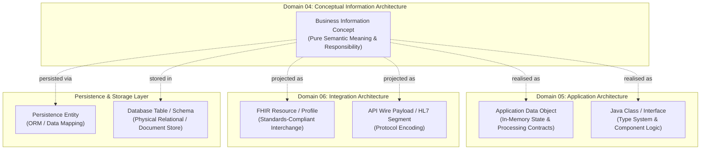
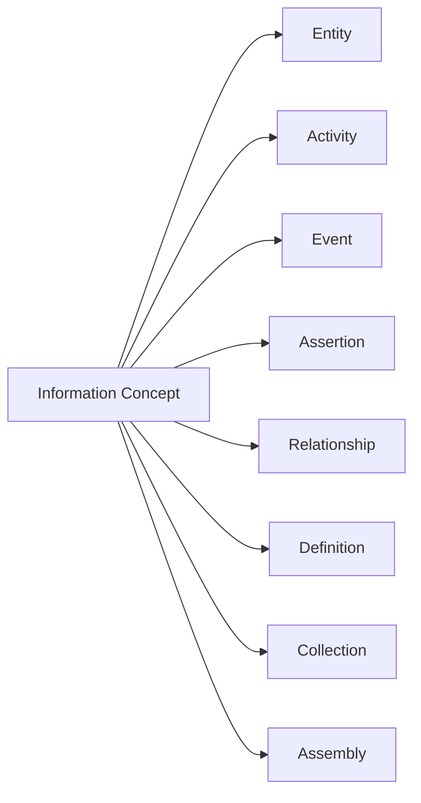
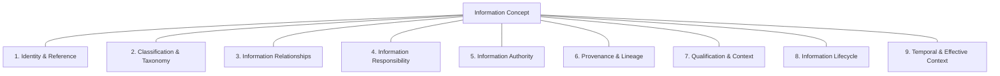

# Information Architecture Metamodel & Core Concept Model

## 1. Foundational Semantic Distinction

The Harmonia Information Architecture is governed by a fundamental axiom:
> **Information architecture is derived from business meaning and responsibility. Representation does not define meaning.**

Information concepts describe the facts, entities, activities, relationships, and assertions that Harmonia must govern to enable regional healthcare integration. They exist independently of software components, persistence technologies, or interchange formats.

### The Six-Way Independence Boundary
To prevent implementation frameworks and wire protocols from dictating architectural semantics, Domain 04 maintains an explicit boundary across six distinct architectural tiers:

```text
Business Information Concept
    ≠ Application Data Object
    ≠ FHIR Resource
    ≠ Persistence Entity
    ≠ Java Class
    ≠ Database Table
    ≠ API Payload
```



### Architectural Implications
1. **One-to-Many Mappings**: A single Information Concept (e.g. `HealthcareServiceDelivery`) may require multiple downstream technical representations (e.g. an in-memory Java state object, an Infinispan cache entry, a PostgreSQL record, and a FHIR `Encounter` or `Procedure` projection).
2. **Many-to-One Physical Mappings**: Multiple distinct Information Concepts may downstream share a common physical table or class structure (e.g. distinct task types persisting in a common work envelope table) without forfeiting their conceptual distinction.
3. **Standards Independence**: FHIR resources, HL7 messages, and OpenEHR archetypes do not define Harmonia Information Architecture. While Harmonia projects information to and from these standards via Pylai gateways, its internal semantic models remain technology-neutral.
4. **Structural Similarity ≠ Semantic Identity**: Two concepts with identical or overlapping data attributes (such as `Practitioner` and `Person`, or `DeliverableHealthcareService` and `HealthcareServiceDelivery`) remain semantically distinct because their business meanings, lifecycles, and responsibilities differ.

---

## 2. The Core Information Concept

The universal semantic building block of Domain 04 is the **Information Concept**.

> **Information Concept**: An identifiable unit of governed business meaning within the Harmonia Health Integration Environment, representing an entity, activity, event, assertion, relationship, definition, collection, or assembly.

Rather than imposing a rigid, single-inheritance object-oriented hierarchy, Domain 04 classifies Information Concepts into non-hierarchical, multi-dimensional **Semantic Categories**.



### 2.1 Semantic Classifications

| Semantic Category | Definition | Representative Healthcare / HIE Examples |
| :--- | :--- | :--- |
| **Entity** | An enduring physical, legal, organizational, or conceptual subject that possesses identity and participates in healthcare processes. | `Person`, `Practitioner`, `Healthcare Organisation`, `Healthcare Location`, `Clinical Device`. |
| **Activity** | A dynamic, stateful unit of clinical or operational work performed by human actors, automated systems, or collaborating parties. | `FulfillmentTask`, `HealthcareServiceDelivery`, `Patient Transport Execution`, `Bed Cleaning Activity`. |
| **Event** | An instantaneous, immutable occurrence at a specific point in time that alters state or records a notable happening. | `Admission Notice`, `Discharge Notification`, `Vital Status Transition (Death)`, `Order Dispatch Event`. |
| **Assertion** | A formal statement of clinical, demographic, or operational fact made by an identifiable source within a qualified context. | `Active Allergy Finding`, `Diagnostic Report Interpretation`, `Verified Identifier Linkage`, `Consent Directive`. |
| **Relationship** | A reified semantic association connecting a source concept to a target concept with defined roles, qualification, and temporal validity. | `Practitioner Role Binding`, `Subject-to-Carer Association`, `Location Containment`, `Service Delivery Association`. |
| **Definition** | A catalogue, template, rule, or specification describing a permitted semantic space, prerequisite conditions, or expected outcomes. | `OfferedHealthcareService`, `ActionableTask Template`, `Clinical Care Plan Definition`, `Service Catalogue Specification`. |
| **Collection** | An explicit grouping of Information Concepts governed under common criteria without implying physical containment or composition. | `Patient Cohort`, `Active Problem List`, `Dispatch Work Queue`, `Departmental Intake Batch`. |
| **Assembly** | A governed composite projection of multiple independently meaningful Information Concepts assembled for a specific operational or clinical context. | `Healthcare Subject Context`, `Longitudinal Clinical Record`, `Encounter Context`, `Operational Work Context`. |

These categories are conceptual patterns rather than an inheritance tree. A concept may draw semantic characteristics from multiple categories where meaningful (e.g. a `Consent Directive` is both an `Assertion` and a `Definition`).

---

## 3. Semantic Characteristics of Information Concepts

An Information Concept is characterized by a set of core semantic dimensions. **Not every Information Concept is required to possess every characteristic**; rather, characteristics are applied where they add architectural and clinical meaning.



### 3.1 Identity & Reference
- **Semantic Identity**: The unique business identity that distinguishes one instance of an Information Concept from all others across time and space.
- **Identifier Namespace Bindings**: Multiple business identifiers (e.g. National Identifier, Regional MRN, Facility Medical Record Number) may bind to a single conceptual instance.
- **Immutability of Meaning**: Identity remains stable even as attributes, states, or representations evolve.

### 3.2 Classification & Taxonomy
- **Semantic Typing**: Explicit categorisation within enterprise clinical and administrative taxonomies (e.g. SNOMED-CT specialty codes, Australian National Healthcare Identifier types).
- **Multi-Dimensional Categorisation**: Concepts may be classified simultaneously along clinical, operational, and legal dimensions.

### 3.3 Information Relationships
- **Reified Associations**: Concepts participate in explicit, governed associations with other concepts via the canonical Information Relationship pattern.
- **Directional Clarity**: Relationships are authored with forward semantic clarity (`Source` $\to$ `Target`).

### 3.4 Information Responsibility
- **Owning Capability**: Information Concepts for which Harmonia claims architectural responsibility derive their ownership from an unambiguous Domain 03 Capability. Referenced, external, or contextual concepts may be represented where needed without acquiring Harmonia ownership.
- **Non-Transferability**: Caching, transforming, transporting, indexing, or displaying information does not transfer responsibility.

### 3.5 Information Authority
- **Originating & Attesting Authority**: The identifiable legal, professional, or organisational actor that asserts or attests to the validity of the concept or assertion.
- **Granular Binding**: Information Authority can attach directly to individual assertions and relationships rather than whole composite records.

### 3.6 Provenance & Lineage
- **Origin & Transformation History**: Who asserted or recorded the information, when, via what activity or interaction, using what source evidence, and under what business process.
- **Derivation Tracking**: Lineage tracing for synthesized, inferred, translated, or aggregated concepts.

### 3.7 Qualification & Context
- **Confidence & Verification**: Verification status (*Confirmed*, *Provisional*, *Refuted*, *Entered-in-Error*), evidentiary basis, and confidence qualifiers.
- **Operational Preconditions**: Constraints and prerequisite qualifications governing valid usage.

### 3.8 Information Lifecycle
- **Concept-Specific State Progression**: Stateful concepts progress through domain-specific lifecycles (e.g. *Proposed* $\to$ *Active* $\to$ *Superseded*).
- **No Universal Lifecycle**: Lifecycles are tailored to concept semantics rather than forced into an artificial universal state machine.

### 3.9 Temporal & Effective Context
- **Effective Time vs. Transaction Time**: Clear demarcation between when a clinical/operational fact occurred in the real world (`Effective Period`) and when it was recorded/asserted in Harmonia (`Assertion Time`).
- **Historical Validity**: Support for bi-temporal and multi-temporal reconstruction of health records.

---

## 4. Metamodel Governance Principles

1. **Pure Semantic Abstraction**: Information Concepts contain no database column definitions, ORM annotations, JSON schema properties, or network protocol structures.
2. **Derivation from Business Architecture**: Information Concepts for which Harmonia claims architectural responsibility trace directly to an Information Responsibility, Business Function, Business Service, or Business Process defined in Domain 03. Referenced or contextual concepts do not thereby acquire Harmonia authority or ownership.
3. **No Speculative Modelling**: Concepts are introduced only when required to support an authoritative Domain 03 capability or function, never because a third-party standard (e.g. FHIR) happens to provide a matching resource.
4. **Resilience to Downstream Change**: Changes in downstream application architectures (Domain 05) or physical storage platforms (Domain 07) do not invalidate Domain 04 conceptual models.
