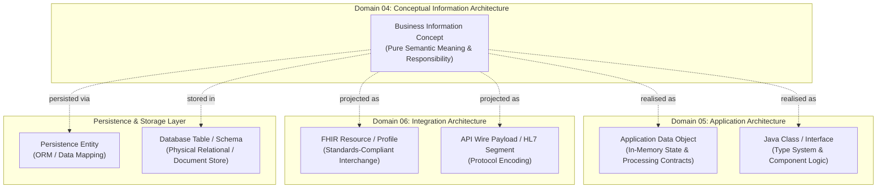
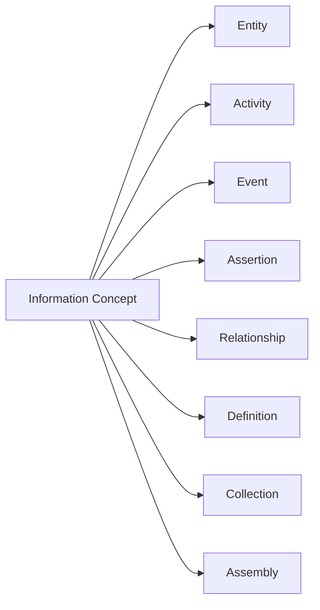
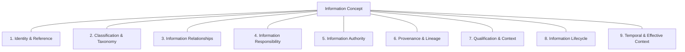

# Information Architecture Metamodel & Core Concept Model

## 1. Foundational Semantic Distinction

The Harmonia Information Architecture is governed by a fundamental axiom:
> **Information architecture is derived from business meaning and responsibility. Representation does not define meaning.**

Information concepts describe the facts, entities, activities, relationships, and assertions that Harmonia must govern to enable regional healthcare integration. They exist independently of software components, persistence technologies, or interchange formats.

### The Six-Way Independence Boundary
To prevent implementation frameworks and wire protocols from dictating architectural semantics, Domain 04 maintains an explicit boundary across six distinct architectural tiers:

```text
Business Information Concept
    ≠ Application Data Object
    ≠ FHIR Resource
    ≠ Persistence Entity
    ≠ Java Class
    ≠ Database Table
    ≠ API Payload
```



### Architectural Implications
1. **One-to-Many Mappings**: A single Information Concept (e.g. `HealthcareServiceDelivery`) may require multiple downstream technical representations (e.g. an in-memory Java state object, an Infinispan cache entry, a PostgreSQL record, and a FHIR `Encounter` or `Procedure` projection).
2. **Many-to-One Physical Mappings**: Multiple distinct Information Concepts may downstream share a common physical table or class structure (e.g. distinct task types persisting in a common work envelope table) without forfeiting their conceptual distinction.
3. **Standards Independence**: FHIR resources, HL7 messages, and OpenEHR archetypes do not define Harmonia Information Architecture. While Harmonia projects information to and from these standards via Pylai gateways, its internal semantic models remain technology-neutral.
4. **Structural Similarity ≠ Semantic Identity**: Two concepts with identical or overlapping data attributes (such as `Practitioner` and `Person`, or `DeliverableHealthcareService` and `HealthcareServiceDelivery`) remain semantically distinct because their business meanings, lifecycles, and responsibilities differ.

### Observable Information and Domain Comprehension

Harmonia manages information through established architectural semantics;
observing or carrying encapsulated domain content does not intrinsically
require comprehension or inference of its domain meaning. The
[observable-information and domain-meaning boundary](../guardrails/observable-information-and-domain-meaning.md)
defines this distinction, the governed Context Loading → Ergo Logic Process →
Context Unloading boundary, and optional runtime AI intentionally invoked by
developer-defined Ergo logic. Such interpretation does not make the Platform
intrinsically intelligent or change its own semantic-governance obligations.

---

## 2. The Core Information Concept

The universal semantic building block of Domain 04 is the **Information Concept**.

> **Information Concept**: An identifiable unit of governed business meaning within the Harmonia Health Integration Environment, representing an entity, activity, event, assertion, relationship, definition, collection, or assembly.

Rather than imposing a rigid, single-inheritance object-oriented hierarchy, Domain 04 classifies Information Concepts into non-hierarchical, multi-dimensional **Semantic Categories**.



### 2.1 Semantic Classifications

| Semantic Category | Definition | Representative Healthcare / HIE Examples |
| :--- | :--- | :--- |
| **Entity** | An enduring physical, legal, organizational, or conceptual subject that possesses identity and participates in healthcare processes. | `Person`, `Practitioner`, `Healthcare Organisation`, `Healthcare Location`, `Clinical Device`. |
| **Activity** | Information representing a dynamic, stateful undertaking of clinical or operational work by human actors, automated systems or collaborating parties; the information does not become the represented activity. | `FulfillmentTask`, `HealthcareServiceDelivery`, information about patient transport or bed cleaning. |
| **Event** | An instantaneous, immutable occurrence at a specific point in time that alters state or records a notable happening. | `Admission Notice`, `Discharge Notification`, `Vital Status Transition (Death)`, `Order Dispatch Event`. |
| **Assertion** | A formal statement of clinical, demographic, or operational fact made by an identifiable source within a qualified context. | `Active Allergy Finding`, `Diagnostic Report Interpretation`, `Verified Identifier Linkage`, `Consent Directive`. |
| **Relationship** | A reified semantic association connecting a source concept to a target concept with defined roles, qualification, and temporal validity. | `Practitioner Role Binding`, `Subject-to-Carer Association`, `Location Containment`, `Service Delivery Association`. |
| **Definition** | A catalogue, template, rule, or specification describing a permitted semantic space, prerequisite conditions, or expected outcomes. | `OfferedHealthcareService`, `ActionableTaskArchetype`, `Clinical Care Plan Definition`, `Service Catalogue Specification`. |
| **Collection** | An explicit grouping of Information Concepts governed under common criteria without implying physical containment or composition. | `Patient Cohort`, `Active Problem List`, `Dispatch Work Queue`, `Departmental Intake Batch`. |
| **Assembly** | A governed composite projection of multiple independently meaningful Information Concepts assembled for a specific operational or clinical context. | `Healthcare Subject Context`, `Longitudinal Clinical Record`, `Encounter Context`, `Operational Work Context`. |

These categories are conceptual patterns rather than an inheritance tree. A concept may draw semantic characteristics from multiple categories where meaningful (e.g. a `Consent Directive` is both an `Assertion` and a `Definition`).

The [bounded Task / Work model](../information-families/task-work.md)
distinguishes `ActionableTaskArchetype` (definition), `ActionableTask`
(identifiable work instance), `FulfillmentTask` (identifiable undertaking) and
`TaskOutcome` (outcome information). These are not lifecycle states or implied
implementation subclasses. General metamodel characteristics below do not
settle the expressly deferred TaskOutcome identity/cardinality/lifecycle
questions or the unresolved ReportedTask meaning.

---

## 3. Semantic Characteristics of Information Concepts

An Information Concept is characterized by a set of core semantic dimensions. **Not every Information Concept is required to possess every characteristic**; rather, characteristics are applied where they add architectural and clinical meaning.



### 3.1 Identity & Reference
- **Semantic Identity**: The unique business identity that distinguishes one instance of an Information Concept from all others across time and space.
- **Identifier Namespace Bindings**: Multiple business identifiers (e.g. National Identifier, Regional MRN, Facility Medical Record Number) may bind to a single conceptual instance.
- **Immutability of Meaning**: Identity remains stable even as attributes, states, or representations evolve.

### 3.2 Classification & Taxonomy
- **Semantic Typing**: Explicit categorisation within enterprise clinical and administrative taxonomies (e.g. SNOMED-CT specialty codes, Australian National Healthcare Identifier types).
- **Multi-Dimensional Categorisation**: Concepts may be classified simultaneously along clinical, operational, and legal dimensions.

### 3.3 Information Relationships
- **Reified Associations**: Concepts participate in explicit, governed associations with other concepts via the canonical Information Relationship pattern.
- **Directional Clarity**: Relationships are authored with forward semantic clarity (`Source` $\to$ `Target`).

### 3.4 Information Responsibility
- **Owning Capability**: Information Concepts for which Harmonia claims architectural responsibility derive their ownership from an unambiguous Domain 03 Capability. Referenced, external, or contextual concepts may be represented where needed without acquiring Harmonia ownership.
- **Non-Transferability**: Caching, transforming, transporting, indexing, or displaying information does not transfer responsibility.

### 3.5 Information Authority
- **Originating & Attesting Authority**: The identifiable legal, professional, or organisational actor that asserts or attests to the validity of the concept or assertion.
- **Granular Binding**: Information Authority can attach directly to individual assertions and relationships rather than whole composite records.

### 3.6 Provenance & Lineage
- **Origin & Transformation History**: Who asserted or recorded the information, when, via what activity or interaction, using what source evidence, and under what business process.
- **Derivation Tracking**: Lineage tracing for synthesized, inferred, translated, or aggregated concepts.

### 3.7 Qualification & Context
- **Confidence & Verification**: Verification status (*Confirmed*, *Provisional*, *Refuted*, *Entered-in-Error*), evidentiary basis, and confidence qualifiers.
- **Operational Preconditions**: Constraints and prerequisite qualifications governing valid usage.

### 3.8 Information Lifecycle
- **Concept-Specific State Progression**: Stateful concepts progress through domain-specific lifecycles (e.g. *Proposed* $\to$ *Active* $\to$ *Superseded*).
- **No Universal Lifecycle**: Lifecycles are tailored to concept semantics rather than forced into an artificial universal state machine.

### 3.9 Temporal & Effective Context
- **Effective Time vs. Transaction Time**: Clear demarcation between when a clinical/operational fact occurred in the real world (`Effective Period`) and when it was recorded/asserted in Harmonia (`Assertion Time`).
- **Historical Validity**: Support for bi-temporal and multi-temporal reconstruction of health records.

---

## 4. Metamodel Governance Principles

1. **Pure Semantic Abstraction**: Information Concepts contain no database column definitions, ORM annotations, JSON schema properties, or network protocol structures.
2. **Derivation from Business Architecture**: Information Concepts for which Harmonia claims architectural responsibility trace directly to an Information Responsibility, Business Function, Business Service, or Business Process defined in Domain 03. Referenced or contextual concepts do not thereby acquire Harmonia authority or ownership.
3. **No Speculative Modelling**: Concepts are introduced only when required to support an authoritative Domain 03 capability or function, never because a third-party standard (e.g. FHIR) happens to provide a matching resource.
4. **Resilience to Downstream Change**: Changes in downstream application architectures (Domain 05) or physical storage platforms (Domain 07) do not invalidate Domain 04 conceptual models.

---

## 5. Harmonia-Managed Information

> **Harmonia-managed information is information for which Harmonia has accepted an explicit responsibility to maintain a governed representation and its management context over time.**

Accepting responsibility to manage information is distinct from originating
information authority, authority over the underlying domain activity, custody,
persistence, transport, presentation and consumption. Holding, storing,
transmitting, displaying or using information SHALL NOT by itself establish
that explicit management responsibility or transfer originating authority.
Externally originated information may be Harmonia-managed while its originating
authority remains external.

Harmonia managing information SHALL NOT by itself imply that Harmonia originated
the information or has authority over the underlying domain activity.
[AX-18](../../governance/architectural-axioms.md#ax-18) requires domain authority
to remain with the responsible actor, system or governed capability unless the
architecture explicitly assigns it to Harmonia. Explicitly assigned Harmonia
operational responsibilities remain applicable.

The existing [responsibility, authority, custody and consumption distinctions](../governance/authority-custody-provenance.md#2-the-four-pillars-of-information-governance)
continue to apply. Management responsibility does not redefine the meaning or
originating responsibility of an Information Concept, assertion or relationship.
[AX-06](../../governance/architectural-axioms.md#ax-06) preserves information
authority independently of technical transport, persistence and concurrency.

## 6. Information Unit

> **An Information Unit is the governed boundary within which Harmonia associates a Governed Representation with its Management Context.**

An Information Unit is bounded, governed and a unit of Harmonia-managed
information. It is **not necessarily atomic**: boundedness does not imply
indivisibility. An Information Unit MAY contain structured, composite or related
information according to its defined Information Unit structure.

**Information Unit** is the canonical term for this concept. **Information
Container** is retired as its proposed name; legitimate technology or application
uses of container and the existing containment pattern retain their meaning.
No architectural mapping to `PetasosParcel` is established. Any future
implementation mapping must be derived downstream.

### 6.1 Conceptual Partition

```text
Information Unit
│
├── Identity
│
├── Metadata
│
├── Content
│
└── Context
```

| Conceptual partition | Meaning |
| :--- | :--- |
| **Identity** | Identifies the Information Unit. |
| **Metadata** | Describes how Harmonia recognises and manages the Information Unit. |
| **Content** | Contains the represented information and its representation characteristics. |
| **Context** | Contains the management context governing the information over time. |

These are conceptual partitions, **not a final schema**. They SHALL NOT be
interpreted as requiring four implementation objects, database structures,
Java classes or serialised elements. The partition does not prescribe a physical
separation or a complete allocation of management concerns to implementation
representations.

All dotted notation below is illustrative conceptual notation only. It SHALL
NOT establish final attribute names, datatypes, identifier schemes, cardinalities
or implementation representations, and does not enumerate complete structures.

### 6.2 Identity

> **Identity identifies the Information Unit itself.**

Illustrative notation: `InformationUnit.Identity.InstanceId`.

Information Unit identity, the identity of the represented information, and the
identity of a real-world entity represented by that information are potentially
distinct architectural concerns. None SHALL be inferred to be another merely
because an implementation or external representation uses a common identifier.
The Information Concept's [Identity & Reference characteristics](#31-identity--reference)
remain distinct from this Information Unit identity. The complete Identity
structure is not established here.

### 6.3 Metadata

> **Metadata describes the Information Unit and the characteristics required for Harmonia to recognise and manage that Information Unit.**

Illustrative notation: `InformationUnit.Metadata.StructureId`. This MAY
conceptually identify the defined Information Unit structure/type to which the
Information Unit conforms. It concerns the **Unit structure**, not the semantic
structure/model of the information represented within it. The complete Metadata
attribute set, naming, cardinality and representation are not established here.

### 6.4 Content

> **Content contains the information represented by the Information Unit together with the representation characteristics necessary to interpret that content.**

Illustrative notation:

```text
InformationUnit.Content.Data
InformationUnit.Content.StructureId
InformationUnit.Content.Format
```

**Content Structure** conceptually identifies the semantic/structural definition
to which the represented content conforms. **Content Format** conceptually
identifies the concrete representation or encoding of that content.

Downstream architecture might, for example, distinguish a semantic structure,
profile or model from JSON, XML, a binary representation or a media type. These
examples are non-normative: no supported model, format, mapping or mandatory
attribute is established by them. Concrete encoding/format SHALL NOT be treated
as equivalent to semantic information structure.

| Illustrative notation | Distinct architectural concern |
| :--- | :--- |
| `InformationUnit.Metadata.StructureId` | The structure/type of the Information Unit. |
| `InformationUnit.Content.StructureId` | The semantic structure/model of the represented information within Content. |
| `InformationUnit.Content.Format` | The concrete representation or encoding of that Content. |

Unit Structure, Content Structure and Content Format SHALL remain distinct.
Sharing a notation suffix or a downstream representation does not collapse
these concerns.

### 6.5 Context

> **Context contains the management context through which Harmonia governs, understands and safely manages the represented information over time.**

The following are currently identified **conceptual management concerns**. They
are not a final attribute list or schema, nor a mandatory populated field bundle.

| Concern | Conceptual meaning and boundary |
| :--- | :--- |
| **Provenance** | Where/how information arose or was established. |
| **Authority** | Whose assertion, relationship or determination is authoritative within the applicable context. |
| **Version** | Identifies a governed progression of an Information Unit's representation. |
| **Lifecycle** | The applicable information lifecycle and its governance; no universal lifecycle or new state set is defined. |
| **Temporal Context** | The temporal context needed to understand and manage the represented information; no new temporal model is defined. |
| **Relationships** | Applicable relationships relevant to management and interpretation; no new relationship taxonomy is defined. |
| **Active Generation** | Identifies a particular valid manifestation of an Information Unit established for active management or use. |

**Provenance and Authority SHALL NOT be collapsed.** The source supplying
information is not necessarily the originating authority for every assertion or
relationship represented by it. The existing granular assertion/relationship
authority and provenance distinctions remain applicable; this model does not
complete the wider authority/credibility vocabulary or evidence/retention model.

**Version and Active Generation SHALL NOT be collapsed.** Under
[AX-05](../../governance/architectural-axioms.md#ax-05), authoritative durable
progression and valid active managed-state generation remain distinct concurrency
domains. Mnemosyne establishes authoritative durable state/version; Mneme manages
active representation and coordination. Failed or degraded convergence SHALL NOT
establish or advance a valid active-state generation; untrusted active
coordination requires reconciliation with authoritative state. Neither domain
may substitute for the other or promote cached/process-local state to durable
authority. This preserves the established boundary without completing the
managed-state model or prescribing concurrency mechanisms.

Management Context does not imply that every management concern is durable
resource content. [AX-07](../../governance/architectural-axioms.md#ax-07) preserves
security context as operational context without automatic persistence as
information content; [AX-08](../../governance/architectural-axioms.md#ax-08) and
[AX-09](../../governance/architectural-axioms.md#ax-09) distinguish meaningful
durable evidence from transient operational state. No retention or security
representation mechanism is inferred here.

#### 6.5.1 Version and Active Generation

> **Version identifies a governed progression of an Information Unit's representation.**

> **Active Generation identifies a particular valid manifestation of an Information Unit established for active management or use.**

These definitions are complementary and identify different semantic dimensions:
**Version concerns governed information progression. Active Generation concerns
active manifestation.**

**Multiple Active Generations MAY derive from the same Version. A change of
Active Generation does not, by itself, indicate a change of Version.**

```text
Information Unit
      │
      ├── Version V7
      │      ├── Active Generation G21
      │      ├── Active Generation G22
      │      └── Active Generation G23
      │
      └── Version V8
             └── Active Generation G24
```

The labels are illustrative only; they establish no identifier syntax, sequence
mechanism or numbering scheme. The model also permits a Version with no current
Active Generation. It establishes no maximum number of Generations.

Version and Active Generation remain conceptual concerns within Information Unit
Context. Their inclusion in Context does not require simple scalar fields and
defines no canonical Version or Generation attributes. The architecture
establishes semantics, not schema.

#### 6.5.2 Observability and Manifestation

Independent processes/functions may act upon manifestations of the same
Information Unit Version established at different observable points. For
example, Process A may act upon G21, Process B upon G22 and Process C upon G23,
with all three manifestations derived from V7:

```text
                Information Unit
                   Version V7
                       │
          ┌────────────┼────────────┐
          │            │            │
          ▼            ▼            ▼
      Process A    Process B    Process C
          │            │            │
          ▼            ▼            ▼
         G21          G22          G23
```

The arrows illustrate which manifestations the processes act upon; they do not
define Generation creation, assignment or ownership. The processes can therefore
share governed information progression while acting against different active
manifestations. Version alone cannot express that distinction.

**Active Generation identifies the manifestation, not the process acting upon
it.** Multiple processes/functions MAY legitimately act upon the same Active
Generation. The example requires neither a separate Generation for each process
nor any process-to-Generation cardinality or affinity.

#### 6.5.3 Generation and Temporal Context

> **Active Generation is not a timestamp or measure of time.**

Temporal Context may help explain when a manifestation was established,
applicable or observed, but Temporal Context and Active Generation are distinct
Information Architecture concerns. A single Active Generation may remain valid
across an interval. Different Active Generations need not be distinguished by
wall-clock time. No timestamp, clock, sequence counter or temporal implementation
mechanism is established.

```text
Version change           = governed information progression
Active Generation change = different valid active manifestation
                         ≠ necessarily information progression
```

Active Generation SHALL NOT be treated as another form of Version. A difference
in active manifestation does not, by itself, establish authoritative information
progression.

#### 6.5.4 Durable Authority and Unresolved Realisation

> **An Active Generation SHALL NOT be treated as an authoritative durable Version merely because Harmonia has manifested or acted upon it.**

Active manifestation does not manufacture durable authoritative progression.
The [AX-05 boundary](../../governance/architectural-axioms.md#ax-05) preserved above
continues to govern: authoritative durable Version and valid Active Generation
remain distinct, and failed or degraded convergence following authoritative state
progression SHALL NOT establish or advance a valid active-state generation.
Active use does not establish durable authoritative progression.

This distinction does not imply that every Active Generation must be persisted,
becomes or produces a Version, is durable, constitutes historical truth or
constitutes evidence. Applicable existing evidence and lifecycle obligations
retain their scope; those relationships are not established by manifestation
alone.

These information semantics may later inform Mneme active managed information,
cache-instance management, concurrent active manifestations, Mnemosyne
authoritative durable representation, convergence, conflict handling and
reconstruction of active state. **Domain04 SHALL establish the information
semantics before downstream architecture determines their realisation.** This
distinction prescribes no cache, persistence, concurrency or coordination
mechanism and SHALL NOT be retrofitted to existing implementation behaviour.

The remaining managed-state questions are deliberately unresolved here; the
[establishment and failure boundary](#656-establishment-and-semantic-indivisibility)
below does not determine their realisation:

- how manifestation begins or is realised, a Generation's lifetime or retirement,
  and when it ceases to be active;
- its ownership, visibility, or process, cache, node or cluster affinity;
- how concurrent Generations reconcile, how active state converges, or what
  follows uncertain effect;
- persistence or retention, association with historical truth or evidence,
  and relationships to snapshots, lifecycle state, Praxis progression or
  entity state.

The distinction also does not determine whether retrieval creates a Generation,
whether returned Units or result sets have Generations, whether search results
become Harmonia-managed, or whether search creates Versions. The
[search-management question](#11-downstream-derivation-and-retained-questions)
remains unresolved. The existing generic Task/work/result meanings and their
relationship to Work Order, To Do and synthetic Task also remain unresolved;
Version/Active Generation semantics do not adjudicate them. Assurance and
capacity information questions are unchanged.

#### 6.5.5 Version / Active Generation Guardrails

These VG-01–VG-08 identifiers are local to this semantic distinction.

| Guardrail | Required semantic boundary |
| :--- | :--- |
| **VG-01 — Different Dimensions** | Version and Active Generation identify different semantic dimensions. |
| **VG-02 — Version Progression** | Version identifies governed progression of an Information Unit's representation. |
| **VG-03 — Active Manifestation** | Active Generation identifies a particular valid manifestation established for active management or use. |
| **VG-04 — Multiple Generations per Version** | Multiple Active Generations MAY derive from the same Version. |
| **VG-05 — Generation Change != Version Change** | A change in Active Generation does not by itself establish information progression or a new Version. |
| **VG-06 — Manifestation, Not Process** | Active Generation identifies the manifestation, not the process/function using it. |
| **VG-07 — Generation != Time** | Active Generation is not a timestamp or measure of time. |
| **VG-08 — No Durable Authority by Manifestation** | An Active Generation SHALL NOT become an authoritative durable Version merely because Harmonia manifested or acted upon it. |

#### 6.5.6 Establishment and Semantic Indivisibility

> **Active Generation is a successful-state concept. An unsuccessful attempt to manifest an Information Unit does not create an invalid Active Generation; it fails to establish an Active Generation.**

> **Active Generation establishment is semantically indivisible. Partial, degraded or incomplete manifestation SHALL NOT constitute an Active Generation.**

The manifestation must be successfully established in full according to the
applicable governed architecture; otherwise no Active Generation is established
by that attempt.

```text
Manifestation Attempt
      │
      ├── successfully established in full
      │           └── Active Generation established
      │
      └── otherwise
                  └── No Active Generation established by this attempt
```

There is no partially valid, degraded, incomplete or half-established Active
Generation. Runtime work may pass through partial, intermediate, degraded or
failed conditions while attempting manifestation. Those belong to the
manifestation activity or its mechanics and SHALL NOT acquire the semantic
standing of an Active Generation. These examples define no implementation state
names, attributes or schema. This rule establishes no universal structural,
semantic, temporal, authority, security, provenance, relationship or cache
validation checklist.

**Semantic indivisibility is not transactional atomicity.** Either an Active
Generation has been successfully established or it has not. This semantic outcome
SHALL NOT imply database or distributed transactions, atomic cache operations,
distributed locks, mutexes, optimistic locking, MVCC, compare-and-swap,
synchronised execution, or single-thread, single-node execution. How downstream
architecture guarantees or implements the outcome remains to be derived.

#### 6.5.7 Operational Failure and Information State

> **Failure to establish an Active Generation is an operational failure within Harmonia. It describes the unsuccessful manifestation activity and SHALL NOT, by itself, alter the Version or state of the Information Unit from which manifestation was attempted.**

> **Operational knowledge that Harmonia failed to manifest information is not, by itself, a change to that information.**

The attempt and its outcome belong to Harmonia's operational activity. The
Information Unit and its Version remain governed by their own information
semantics. Manifestation failure does not, merely by occurring, establish that
the source Version is invalid or changed, that a new Version exists, that the
Information Unit lifecycle has changed, that the represented information is
defective or no longer authoritative, or that historical truth has changed.
Any such consequence requires separate established architecture.

Manifestation failure SHALL NOT be modelled as Information Unit state merely
because downstream realisation may need to record, audit, monitor or respond to
that failure. No failure-state attribute or lifecycle transition is defined here.
Active manifestation and its failure do not manufacture authoritative durable
progression; the existing AX-05 boundary remains applicable.

#### 6.5.8 Existing Active Generation Preservation

> **Failure to establish a subsequent Active Generation SHALL NOT, by itself, invalidate an already established Active Generation.**

For example, successful manifestation of Version V7 establishes G31. A later
manifestation attempt from V7 fails:

```text
Information Unit Version V7
      │
      ├── manifestation succeeds ──> G31 established
      │
      └── later manifestation fails ──> Operational Failure
                                       does not, by itself, invalidate G31
```

The later failure does not retroactively alter G31's successful establishment.
The labels are illustrative and define no identifier or sequence mechanism.
The rule establishes only that another manifestation attempt's failure is not,
by itself, an invalidating event. It defines no indefinite lifetime, expiry,
lease, freshness, automatic fallback, selection, replacement, invalidation
trigger, precedence or current-generation semantics. AX-05's existing
failed/degraded-convergence and untrusted-coordination requirements remain
applicable; this narrow preservation rule does not settle their realisation.

**Domain04 deliberately stops at these establishment and failure semantics.**
Manifestation initiation, component responsibility, data loading, Context
assembly, completeness/coherence checks, success commit, failure detection and
operational representation, logging, audit, alerts, retry and recovery remain
downstream architecture and engineering. Generation caching, distribution,
replication, expiry, replacement, invalidation and concurrent interaction are
also undetermined. No broader managed-state reconciliation follows from this
semantic boundary.

#### 6.5.9 Active Generation Establishment / Failure Guardrails

These AG-01–AG-07 identifiers are local to establishment and failure semantics
and supplement VG-01–VG-08 without replacing them.

| Guardrail | Required semantic boundary |
| :--- | :--- |
| **AG-01 — Successful-State Concept** | An Active Generation exists only when manifestation has been successfully established. |
| **AG-02 — Semantic Indivisibility** | Active Generation establishment is semantically indivisible. Partial, degraded or incomplete manifestation SHALL NOT constitute an Active Generation. |
| **AG-03 — Failure Establishes No Generation** | An unsuccessful manifestation attempt fails to establish an Active Generation; it does not establish an invalid or degraded Active Generation. |
| **AG-04 — Operational Failure Boundary** | Failure to establish an Active Generation is an operational failure within Harmonia and SHALL NOT, by itself, alter the Version or state of the Information Unit from which manifestation was attempted. |
| **AG-05 — Information / Operational Separation** | Operational knowledge of manifestation failure SHALL NOT, by itself, be treated as a change to the information being manifested. |
| **AG-06 — Existing Generation Preservation** | Failure to establish a subsequent Active Generation SHALL NOT, by itself, invalidate an already established Active Generation. |
| **AG-07 — No Transactional Inference** | Semantic indivisibility SHALL NOT imply any particular transactional, concurrency, persistence or cache mechanism. |

## 7. Release-Bound Information Unit Model

> **Harmonia SHALL support a bound set of Information Unit structures for each architectural release. The composition and semantics of that set MAY evolve between releases, but SHALL be explicitly defined and governed within a release. Information Unit structures SHALL NOT arise implicitly through implementation convenience or runtime behaviour.**

**The semantic space supported by a release is explicitly governed and bounded.**
Bound does not mean that all Information Units have identical populated
attributes, that every conceptual element is mandatory, that the model can never
evolve, or that the supported set is permanently closed.

A release MAY define optionality, cardinality, permitted structures, supported
formats, extension mechanisms and other constraints. Those details remain
downstream of this conceptual model unless already established by applicable
architecture. This section defines the release-governance obligation; it does
not supply an actual R1.x or R2.x structure/attribute set or complete release
catalogue.

### 7.1 Explicit Evolution Across Releases

> **Evolution between release-bound Information Unit models is explicit architectural evolution, not uncontrolled schema drift.**

```text
Harmonia
   │
   ├── R1.x
   │    └── Bound Information Unit Model
   │
   ├── R2.x
   │    └── Bound Information Unit Model
   │
   └── R3.x
        └── Bound Information Unit Model
```

This is a conceptual illustration of release governance and evolution, not a
claim that these release models have been fully defined. An implementation
wrapper, envelope, DTO, cache object or transport object SHALL NOT invent a new
Information Unit structure or its semantics.

## 8. Relationship to Existing Information Architecture

Information Unit adds a governed management boundary without redefining the
existing Information Concept metamodel, semantic categories or family approvals.
No one-to-one mapping between these concepts and Information Units is established.

| Existing concept/concern | Relationship to Information Unit |
| :--- | :--- |
| **Information Concept** | Describes information meaning. Information Unit establishes the governed boundary through which Harmonia manages represented information; it is not an Information Concept synonym or a new semantic category. |
| **Information Relationship** | Retains its governed source/target/type, qualification and role distinctions. Relationships may be relevant to represented information and Management Context without being replaced by the Information Unit boundary. |
| **Information Assembly** | Retains its meaning as a governed semantic composition of independently meaningful Information Concepts. Composite Content is permitted, but Information Unit does not redefine Assembly or establish Assembly-to-Unit equivalence. |
| **Information View** | Retains its purpose/consumer-oriented projection meaning. Presentation or a contextual view does not by itself establish an Information Unit or acceptance of management responsibility. |
| **Authority, Custody and Provenance** | Retain their existing distinctions. Establishing a managed boundary does not originate represented facts, transfer their authority or equate custody with management acceptance. Provenance remains distinct from Authority. |
| **Lifecycle, Temporal Context and Managed State** | Remain governed concerns within applicable context. The conceptual partitions establish neither a universal lifecycle nor the complete managed-state/history model. Durable Version remains distinct from Active Generation. |
| **FHIR Resource / Standards Model** | A FHIR Resource MAY eventually be used as, or within, the representation of Content according to downstream architecture. Information Unit is not a FHIR Resource; no one-to-one equivalence or mapping is established. Native standards representations remain applicable under AX-03. |
| **Digital Twin** | Remains an active management construct associated with a real-world entity, coordinating information and operational activity. The Twin SHALL NOT be modelled as an Information Unit. Its information relationships/structures remain downstream questions, not a Unit mapping established here. |

See the [Assembly/View definitions](../assemblies-views/assemblies-and-views.md#1-information-assembly-vs-information-view),
[relationship pattern](../patterns/information-relationships.md),
[lifecycle principles](../governance/information-lifecycle.md) and
[Strategy Digital Twin definition](../../02-strategy/strategic-views/logical-component-responsibilities.md#component-7-digital-twin-entity-centred-operational-coordination-construct)
for their established meanings. [AX-03](../../governance/architectural-axioms.md#ax-03)
and [AX-12](../../governance/architectural-axioms.md#ax-12) preserve appropriate
native standards models and fluent access to information; the conceptual Unit
boundary does not require replacement models or an implementation wrapper.

## 9. Platform / Framework Obligations

> **Harmonia capabilities/services concerned with persistence, security, provenance or transport SHALL recognise and support both the Information Unit itself and the information represented within the Information Unit.**

An Information Unit is not an incidental implementation wrapper that
infrastructure services may ignore. Persistence, security, provenance and
transport SHALL be capable of respecting the Information Unit boundary and its
applicable management semantics, as well as those of the represented information.

This obligation defines required semantic support. It allocates no Application
Component and prescribes no encryption mechanism, database schema, ACL structure,
serialisation protocol, message header, cache layout or other implementation
mechanism. It is consistent with [AX-04](../../governance/architectural-axioms.md#ax-04):
Harmonia owns semantics while engines provide suitable machinery.

Recognition by transport does not require external parties to understand private
Information Unit management semantics. [AX-02](../../governance/architectural-axioms.md#ax-02)
governs standards-facing contracts, and [AX-13](../../governance/architectural-axioms.md#ax-13)
terminates Harmonia management of the emitted representation at external egress.
Retained internal information and provenance do not extend operational control
beyond that boundary. No external Unit envelope or transport mapping is defined.

## 10. Information Unit Guardrails

These G1–G8 identifiers are local to the Information Unit model and supplement
the existing [sixteen core modelling guardrails](../guardrails/modelling-guardrails.md).

| Guardrail | Required boundary |
| :--- | :--- |
| **G1 — Managed Does Not Mean Originated** | Harmonia management responsibility does not establish originating information authority. |
| **G2 — Managed Does Not Mean Domain Authority** | Managing information concerning an activity does not confer authority to determine or manage the underlying domain activity; AX-18 applies. |
| **G3 — Information Unit Is Not Necessarily Atomic** | Boundedness does not imply indivisibility. |
| **G4 — Unit Structure and Content Structure Are Distinct** | The structure/type of an Information Unit and the semantic structure of its Content are different architectural concerns. |
| **G5 — Format and Semantic Structure Are Distinct** | Concrete encoding/format SHALL NOT be treated as equivalent to semantic information structure. |
| **G6 — Release Models Are Bound** | Within a release, supported Information Unit structures and semantics SHALL be explicitly governed. |
| **G7 — Evolution Is Explicit** | Change between release-bound Information Unit models is architectural evolution, not uncontrolled schema drift. |
| **G8 — Implementation Does Not Invent Information Unit Semantics** | New Information Unit structures SHALL NOT arise merely because an implementation component requires a convenient wrapper, envelope, DTO, cache object or transport object. |

## 11. Downstream Derivation and Retained Questions

This conceptual model does **not yet establish**:

- complete Information Unit types or detailed structures;
- complete Identity, Metadata or Context attributes;
- Data Objects, schemas or Java classes;
- persistence envelopes, cache structures or transport messages;
- API representations or FHIR mappings;
- Application Component allocations.

Detailed Information Unit structures are expected to become clearer through
downstream Data Object dissemination, Application Architecture decomposition,
Integration Architecture, Technology Architecture and implementation design.
Those derivations SHALL respect the semantic boundary and release governance
defined here rather than invent missing Information Architecture.

The complete managed-state model, search-result atomicity, Episode responsibility,
Observation/Finding derivation, assurance/evidence and capacity information
structures, Digital Twin information structures and residual candidate-family
approvals remain outside this model's established decisions.

In particular, future search reconciliation must determine:

> **For information returned through search, under what circumstances does Harmonia accept management responsibility and establish that information within a supported Information Unit?**

Whether each returned resource, a result set, neither or both forms become
Information Units remains unresolved. A search result's encoding, projection,
cache treatment or implementation boundary SHALL NOT decide that question.
[AX-17](../../governance/architectural-axioms.md#ax-17) preserves these absent
decisions; this model authorises no continuation into their adjudication.
