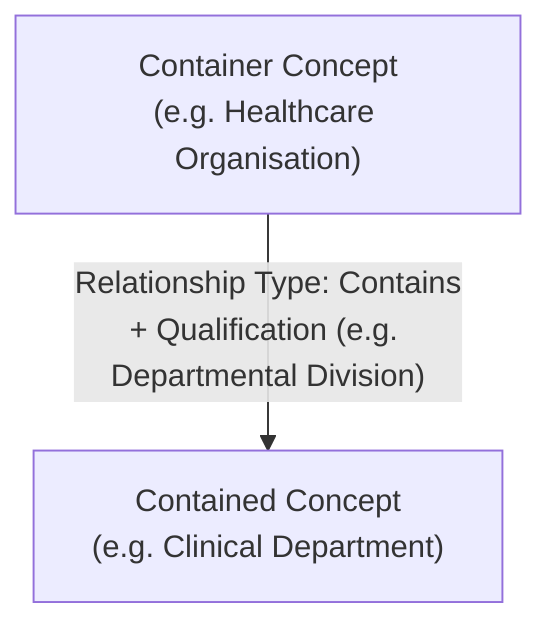
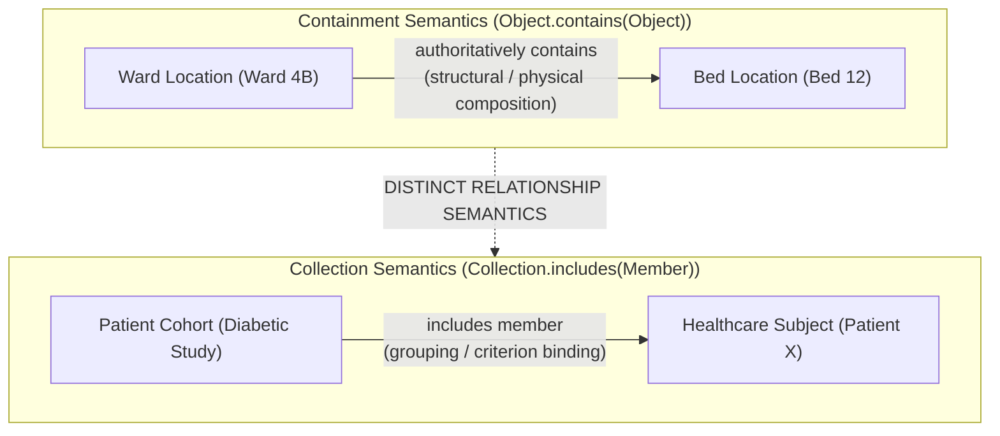

# Qualified Containment, Recursion & Collection Semantics

## 1. Qualified Forward Containment

In healthcare integration, complex entities such as healthcare facilities, enterprise health services, and organizational structures exhibit structural, spatial, or compositional hierarchies.

Harmonia models containment using the canonical **Information Relationship pattern** rather than inventing a separate structural or storage-specific pointer mechanism.

### The Canonical Containment Expression
> **`Object.contains(Object)` is the authoritative semantic expression of containment.**

### 1.1 Forward Authoring Invariant
- **Forward Authority**: The containing entity authoritatively asserts the containment relationship (`Container.contains(Contained)`).
- **Inverse Derivation**: Navigating upward from child to container (`Child.parent()`) is an operational convenience and query projection derived downstream in Application and Integration architectures. Inverse pointers are never modeled as primary conceptual relationships.
- **Qualified Containment**: The containment relationship may be qualified to denote physical containment, legal jurisdiction, administrative subordination, or clinical composition.

---

## 2. Recursive Containment & Permitted Domains

Recursive containment occurs when an entity contains entities of the same conceptual family across multiple depths of granularity.

### 2.1 Permitted Recursive Domains

| Conceptual Family | Recursive Expression | Concrete Healthcare Examples |
| :--- | :--- | :--- |
| **Healthcare Organisation** | `Organisation.contains(Organisation)` | *Health Service District* $\to$ *Hospital Network* $\to$ *Hospital Facility* $\to$ *Clinical Directorate* $\to$ *Specialist Department* $\to$ *Clinical Sub-Unit*. |
| **Healthcare Location** | `Location.contains(Location)` | *Regional Campus* $\to$ *Hospital Building* $\to$ *Floor / Level* $\to$ *Clinical Ward* $\to$ *Patient Room* $\to$ *Bed Bay / Care-Place*. |
| **Healthcare Service** | `OfferedHealthcareService.contains(OfferedHealthcareService)` | *Comprehensive Cardiology Service* $\to$ *Interventional Cardiology* $\to$ *Coronary Angiography Procedure*. |

Containment does not require the source and target to be identical concrete subtypes, provided they belong to a semantically compatible information family (e.g. a `Location (Campus)` contains a `Location (Ward)`).

### 2.2 Person Containment Constraints
> **Person-oriented concepts SHALL NOT use recursive containment merely to represent familial, social, care, representation or authority relationships. Those semantics SHALL use appropriate Information Relationships or Collections.**

- Familial, guardian, or caregiving associations (e.g. parent/child, legal proxy) are modeled via distinct relationship patterns (e.g. `Relationship Roles`, `Support Network Associations`), never via structural containment (`Person.contains(Person)`).
- Practitioner relationships such as clinical supervision, care team collaborations, and referral networks are modeled via explicit participation and role bindings rather than recursive containment.

---

## 3. Collections vs. Containment: Distinct Semantics

A common failure mode in domain modelling is conflating **Collection Membership** with **Containment / Composition**. Harmonia enforces a strict semantic boundary:

> **Containment and Collection Membership are distinct relationship semantics represented through the common Information Relationship pattern.**
> **Collection Membership does not imply containment, hierarchy, composition, or ownership unless the semantics of that Collection explicitly establish it.**
>
> $$\text{Containment} \neq \text{Membership}$$

### 3.1 Comparison of Containment and Membership

| Characteristic | Containment Semantics (`Object.contains(Object)`) | Collection Membership Semantics (`Collection.includes(Member)`) |
| :--- | :--- | :--- |
| **Primary Semantic Meaning** | Structural composition, physical enclosure, or administrative sub-division. | Conceptual grouping, cohort aggregation, or operational queueing based on shared criteria. |
| **Hierarchical Implication** | Inherently hierarchical; child exists within the structural boundary of the parent. | Non-hierarchical; members are peer participants in the collection. |
| **Ownership Implication** | Container frequently governs the operational scope of the contained entity. | Collection does **not** own or control the lifecycle of its member entities. |
| **Multi-Parent / Multi-Collection** | Typically single parent per qualified dimension (e.g. a physical bed is in exactly one room at a given time). | Multi-membership is standard (e.g. a patient belongs to multiple registries, cohorts, and care lists simultaneously). |
| **Lifecycle Coupling** | Decommissioning a container may structurally affect contained entities. | Removing a member from a collection has zero effect on the member's underlying existence or identity. |

### 3.2 Unified Relationship Mechanism
Despite their distinct business semantics, **Collection Membership does not require a second, redundant relationship engine**.

Membership is expressed using the canonical Information Relationship pattern:
- **Relationship Source**: The `Collection` concept.
- **Relationship Target**: The member `Information Concept`.
- **Relationship Type**: `IncludesMember` (or inversely queried as `MemberOf`).
- **Available Characteristics**: `Membership Role` (e.g. *Principal Subject*, *Control Subject*), `Effective Period`, `Inclusion Basis / Criterion`, and `Authority`.
