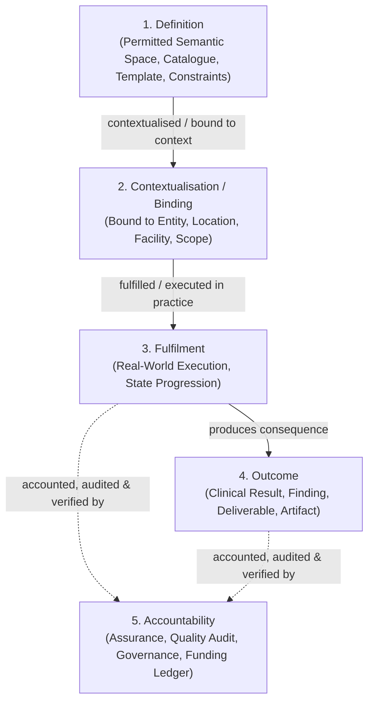
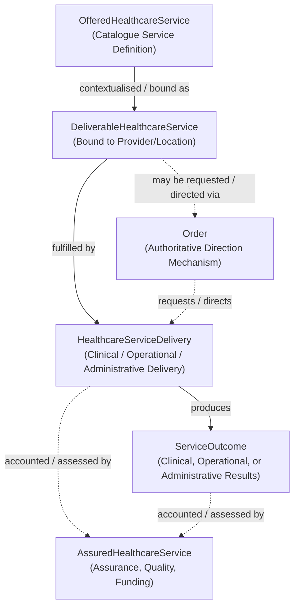

# The Definition-to-Accountability Semantic Pattern

## 1. The Five-Stage Reusable Semantic Pattern

In enterprise health integration, clinical and administrative workflows span from abstract catalogue specifications to retrospective assurance audits. A common modelling error is forcing these fundamentally distinct business concepts into status fields or lifecycle state machines on a single entity record.

Harmonia formalises the **Definition-to-Accountability Progression** as a reusable semantic pattern consisting of five distinct stages:

```text
Definition
    ↓
Contextualisation / Binding
    ↓
Fulfilment
    ↓
Outcome
    ↓
Accountability
```



### 1.1 Core Semantic Principles of the Pattern

1. **Independent Semantic Concepts**: The five stages represent distinct Information Concepts with independent:
   - **Identities**: A service definition has a distinct persistent identity from the millions of service deliveries performed against it.
   - **Authorities**: A definition is authored by a clinical governance board; a fulfilment is attested by an attending clinician; an outcome may be produced by a laboratory analyser; an accountability record is established by a compliance auditor or funding authority.
   - **Lifecycles**: A catalogue definition progresses through versioning (*Draft* $\to$ *Active* $\to$ *Deprecated*); a fulfilment progresses through operational execution (*In-Progress* $\to$ *Completed*); an accountability record progresses through audit states (*Pending Verification* $\to$ *Certified*).
   - **Cardinalities**: One definition supports many contextual bindings; one contextual binding supports many fulfilments; one fulfilment produces multiple outcomes; one accountability record may evaluate multiple fulfilments and outcomes.
   - **Provenances**: Each stage records its own author, system, timestamp, and transactional evidence.

2. **Pattern, Not Rigid Requirement**: The pattern provides semantic guidance. Individual domains and information families are **not required to materialise all five stages as separate Information Concepts** if business semantics in that domain do not justify them. Stages may be collapsed where appropriate.

3. **Definition Describes the Permitted Semantic Space**:
   A `Definition` specifies:
   - Permitted participants and performer qualifications.
   - Allowable inputs, parameters, and valid value ranges.
   - Clinical prerequisites, indications, and contraindications.
   - Supported relationships and composition structures.
   - Expected outputs and valid completion criteria.

4. **Binding Without Redundant Replication**:
   A contextualised or fulfilment instance binds to its governing definition by reference (including definition version and namespace) rather than redundantly copying the entire specification.

These are reusable distinctions and illustrative characteristics, not a
substitute for concept-specific adjudication. The pattern does not establish
reserved identity, cardinality, lifecycle or accountability rules for the
[bounded Task / Work model](../information-families/task-work.md#5-explicitly-unresolved-architecture).

---

## 2. Reference Example 1: Healthcare Service

The Healthcare Service information family provides the canonical clinical example of the Definition-to-Accountability pattern:

```text
OfferedHealthcareService
    ↓ contextualised / bound as
DeliverableHealthcareService
    ↓ [associated request/direction via Order]
HealthcareServiceDelivery
    ↓ produces
ServiceOutcome
    ↓ accounted / assessed through
AssuredHealthcareService
```



### 2.1 Healthcare Service Concepts & Semantics

| Information Concept | Pattern Stage | Governed Business Semantics | Key Architectural Demarcations |
| :--- | :--- | :--- | :--- |
| **`OfferedHealthcareService`** | **Definition** | The canonical service offering defined within a health enterprise or jurisdictional catalogue (e.g. *12-Lead Electrocardiography*, *Inpatient Acute Haemodialysis*, *Ward Disinfection Protocol*). Describes clinical specialty, standard indications, and composition. | May use recursive qualified containment to model complex service hierarchies (e.g. *Cardiology Service* contains *Echocardiography*). |
| **`DeliverableHealthcareService`** | **Contextualisation / Binding** | The contextual binding of an offered service to a specific healthcare facility, provider organisation, operating schedule, or local practitioner cohort (e.g. *12-Lead ECG at St Jude Hospital Ward 3B, Mon-Fri 08:00-17:00*). | Governed by *Health Service Administration*. Establishes deliverability and local availability. |
| **`Order`** | **Associated Request Mechanism** | An authoritative clinical or operational requisition or direction instructing the performance of a healthcare service (e.g. *Dr Smith orders urgent 12-lead ECG for Patient Y*). | **NOT a mandatory lifecycle stage of Healthcare Service**. An order is an authoritative direction mechanism. Deliveries may occur without an order (e.g. emergency triage, direct nursing care, scheduled facility sanitation). |
| **`HealthcareServiceDelivery`** | **Fulfilment** | Information referring to actual clinical, operational or administrative performance/delivery by practitioners or service agents at a specific time and location; the concept does not become that real-world activity. | Information responsibility follows the evidenced information-management Capability; it does not confer performance responsibility or originating authority. A universal Delivery owner is not established. While clinical service deliveries typically associate with a Healthcare Subject, broader service semantics (e.g. facility disinfection, environmental testing, population calibration) do not universally require a Healthcare Subject. |
| **`ServiceOutcome`** | **Outcome** | Information concerning a clinical finding, diagnostic observation, therapeutic change, operational result/consequence or administrative artefact associated with delivery (e.g. *Confirmed ST-Elevation Myocardial Infarction finding*, *Telemetry Trace artifact*, *Sanitised Care-Place Certification*). | Distinct from delivery and from the represented phenomenon. Results, findings, changes, consequences and administrative artefacts retain their contextual distinctions; no universal information-kind representation is established. |
| **`AssuredHealthcareService`** | **Accountability** | The retrospective quality assessment, clinical audit, accreditation review, or funding/billing reconciliation evaluated against the delivered service. | May evaluate a single service delivery or an aggregated cohort of deliveries across an episode of care. |

> **Guardrail**: *Offered, Deliverable, Delivered, and Assured semantics MUST NOT be represented merely as lifecycle states of a single Healthcare Service record.*

---

## 3. Reference Example 2: Task / Work Progression

The [bounded Task / Work information model](../information-families/task-work.md)
provides the operational example across human and automated work. Its
authorised distinctions are definition, work instance, undertaking and
governed resolution of the work instance. Undertaking outputs contribute
according to the ActionableTask's explicit outcome policy; the Accountability
intersection remains unresolved.

**Established responsibility boundary:** This illustration does not assign authority over underlying clinical work to Harmonia. The [Business clinical-work boundary](../../03-business-architecture/metamodel/business-architecture-metamodel.md#37-clinical-work-integration-boundary) and [AX-18](../../governance/architectural-axioms.md#ax-18) apply: representing work/results and coordinating associated activity do not confer clinical-work determination, allocation, handover management, clinical decision authority, worklist ownership or clinical task ownership. Harmonia retains explicitly assigned information management, operational/workflow coordination, communication, provenance, control and activity execution. The Task information meanings established by the bounded model do not become the underlying work/result or redefine the Business Work Order / To Do / synthetic Task distinction.

```text
ActionableTaskArchetype                Definition
    ↓ instantiated as
ActionableTask                        Contextualisation / work instance
    ↓ governs undertakings and outcome policy
FulfillmentTask [0..*]                 Fulfilment / undertaking
    ↓ participating state / output contributes under that policy
TaskOutcome                           Outcome / governed ActionableTask resolution
    ├ references participating FulfillmentTask [0..*]
    ├ contains Task Completion Metadata
    └ contains / represents Task.Output(s)

Accountability / ReportedTask          Unresolved; no relationship settled here
```

TaskOutcome belongs to and resolves the ActionableTask according to its
explicit outcome policy; a FulfillmentTask does not independently own it.
ExecutionConcurrency, OutcomeConcurrency.Mode (FirstToFinish,
AssignedToFinish, Aggregate) and Outcome.OutputRules.Mode (Direct, Collection,
Derived) respectively govern permitted execution concurrency, participating
undertakings and output handling. They remain orthogonal. Multiple results
are represented through participating-undertaking references, without
recursive TaskOutcome containment. The
[conceptual relationship diagram](../information-families/task-work.md#3-established-conceptual-relationships)
and [policy definitions](../information-families/task-work.md#221-actionabletaskexecutionconcurrency)
record the bounded information semantics without prescribing implementation.

### 3.1 Task Concepts & Activity Classifications

| Information Concept | Pattern Stage | Governed Business Semantics | Key Architectural Demarcations |
| :--- | :--- | :--- | :--- |
| **`ActionableTaskArchetype`** | **Definition** | Reusable definition of a kind of actionable work, including applicable meaning, constraints and expectations. | Not an instance of work; content expectations do not require structural definition or Platform domain comprehension. |
| **`ActionableTask`** | **Contextualisation / work instance** | Identifiable particular thing-to-be-done, instantiated from / governed by an applicable archetype; explicitly governs execution concurrency, outcome participation and output rules. | Neither definition nor undertaking; the three controls remain orthogonal. |
| **`FulfillmentTask`** | **Fulfilment** | Identifiable undertaking of an ActionableTask, carrying its own execution state/information and potentially producing output. | Zero or more per ActionableTask; concurrent execution according to ExecutionConcurrency. It does not independently own TaskOutcome; completion alone does not inherently satisfy its parent. |
| **`TaskOutcome`** | **Outcome** | Governed resolution of an ActionableTask according to that ActionableTask's explicitly defined outcome policy. | References participating undertakings, contains Task Completion Metadata and contains / represents resulting Task.Output(s). Output domain content may be opaque; recursive TaskOutcome containment is excluded. Identity, further cardinalities, detailed structures and lifecycle remain reserved. |
| **`ReportedTask`** | **Existing Accountability intersection — unresolved** | Necessity and semantics await separate Assurance / Accountability adjudication. | This task does not reaffirm the earlier immutable accountable-report interpretation or its relationships. |

### 3.2 Harmonia Activity Classifications

Domain03 preserves **Work Order — human doing**, **To Do — human
review/update/validation/judgment/decision/approval**, and **Synthetic Task —
automated/non-human executable work**. These are distinct Business
classifications; the generic Task information semantics must represent work
arising from them without renaming Domain03's business **Task = synthetic
task** vocabulary or creating specialised archetype, undertaking or outcome
subclasses. Their
[business meanings, responsibilities and progression authority](../information-families/task-work.md#4-relationship-to-domain03-business-work-classifications)
remain intact.

### 3.3 Accountability and ReportedTask — Unresolved

The earlier example placed `ReportedTask` at Accountability as an immutable,
audited report of fulfilment and outcome. That interpretation is **not
reaffirmed** by this reconciliation. Its necessity and semantics may overlap
accountability, assurance, audit, historical representation and evidence.
Separate architectural adjudication is required under
[AX-17](../../governance/architectural-axioms.md#ax-17); no ReportedTask
relationship or lifecycle is settled here. Execution completion alone does
not settle accountability or constitute an independent assurance evaluation.
