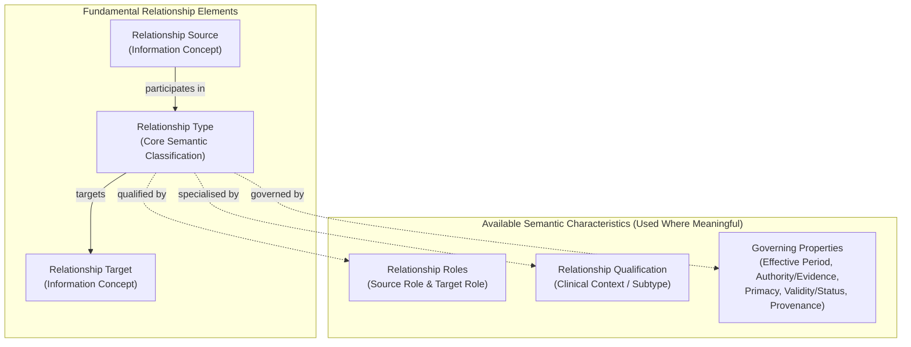
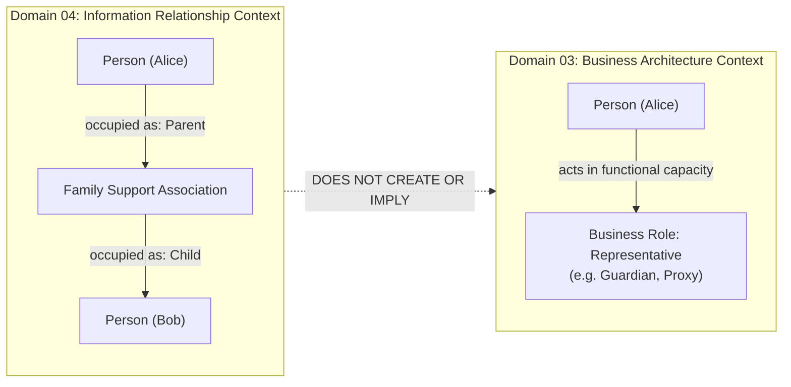

# Reusable Information Relationship Pattern & Role Separation

## 1. The Canonical Information Relationship Pattern

In the Harmonia Information Architecture, relationships between Information Concepts are reified as explicit, first-class semantic structures rather than opaque foreign keys or unannotated graph edges.

A healthcare integration environment operates across multi-jurisdictional, multi-facility, and multi-author contexts where a relationship between two entities carries critical clinical, legal, and temporal semantics.

```text
Information Relationship
├── Relationship Source
│   └── Source Relationship Role (available)
├── Relationship Target
│   └── Target Relationship Role (available)
├── Relationship Type (fundamental)
├── Relationship Qualification (available)
└── Relationship Properties (available)
    ├── Effective Period
    ├── Authority / Evidence
    ├── Primacy
    ├── Validity / Status
    ├── Provenance
    └── Qualification
```



### 1.1 Fundamental Elements vs. Available Characteristics

Harmonia establishes a clear distinction between what is **fundamental** to every relationship and what is an **available semantic characteristic**:

1. **Fundamental Elements (Present in all Relationships)**:
   - **Relationship Source**: The originating Information Concept.
   - **Relationship Target**: The destination Information Concept.
   - **Relationship Type**: The primary semantic nature of the association (e.g. *Contains*, *Delivers*, *Performs*, *Targets*, *Asserts*, *Directs*, *ParticipatesIn*, *MemberOf*).

2. **Available Semantic Characteristics (Applied where meaningful)**:
   - **Relationship Roles**: The specific semantic role occupied by the source and/or target within the relationship context.
   - **Relationship Qualification**: Contextual nuance, clinical setting, or degree of association (e.g. *Direct Clinical Supervision*, *Emergency Proxy*).
   - **Effective Period**: The bounded real-world temporal validity during which the relationship holds true (`start_time` $\to$ `end_time`).
   - **Authority / Evidence**: The legal, professional, or evidentiary basis asserting the relationship (e.g. legal mandate, statutory certificate, practitioner attestation).
   - **Primacy**: Priority or ordering in multi-target associations (e.g. *Primary Nominated Next-of-Kin*, *Secondary Emergency Contact*).
   - **Validity / Status**: The verification or lifecycle state of the relationship (e.g. *Active*, *Suspended*, *Refuted*, *Entered-in-Error*).
   - **Provenance**: The author, time, mechanism, and transaction through which the relationship was established or modified.

These available characteristics **SHALL be used where they carry architectural or clinical meaning**, but are not universally mandatory properties of trivial or structurally opaque links.

---

## 2. Strict Separation: Relationship Role vs. Business Role

A critical guardrail within the Harmonia architecture is the strict semantic separation between a **Relationship Role** (Domain 04) and a **Business Role** (Domain 03).

> **Relationship Role**: The local semantic role occupied by an Information Concept (Source or Target) exclusively within the context of a specific Information Relationship.
>
> **Business Role** (Domain 03): A functional capacity, responsibility profile, or enterprise posture assumed by a Business Actor to perform Business Functions and participate in Business Collaborations (e.g. *Clinician*, *Care Coordinator*, *Information Steward*, *Patient*, *Representative*, *Performer*, *Service Provider*).

### The Invariant Boundary
> **A Relationship Role SHALL NOT create or imply a Business Role. A Business Role SHALL NOT be inferred merely because an entity occupies a similarly named Relationship Role.**

Furthermore, **Healthcare Subject** is an entity/subject context (the person or subject of care receiving services), orthogonal to the *Patient* Business Role, and is **NOT** itself a Business Role.



### Clarifying Examples

| Relationship Context | Source Concept | Source Relationship Role | Target Concept | Target Relationship Role | Why It Is NOT a Domain 03 Business Role |
| :--- | :--- | :--- | :--- | :--- | :--- |
| **Family Lineage** | `Person` | *Parent* | `Person` | *Child* | *Parent* and *Child* are biological/familial relationship roles. They do not define enterprise functional capacities in Harmonia. |
| **Marital / Legal Union** | `Person` | *Spouse* | `Person` | *Spouse* | *Spouse* is a civil relationship role, not a system operational capacity. |
| **Clinical Supervision** | `Practitioner` | *Supervising Clinician* | `Practitioner` | *Trainee / Registrar* | While both hold the canonical Business Role *Practitioner* or *Clinician*, their supervisory relationship role exists only within this specific binding. |
| **Support Network Association** | `Person` | *Emergency Contact* | `Person` | *Contact Subject* | *Emergency Contact* is a relationship role within a support network; enterprise representation in business interactions is governed separately through canonical Business Roles such as *Representative* or *Support Person*. |

---

## 3. Forward Semantic Authoring & Traversal

Domain 04 enforces **Forward Semantic Clarity**:
- Relationships are modeled, authored, and validated in their natural authoritative forward direction (e.g. `Organisation.contains(OrganisationalUnit)`, `Practitioner.delivers(HealthcareService)`).
- Inverse navigability (e.g. finding the parent organisation of a unit, or finding all services delivered by a practitioner) is a **derived query and indexing concern** in Application and Integration architectures, not a distinct conceptual entity.
- Bidirectional relationship definitions that duplicate authority or create dual-source inconsistencies are forbidden.

---

## 4. Multi-Target and N-Ary Relationships

Where healthcare scenarios involve multi-party or contextual associations (such as a multidisciplinary clinical encounter involving a patient, primary physician, specialist consultant, and family carer):
- The relationship is modeled through a reified association concept (e.g. `CareTeamMembership` or `EncounterParticipation`) rather than collapsing the association into artificially decoupled, lossy binary pairs.
- Each participant attaches to the association with its own specific `Relationship Role`, `Effective Period`, and `Authority`.
