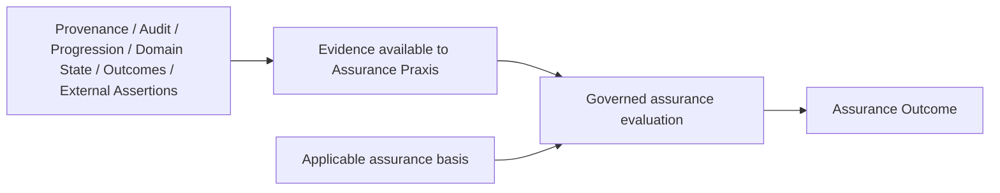
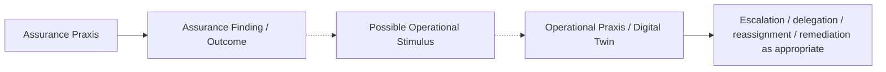

# Dokimasia — Independent Governed Assurance: Architectural Finding

**Date:** 2026-10-08. **Origin:** Domain04 Package2 G2 review, following G2-D04.

**Status: NAME AND CONCEPTUAL BOUNDARIES APPROVED FOR CAPTURE; COMPLETE ARCHITECTURAL PLACEMENT NOT ESTABLISHED.**

This is a bounded architectural finding and impact analysis. It records the explicitly approved review finding; it does not reconcile Dokimasia into frozen architecture, establish an Information Family, allocate an implementation, or continue G2-Q02–Q07. Its location records where the finding emerged, not Dokimasia's architectural placement.

## 1. Authority and Status of Statements

The [central Architectural Axioms](../../governance/architectural-axioms.md) and repository [AGENTS.md](../../../../AGENTS.md) govern. The [Domain04 upstream immutability boundary](../README.md#upstream-authority--immutability-context) identifies Domain01–03 as CLOSED and FROZEN. [AX-17](../../governance/architectural-axioms.md#ax-17) requires absent relationships to remain explicit. This review's approval authorises capture of the name and conceptual boundaries below; it does not authorise upstream reconciliation or complete placement.

| Classification | Meaning in this finding |
| :--- | :--- |
| **Already established by authoritative architecture** | Existing documented meaning or responsibility, cited to its source. It is not retroactive approval of Dokimasia. |
| **Approved through this review** | The name and conceptual boundaries explicitly approved for capture in the task instruction, recorded in §2. |
| **Candidate requiring derivation/reconciliation** | Working relationships, vocabulary and impact-analysis recommendations awaiting architectural review. |
| **Unresolved** | A fact, responsibility or relationship not established by the reviewed architecture; AX-17 applies. |
| **Downstream/deferred** | Implications for later architectural domains, without deriving a solution here. |

The explanatory term **QA service** does not allocate a Domain03 Business Service, Domain05 Application Component, network service or deployable unit. Dokimasia is a candidate Harmonia assurance framework/construct whose approved conceptual responsibility is now recorded.

## 2. Approved Conceptual Definition and Boundaries

**Classification throughout §2: approved through this review.** Examples and diagrams explain these boundaries; they establish neither detailed workflow mechanics nor information representations.

### 2.1 Dokimasia and Assurance Activity

> **Dokimasia is Harmonia's independent assurance framework responsible for coordinating governed assurance activity over a subject of assurance.**

Assurance is itself managed activity. An Assurance Praxis evaluates a subject of assurance using available evidence against applicable expectations, criteria, obligations or other assurance bases and produces governed assurance information/outcomes.

Assurance is not merely a calculated property of its subject, a property of another workflow, passive observation, a status field, provenance, audit information or workflow completion.

### 2.2 Assurance Is Distinct from Evidence

```text
Provenance ≠ Assurance
AuditEvent / audit information ≠ Assurance
Workflow progression ≠ Assurance
Business Outcome ≠ Assurance Outcome
Workflow completion ≠ Assurance
```

Provenance, audit information, progression information, checkpoints, domain information, outcomes and external assertions MAY contribute evidence to an Assurance Praxis. They do not individually constitute assurance. An attributable record that an activity completed remains evidence about completion; it does not become an independent assurance evaluation.



The diagram specifies conceptual meaning only. It prescribes no evidence schema, evidence repository, interface, representation or automatic ingestion of all operational observations.

### 2.3 Assurance Is Workflow

> **Assurance activity is itself governed workflow and may therefore be represented through the Pragma/Praxis conceptual model.**

| Conceptual activity | Responsibility |
| :--- | :--- |
| **Operational Praxis** | Performs/manages the activity being assured. |
| **Assurance Praxis** | Performs the assurance activity concerning its subject. |

The Assurance Praxis is not merely another state within the Operational Praxis. Approval establishes assurance as governed activity/workflow, not a canonical Pragma/Praxis definition-versus-instance model, particular transition system, linkage mechanism or execution allocation. The current model's insufficiencies are recorded in §§4.5 and 6 under AX-17.

### 2.4 Operational Independence

> **Assurance activity SHALL be operationally independent of the activity it assures.**

The architecture SHALL NOT assume that the same execution/control responsibility which performs the assured activity is also responsible for determining its assurance outcome.

Downstream architecture must preserve sufficient independence such that the assured activity cannot determine, suppress, manufacture or retrospectively alter its own assurance outcome. Producing evidence about its own activity does not confer responsibility for deciding assurance.

The required architectural independence is established now. It does not establish separate Kubernetes clusters, processes, databases, physical infrastructure, a deployment topology or a technology. Independence concerns responsibility and control; its downstream realisation remains deferred.

### 2.5 QA Service, Not the Job Foreman

> **Dokimasia is the QA service, not the Job Foreman.**

> **Dokimasia SHALL coordinate independent assurance activity concerning a subject of assurance. It SHALL NOT assume responsibility for the operational management, assignment, delegation, reassignment, escalation or remediation of the activity being assured. Assurance findings and outcomes MAY initiate or inform operational activity, but responsibility for that activity remains with the appropriate operational construct.**

```text
Assurance Exception ≠ Operational Escalation
Assurance Finding ≠ Work Assignment
Assurance Recommendation ≠ Delegation
Assurance Outcome ≠ Remediation Workflow
```

An Assurance Outcome MAY become a stimulus/input to an appropriate operational Praxis or Digital Twin. The operational construct remains responsible for determining and coordinating the operational response.



The possible handoff does not make Dokimasia the operational supervisor of its subject, establish a mandatory response, or prescribe a stimulus contract.

### 2.6 Assurance May Manage Its Own Workflow

> **An Assurance Praxis may manage escalation, delegation, reassignment and other workflow concerns necessary to conduct the assurance activity itself; it SHALL NOT perform those functions on behalf of the operational Praxis that is its subject of assurance.**

Unavailable evidence, assurance review, disputed assurance findings, a requirement for additional assurance activity, and assignment of assurance work are examples of assurance-internal workflow concerns. These examples SHALL NOT be interpreted as an approved canonical workflow or state model.

**Dokimasia may manage its own assurance work. Dokimasia does not manage the operational work being assured.** The meaning of an escalation or assignment depends on which activity it concerns; similarity of workflow vocabulary does not merge responsibilities.

### 2.7 Relationship to Digital Twin

Dokimasia has conceptual similarities to a Digital Twin: it has a subject, maintains relevant context, observes changing information/evidence, coordinates activity, may respond to stimuli, has lifecycle/progression, and produces/maintains governed state and outcomes.

> **Dokimasia is NOT established as a Digital Twin or Digital Twin subtype.**

| Construct | Established distinction |
| :--- | :--- |
| **Digital Twin** | Entity-centric active management construct coordinating information and operational activity associated with a real-world entity; see the [existing strategic definition](../../02-strategy/strategic-views/logical-component-responsibilities.md#component-7-digital-twin-entity-centred-operational-coordination-construct). |
| **Dokimasia** | Assurance-subject-centric construct coordinating independent governed assurance activity concerning a subject of assurance. |

Dokimasia's subject is not assumed to be limited to a real-world entity. Potential subjects MAY include activity, Praxis, service delivery, information, controls or other governable subjects. This is not an exhaustive or approved subject taxonomy. Structural similarity supplies no inheritance, shared execution allocation or Twin classification.

### 2.8 Execution Relationship with Ponos

> **The execution relationship between Dokimasia, Assurance Praxis and Ponos remains to be architecturally determined.**

Dokimasia is not placed inside Ponos. Ponos is not established as its execution engine; no new physical/runtime engine is established either. Assurance Praxis execution must be sufficiently independent from the execution/control responsibility of the activity being assured, particularly where that activity itself executes through Ponos.

The current execution-responsibility statements require explicit reconciliation before any assurance execution allocation (§4.5). They do not settle this relationship by inference.

## 3. G2-D04 Is Preserved

**Classification: already established by authoritative architecture**, with the assurance distinction **approved through this review**.

[G2-D04 — Referral Outcome](package2-g2-block1-review.md#g2-d04) remains authoritative:

> **Referral Outcome is the governed information concerning what ultimately became of a Referral, sufficient to support assurance, governance and traceability over the Referral and its progression.**

The issue emerged because G2-D04 and [RF-IR5](../information-families/referral.md#2-domain-03-responsibility--traceability) require enough information to account for Referrals within governance scope. Asking what performs that assurance exposed a distinction between supplying sufficient evidence and conducting independent governed assurance activity.

Referral Outcome is NOT assurance itself. Referral progression evidence is NOT assurance itself. Referral Administration workflow is NOT assurance itself. Each may provide evidence to a separate assurance activity. G2-D04's expression `Referral population within governance scope → progression/outcome evidence → assurance coverage` records the evidence-support obligation; it does not establish evidence possession or workflow closure as assurance evaluation.

**Candidate requiring derivation/reconciliation:** the governance-scope requirement may eventually be realised through Dokimasia/Assurance Praxis rather than by embedding assurance workflow inside the Referral Information Family. This does not yet assign Dokimasia responsibility for a Referral population, establish a population Collection, or define coverage/evidence sufficiency.

Referral Administration retains its established progression/outcome information responsibility. Unknown Referral Outcome remains unknown, and an inability to establish what became of a Referral remains an assurance gap. No outcome is manufactured. Existing responsibility-assumption, Transfer of Care, HealthcareServiceDelivery and ServiceOutcome distinctions remain intact.

No G2-D04 text, Referral family, G2-Q02–Q07, G2-D01–D03, G1 closure/decisions, Foundation or Package1 family is modified. G2 remains open; this finding is not a further G2 decision or continuation gate.

## 4. Authoritative Support and Architectural Impact Analysis

### 4.1 Domain01 — Motivation

**Assessment:** existing motivation supports trustworthy, governed, evidence-bearing activity. The reviewed Drivers, Goals, four foundational Requirements, three external Constraint categories and central Axioms do not explicitly establish the particular operational-independence requirement in §2.4 or identify Dokimasia. That requirement is approved through this review, not claimed as an existing Domain01 statement.

| Existing source — already established | Support and limit | Subsequent reconciliation question — candidate |
| :--- | :--- | :--- |
| [Drivers](../../01-motivation/drivers-assessments/drivers.md): Patient Safety & Identity Integrity; Statutory Health Information Privacy & Protection; Coordinated Operational Activity and Entity State | Motivate integrity, accountability, protected information and visible progression. They do not assign independent assurance activity. | Can independent assurance trace to these motivations, and does Domain01 need a specific Requirement/Constraint after approval? No Driver is added here. |
| [Strategic Goals](../../01-motivation/goals-outcomes/strategic-goals.md): durable event preservation, reliable identity, coordinated activity/state | Establish desired operational properties; achieving or recording those properties is not assurance evaluation. | Confirm traceability of assurance purpose without equating a Business Outcome with an Assurance Outcome. |
| [REQ-FND-002 and REQ-FND-004](../../01-motivation/requirements-constraints/foundational-requirements.md) | Require observable operational progression/outcome and explicit indeterminate outcome. Progression is evidence; uncertainty must not be converted into a favourable assurance conclusion. | Distinguish an assurance evidence need from a new assurance-activity obligation. These Requirements remain unchanged. |
| [CST-EXT-001–003](../../01-motivation/requirements-constraints/external-constraints.md) | Applicable privacy/retention, identifier and interoperability obligations may supply assurance bases. They establish no universal independent-assessor rule. | Determine applicable obligations per assurance context, without universalising a jurisdictional rule. |

The materially relevant [central Axioms](../../governance/architectural-axioms.md) constrain this capture as follows:

| Axiom — already established | Consistency of the captured approach |
| :--- | :--- |
| **AX-01 / AX-04** | Assurance remains a Harmonia health-information/governance concern. Its semantics are captured without inventing generic workflow machinery or an engine. |
| **AX-06 / AX-07** | Evidence authority/credibility and governed security context remain explicit. Evidence supply, technical success and custody confer no assurance decision authority. Assurance activity is governed too. |
| **AX-08 / AX-09** | Meaningful provenance/audit evidence remains distinct from diagnostic mechanics and transient state. Availability as possible assurance evidence does not mandate durable capture of every checkpoint. Kleio preserves evidence; it is not thereby the assurance evaluator. |
| **AX-14** | Assurance, operational progression, business outcomes and evidence retain their distinct meanings. Digital Twin similarity does not establish identity or subtype. |
| **AX-15** | Unknown operational outcomes stay unknown. Missing/uncertain evidence cannot be replaced with invented completion or success. No assurance qualification/value set is inferred. |
| **AX-17** | Placement, Business Architecture derivation, information concepts and execution relationship remain visibly unestablished until reviewed. |
| **AX-05 / AX-10 / AX-11** | Later assurance state management must preserve active/durable responsibility and failure semantics without this review allocating stores or deployment boundaries. |
| **AX-02 / AX-03 / AX-13** | Later external assurance interactions must honour standards contracts and the management boundary. External assertions may be evidence without extending Harmonia control beyond egress. No mapping is derived. |

There is no identified contradiction between the approved conceptual boundaries and these central Axioms. Their support does not make the architecture complete or automatically reconcile frozen Domain01.

### 4.2 Domain02 — Strategy

**Assessment:** Dokimasia exposes a missing explicit strategic responsibility for independent governed assurance activity. It gives a concrete boundary to an already present assurance/accountability concern, but the reviewed Strategy does not fully establish that responsibility. Treating it as merely a new name for EC-12 or evidence collection would erase the gap. Whether the gap requires a new Capability, refinement or other strategic placement remains unresolved.

| Area and existing authority | Impact requiring explicit reconciliation — candidate |
| :--- | :--- |
| [Enterprise Capabilities](../../02-strategy/capabilities/enterprise-capabilities.md): **EC-12 Operational Assurance** | Its stated scope is concurrency integrity, resilience, duplicate detection, exception handling/recovery and telemetry, collaboratively realised by operational components. These safeguards may provide evidence; they do not establish independent governed evaluation. Preserve EC-12's existing responsibility and determine the strategic relationship explicitly. Do not rename it or absorb Dokimasia into it by lexical similarity. |
| **EC-07 Provenance & Traceability; EC-06 Policy & Control; EC-10 Activity & Execution; EC-13 Semantic Governance & Conformance** | Establish evidence, policy, work coordination and semantic rules that may support assurance. None individually establishes independent assurance responsibility or outcome authority. No composition or exclusive owner is allocated. |
| [Business Capabilities](../../02-strategy/capabilities/business-capabilities.md): **Clinical Quality, Safety & Improvement**; **Enterprise Direction & Stewardship** | The first is Harmonia-Relevant and currently supported through identity integrity, duplicate suppression, preservation and provenance; the second is Reference. These are relevant motivations/enterprise contexts, not an approved Dokimasia ancestor or a mandate to automate all clinical governance. |
| [Courses of Action](../../02-strategy/courses-of-action/strategic-courses-of-action.md): **COA-03, COA-04, COA-05, COA-06** | Meaning-centric evidence, governed activity, entity coordination and collaborative capabilities provide support. COA-04's Ponos grounding and COA-06's local/collaborative assurance language must be assessed against independent determination. COA-05 does not make Dokimasia a Twin. Independent responsibility does not require a central runtime bottleneck. |
| [Logical responsibilities](../../02-strategy/strategic-views/logical-component-responsibilities.md) | The seven named responsibilities and EC-12/Ponos composition do not identify a subject-centric independent assurance coordinator. A new name is not an approved eighth component. Review responsibility, authority and exclusion before placement; retain the Digital Twin's entity-centred boundary. |
| **Strategic Guardrails G1–G4** in that same source | Reusable capability does not imply central service; boundaries follow responsibility; information/state, activity, standards and transport remain distinct. These support a conceptual independence boundary but establish no particular assurance executor. |
| [Value Streams](../../02-strategy/strategic-views/strategic-value-streams.md): **VS-02 and VS-03**, within the four-stream sufficiency boundary | VS-02's durable integrity assurance and VS-03's achieved/verified operational outcomes express existing stakeholder value. Neither establishes a separate Assurance Praxis. Review independent assurance value/coverage without adding a fifth stream, inserting an assurance stage or equating operational resolution with assurance. |

No Enterprise Capability ID, Capability Tier, ancestry, Feature, Course of Action, resource, value stream or logical-component allocation is added or changed.

### 4.3 Domain03 — Business Architecture

**Assessment: a genuine Business Architecture gap exists for derivation of independent governed assurance activity.** The baseline supplies relevant governance contexts, review interactions and generic workflow support, but no complete, bounded assurance responsibility linking Capability, Functions/Services, Process, Roles/Interactions and Information Responsibility. This is an analysis finding, not approval of replacement Business Architecture.

| Existing authority — already established | Sufficiency and gap |
| :--- | :--- |
| [Business metamodel](../../03-business-architecture/metamodel/business-architecture-metamodel.md) and [principal Processes](../../03-business-architecture/processes/business-processes.md) | Support governed progression within an owning Capability/Feature and forbid using cross-capability processes to erase ownership. The sixteen R1 Processes include verification and generic work/review/system-task progression, but none establishes the independent assurance workflow described here. Their names/checkpoints do not establish equivalence. |
| [Workflow & Activity Coordination](../../03-business-architecture/behaviours/05-intrinsic-enablement.md#29-workflow--activity-coordination) | Coordinate Work Order, Coordinate To Do, Coordinate Synthetic Task and Supervise Activity Timeout / Escalation supply generic activity support. Its Services and generic activity/timer information responsibility explicitly do not own business meaning or clinical outcome. They do not determine assurance meaning/authority or assign Dokimasia execution. |
| [Health Information Control](../../03-business-architecture/behaviours/05-intrinsic-enablement.md#25-health-information-control) and Information Design Governance | Policy/access/consent/security-context and Record Security-Significant Activity / Security Audit Ingress are established. Semantic conformance verification is established. Audit production and conformance checks can contribute evidence; neither automatically fulfils independent assurance of another activity. |
| [Governance / Authority Roles](../../03-business-architecture/actors-roles/roles.md#25-governance--authority-roles) and [Review & Clinical Governance Interactions](../../03-business-architecture/collaborations-interactions/interactions.md#29-review--clinical-governance-interactions) | Policy Authority, System/Information Steward and related Roles, plus Review Request/Review Outcome, give relevant contexts. They do not establish who independently conducts assurance, who determines an Assurance Outcome, or whether these existing interactions suffice for Dokimasia. No new Role or automatic equivalence is inferred. |
| [Information Responsibility matrix](../../03-business-architecture/information-responsibility/information-responsibility.md#2-canonical-business-information-ownership-matrix) and [cross-capability dependencies](../../03-business-architecture/dependencies/cross-capability-dependencies.md) | Establish operational information ownership, generic coordination state and security audit responsibility. They do not allocate assurance-specific information responsibility, evidence consumption dependencies or outcome publication/response responsibilities. No ownership transfers from the assured Capability. |

Subsequent Business Architecture review must establish the bounded assurance owner and purpose, assurance Functions and any justified exposed Services/consumers, meaningful assurance progression, participant/decision authority, evidence interactions, assurance-information responsibility, and the handoff to the appropriate operational response. This task does not author those elements or mandate a canonical assurance state model. The assurance workflow may coordinate its own work while the operational subject retains its own management and remediation responsibility.

### 4.4 Domain04 — Information Architecture

**Assessment:** existing information semantics support distinguishing evidence, fulfilment, outcomes and accountability. They are insufficient to derive a complete Dokimasia assurance family without subsequent Business Architecture reconciliation.

| Existing authority — already established | Impact requiring later derivation/reconciliation — candidate |
| :--- | :--- |
| [Definition-to-Accountability pattern](../patterns/definition-to-accountability.md) and [Guardrails 6, 7, 11, 13, 14 and 16](../guardrails/modelling-guardrails.md) | Distinct definition, fulfilment, outcome and accountability semantics support the finding. A pattern stage is not assurance workflow, and reported/completed work is not assurance. Derive new information through business responsibility; do not turn all stages or candidate words into mandatory Concepts. |
| [Healthcare Service family](../information-families/healthcare-service.md#stage-5-assuredhealthcareservice-accountability): **AssuredHealthcareService** | Already documents retrospective quality evaluation/audit/accreditation/reconciliation, explicitly **Reference / Contextual**, without Harmonia ownership of external statutory authority. It is not Dokimasia or a universal Assurance Outcome. Review any future relationship without changing its standing or importing the illustrative “Clinical Governance / Quality & Assurance” row as a canonical Domain03 owner. |
| [Bounded Task / Work model](../information-families/task-work.md): **ActionableTaskArchetype, ActionableTask, FulfillmentTask, TaskOutcome**; **ReportedTask remains unresolved** | The 2026-10-10 reconciliation distinguishes reusable definition, work instance, undertaking and outcome information. It does not reaffirm the earlier ReportedTask accountable-report interpretation. Execution completion or reporting alone does not constitute independent assurance; ReportedTask necessity, semantics and accountability/evidence relationships require separate adjudication. The full Task / Work or Pragma/Praxis family is not derived. |
| [Assertion, authority, custody, provenance and qualification](../governance/authority-custody-provenance.md); [Information lifecycle](../governance/information-lifecycle.md) | Evidence has source authority, context and lineage; consuming it does not acquire originating authority. Assurance activity may produce its own governed information and provenance. Determine the assurance-specific application later, rather than reifying every qualification/provenance characteristic. |
| [Domain03-to-Domain04 traceability](../traceability/domain03-traceability.md#11-traceability-principles) | Requires established owning information responsibility for Harmonia-owned Concepts. The missing assurance Business Architecture chain prevents formal promotion of the vocabulary in §5. Referenced/contextual evidence can retain its original responsibility. |
| **G2-D04 / RF-IR5**, Referral Outcome and Referral Progression Event | Already require sufficient evidence to account for Referrals. Assurance execution, governance scope, evidence sufficiency and assurance outcome authority remain unestablished. Preserve the Concepts and information requirement while recording the independent activity gap. |

Assurance-specific information requirements must later follow the approved assurance Functions/Processes and information responsibility. The finding does not prescribe an evidence schema, repository, evidence completeness rule, universal qualification/value set, or detailed assurance family. Business outcomes and their provenance remain evidence candidates, not Assurance Outcomes by renaming.

### 4.5 Existing Statements Requiring Explicit Reconciliation

**Classification: unresolved**, except the previously recorded source discrepancies identified below. These tensions are reported, not silently repaired.

| Source tension | Disposition in this capture |
| :--- | :--- |
| [Praxis concept](../../../concepts/praxis.md) defines Praxis as the structural workflow blueprint and excludes runtime transaction-state tracking; [Pragma concept](../../../concepts/pragma.md) defines Pragma as an execution-state envelope, not the workflow definition. | The reviewed Assurance Praxis means the actual assurance activity for a subject/context. Blueprint-versus-instance semantics and the conceptual use of Praxis therefore require review. Do not rewrite either concept, identify Pragma with Assurance Definition, or use implementation-status labels to supply missing architectural intent. |
| [ADR-014](../../../architecture-decisions.md#adr-014-----petasos-owns-durable-processing-transition-boundaries), COA-04 and Strategy's Ponos responsibility assign execution/orchestration of governed processing/operational activity to Ponos; Strategy includes EC-12 in its Ponos composition. | A blanket reading as “all assurance must execute under the assured activity's Ponos control” would not preserve the approved independence boundary. Whether/how those existing statements apply to Assurance Praxis is unresolved. No automatic Ponos allocation or alternative engine is accepted. Reconciliation must precede execution design. |
| COA-06 and Guardrail G1 describe collaboratively/local-realised operational assurance. | Local operational controls remain established. Their existence does not establish independent assurance evaluation. Clarify the scope of “assurance” and independence of determination without replacing distributed controls or imposing central deployment. |
| Strategy's Mnemosyne clarification (§Component 2 and Seam 1) denies ownership of authoritative state/version progression and “durable truth”; central **AX-05** assigns those responsibilities to Mnemosyne. | This is a pre-existing conflict in the inspected sources. Central AX-05 governs. It is reported because later assurance state derivation must not inherit the conflicting statement; no correction or assurance persistence design is authorised here. |
| [G1 §16.3 and §16.5](package2-g1-review.md#163-ax-16-investigation-and-disposition) record absent central AX-16 standing and the Domain01/central AX-12 discrepancy. | Preserve those existing unresolved discrepancies and identifiers. Dokimasia is not derived from presumed central adoption of AX-16 or inferred resolution of AX-12. No Axiom change is made. |

### 4.6 Domain05+ — Implications Only

**Classification: downstream/deferred.** Subsequent application, integration, technology, security, operational and governance architecture must assess execution/control independence; permitted evidence access and source attribution; protection of assurance determination/outcomes from subject control; governed assurance progression and uncertainty; and the boundary between an assurance finding and an operational response.

[ADR-013 / ADR-016](../../../architecture-decisions.md#adr-013-----kleio-owns-audit-evidence-and-provenance) already allocate immutable evidence/provenance and significant-transition audit to Kleio. Those responsibilities remain intact; evidence preservation does not allocate independent assurance evaluation to Kleio. Later assurance evidence arrangements must respect that boundary and AX-08/AX-09.

Later managed-state, recovery and external-publication decisions must preserve AX-05/AX-10/AX-15 and AX-02/AX-13. This review derives no Application Component, engine, API, event/message contract, persistence model, schema, network boundary, cluster, process, deployment topology or technology. It is not a convergence/runtime implementation step and changes no implementation sequence.

## 5. Candidate Assurance Information Semantics

**Classification: candidate requiring derivation/reconciliation.** Assurance activity necessarily produces and/or manages assurance-specific information. The following names are working vocabulary, not newly promoted Information Concepts, an exhaustive model, a schema or a taxonomy.

| Candidate semantic area | Question requiring later Business Architecture derivation and Domain04 assessment |
| :--- | :--- |
| **Subject of Assurance** | What is within the assurance responsibility/scope, and how is the subject/context identified? A reference or relationship may suffice; no new subject entity or exhaustive taxonomy is established. |
| **Assurance Basis / Criteria** | Which expectations, obligations or criteria are applied, under whose responsibility/authority? Determine reuse versus independently governed definition semantics. |
| **Assurance Evidence** | What information is used and what can be established from it? Determine evidence-selection/use responsibility and qualification while preserving source ownership/authority; no universal evidence wrapper is mandated. |
| **Assurance Assessment** | What evaluation is undertaken, by whom, in which context? Distinguish activity from information about an evaluation before deciding Concept status. |
| **Assurance Finding** | What is established through evaluation and needs to be retained or communicated? Decide identity/authority and relation to an Outcome without equating it with work assignment. |
| **Assurance Exception** | What assurance concern needs separate meaning, qualification or progression? It is not operational escalation; no exception taxonomy or state model is approved. |
| **Assurance Outcome** | What governed result does assurance activity produce, under whose determination authority? Its conceptual distinction is approved, but full Information Concept identity, scope, relationships and lifecycle are not yet derived. |
| **assurance qualification** | How is the standing/context/limitation of assurance information expressed where meaningful? Existing qualification is available; it does not justify a standalone Concept or universal confidence score. |
| **assurance provenance** | How is the origin and conduct of assurance information attributable? Existing provenance principles apply; a separately named Concept or representation is not established. |

All nine require an established assurance-business purpose and responsibility before assurance-specific formalisation. Their eventual treatment may differ: independently meaningful Concepts, relationships, semantic characteristics, contextual references or reuse of existing information. Naming alone cannot decide. General provenance/qualification and AssuredHealthcareService are already documented, but do not establish a complete assurance family or equivalence to these working names.

**Candidate conceptual relationship for later derivation:** a governed assurance definition may establish what is expected or what must be evaluated; an Assurance Praxis represents the actual assurance activity undertaken for a particular subject/context; available evidence represents what can be established about the subject. The Assurance Praxis evaluates that evidence against the applicable assurance basis and produces assurance information/outcomes.

```text
Governed assurance definition → applicable assurance basis / expectations
Subject / context + available evidence + applicable assurance basis
    → Assurance Praxis: actual governed assurance evaluation
    → assurance information / outcomes
```

This is not a canonical Pragma/Praxis mechanics model. **Pragma is not asserted to be the Assurance Definition.** That proposed equivalence lacks support in the current Pragma execution-envelope definition and must be tested against the current model before formalisation. No identity, cardinality, version linkage or execution lifecycle is allocated.

## 6. Unresolved Architectural Questions

**Classification: unresolved under AX-17.** The approved name, activity/workflow distinction, independence and operational exclusion are not reopened by these questions.

| Unestablished question | Required review context |
| :--- | :--- |
| How should independent assurance responsibility be expressed in Strategy, and how does it relate to EC-12 without erasing operational resilience? | Domain02, informed by the Domain01 traceability assessment. No new Capability/component is presumed. |
| Which Business Capability/Feature owns assurance behaviour and information, and which existing Roles/Interactions/Services are sufficient? | Domain03 responsibility derivation, preserving existing ownership and unresolved hierarchy. |
| How are assurance scope, subjects, expectations, evidence sufficiency and determination authority governed? | Domain03 before assurance-specific Domain04 Concepts or coverage claims. No exhaustive subject taxonomy. |
| How do the existing Praxis blueprint and Pragma execution envelope relate to the actual Assurance Praxis and a governed assurance definition? | Explicit conceptual-model review; no assumed Pragma/Definition or Praxis/instance equivalence. |
| What is the execution relationship with Ponos, especially when Ponos executes the activity being assured? | Later execution/control architecture after responsibility reconciliation. Independence is mandatory; topology/engine is undecided. |
| How will sufficient independence be demonstrated so the subject cannot determine, suppress, manufacture or retrospectively alter its own assurance outcome? | Subsequent governance/security and execution architecture; no physical-separation prescription. |
| Which candidate assurance information areas require independent Concepts, and which are relationships, qualifications, provenance or reused/contextual information? | Domain04 after the Business Architecture basis exists. |
| What qualifies an assurance determination when evidence is absent, disputed, conflicting or uncertain, and how does assurance information progress/correct? | Business and Information Architecture; preserve AX-14/AX-15. No value set or canonical state model. |
| What bounded stimulus/handoff can inform operational response without transferring operational assignment, escalation or remediation to Dokimasia? | Domain03 interactions/responsibilities first; downstream contracts deferred. |
| How should Referral governance-scope coverage consume independent assurance while preserving G2-D04 and RF-IR5? | A separately approved reconciliation task. No G2-Q02–Q07 continuation here. |

## 7. Recommended Reconciliation Sequence

**Classification: candidate requiring architectural approval.** This is a recommendation, not an approved programme or permission to start the next activity. Each reconciliation requires subsequent architectural approval and its own bounded scope.

1. **Review this finding and establish the reconciliation scope.** Confirm the already approved conceptual boundaries, the identified responsibility gaps and the existing source tensions. Do not require inventing missing placement to accept the capture.
2. **Assess Domain01 traceability explicitly.** Decide whether existing motivations/Requirements/Constraints suffice or a separately approved change is required for independence. Resolve only authorised source discrepancies; do not silently modify Axioms or frozen baselines.
3. **Reconcile Domain02 responsibility.** Decide how independent assurance is represented relative to Enterprise Capabilities, Courses of Action, logical responsibilities, guardrails and value streams. Preserve EC-12 operational controls, Digital Twin's entity boundary and the absence of a deployment decision.
4. **Derive Domain03 assurance behaviour and accountability.** Establish the owner, Functions, justified Services/consumers, progression responsibility, Roles/Interactions and information responsibility. Separate management of assurance work from management of the operational subject.
5. **Review Pragma/Praxis semantics against that business basis.** Resolve definition, blueprint, actual activity and execution-envelope relationships before formalising assurance-specific information. Keep the Ponos execution allocation open until independence can be assessed.
6. **Derive the justified Domain04 assurance information.** Assess §5 candidates, evidence versus assessment/outcome, authority, qualification, provenance and concept-specific lifecycle. Reconcile affected information requirements, AssuredHealthcareService/reference semantics and future workflow families through an approved task. Preserve G2-D04; Referral evidence responsibility remains distinct from assurance execution.
7. **Only then assess Domain05+ realisation.** Determine execution/control independence and any Ponos relationship, security/evidence boundaries, operational handoff and necessary downstream architecture with explicit approvals. Implementation remains separately authorised work.

## 8. Capture Completion and Verification Boundary

The approved finding and bounded impact analysis are captured. Complete architectural placement, upstream reconciliation, a detailed assurance Information Family and implementation remain unestablished. No frozen source or existing G2 artefact was changed by this task, and no G2-Q02–Q07 work was commenced.

Actual file-preservation, link, semantic-scope and repository-required architecture-test results are recorded in the [completion report](../../../../.junie/reports/2026-10-08-dokimasia-assurance-architectural-capture.md). Passing repository tests verifies existing executable guardrails; it does not approve candidates or demonstrate a Dokimasia implementation/independence mechanism.
