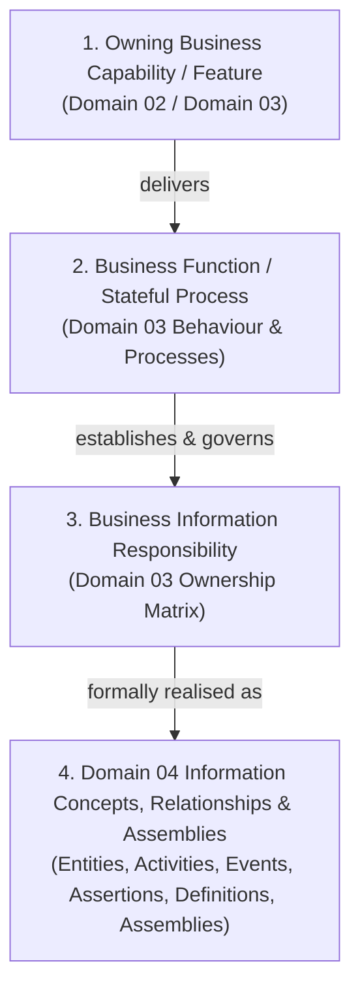
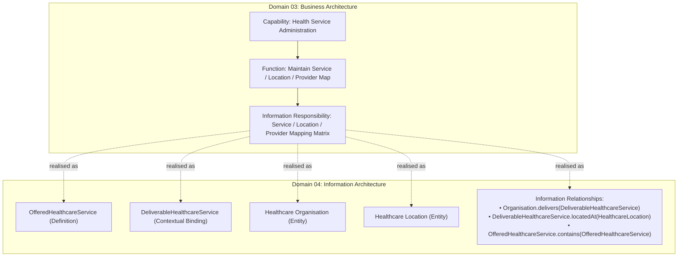

# Domain 03 to Domain 04 Traceability Framework

## 1. The Four-Tier Derivation Framework

The Information Architecture (Domain 04) is derived systematically from the business semantics established in the Business Architecture (Domain 03).

Every Information Concept, Relationship, and Assembly traces upward through a canonical four-tier derivation chain:

```text
1. Business Capability / Feature (Domain 02 / Domain 03)
      ↓ delivers
2. Business Function / Process (Domain 03)
      ↓ establishes
3. Business Information Responsibility (Domain 03 Matrix)
      ↓ realised as
4. Domain 04 Information Concepts, Relationships & Assemblies
```



### 1.1 Traceability Principles
1. **Derivation, Not Redefinition**: Domain 04 does not invent new business capabilities or alter the ownership boundaries established in Domain 03.
2. **Purity of Information Responsibilities**: The Business Information Responsibility matrix (`docs/markdown/03-business-architecture/information-responsibility/information-responsibility.md`) is the authoritative source for architectural information responsibilities. Architectural information responsibility is a capability property and is distinct from the governance role of `Information Steward`.
3. **Bounded Responsibility Derivation**: Information Concepts for which Harmonia claims architectural responsibility SHALL trace to an owning Domain 03 Information Responsibility. Referenced, consumed, externally authoritative or contextual Information Concepts may be represented where required to discharge a traced Harmonia responsibility, but SHALL NOT thereby acquire Harmonia ownership or authority.

---

## 2. Representative Derivation Examples

The following representative examples demonstrate how Domain 03 capabilities, functions, and information responsibilities realise concrete Domain 04 Information Concepts, Relationships, and Assemblies:

### 2.1 Representative Example 1: Health Service Administration (Mandatory Reference)

```text
Health Service Administration (Capability / Feature: Service-Location-Provider Binding)
    ↓ delivers
Maintain Service / Location / Provider Map (Function)
    ↓ establishes
Service / Location / Provider Mapping Matrix (Information Responsibility)
    ↓ realised as
OfferedHealthcareService (Definition)
DeliverableHealthcareService (Contextual Binding)
Service Provider / Healthcare Organisation (Entity)
Healthcare Location (Entity)
Service-Provider-Location Relationships & Qualified Containment
```



### 2.2 Representative Example 2: Person Identity Administration

```text
Person Identity (Capability / Feature: Cross-Authority Identifier Correlation)
    ↓ delivers
Correlate Person Identifiers (Function)
    ↓ establishes
Person Identity Record, Identifier Namespace Bindings, Cross-Authority Correlation Graph (Information Responsibility)
    ↓ realised as
Person (Entity)
Identifier Namespace Binding (Assertion)
Cross-Authority Correlation Link (Relationship with Qualification & Authority)
```

### 2.3 Representative Example 3: Clinical Order Administration

```text
Order Administration (Capability / Feature: Closed-Loop Order Status Tracking)
    ↓ delivers
Track Order Fulfilment Status (Function)
    ↓ establishes
Clinical Order Record, Order Status History, Order-Result Reconciliation Binding (Information Responsibility)
    ↓ realised as
Order (Associated Direction Mechanism)
Order Routing Directive (Assertion / Instruction)
Order-Result Correlation Link (Relationship with Provenance & Status)
```

---

## 3. Scope Boundary for Detailed Model Population

This foundation establishes the canonical derivation mechanism and validates it through representative references.

> **Scope Note**: Full, detailed derivation across all 110 atomic business enabling capabilities and the complete Domain 03 Business Information Responsibility matrix remains reserved for subsequent, dedicated Domain 04 modelling packages.
