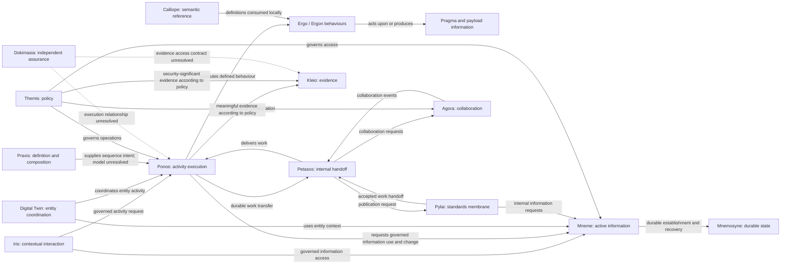

<!-- Copyright (c) 2026 Mark Hunter. Licensed under GPL-3.0-or-later. -->

# Harmonia Candidate Information Systems Architecture — System Map

**Standing: reconstructed candidate; [Step 1 boundary](README.md) applies.**
The map groups documented responsibilities and preserves named constructs. It
does not prescribe deployment, map upstream capabilities or select an MVP.
Components are detailed in the [register](component-register.md); source keys
resolve through [Sources](sources.md).

## Structural hierarchy

The following is a software responsibility map. “Grouping” identifies a
documented solution grouping without assigning it additional semantic or
operational authority. “Slice” denotes a documented responsibility area within
a component, not an approved separate process or service. Leaves called
“construct” or “Data Object” are significant contained constructs, not all
independently executable components.

```text
Harmonia Information System — candidate software solution
  Calliope — semantic definitions, shared models and conversion support [C01]
    Canonical model / schema / terminology-binding support
    Event, payload, reason and topic definitions (Data Objects)
    HL7/FHIR converter support
  Themis — policy and authorization [C02]
    Policy evaluation and security contracts
    Security-decision evidence production (not durable evidence ownership)
  Kleio — meaningful audit and provenance evidence [C03]
    Detailed internal decomposition unresolved
  Hestia — documented information-management/preservation grouping
    Mneme — governed active information access and coordination [C09]
      Governed read/write and observation/coordination services [C11]
      Active representations and working definitions (Data Objects)
    Mnemosyne — authoritative durable establishment/preservation [C12]
      Clinical/FHIR persistence responsibility slice
      Non-FHIR operational persistence responsibility slice
  Energeia — documented activity/execution grouping
    Ponos — governed activity execution and progression [C04]
      Ingress dispatch / sequence resolution / execution control
    Ergo / Ergon / Erga — defined activity behaviours [C05]
      Transformation, validation, distribution and registry change activities
    Praxis — workflow definition/composition/execution design area [C06]
      Definition loader / seeder / composition / checkpoint support
      Exact definition-to-instance model unresolved
    Pragma — task/context/progression carrier construct [C07]
      Payload or payload references / checkpoints / destination status
      Representation for distinct work and undertaking meanings remains candidate
  Petasos — internal messaging and recoverable handoff [C10]
    Producer/consumer/destination contracts
    Opaque envelope, duplicate detection and transport observation support
  Pylai — standards-facing interoperability/publication membrane [C14]
    Inbound HL7 interaction responsibility slice
    Outbound HL7 publication/delivery-observation slice
    FHIR registry interaction responsibility slice
  Iris — contextual human interaction [C15]
    Clinical viewer [C16]
    Operations console [C16]
    Administration / provider self-service views [C16]
    Backend-for-frontend mediation [C17]
    Shared presentation/design-system support
  Agora — governed collaboration [C18]
    Identity and collaboration-context mapping
    Space/room lifecycle and membership reconciliation
    Collaboration event/transaction ingress and messaging handoff
    Protocol adapter encapsulation (implementation support)
```

Hestia and Energeia composition is explicitly described in
[L09/L10/L23](sources.md#l09) and [L01–L05](sources.md#l01); it is not inferred
from Maven parents. Their constituent meanings remain separate. Clinical and
operations persistence slices follow documented information responsibilities
in L09/L10, not the database topology. Iris's presentation/mediation distinction
is documented in [L11/L23](sources.md#l11). Agora's functional slices follow
[L12](sources.md#l12), not a promotion of its four Maven modules.

The following do not have a supported structural parent in that tree:

| Construct / solution area | Representation and standing |
| :--- | :--- |
| **PragmaFactory [C08]** | Candidate logical embodiment of ActionableTaskArchetype under [U01](sources.md#u01). No documented allocation to Calliope, Praxis or Ponos is established. |
| **Digital Twin [C19]** | Entity-specific coordination construct across Mneme/Ponos; not a third execution engine, resource, table or independent platform component. [A02](sources.md#a02). |
| **Dokimasia / Assurance Praxis [C20]** | Candidate independent assurance framework and actual assurance activity. Approved conceptual boundary; execution/control placement and relation to Ponos remain unresolved. [A04/L31](sources.md#a04). |
| **Provider Registry [C13]** | Documented cross-component application collaboration spanning Pylai, Themis, Petasos, Ponos/Praxis/Erga, Mneme/Mnemosyne and Iris; not automatically a new enclosing subsystem. [L15](sources.md#l15). |
| **Operator/developer support [C22]** | Documented CLI, activity/sequence authoring, shared design support and telemetry contracts. Tools retain association with their target components; no invented common platform subsystem. [L19/L21/L23](sources.md#l19). |
| **Media Server / runtime terminology service** | No sufficiently defined component boundary found. DocumentReference and binary payloads, compiled bindings and proposed terminology services are retained in the data/features views; named server allocation remains unknown. [L17/L19/L27](sources.md#l17). |

**Paradeigma [C21]** is associated simulation/verification support, outside the
production collaboration hierarchy. Its documented PAS, EMR, LMS, RIS-PAC,
scenario, synthetic-generator/fault-injection and verification responsibilities
are retained. It exercises production interfaces; production components must
not depend on it. Its “digital twins of external applications” wording does not
establish Harmonia Digital Twin archetypes. [L22](sources.md#l22), AGENTS Invariant 1.

## Collaboration map

Arrows describe responsibilities crossing a seam, not containment, mandatory
network hops, exact APIs, or one synchronous sequence. Dotted arrows are
explicitly incomplete candidate relationships. Themis and Kleio participation
applies across governed boundaries; the diagram does not require all activity
to pass through one central runtime service.



| Relationship | Documentary basis and limit |
| :--- | :--- |
| Mneme persists through / recovers from Mnemosyne | A01 AX-05, A02 Seam 1; L13 ADR-018/019. Active state is reconstructable; cache acceptance is not durable establishment. |
| Ponos uses Praxis, executes Erga, carries Pragma | L01–L05/L18/L19. The collaboration is supported; legacy “four tiers” is not four levels of structural containment. |
| PragmaFactory logically embodies archetype | U01. Creator, execution placement and persistence contract are unknown. No automatic Praxis equivalence. |
| Twin coordinates across access/execution | A02 Seams 2–3. Entity-related execution SHOULD use Twin coordination unless explicitly justified otherwise; detailed control/state contract unknown. |
| Components use Themis and produce Kleio evidence | A01 AX-07–09; L08/L13 ADR-013/016. Evaluation, production, preservation and assurance assessment are separate responsibilities. |
| Ingress / execution / publication use Petasos handoffs | L13 ADR-014/017, L29/L30. Messaging is opaque; work acceptance, state commit, activity completion and external acknowledgement remain distinct. |
| Agora coordinates with execution through Petasos | AGENTS Invariant 10; L12 §3. No direct Agora-to-Ponos dependency. A detailed information-summary/provider contract is not established. |
| Pylai publishes governed information externally | A01 AX-02/13 and A02 Seams 4/G4. Projection is non-destructive and fail-closed; egress ends management of the emitted representation. Transport packaging does not transfer logical ownership. |

## Preserved model boundaries

The [Task/Pragma candidate](README.md#task-decisions) preserves work versus
undertaking even where both use Pragma. Ergon is behaviour and acquires no
discrete Information Resource. Blueprint, composed behaviour and actual Praxis
execution remain distinguishable where their relationship is unknown. Evidence
does not itself constitute assurance; Dokimasia does not manage its operational
subject. Information custody, active management, durable persistence and domain
authority are not aliases. These limits apply to every source-derived feature
and relationship, with unresolved cases recorded in [CDG](gaps.md).
