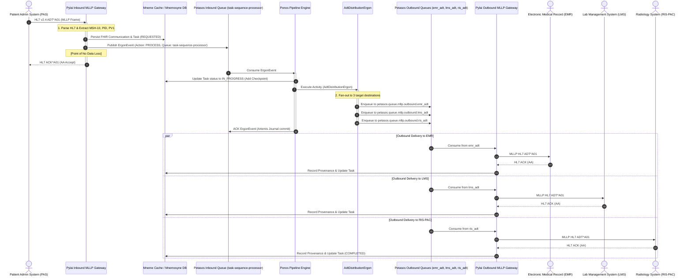
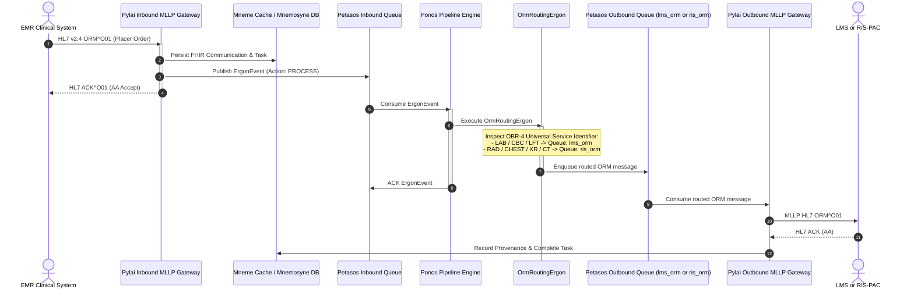
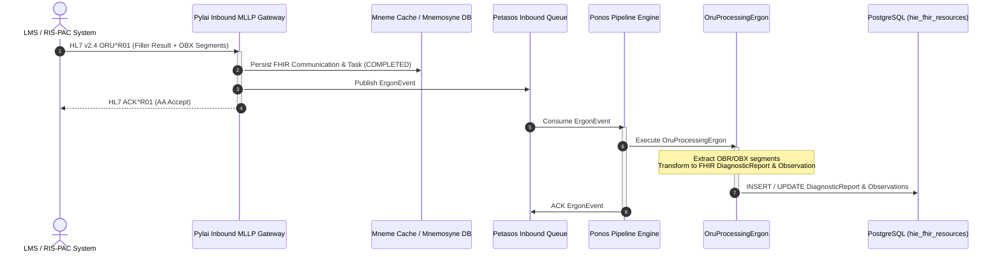
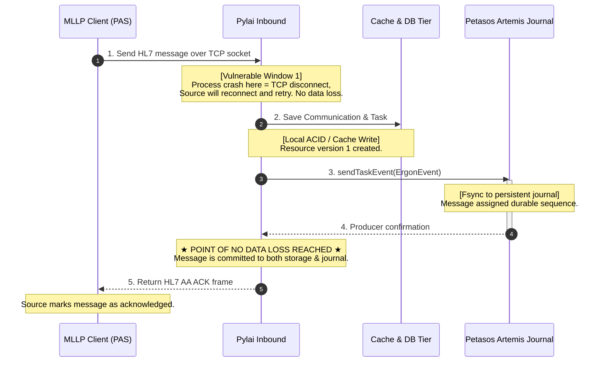

# Harmonia Message Lifecycle & Transaction Boundaries

## 1. Overview

This document provides end-to-end tracing, sequence diagrams, transaction boundary definitions, and dual-write failure analyses for the three primary clinical integration flows within Harmonia:
1. **PAS ADT Distribution Flow**: Inbound HL7 ADT fan-out to EMR, LMS, and RIS-PAC.
2. **EMR ORM Routing Flow**: Inbound HL7 ORM order routing to LMS (Lab) or RIS-PAC (Radiology) based on OBR-4 Universal Service Identifier.
3. **LMS / RIS-PAC ORU Processing Flow**: Inbound HL7 ORU clinical observation result ingestion, FHIR transformation, and durable persistence.

---

## 2. End-to-End Clinical Message Flows

### 2.1 ADT Multi-Destination Fan-Out Flow (PAS -> EMR / LMS / RIS-PAC)



---

### 2.2 ORM Deterministic Order Routing Flow (EMR -> LMS / RIS-PAC)



---

### 2.3 ORU Observation Result Ingestion Flow (LMS / RIS-PAC -> Harmonia Store)



---

## 3. Persistence Timeline & Point of No Data Loss



---

## 4. Transaction Boundaries

| Stage | Operation | Component | Transaction Type | Commit / ACK Point | Rollback Action |
| :--- | :--- | :--- | :--- | :--- | :--- |
| **Inbound Stage 1** | HL7 Message Parse & Validation | `IncomingAdtMessageProcessor` | None (In-memory) | N/A | Return HL7 `AR` (Reject) |
| **Inbound Stage 2** | Resource Creation | `FhirStorageService` / `TaskCacheService` | Spring `@Transactional` (PostgreSQL) / HotRod Put | DB Commit upon method exit | Return HL7 `AE` (Error) |
| **Inbound Stage 3** | ErgonEvent Enqueue | `TaskEventProducerService` | Artemis JMS Producer Session | Broker Journal Write | Log Warning (See Dual-Write Analysis) |
| **Inbound Stage 4** | Protocol Acceptance | `IncomingAdtMessageRouteBuilder` | MLLP Socket Protocol | Send HL7 `AA` ACK Frame | Client TCP Retries |
| **Execution Stage 1** | Consume TaskEvent | `TaskProcessorRouteBuilder` | Camel / JMS Client ACK Mode | Received into memory | Redelivered after unacked timeout |
| **Execution Stage 2** | Task Mutation & Routing | `ErgonBase` (`AdtDistributionErgon`) | Cache Mutation & JMS Outbound Produces | Multiple JMS queue puts | Artemis redelivery if worker crashes |
| **Execution Stage 3** | Completion ACK | `PetasosQueueToExchangeConduit` | JMS Message ACK | Artemis Journal records consumption | Unacked message redelivered |
| **Outbound Stage 1** | Outbound Dispatch | `OutboundMllpProcessor` | MLLP Socket Transaction | Await Remote HL7 `AA` ACK | Camel retry policy (backoff + DLQ) |
| **Outbound Stage 2** | Provenance Record | `OutboundStateLifecycleManager` | JPA Transaction | DB Commit | Log warning |

---

## 5. Dual-Write Failure Analysis

In the inbound gateway (`IncomingAdtMessageProcessor`, `IncomingOrmMessageProcessor`, `IncomingOruMessageProcessor`), two distinct external systems are updated sequentially without a distributed two-phase commit (2PC / XA):

```
       Step 1: Write DB / Cache        Step 2: Publish Artemis Queue
      ┌─────────────────────────┐     ┌─────────────────────────────┐
      │   Task / Communication  │     │       ErgonEvent to         │
      │   saved in PostgreSQL   │────►│   task-sequence-processor   │
      └─────────────────────────┘     └─────────────────────────────┘
```

### 5.1 Failure Window 1: DB Commit Succeeds, Artemis Publish Fails
* **Scenario**: The FHIR `Task` and `Communication` are successfully committed to PostgreSQL / Infinispan, but the network connection to Apache ActiveMQ Artemis times out or throws an exception during `taskEventProducerService.sendTaskEvent(event)`.
* **Observed Implementation Behavior**: The exception is caught and logged (`log.warn("Could not dispatch TaskEvent...")`), and an HL7 `AA` ACK is returned to the sending system.
* **Risk**: The clinical source believes Harmonia has accepted the message, but no event exists in the Artemis queue to drive Ponos workflow execution. The task remains in `REQUESTED` status indefinitely unless recovered.
* **Remediation / Gap Reference**: Documented as **REC-001 (Dual-Write Outbox Gap)** in `docs/persistence-recovery-gaps.md`. Requires implementing a transactional outbox table or failing the inbound HL7 transaction with an `AE` NACK so the sender retries.

### 5.2 Failure Window 2: Outbound MLLP Delivery Succeeds, Completion Event Fails
* **Scenario**: `OutboundMllpProcessor` successfully sends an ADT message to EMR and receives an `AA` ACK. In `OutboundStateLifecycleManager`, recording `Provenance` or dispatching the completion event to Petasos throws an exception.
* **Observed Implementation Behavior**: The exception is caught and logged; the remote system has received the clinical data, but the local Task execution log may not reflect the completed state.
* **Mitigation**: The consumer queue message is acknowledged after dispatch, preventing duplicate message transmission to the destination.
