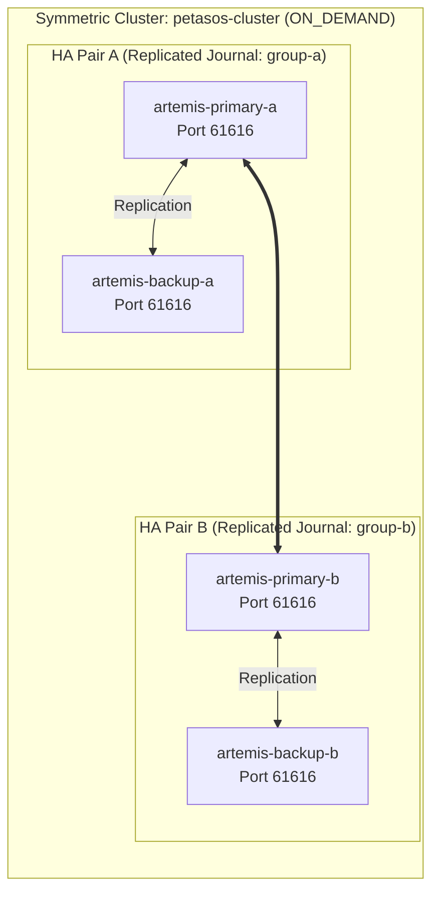

# Apache ActiveMQ Artemis 2.33.0 Messaging Topology `[IMPLEMENTED]`

ActiveMQ Artemis provides the distributed, high-availability messaging backbone for Petasos transport.

---

## 1. 4-Broker Clustered HA Topology

Harmonia operates four Artemis broker instances organized into two HA pairs connected via server-side clustering. All brokers communicate over a single port (`61616`):



- **Journal Replication**: Synchronous network replication of NIO journal files between Primary and Backup within each HA pair.
- **Failover Mechanics**: If Primary A process crashes, Backup A detects heartbeat loss and immediately transitions to `LIVE` status, taking over journal processing.
- **Load Balancing**: Cluster connection uses `ON_DEMAND` message distribution with `redistribution-delay: 0` to prevent message starvation across nodes.
- **Single Port**: All cluster communication (client connections, replication, cluster discovery) occurs over port `61616`; no separate replication ports are configured.

---

## 2. Storage Directory Separation

To prevent split-brain and lock corruption, Artemis brokers never share filesystem directories. Each pod mounts an isolated PersistentVolume:
- `./data/journal`: Active write journal records.
- `./data/bindings`: Queue configuration and routing bindings.
- `./data/paging`: On-disk paging files for memory threshold protection.
- `./data/large-messages`: Large streaming payload storage.

---

## 3. Address & Queue Settings (`broker.xml`)

```xml
<address-settings>
   <address-setting match="#">
      <dead-letter-address>DLQ</dead-letter-address>
      <expiry-address>ExpiryQueue</expiry-address>
      <redelivery-delay>1000</redelivery-delay>
      <redelivery-delay-multiplier>1.5</redelivery-delay-multiplier>
      <max-delivery-attempts>3</max-delivery-attempts>
      <max-size-bytes>104857600</max-size-bytes>
      <page-size-bytes>10485760</page-size-bytes>
      <address-full-policy>PAGE</address-full-policy>
      <redistribution-delay>0</redistribution-delay>
   </address-setting>
</address-settings>
```

**Configuration Details**:
- **Address Match Pattern**: `match="#"` applies settings to all addresses.
- **Dead-Letter Queue**: Messages exceeding `max-delivery-attempts` are routed to the `DLQ` address.
- **Expiry Queue**: Messages exceeding their TTL are routed to the `ExpiryQueue` address.
- **Redelivery Policy**: Initial delay is `1000` ms; multiplier is `1.5`; maximum delivery attempts is `3`.
- **Paging**: When queue size exceeds `104857600` bytes (100 MB), messages are paged to disk in `10485760` byte (10 MB) chunks.

---

## 4. Middleware Capabilities: Used vs. Avoided

| Capability Dimension | Used / Relied Upon in Harmonia | Avoided / Excluded in Harmonia | Architectural Rationale |
| :--- | :--- | :--- | :--- |
| **Clustering Topology** | Clustered mesh (`ON_DEMAND` redistribution, discovery) | Static discovery via fixed XML IP lists only | Dynamic mesh avoids single points of failure across nodes. |
| **High Availability** | Replicated journal HA (`<replicated/>`) | Shared-store HA (NFS / SAN file lock clustering) | Eliminates shared storage controller bottlenecks and split-brain risks. |
| **Transport Protocol** | Artemis Core / Netty Protocol (port `61616`) with CORE, AMQP, OPENWIRE enabled | MQTT, STOMP, REST protocols | Core Netty transport is primary; AMQP and OpenWire are enabled for interoperability but not actively used. |
| **Broker Hosting** | Dedicated StatefulSet pods in Kubernetes | Embedded in-VM Artemis inside production apps | Isolates broker crashes and memory churn from business logic. |
| **Coordination** | Native Artemis cluster discovery protocol | Apache ZooKeeper / Consul | Reduces external operational dependencies and infrastructure overhead. |
| **Dead-Letter Handling** | Automatic DLQ (`DLQ` address) & Expiry (`ExpiryQueue` address) | Silent drops or infinite retries | Bounded retry (max 3 attempts) with dead-letter preservation guarantees zero message loss. |

---

## 5. Operational Verification

```bash
# 1. Check broker status and node clustering
kubectl exec -it artemis-primary-a-0 -n harmonia -- \
  /opt/activemq-artemis/bin/artemis check node

# 2. Inspect active queue depths and consumer counts
kubectl exec -it artemis-primary-a-0 -n harmonia -- \
  /opt/activemq-artemis/bin/artemis queue stat

# 3. Check specific task queue stats
kubectl exec -it artemis-primary-a-0 -n harmonia -- \
  /opt/activemq-artemis/bin/artemis queue stat --queue-name task.processing.queue

# 4. View active cluster connections
kubectl exec -it artemis-primary-a-0 -n harmonia -- \
  /opt/activemq-artemis/bin/artemis check cluster
```
