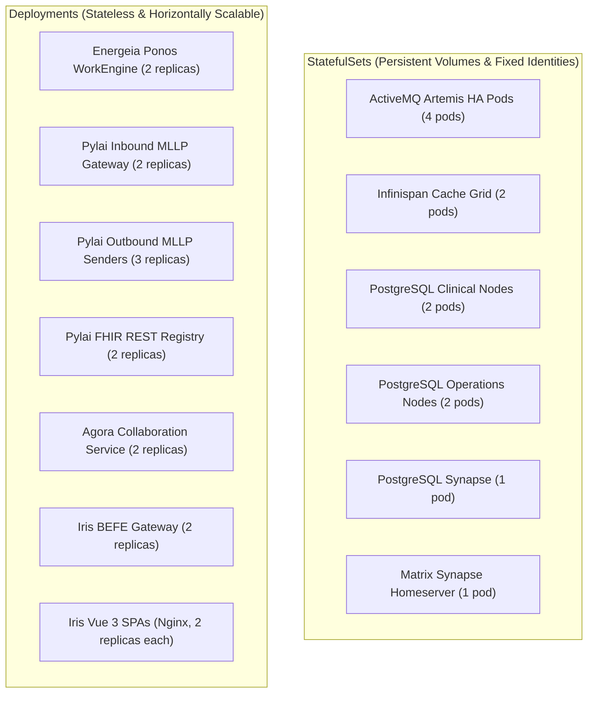

# Kubernetes & MicroK8s Infrastructure Architecture `[CONFIGURED]`

Kubernetes (specifically Canonical **MicroK8s v1.28+**) serves as Harmonia's container runtime, workload orchestrator, network fabric, and storage abstraction layer.

---

## 1. Workload Categorization & Topologies `[CONFIGURED]`

Harmonia partitions all system workloads strictly based on statefulness:



---

## 2. Headless Discovery Services `[CONFIGURED]`

To enable peer-to-peer clustering without hardcoded IP addresses or external consensus stores, Harmonia deploys Kubernetes Headless Services (`clusterIP: None`):

| Headless Service | Namespace | Bound StatefulSet | Cluster Discovery Protocol |
| :--- | :--- | :--- | :--- |
| `infinispan-service` | `harmonia` | `infinispan-1`, `infinispan-2` | JGroups TCPPING / DNS_PING (port `7800`) |
| `artemis-discovery` | `harmonia` | `artemis-primary-a`, `artemis-primary-b` | Artemis Netty cluster auto-discovery |
| `postgres-cluster` | `harmonia` | `postgres-clinical-1`, `postgres-clinical-2` | PostgreSQL internal replication discovery |

---

## 3. Persistent Storage Mappings (PVCs) `[CONFIGURED]`

Stateful components declare dedicated `PersistentVolumeClaim` templates backed by the `microk8s-hostpath` storage class:

| Workload Pod | PVC Name Template | Mount Path | Storage Capacity | Access Mode |
| :--- | :--- | :--- | :--- | :--- |
| `artemis-primary-a-0` | `artemis-data-a` | `/var/lib/artemis/data` | `10Gi` | `ReadWriteOnce` |
| `artemis-backup-a-0` | `artemis-data-backup-a` | `/var/lib/artemis/data` | `10Gi` | `ReadWriteOnce` |
| `infinispan-1-0` | `ispn-data-1` | `/opt/infinispan/server/data` | `5Gi` | `ReadWriteOnce` |
| `postgres-clinical-1-0` | `postgres-clinical-data` | `/var/lib/postgresql/data` | `10Gi` | `ReadWriteOnce` |
| `postgres-ops-1-0` | `postgres-ops-data` | `/var/lib/postgresql/data` | `10Gi` | `ReadWriteOnce` |
| `postgres-synapse-0` | `postgres-synapse-data` | `/var/lib/postgresql/data` | `5Gi` | `ReadWriteOnce` |
| `synapse-0` | `synapse-media-data` | `/data` | `5Gi` | `ReadWriteOnce` |

---

## 4. Health & Liveness Probe Disciplines `[CONFIGURED]`

Harmonia avoids synthetic or superficial probe definitions. Every container is equipped with an empirically verified probe:

| Component | Probe Type | Check Mechanism | Initial Delay | Timeout | Period |
| :--- | :--- | :--- | :--- | :--- | :--- |
| **Artemis** | Liveness & Readiness | TCP Socket on port `61616` | 30s | 5s | 10s |
| **Infinispan** | Liveness & Readiness | HTTP GET `http://localhost:11222/rest/v2/cache-managers/default/health/status` | 20s | 3s | 10s |
| **PostgreSQL** | Liveness & Readiness | Exec `pg_isready -U fhir_user -h 127.0.0.1` | 15s | 5s | 10s |
| **Pylai MLLP** | Liveness & Readiness | TCP Socket on port `2575` & HTTP GET `/health` | 20s | 3s | 10s |
| **Iris BEFE** | Liveness & Readiness | HTTP GET `http://localhost:8090/api/operations/health` | 25s | 3s | 10s |
| **Synapse** | Liveness & Readiness | HTTP GET `http://localhost:8008/health` | 30s | 5s | 10s |

---

## 5. Deep Capability Exploitation: Used vs. Avoided `[IMPLEMENTED]`

| Capability Dimension | Used / Relied Upon in Harmonia | Avoided / Excluded in Harmonia | Architectural Rationale |
| :--- | :--- | :--- | :--- |
| **Workload Abstraction**| Standard StatefulSets & Deployments | Custom Operators / CRDs | Eliminates operator lifecycle bugs and custom controller runtime overhead. |
| **Networking Fabric** | Native Kube-DNS & Headless Services | Heavy Service Meshes (Istio, Linkerd) | Service meshes add latency, CPU overhead, and sidecar proxy certificate rot. |
| **Ingress Controller** | Traefik / Nginx Ingress with TLS termination | Multi-cloud dynamic ingress controllers | Standard ingress provides predictable path routing and stable TLS certificates. |
| **Configuration** | Native ConfigMaps & Kubernetes Secrets | External HashiCorp Vault sidecar injectors | Direct Secret mounting simplifies local MicroK8s deployments. |
| **Storage Class** | HostPath / Local PV with direct ext4 bind mounts | Distributed Ceph / Rook / GlusterFS | Eliminates distributed network storage replication latency for write-intensive databases. |

---

## 6. Operational Cluster Verification `[IMPLEMENTED]`

```bash
# 1. Verify status of all pods across harmonia namespace
kubectl get pods -n harmonia -o wide

# 2. Check PVC binding states
kubectl get pvc -n harmonia

# 3. Verify headless service endpoints
kubectl get endpoints -n harmonia

# 4. Check node resource utilization
kubectl top nodes
kubectl top pods -n harmonia
```
