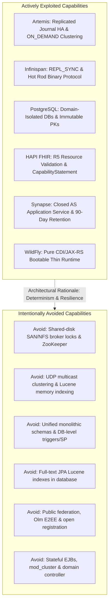

# Harmonia Middleware Architecture Overview `[IMPLEMENTED]`

Harmonia relies on an enterprise-grade middleware foundation providing high-availability messaging, in-memory caching, relational persistence, standard healthcare data models, collaboration messaging, and Jakarta EE application hosting.

Rather than adopting a monolithic middleware stack, Harmonia follows a **deep capability exploitation** strategy: selecting proven open-source middleware technologies, strictly circumscribing the specific features utilized, and explicitly avoiding problematic capabilities that introduce single points of failure, non-deterministic latency, or operational complexity.

---

## 1. Middleware Stack Inventory `[IMPLEMENTED]`

| Middleware Component | Version | Subsystem Binding | Transport Protocol | Default Port(s) | Primary Responsibility |
| :--- | :--- | :--- | :--- | :--- | :--- |
| **Apache ActiveMQ Artemis** | `2.33.0` | Petasos Transport | Netty Core / JMS 3.1 | `61616` (Primary A), `61618` (Primary B) | Clustered HA messaging backbone with replicated journals |
| **Infinispan** | `15.0.3.Final` | Hestia (Mneme) | Hot Rod Binary RPC / JGroups TCP | `11222` (Hot Rod), `7800` (JGroups) | Distributed in-memory data grid and task cache |
| **PostgreSQL** | `16-alpine` | Hestia (Mnemosyne) | PostgreSQL Wire Protocol | `5432`-`5433` (Clinical), `5434`-`5435` (Operations) | Authoritative relational persistence and immutable audit history |
| **HAPI FHIR R5 JPA** | `7.2.0` | Mnemosyne Clinical | HTTP / REST (`application/fhir+json`) | `8080` (Internal REST) | Standard FHIR R5 storage engine and Provider Registry |
| **Matrix Synapse** | `1.120.0` | Agora Collaboration | Matrix Client-Server & AS API | `8008` (HTTP API), `5436` (Synapse DB) | Internal clinical collaboration, Patient Spaces & event stream |
| **WildFly Application Server** | `31.0.1.Final` | Iris Presentation & Ponos | HTTP REST / Management CLI | `8080` (Clinical), `8090` (Ops), `9990` (Mgmt) | Jakarta EE 10 lightweight runtime (CDI 4.0, JAX-RS 3.1) |
| **Kubernetes (MicroK8s)** | `1.28+` | Infrastructure Layer | Kubernetes API / Kubelet | `6443` (K8s API), `10250` (Kubelet) | Container orchestration, StatefulSets, PVCs, and health probes |

---

## 2. Deep Capability Exploitation: Used vs. Avoided Summary `[IMPLEMENTED]`

---

## 3. Storage Separation & Isolation Disciplines `[CONFIGURED]`

Harmonia prevents cross-subsystem cascading failures through physical and logical storage separation:

1. **Artemis Journal Separation**: Each broker pod mounts its own dedicated PersistentVolume for journal, bindings, paging, and large messages. Shared storage locks are strictly prohibited.
2. **PostgreSQL Database Separation**:
   - `fhir_node_1` / `fhir_node_2` (ports `5432`/`5433`): Clinical FHIR data and Provider Registry.
   - `ops_node_1` / `ops_node_2` (ports `5434`/`5435`): Operational workflow telemetry and task lineage.
   - `synapse_db` (port `5436`): Matrix collaboration chat and room metadata.
3. **Infinispan Cache Partitioning**: Seventeen replicated caches comprise fourteen clinical FHIR resource caches and three operations caches, all using `text/plain` encoding and write-behind stores; Petasos duplicate detection remains in-memory (`DuplicateDetector`), not an Infinispan cache.

---

## 4. Middleware Guides Directory `[IMPLEMENTED]`

Explore the dedicated technical profiles for each middleware component:

- [**Apache ActiveMQ Artemis 2.33.0**](activeMQ-artemis.md): Clustered 4-broker HA mesh, replicated journal, and paging configuration.
- [**Infinispan 15.0.3 Cache Grid**](infinispan.md): Hot Rod protocol, JGroups discovery, write-behind SPI, and cache definitions.
- [**PostgreSQL 16 Relational Persistence**](postgresql.md): Domain database isolation, versioned composite primary keys, and HikariCP connection tuning.
- [**HAPI FHIR R5 JPA Engine**](hapi-fhir.md): RESTful server architecture, Provider Registry validation, and persistence mapping.
- [**Matrix Synapse 1.120.0 Homeserver**](matrix-synapse.md): Closed collaboration perimeter, Application Service integration, and 90-day retention policies.
- [**WildFly 31.0.1 Runtime**](wildfly.md): Jakarta EE 10 profile, CDI/JAX-RS BEFE gateway, and dual-port separation.
- [**Kubernetes Infrastructure Layer**](kubernetes.md): StatefulSets, Headless Services, PersistentVolumeClaims, and liveness/readiness probes.
