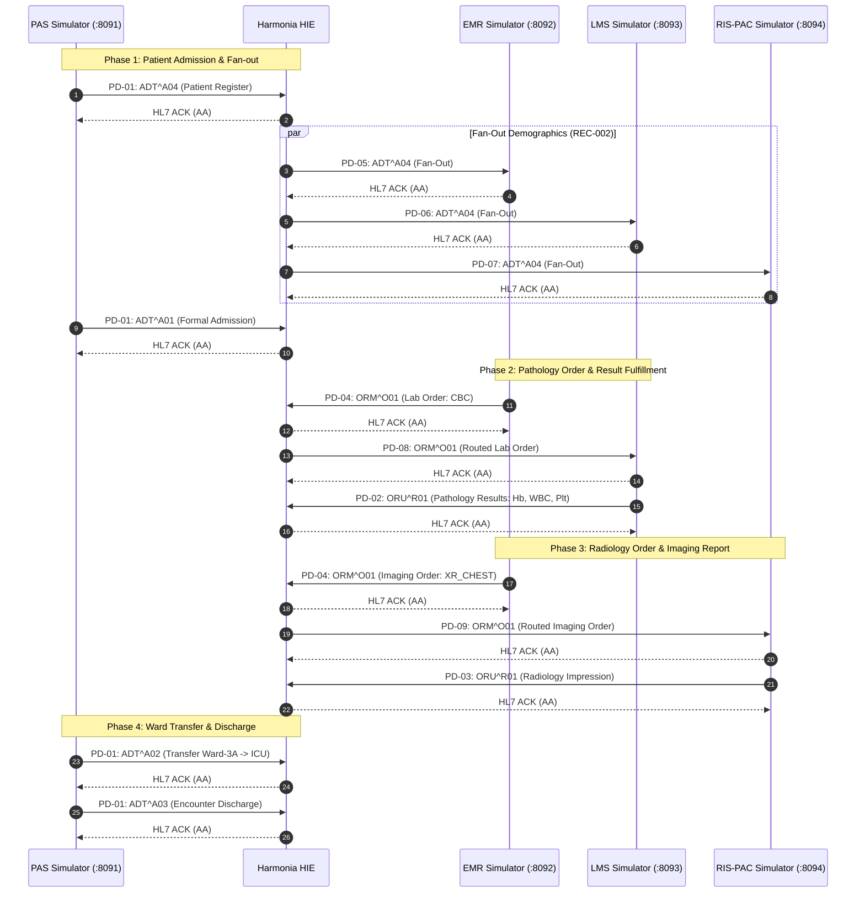

# Paradeigma Architecture & Component Specifications `[IMPLEMENTED]`

This document specifies the technical architecture, leaf module internals, wire interface catalogue (PD-01 through PD-09), and clinical sequence workflows of the Paradeigma synthetic simulation framework.

---

## 1. Subsystem Module Decomposition `[IMPLEMENTED]`

Paradeigma is organized across 7 specialized Maven leaf modules under `paradeigma/`:

```
paradeigma/
├── paradeigma-common/      # Core seed random generators, HL7 builders, MLLP codecs, fault injectors, probes
├── paradeigma-pas/         # Patient Administration System simulator (ADT PD-01)
├── paradeigma-emr/         # Electronic Medical Record simulator (ORM PD-04, ADT Inbound PD-05)
├── paradeigma-lms/         # Laboratory Management System simulator (ORU PD-02, ADT PD-06, ORM PD-08)
├── paradeigma-rispac/      # Radiology & PACS simulator (ORU PD-03, ADT PD-07, ORM PD-09)
├── paradeigma-scenarios/   # Multi-system scenario orchestrator & REST management API
└── paradeigma-test/        # Automated integration test suite, failure recovery & ArchUnit guardrails
```

### Module Responsibilities & Technologies

| Module | Core Classes / Components | Technologies & Frameworks | Port Bindings |
| :--- | :--- | :--- | :--- |
| **`paradeigma-common`** | `SeedRandom`, `SyntheticPatientGenerator`, `SyntheticOrderGenerator`, `SyntheticResultGenerator`, `SyntheticProviderRegistryGenerator`, `MllpServer`, `MllpClient`, `MllpFrameCodec`, `FailureSimulator`, `PhiLogTestProbe`, `SecretLeakageAssertion` | Java 21, HAPI FHIR R5, HAPI HL7 v2, Netty, Logback | N/A (Shared Library) |
| **`paradeigma-pas`** | `PasApplication`, `PasRestController`, `PasService`, `PasScheduler`, `PasPatientLifecycleManager` | Spring Boot 3.2, Netty MLLP client | HTTP `8091` (REST Management), MLLP `2101` (Egress to Harmonia) |
| **`paradeigma-emr`** | `EmrApplication`, `EmrRestController`, `EmrService`, `EmrPatientManager`, `EmrScheduler`, `EmrMllpListener` | Spring Boot 3.2, Netty MLLP client & server | HTTP `8092` (REST), MLLP `2104` (Egress), MLLP `2201` (Ingress Fan-Out) |
| **`paradeigma-lms`** | `LmsApplication`, `LmsRestController`, `LmsService`, `LmsResultWorker`, `LmsMllpListener` | Spring Boot 3.2, Netty MLLP client & server | HTTP `8093` (REST), MLLP `2102` (Egress), MLLP `2202` (ADT Ingress), MLLP `2204` (ORM Ingress) |
| **`paradeigma-rispac`**| `RispacApplication`, `RispacRestController`, `RispacService`, `RispacResultWorker`, `RispacMllpListener`| Spring Boot 3.2, Netty MLLP client & server | HTTP `8094` (REST), MLLP `2103` (Egress), MLLP `2203` (ADT Ingress), MLLP `2205` (ORM Ingress) |
| **`paradeigma-scenarios`**| `ScenariosApplication`, `ScenariosRestController`, `ParadeigmaScenarioEngine`, `PatientJourneyScenario` | Spring Boot 3.2, RestClient / WebClient | HTTP `8090` (REST Scenario Management) |
| **`paradeigma-test`** | `EndToEndPatientJourneyTest`, `FailureRecoveryTest`, `RecoveryAcceptanceTest`, `ThemisDefenceInDepthAcceptanceTest`, `ParadeigmaIsolationArchitectureTest`, `AgoraIsolationArchitectureTest` | JUnit 5, AssertJ, ArchUnit 1.3, Spring Boot Test | Test Execution Runtime |

---

## 2. Interface Catalogue: PD-01 through PD-09 `[IMPLEMENTED]`

All clinical interactions between Paradeigma simulators and Harmonia utilize standard HL7 v2.x over TCP using MLLP wire framing:

| Interface ID | Interface Name | Source System | Destination System | HL7 Trigger Events | MLLP Port | Traffic Flow |
| :--- | :--- | :--- | :--- | :--- | :--- | :--- |
| **PD-01** | PAS-ADT-IN | PAS Simulator (`paradeigma-pas`) | Harmonia Pylai Inbound | `ADT^A01`, `A02`, `A03`, `A04`, `A08`, `A11`, `A12`, `A13` | `2101` / `2575` | Inbound Ingress |
| **PD-02** | LMS-ORU-IN | LMS Simulator (`paradeigma-lms`) | Harmonia Pylai Inbound | `ORU^R01` (Pathology Observations) | `2102` / `2575` | Inbound Ingress |
| **PD-03** | RISPAC-ORU-IN | RIS-PAC Simulator (`paradeigma-rispac`) | Harmonia Pylai Inbound | `ORU^R01` (Diagnostic Imaging Reports) | `2103` / `2575` | Inbound Ingress |
| **PD-04** | EMR-ORM-IN | EMR Simulator (`paradeigma-emr`) | Harmonia Pylai Inbound | `ORM^O01` (Lab & Imaging Orders) | `2104` / `2575` | Inbound Ingress |
| **PD-05** | EMR-ADT-OUT | Harmonia Pylai Outbound | EMR Simulator (`paradeigma-emr`) | `ADT` (Encounter Broadcast) | `2201` | Outbound Fan-Out |
| **PD-06** | LMS-ADT-OUT | Harmonia Pylai Outbound | LMS Simulator (`paradeigma-lms`) | `ADT` (Encounter Broadcast) | `2202` | Outbound Fan-Out |
| **PD-07** | RISPAC-ADT-OUT | Harmonia Pylai Outbound | RIS-PAC Simulator (`paradeigma-rispac`) | `ADT` (Encounter Broadcast) | `2203` | Outbound Fan-Out |
| **PD-08** | LMS-ORM-OUT | Harmonia Pylai Outbound | LMS Simulator (`paradeigma-lms`) | `ORM^O01` (Routed Lab Order) | `2204` | Outbound Routing |
| **PD-09** | RISPAC-ORM-OUT | Harmonia Pylai Outbound | RIS-PAC Simulator (`paradeigma-rispac`) | `ORM^O01` (Routed Imaging Order)| `2205` | Outbound Routing |

---

## 3. Wire Protocol & MLLP Framing `[IMPLEMENTED]`

All MLLP interfaces operate strictly under standard HL7 Minimal Lower Layer Protocol framing:

```
+----------+----------------------------------------------------+----------+----------+
|  0x0B    |                  HL7 Message Text                  |   0x1C   |   0x0D   |
|  (<VT>)  |                  (UTF-8 Encoded)                   |  (<FS>)  |  (<CR>)  |
+----------+----------------------------------------------------+----------+----------+
```

1. **Start Block**: Single byte `0x0B` (ASCII vertical tab `<VT>`).
2. **Payload**: Raw HL7 message text encoded in UTF-8. Lines terminate with single carriage return `0x0D` (`\r`).
3. **End Block**: Two-byte sequence `0x1C` (ASCII file separator `<FS>`) followed immediately by `0x0D` (ASCII carriage return `<CR>`).
4. **Synchronous Acknowledgement**:
   - Every transmission requires an immediate synchronous HL7 ACK response before the socket is released or next message sent.
   - `MSA-1` must indicate:
     - `AA`: Application Accept (message successfully ingested downstream).
     - `AE`: Application Error (validation failure; upstream sender must retry or inspect error).
     - `AR`: Application Reject (protocol or syntax violation; non-retryable fatal error).
   - `MSA-2` must mirror the inbound `MSH-10` message control ID.

---

## 4. End-to-End Clinical Journey Sequence `[IMPLEMENTED]`

The standard hospital patient journey coordinates all four simulators across Harmonia:



---

## 5. Governed Provider Registry Write Lifecycle `[IMPLEMENTED]`

Paradeigma tests the asynchronous **Request for Change** pattern on the Provider Registry:

```mermaid
sequenceDiagram
    autonumber
    participant Actor as Paradeigma (Provider Steward)
    participant Pylai as Pylai REST Gateway (:8080)
    participant Themis as Themis Security Engine
    participant Ponos as Ponos / Ergon Engine
    participant Mneme as Mnemosyne JPA Persistence
    participant PhiLog as Harmonia PhiLogger

    Actor->>Pylai: POST /fhir/r5/Practitioner (Bearer Token)
    Pylai->>Themis: Authorize Request (ThemisAction.CREATE)
    Themis-->>Pylai: ThemisDecision.ALLOW
    Pylai->>PhiLog: Diagnostic Ingress Trace (Marker PHI)
    Pylai-->>Actor: HTTP 202 Accepted (Location: /Task/{pragmaId}, X-Correlation-Id)

    Pylai->>Ponos: Dispatch Pragma (RECEIVED -> VALIDATING)
    Ponos->>Themis: Authorize Async Execution (Ergon Authority)
    Themis-->>Ponos: ThemisDecision.ALLOW
    Ponos->>Ponos: Validate HPI-I Identifier Checksum
    Ponos->>Ponos: Transition to APPROVED -> COMMITTING
    Ponos->>Mneme: Persist Practitioner v1
    Mneme-->>Ponos: Committed
    Ponos->>Ponos: Transition to COMPLETED

    Actor->>Pylai: GET /fhir/r5/Task/{pragmaId}
    Pylai-->>Actor: HTTP 200 OK (Task status=completed)
    Actor->>Pylai: GET /fhir/r5/Practitioner/{id}
    Pylai-->>Actor: HTTP 200 OK (Practitioner Resource)
```
