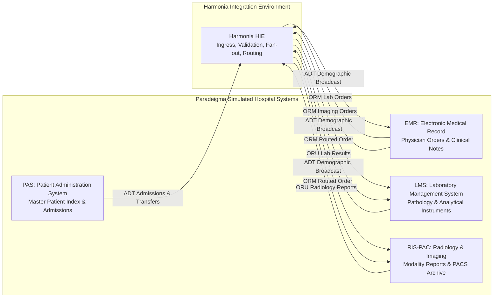

# Concept: Paradeigma `[IMPLEMENTED]`

Paradeigma is Harmonia's isolated, first-class synthetic clinical simulation subsystem, providing deterministic modeling of hospital information systems, clinical encounter trajectories, and chaotic failure modes.

---

## 1. Classical Metaphor & Etymology `[IMPLEMENTED]`

- **Greek Term**: *Παράδειγμα* (Paradeigma)
- **Etymology**: Ancient Greek neuter noun derived from the verb *παραδείκνυμι* (*paradeiknymi* — from *παρά* "beside" + *δείκνυμι* "to show, point out, exhibit").
- **Historical & Philosophical Context**: In classical Greek rhetoric and Platonic philosophy, a *paradeigma* is a model, pattern, exemplar, or archetype. In Plato's *Timaeus*, the Demiurge gazes upon an eternal, intelligible *paradeigma* (ideal blueprint) when shaping the physical cosmos. In Aristotelian rhetoric, a *paradeigma* is an inductive argument by exemplar or historical parallel. In modern science (via Thomas Kuhn), it became the root of "paradigm" — an overarching framework of thought.
- **Architectural Rationale**: Integration engines cannot be safely engineered against live clinical systems or unstable hospital staging environments. Paradeigma provides the ideal exemplar — an isolated, deterministic, mathematically reproducible clinical world against which Harmonia can be thoroughly tested, observed, stressed, and certified without risk to human life or clinical data integrity.

---

## 2. Core Architectural Principles `[IMPLEMENTED]`

1. **Deterministic Pseudorandomness**:
   - Every patient identity, clinical observation, encounter number, and timing offset is generated from seed-controlled pseudorandom number generators (`SeedRandom`).
   - Given the same seed (e.g. `42L`), Paradeigma produces bit-for-bit identical HL7 v2 frames and FHIR R5 bundles across all execution environments.
2. **Strict Production Isolation**:
   - Paradeigma is strictly a leaf module. Production modules never import or depend upon Paradeigma.
   - Production code contains zero `if (isSimulation)` flags or synthetic test bypasses.
3. **Public Contract Ingress**:
   - Simulators communicate with Harmonia exclusively across its public wire protocols: MLLP over TCP on ports `2101`-`2104` and `2575`, and FHIR REST over HTTP on port `8080`.
   - Harmonia processes synthetic messages through the exact same Netty pipelines, Themis security gates, Petasos queues, Ponos WorkEngines, and Mnemosyne storage as real clinical traffic.
4. **Resilience Validation via Fault Seams**:
   - Testing negative cases and error handling is achieved by injecting defects at the network boundary (dropped connections, delayed ACKs, malformed payloads) rather than corrupting internal production code.

---

## 3. Simulated Healthcare Ecosystem `[IMPLEMENTED]`

Paradeigma models the core enterprise clinical systems found in modern hospital health districts:

### 3.1 Patient Administration System (PAS)
- **Role**: Authoritative hospital master patient index (MPI) and bed manager.
- **Emitted Messages**:
  - `ADT^A04`: Patient registration (outpatient / emergency arrival).
  - `ADT^A01`: Inpatient admission to a clinical ward.
  - `ADT^A02`: Ward-to-ward patient transfer (e.g., Ward-3A to ICU).
  - `ADT^A08`: Demographic and contact updates.
  - `ADT^A03`: Formal patient discharge.
- **Stateful Progression**: Maintains active encounter state and advances patients through realistic hospital stays.

### 3.2 Electronic Medical Record (EMR)
- **Role**: Physician ordering workstation and encounter viewer.
- **Responsibilities**:
  - Receives broadcast ADT updates from Harmonia to maintain synchronized local rosters.
  - Places pathology orders (`ORM^O01` with order code `CBC`, `ELEC`, etc.).
  - Places medical imaging orders (`ORM^O01` with order code `XR_CHEST`, `CT_HEAD`).

### 3.3 Laboratory Management System (LMS)
- **Role**: Pathology laboratory information system and analyzer interface.
- **Responsibilities**:
  - Receives routed lab orders from Harmonia (`PD-08`).
  - Simulates clinical analyzer instruments, producing realistic numeric observations (Hemoglobin, White Blood Cells, Platelets, Potassium).
  - Emits unsolicited diagnostic observations (`ORU^R01`) back to Harmonia.

### 3.4 Radiology Information System & PACS (RIS-PAC)
- **Role**: Diagnostic imaging department workflow and PACS archive.
- **Responsibilities**:
  - Receives routed imaging orders from Harmonia (`PD-09`).
  - Simulates radiologist reporting, generating multi-line diagnostic impressions and PACS accession numbers.
  - Emits diagnostic imaging reports (`ORU^R01`) back to Harmonia.

---

## 4. Execution Profiles `[IMPLEMENTED]`

Paradeigma provides three standardized execution profiles (`ExecutionProfile`):

| Profile | Target Environment | Pacing (Step Delay) | Concurrency | Primary Use Case |
| :--- | :--- | :--- | :--- | :--- |
| **`TEST`** | CI/CD Pipelines & Unit Tests | 10 ms – 50 ms | Single or deterministic threaded | Automated regression verification and ArchUnit assertions. Runs 100+ message scenarios in seconds. |
| **`DEMO`** | Live Demos & Operator Training | 2 s – 10 s | Single patient journey | Visual tracking across Iris SPAs and console monitors, demonstrating real-time clinical workflows to clinicians. |
| **`LOAD`** | Staging Performance Benchmarks | 0 ms – 5 ms | High concurrency (10–500 workers) | Stress-testing Artemis message queues, Infinispan cache evictions, and PostgreSQL connection pool saturation. |

---

## 5. Security & Governance Invariants `[IMPLEMENTED]`

- **Default-Deny Gating**: All synthetic API invocations carry simulated security credentials (`ParadeigmaSecurityActors`) evaluated against Themis.
- **Zero Real PHI**: All personas use randomized synthetic demographics and reserved national identifier blocks.
- **Non-Leakage Verification**: Operational logs are verified during every scenario run to guarantee that zero synthetic patient details appear in operational log appenders (`INFO`, `WARN`, `ERROR`).
