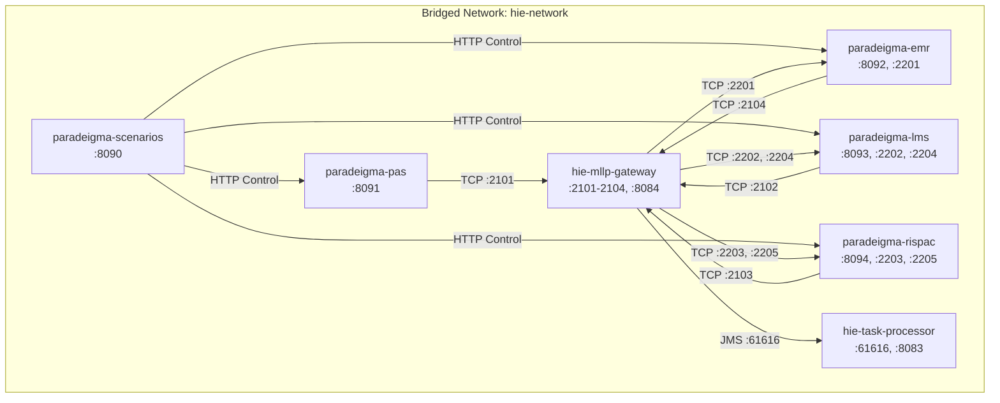

# Paradeigma Deployment & Operations Guide `[CONFIGURED]`

This guide details the deployment topologies, container inventories, orchestration workflows, and operational verification procedures for running the Paradeigma simulation suite.

---

## 1. Container Inventory & Network Topology `[CONFIGURED]`

The Paradeigma simulation environment introduces 5 dedicated simulator workloads that communicate with Harmonia's protocol gateways over a bridged container network:

| Container Name | Workload Role | Base Image / Dockerfile | Exposed Ports | Bound Network |
| :--- | :--- | :--- | :--- | :--- |
| **`paradeigma-pas`** | Patient Administration System | `eclipse-temurin:21-jre-jammy` (`paradeigma/paradeigma-pas/Dockerfile`) | `8091/TCP` (REST Management) | `hie-network` |
| **`paradeigma-emr`** | Electronic Medical Record | `eclipse-temurin:21-jre-jammy` (`paradeigma/paradeigma-emr/Dockerfile`) | `8092/TCP` (REST), `2201/TCP` (ADT Ingress) | `hie-network` |
| **`paradeigma-lms`** | Laboratory Management System | `eclipse-temurin:21-jre-jammy` (`paradeigma/paradeigma-lms/Dockerfile`) | `8093/TCP` (REST), `2202/TCP` (ADT), `2204/TCP` (ORM) | `hie-network` |
| **`paradeigma-rispac`**| Radiology & PACS | `eclipse-temurin:21-jre-jammy` (`paradeigma/paradeigma-rispac/Dockerfile`) | `8094/TCP` (REST), `2203/TCP` (ADT), `2205/TCP` (ORM) | `hie-network` |
| **`paradeigma-scenarios`**| Scenario Orchestration Engine| `eclipse-temurin:21-jre-jammy` (`paradeigma/paradeigma-scenarios/Dockerfile`) | `8090/TCP` (REST Control) | `hie-network` |



---

## 2. Launching via Docker Compose `[CONFIGURED]`

The recommended mechanism for executing local integration testbeds is Docker Compose:

### 2.1 Build and Start Containers
```bash
# Start Harmonia core services and all Paradeigma simulators
docker compose -f paradeigma/deployment/docker-compose-paradeigma.yml up -d --build

# Verify all 7 containers are healthy and running
docker compose -f paradeigma/deployment/docker-compose-paradeigma.yml ps
```

Expected output:
```
NAME                    IMAGE                   COMMAND                  SERVICE                CREATED         STATUS         PORTS
hie-mllp-gateway        mllp-gateway            "/opt/jboss/containe…"   mllp-gateway           10s ago         Up 9s          0.0.0.0:2101-2104->2101-2104/tcp, 0.0.0.0:8084->8080/tcp
hie-task-processor      task-processor          "/opt/jboss/containe…"   task-processor         10s ago         Up 9s          0.0.0.0:8083->8080/tcp, 0.0.0.0:61616->61616/tcp
paradeigma-emr          paradeigma-emr          "java -jar /app/app.…"   paradeigma-emr         10s ago         Up 9s          0.0.0.0:2201->2201/tcp, 0.0.0.0:8092->8092/tcp
paradeigma-lms          paradeigma-lms          "java -jar /app/app.…"   paradeigma-lms         10s ago         Up 9s          0.0.0.0:2202->2202/tcp, 0.0.0.0:2204->2204/tcp, 0.0.0.0:8093->8093/tcp
paradeigma-pas          paradeigma-pas          "java -jar /app/app.…"   paradeigma-pas         10s ago         Up 9s          0.0.0.0:8091->8091/tcp
paradeigma-rispac       paradeigma-rispac       "java -jar /app/app.…"   paradeigma-rispac      10s ago         Up 9s          0.0.0.0:2203->2203/tcp, 0.0.0.0:2205->2205/tcp, 0.0.0.0:8094->8094/tcp
paradeigma-scenarios    paradeigma-scenarios    "java -jar /app/app.…"   paradeigma-scenarios   10s ago         Up 9s          0.0.0.0:8090->8090/tcp
```

---

## 3. Operational Health Verification `[IMPLEMENTED]`

Verify simulator connectivity and operational readiness using standard curl commands:

```bash
# 1. Inspect PAS Simulator Status
curl -s http://localhost:8091/api/pas/status | jq .

# 2. Inspect EMR Simulator Status
curl -s http://localhost:8092/api/emr/status | jq .

# 3. Inspect LMS Simulator Status
curl -s http://localhost:8093/api/lms/status | jq .

# 4. Inspect RIS-PAC Simulator Status
curl -s http://localhost:8094/api/rispac/status | jq .

# 5. Inspect Scenario Engine Metrics
curl -s http://localhost:8090/api/scenarios/status | jq .
```

---

## 4. Triggering Clinical Scenarios `[IMPLEMENTED]`

### 4.1 Single Inpatient Journey
Triggers an end-to-end admission, blood lab order, chest X-ray order, result fulfillments, and discharge:
```bash
curl -X POST http://localhost:8090/api/scenarios/journey \
  -H "Content-Type: application/json" \
  -d '{"profile": "TEST"}'
```

### 4.2 High-Concurrency Stress Test
Executes multiple simultaneous patient trajectories to test Artemis queue depth and Ponos worker thread pooling:
```bash
curl -X POST "http://localhost:8090/api/scenarios/concurrent?count=25&profile=TEST"
```

### 4.3 Autonomous Background Traffic
Enable autonomous timer modes on PAS to generate steady background clinical traffic:
```bash
curl -X POST http://localhost:8091/api/pas/config \
  -H "Content-Type: application/json" \
  -d '{"timerEnabled": true, "timerMode": "FIXED", "fixedIntervalMs": 3000}'
```

---

## 5. Teardown & Cleanup `[CONFIGURED]`

```bash
# Stop and remove simulator containers and virtual networks
docker compose -f paradeigma/deployment/docker-compose-paradeigma.yml down

# Optional: Remove built simulator container images
docker compose -f paradeigma/deployment/docker-compose-paradeigma.yml down --rmi local
```
