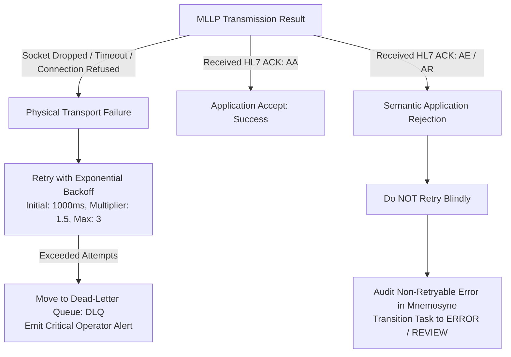

# Paradeigma Failure Injection & Resilience Testing `[IMPLEMENTED]`

This document describes Paradeigma's fault simulation framework, detailing configurable failure modes, the architectural distinction between transport and semantic application errors, and idempotent deduplication testing.

---

## 1. Resilience Philosophy & Architectural Seams `[IMPLEMENTED]`

Healthcare integration platforms must survive network instability, destination downtime, and malformed hospital payloads without message loss or duplicate clinical actions.

Paradeigma implements fault injection at the **network protocol boundary** via `FailureSimulator` in `paradeigma-common`:
- **No Production Code Branches**: Production classes never inspect whether a test is active.
- **Wire-Level Chaos**: Faults manifest as dropped TCP connections, unacknowledged socket reads, artificial latency, or malformed HL7 frames delivered over standard MLLP sockets.
- **Measurable Recovery**: Allows direct observation of Harmonia's retry loops, ActiveMQ Artemis DLQs, and Themis audit trails.

---

## 2. Configurable Fault Modes (`FaultInjectionConfig`) `[IMPLEMENTED]`

| Fault Mode | Parameter Name | Default | Simulated Real-World Incident |
| :--- | :--- | :--- | :--- |
| **Dropped TCP Connection** | `dropConnectionProbability` | `0.0` | Abrupt network switch failure, cable disconnect, or crash of downstream hospital interface engine during packet transmission. |
| **No ACK / Timeout** | `noAckProbability` | `0.0` | Remote firewall dropping return packets, thread pool exhaustion, or severe deadlock on receiving EHR server. |
| **Artificial Latency** | `ackDelayMs` | `0` | Extreme database lock contention or CPU saturation on downstream hospital system. |
| **Application Error (`AE`)** | `applicationErrorProbability` | `0.0` | Receiving system rejects payload due to clinical business rule violation (e.g. invalid attending doctor code). |
| **Application Reject (`AR`)**| `applicationRejectProbability`| `0.0` | Receiving system rejects payload due to unparseable syntax or missing mandatory HL7 segment. |
| **Malformed Segment** | `malformedSegmentProbability` | `0.0` | Network packet corruption, character set translation error, or truncated MLLP frame delimiters. |
| **Duplicate Transmission** | `duplicateMsh10Probability` | `0.0` | Upstream system reconnecting and retransmitting previously delivered message due to ACK timeout. |

---

## 3. Transport Retries vs Application Errors `[IMPLEMENTED]`

Harmonia's core recovery engine strictly differentiates between physical transport defects and semantic application rejections:

### 3.1 Transport Failures (Physical Network Defects)
- **Examples**: TCP reset (`RST`), connection timeout, unacknowledged packet.
- **Harmonia Behavior**:
  1. Catch transport exception in Camel/Netty outbound pipeline.
  2. Retry delivery according to Artemis broker policy:
     - `redelivery-delay`: `1000 ms`
     - `redelivery-delay-multiplier`: `1.5`
     - `max-delivery-attempts`: `3`
  3. If all attempts fail, message is parked in `DLQ` and an administrative alert is emitted.

### 3.2 Application Rejections (`AE` / `AR` ACKs)
- **Examples**: Downstream hospital EMR returns `MSA|AE|Invalid Patient ID` or `MSA|AR|Unsupported Message Type`.
- **Harmonia Behavior**:
  1. Recognizing that the destination successfully received the frame but rejected its content, Harmonia **does not blindly retry** (preventing infinite retry storms).
  2. The rejection is recorded into the audit trail (`ThemisAuditService`).
  3. The associated `Pragma` task is transitioned to `FAILED_VALIDATION` or `REVIEW_REQUIRED`.

---

## 4. Message Deduplication & Idempotency `[IMPLEMENTED]`

In hospital networks, network timeouts frequently cause senders to retransmit messages that were already processed downstream.

`FailureSimulator` injects duplicate messages by repeating the `MSH-10` message control identifier:
1. Senders emit message with `MSH-10 = "CTRL-998822"`.
2. Harmonia ingests message, hashes `MSH-10`, and caches it in Infinispan (`task-cache`).
3. Simulator immediately re-transmits identical message with `MSH-10 = "CTRL-998822"`.
4. Harmonia intercepts duplicate, skips workflow processing, and immediately returns the cached `AA` ACK.
5. Zero duplicate clinical records are created in Mnemosyne.

---

## 5. Resilience Acceptance Suites (`paradeigma-test`) `[IMPLEMENTED]`

Resilience behaviors are verified by automated integration suites:
- **`FailureRecoveryTest`**: Asserts broker redelivery and DLQ parking upon transport failure.
- **`RecoveryAcceptanceTest`**: Validates end-to-end self-healing across simulated gateway restarts.
- **`AdtFanOutIntegrationTest`**: Asserts that partial downstream failure (e.g. LMS down, but EMR and RIS up) correctly tracks destination delivery status per Invariant 5 (REC-002).
