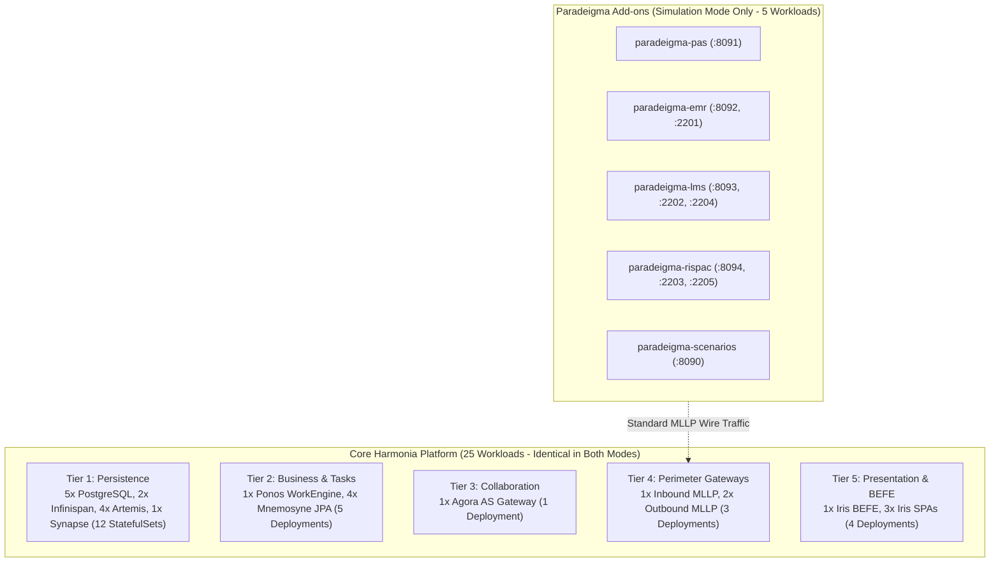

# Normal Production vs Paradeigma Simulation Deployment Register `[CONFIGURED]`

This document provides the authoritative structural, operational, and architectural comparison between a standard Harmonia **Normal Production Deployment** and a **Paradeigma Simulation Deployment**.

---

## 1. Executive Summary `[CONFIGURED]`

| Dimension | Normal Production Deployment | Paradeigma Simulation Deployment | Architectural Rationale & Isolation Guarantees |
| :--- | :--- | :--- | :--- |
| **Primary Objective** | Zero-loss, low-latency clinical data exchange and persistent FHIR storage for real hospital operations. | Deterministic testbed, chaos injection, automated regression, and clinical workflow validation. | Complete segregation of production data from synthetic simulation traffic. |
| **Workload Count** | **25 Pods / Workloads**: 12 StatefulSets + 13 Deployments across 5 tiers. | **30 Pods / Workloads**: 25 core platform workloads + 5 decoupled simulator workloads (or 7 standalone containers under minimal Compose). | Simulators run as decoupled external client pods generating realistic wire traffic. |
| **Persistent Storage** | **12 PVCs (25 GB total)**: 5x PostgreSQL (10 GB), 4x Artemis (8 GB), 2x Infinispan (2 GB), 1x Synapse (5 GB). | **12 PVCs (25 GB total)**: Identical core storage. Simulators are completely stateless and request zero PVCs. | Zero risk of disk contamination; simulators maintain ephemeral state in memory. |
| **Network Listeners** | **18 Platform Listeners**: MLLP :2575, BEFE :8080/:8090, Synapse :8008, Agora :8092, Artemis :61616, etc. | **18 Platform Listeners + 5 Simulator Listeners**: PAS (:8091), EMR (:8092, :2201), LMS (:8093, :2202, :2204), RIS (:8094, :2203, :2205), Scenarios (:8090). | Gateway and platform listeners operate identically regardless of traffic origin. |
| **Target Endpoints** | Production hospital clinical systems (EMR, PAS, LIS, RIS) via dedicated hospital LAN / VPN. | Inbound protocol gateways (`pylai-mllp-in:2575`, `pylai-fhir-registry:8080`) within a closed container network. | Inbound gateways enforce identical validation, authentication, and Themis policy evaluation. |
| **Data Nature** | Real patient demographics, clinical orders, diagnostic observations, and Australian digital health IDs. | Deterministically generated synthetic personas, mock MRNs, and deterministic test identities. | Zero real PHI enters the simulation; all test data is generated via seed-controlled pseudorandomness. |
| **Production Code Coupling** | Strictly zero Paradeigma classes, dependencies, or configuration flags. | Simulators call standard external protocol wire endpoints (MLLP / REST). | Strict unidirectional boundary (`Paradeigma -> Production APIs`). Checked by ArchUnit. |
| **Failure Injection** | Disabled. Standard HA failover, broker auto-recovery, and Infinispan state transfer active. | Programmable chaos testing: dropped TCP sockets, ACK timeouts, delayed responses, malformed HL7, duplicate MSH-10. | Enables chaos testing of retry queues, DLQs, and circuit breakers without customer impact. |
| **Security Context** | Production TLS 1.3 certificates, Vault secrets, real practitioner RBAC/ABAC tokens. | Mocked test credentials, synthetic service principals (`SIM_PAS_USER`), deterministic test tokens. | Evaluated against standard Themis default-deny policy rules (`ThemisAction.PROCESS`). |
| **Logging Invariant** | Dual-gate disabled (`phi-enabled=false`). Zero PHI emitted to any log appender. | Dual-gate toggled dynamically during tests; verified via in-memory `PhiLogTestProbe`. | Guarantees non-clinical log sinks remain free of sensitive data. |

---

## 2. Workload & Container Inventory Comparison `[CONFIGURED]`

### 2.1 Tier-by-Tier Workload Inventory

| Architectural Tier | Normal Production Workloads (25 total) | Simulation Deployment Workloads (30 total) | Delta / Simulator Add-ons |
| :--- | :--- | :--- | :--- |
| **Tier 1: Data & Messaging** | `postgres-1`, `postgres-2`, `postgres-ops-1`, `postgres-ops-2`, `postgres-synapse`, `infinispan-1`, `infinispan-2`, `artemis-1`, `artemis-2`, `artemis-ops-1`, `artemis-ops-2`, `synapse` (12 StatefulSets) | Exactly identical (12 StatefulSets) | None |
| **Tier 2: Business & Persistence**| `hapi-fhir-1`, `hapi-fhir-2`, `hie-operations-1`, `hie-operations-2`, `ponos` (5 Deployments) | Exactly identical (5 Deployments) | None |
| **Tier 3: Collaboration** | `agora-service` (1 Deployment) | Exactly identical (1 Deployment) | None |
| **Tier 4: Gateways & Ingress** | `mllp-gateway`, `mllp-outbound-1`, `mllp-outbound-2` (3 Deployments) | Exactly identical (3 Deployments) | None |
| **Tier 5: Presentation** | `iris-befe`, `iris-clinical`, `iris-console`, `iris-administration` (4 Deployments) | Exactly identical (4 Deployments) | None |
| **Tier 6: External Simulation** | *None* | `paradeigma-pas`, `paradeigma-emr`, `paradeigma-lms`, `paradeigma-rispac`, `paradeigma-scenarios` (5 Deployments / Containers) | **+5 Simulator Workloads** |

---

## 3. Network Listener Delta Register `[CONFIGURED]`

| Port | Workload Binding | Mode | Protocol | Description & Payload |
| :--- | :--- | :--- | :--- | :--- |
| `2575/TCP` | `mllp-gateway` | Both | MLLP / TCP | Inbound HL7 v2 messages (ADT, ORM, ORU) |
| `8080/TCP` | `iris-befe` | Both | HTTP REST | Clinical FHIR R5 API & REST Gateway |
| `8090/TCP` | `iris-befe` | Both | HTTP REST | Operations REST API & queue inspection |
| `8092/TCP` | `agora-service` | Both | HTTP REST | Matrix Application Service transaction endpoint |
| `8008/TCP` | `synapse` | Both | HTTP REST | Matrix Client-Server & Admin API |
| `61616/TCP`| `artemis-*` | Both | Core / AMQP | Resilient JMS messaging backbone |
| `11222/TCP`| `infinispan-*` | Both | Hot Rod | High-speed in-memory cache grid |
| `5432/TCP` | `postgres-*` | Both | PostgreSQL wire| Relational JPA persistence |
| `8091/TCP` | `paradeigma-pas` | **Simulation Only** | HTTP REST | PAS simulator status and manual triggers |
| `8092/TCP` | `paradeigma-emr` | **Simulation Only** | HTTP REST | EMR simulator order placement API |
| `2201/TCP` | `paradeigma-emr` | **Simulation Only** | MLLP / TCP | EMR inbound fan-out port for ADT events |
| `8093/TCP` | `paradeigma-lms` | **Simulation Only** | HTTP REST | LMS simulator lab results API |
| `2202/TCP` | `paradeigma-lms` | **Simulation Only** | MLLP / TCP | LMS inbound fan-out port for ADT events |
| `2204/TCP` | `paradeigma-lms` | **Simulation Only** | MLLP / TCP | LMS inbound routed orders port for ORM |
| `8094/TCP` | `paradeigma-rispac` | **Simulation Only** | HTTP REST | RIS-PAC simulator radiology reports API |
| `2203/TCP` | `paradeigma-rispac` | **Simulation Only** | MLLP / TCP | RIS-PAC inbound fan-out port for ADT events |
| `2205/TCP` | `paradeigma-rispac` | **Simulation Only** | MLLP / TCP | RIS-PAC inbound routed orders port for ORM |
| `8090/TCP` | `paradeigma-scenarios`| **Simulation Only** | HTTP REST | Scenario engine journey orchestration API |

---

## 4. Strict Isolation Proof & Verification `[IMPLEMENTED]`

The separation between Normal and Simulation modes is continuously enforced across four technical boundaries:

1. **Compile-Time Boundary**:
   - Production Maven POMs never declare dependencies on `paradeigma-*`.
   - Verified by `ParadeigmaIsolationArchitectureTest.noProductionPomsShouldDeclareParadeigmaDependency()`.
2. **Package & Import Boundary**:
   - Production Java classes never import `net.fhirfactory.harmonia.paradeigma.*`.
   - Verified by `ParadeigmaIsolationArchitectureTest.noProductionClassesShouldDependOnParadeigma()`.
3. **Source Code Static Boundary**:
   - Production source trees contain zero simulation flags (`simulationMode`, `paradeigmaMode`, `syntheticRequest`, `isParadeigmaGenerated`).
   - Verified by `ParadeigmaIsolationArchitectureTest.noProductionCodeShouldContainSimulationFlagsOrImports()`.
4. **Runtime Packaging Boundary**:
   - Production JAR, WAR, and container image builds strictly exclude Paradeigma test libraries.
   - Verified by `ParadeigmaIsolationArchitectureTest.productionPackagingExcludesParadeigma()`.
