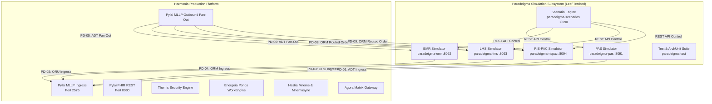

# Paradeigma Subsystem Overview: Synthetic Clinical Simulation `[IMPLEMENTED]`

**Harmonia Paradeigma** is the first-class synthetic clinical simulation, testbed, and resilience validation framework for the Harmonia Health Integration Environment (HIE).

Designed to eliminate reliance on brittle external hospital test environments, Paradeigma provides deterministic, high-fidelity simulation of external healthcare information systems:
- **Patient Administration Systems (PAS)**: Inpatient admissions, registrations, ward transfers, demographic updates, and discharges (`ADT^A01`, `A02`, `A03`, `A04`, `A08`, `A11`, `A12`, `A13`).
- **Electronic Medical Records (EMR)**: Diagnostic laboratory and medical imaging order placement (`ORM^O01`), and clinical note dispatches.
- **Laboratory Management Systems (LMS)**: Pathology laboratory result generation (`ORU^R01`), numeric observation ranges, and abnormal panic values.
- **Radiology Information Systems & PACS (RIS-PAC)**: Diagnostic imaging report generation (`ORU^R01`), multi-line impression narratives, and DICOM study references.
- **Multi-System Scenario Engine**: Automated orchestration of complex clinical trajectories and stress testing across simulated hospital systems.
- **Resilience & Chaos Engineering**: Deterministic fault injection for transport drops, TCP timeouts, ACK latency, malformed HL7 segments, and duplicate control IDs.
- **Provider Registry Testbed**: Generation of canonical Australian digital health structures (`HPI-I`, `HPI-O`, `AHPRA`, `Medicare`, `SNOMED CT`) and asynchronous Request for Change lifecycles.
- **Zero-PHI Logging Verification**: In-memory test probes asserting strict compliance with the platform dual-gate logging invariants.

---

## 1. Core Architectural Role: Leaf Module `[IMPLEMENTED]`

Paradeigma is architecturally classified strictly as a **leaf module**:
- **Unidirectional Invocation**: Paradeigma invokes public Harmonia perimeter interfaces (such as MLLP on TCP port 2575 or FHIR REST on HTTP port 8080).
- **Strict Isolation**: Production Harmonia modules (`calliope`, `themis`, `hestia`, `petasos`, `energeia`, `pylai`, `iris`, `agora`) must **NEVER** import or depend upon Paradeigma.
- **No Simulation Logic in Production**: Production classes contain zero simulation flags (`simulationMode`, `paradeigmaMode`, `syntheticRequest`, `isParadeigmaGenerated`).
- **ArchUnit Enforcement**: Invariant boundaries are checked continuously by `ParadeigmaIsolationArchitectureTest`.

---

## 2. Subproject Leaf Modules Inventory `[IMPLEMENTED]`

The Paradeigma subproject comprises 7 specialized leaf modules located under `paradeigma/`:

| Module | Maven Artifact ID | Packaging | Primary Responsibility |
| :--- | :--- | :--- | :--- |
| **`paradeigma-common`** | `net.fhirfactory.harmonia:paradeigma-common` | JAR | Reusable deterministic persona generators, seed management, MLLP framing codecs, fault injectors, and Logback test probes. |
| **`paradeigma-pas`** | `net.fhirfactory.harmonia:paradeigma-pas` | JAR (Spring Boot) | Patient Administration System simulator emitting ADT events (PD-01) with stateful encounter lifecycles and timer-based generators. |
| **`paradeigma-emr`** | `net.fhirfactory.harmonia:paradeigma-emr` | JAR (Spring Boot) | Electronic Medical Record simulator submitting diagnostic orders (PD-04) and receiving downstream ADT demographic broadcasts (PD-05). |
| **`paradeigma-lms`** | `net.fhirfactory.harmonia:paradeigma-lms` | JAR (Spring Boot) | Laboratory Management System simulator processing routed orders (PD-08) and generating structured pathology results (PD-02). |
| **`paradeigma-rispac`**| `net.fhirfactory.harmonia:paradeigma-rispac`| JAR (Spring Boot) | Radiology Information System / PACS simulator ingesting imaging orders (PD-09) and returning diagnostic reports (PD-03). |
| **`paradeigma-scenarios`**| `net.fhirfactory.harmonia:paradeigma-scenarios`| JAR (Spring Boot) | Multi-application orchestrator executing deterministic clinical journeys, concurrency stress tests, and REST control interfaces. |
| **`paradeigma-test`** | `net.fhirfactory.harmonia:paradeigma-test` | JAR (Test Suite) | End-to-end integration tests, resilience verifications, security acceptance tests, and ArchUnit architectural guardrails. |

---

## 3. Key Capabilities & Architectural Boundaries `[IMPLEMENTED]`

1. **Deterministic Pseudorandom Data (`SeedRandom`)**:
   - Replaces flaky stochastic data generation with fixed seed sequences. Passing seed `42L` produces bit-for-bit identical HL7 and FHIR payloads across runs.
2. **Standard MLLP Wire Framing**:
   - Transmits standard HL7 Minimal Lower Layer Protocol frames (`0x0B` + raw text + `0x1C 0x0D`) and validates synchronous `AA`/`AE`/`AR` acknowledgement responses.
3. **Execution Profiles (`ExecutionProfile`)**:
   - **`TEST`**: Paced at 10–50 ms for ultra-fast CI/CD automated test pipelines.
   - **`DEMO`**: Paced at 2–10 seconds for observable human-in-the-loop demonstrations.
   - **`LOAD`**: High-concurrency asynchronous execution exercising queues and connection pools.
4. **Fault Injection (`FaultInjectionConfig`)**:
   - Simulates realistic physical and network defects: socket drops, timeouts, delayed ACKs, application rejections (`AE`/`AR`), malformed segments, and duplicate message IDs.
5. **Zero-PHI Compliance Guardrails**:
   - `PhiLogTestProbe` captures in-memory log events and validates that non-clinical log streams (`INFO`, `WARN`, `ERROR`) never leak patient names, MRNs, or secrets.

---

## 4. Documentation Suite Navigation `[IMPLEMENTED]`

- **[Concepts](concepts.md)**: Classical metaphor, persona modeling, and simulation concepts.
- **[Architecture](architecture.md)**: Component topology, interface catalog (PD-01 to PD-09), and sequence interactions.
- **[Deployment](deployment.md)**: Docker Compose and Kubernetes deployment runbooks.
- **[Normal vs Paradeigma Matrix](normal-vs-paradeigma.md)**: Production vs simulation comparison and footprint.
- **[Configuration](configuration.md)**: Pacing profiles, timer configurations, and environment parameters.
- **[Scenarios](scenarios.md)**: Multi-step clinical patient journeys and provider sync workflows.
- **[Synthetic Data](synthetic-data.md)**: Seeded data generators, national identifiers, and clinical ranges.
- **[Security Testing](security-testing.md)**: Themis actor fixtures and authorization failure seams.
- **[Failure Injection](failure-injection.md)**: Chaos engineering, transport drops, and retry semantics.
- **[Logging Validation](logging-validation.md)**: Dual-gate verification and `PhiLogTestProbe`.
- **[Production Isolation](production-isolation.md)**: ArchUnit tests, compile-time guardrails, and boundary proofs.
- **[Examples](examples.md)**: Copy-pasteable test fixtures and scenario execution scripts.
