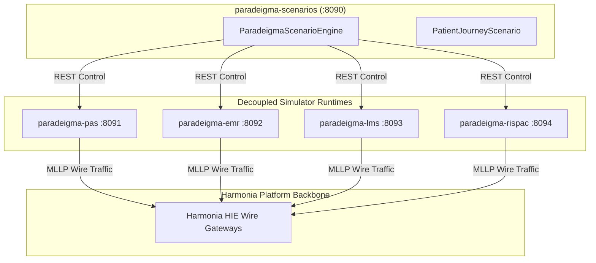

# Paradeigma Scenario Engine & Clinical Trajectories `[IMPLEMENTED]`

The Paradeigma Scenario Engine (`paradeigma-scenarios` on port `8090`) coordinates multi-system clinical trajectories, provider registry synchronization flows, and high-concurrency stress benchmarks across simulated healthcare systems.

---

## 1. Scenario Engine Architecture `[IMPLEMENTED]`



- **Control Separation**: The scenario engine sends REST management commands to simulator endpoints (`/api/pas/*`, `/api/emr/*`, etc.), while all clinical healthcare payloads strictly traverse Harmonia via standard MLLP wire gateways (`:2101-2104`, `:2575`).
- **Pacing Control**: Pacing between sequence steps is controlled by the configured `ExecutionProfile` (`TEST` at 10–50 ms, `DEMO` at 2–10 s, `LOAD` at 0–5 ms).

---

## 2. Standard Inpatient Clinical Journey `[IMPLEMENTED]`

The canonical inpatient journey models a realistic acute hospital stay:

```mermaid
graph LR
    S1[1. Register A04] --> S2[2. Admit A01]
    S2 --> S3[3. ADT Fan-Out]
    S3 --> S4[4. EMR Lab Order]
    S4 --> S5[5. LMS Result R01]
    S5 --> S6[6. EMR Rad Order]
    S6 --> S7[7. RIS Report R01]
    S7 --> S8[8. Transfer A02]
    S8 --> S9[9. Update A08]
    S9 --> S10[10. Discharge A03]
```



### Detailed Sequence Steps
1. **`PAS Register Patient (ADT^A04)`**: Generates synthetic patient demographics (`SyntheticPatientGenerator`) with valid Australian Medicare and MRN, initiating an outpatient encounter.
2. **`PAS Admit Patient (ADT^A01)`**: Formally admits the patient to an inpatient bed (`WARD-3A`, Room 102).
3. **`Harmonia Demographics Fan-out (REC-002)`**: Harmonia intercepts the admission event, generates downstream egress ADT frames, and broadcasts demographics to EMR (`PD-05`), LMS (`PD-06`), and RIS-PAC (`PD-07`).
4. **`EMR Place Pathology Order (ORM^O01 CBC)`**: Attending clinician orders a Full Blood Count (order code `CBC`).
5. **`Harmonia Routes Order (PD-08)`**: Harmonia determines destination routing rules, transforming and delivering the order to LMS.
6. **`LMS Produce Pathology Result (ORU^R01)`**: Simulated laboratory analyzer generates realistic numeric observations:
   - Hemoglobin (`Hb`): `142 g/L` (Reference: `130–180`)
   - White Blood Cells (`WBC`): `7.2 x10^9/L` (Reference: `4.0–11.0`)
   - Platelets (`Plt`): `245 x10^9/L` (Reference: `150–450`)
7. **`EMR Place Radiology Order (ORM^O01 XR_CHEST)`**: Clinician orders a portable chest X-ray.
8. **`Harmonia Routes Order (PD-09)`**: Harmonia routes imaging request to RIS-PAC.
9. **`RIS-PAC Produce Radiology Report (ORU^R01)`**: Diagnostic imaging simulator returns structured radiologist impression text with modality code `CR` and accession number.
10. **`PAS Transfer Patient (ADT^A02)`**: Patient improves and is transferred from `WARD-3A` to Step-Down Unit `WARD-2B`.
11. **`PAS Update Demographics (ADT^A08)`**: Patient updates next-of-kin emergency contact phone number.
12. **`PAS Discharge Patient (ADT^A03)`**: Clinician approves discharge; bed status is released in hospital PAS.

---

## 3. Provider Registry Synchronization Scenario `[IMPLEMENTED]`

Validates master file synchronization and the asynchronous **Request for Change** lifecycle:
1. **Practitioner Onboarding**: Submits new practitioner records with canonical Australian `HPI-I` (`800361...`) and `AHPRA` numbers.
2. **PractitionerRole Binding**: Links practitioner to target `Organization` (`HPI-O 800362...`), clinical `Location`, and `HealthcareService`.
3. **Referential Integrity Testing**: Deliberately submits invalid foreign keys to assert that Harmonia rejects the change request with structured `OperationOutcome` errors.
4. **Asynchronous Verification**: Queries `/fhir/r5/Task/{id}` to verify transition from `RECEIVED` $\rightarrow$ `APPROVED` $\rightarrow$ `COMMITTING` $\rightarrow$ `COMPLETED`.

---

## 4. Agora Collaboration Scenario `[IMPLEMENTED]`

Validated in `AgoraCollaborationScenarioTest`:
1. **Encounter Initiation**: Ingestion of patient admission triggers an `AgoraSpaceRequest`.
2. **Space Provisioning**: Agora creates the private **Patient Space** and links all four child rooms (`Statistics`, `Tasks`, `Discussion`, `Diagnostics`).
3. **Clinical Alert Broadcast**: High-priority panic lab results (e.g. Potassium `6.8 mmol/L`) emitted by LMS trigger automated alert posts into the patient's `Diagnostics` and `Tasks` rooms.
4. **Care Team Reconciliation**: When the attending physician is updated via Provider Registry sync, `AgoraMembershipReconciliationService` automatically invites the new physician and kicks the departed clinician.
5. **Encounter Archival**: When `ADT^A03` discharge completes, Agora executes soft archival on the space and rooms (AGORA-ADR-008).

---

## 5. Scenario Control REST API `[IMPLEMENTED]`

### 5.1 Execute Single Patient Journey
```bash
POST /api/scenarios/journey
Content-Type: application/json

{
  "profile": "TEST",
  "patientId": "sim-pat-42",
  "seed": 42
}
```

### 5.2 Execute Concurrency Stress Benchmark
```bash
POST /api/scenarios/concurrent?count=50&profile=TEST
```

### 5.3 Retrieve Scenario Engine Metrics
```bash
GET /api/scenarios/status
```

Response JSON:
```json
{
  "activeJourneys": 0,
  "completedJourneys": 50,
  "failedJourneys": 0,
  "totalMessagesTransmitted": 600,
  "averageJourneyDurationMs": 420,
  "status": "IDLE"
}
```
