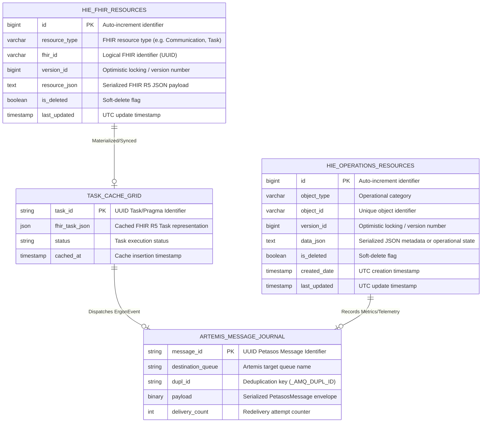

# Harmonia Persistence Architecture

## 1. Overview & Core Philosophy

The Harmonia Health Integration Environment (HIE) implements a segregated, multi-tier storage architecture designed for high-availability clinical message routing, transformation, and distribution. In a clinical integration platform, message durability must never be conflated with application durability or workflow coordination state. 

Harmonia structures its persistence into four explicit, decoupled tiers:

```
                          HARMONIA STORAGE TIERS
                          
   [ External Sources: PAS / EMR / LMS / RIS-PAC ]
                         │
                         ▼
   ┌─────────────────────────────────────────────────────────┐
   │ 1. MESSAGE DURABILITY TIER                              │
   │    Petasos — Apache ActiveMQ Artemis Journal (NIO/AIO)  │
   │    • In-flight queue persistence                        │
   │    • Broker HA journal replication & deduplication      │
   └───���────────────────────┬────────────────────────────────┘
                            │
                            ▼
   ┌─────────────────────────────────────────────────────────┐
   │ 2. WORKFLOW & EXECUTION DURABILITY TIER                 │
   │    Ponos / Mneme — Infinispan Remote HotRod Cache Grid  │
   │    • Pragma execution state & Task lifecycle            │
   │    • Fast in-memory state with cluster replication      │
   └────────────────────────┬────────────────────────────────┘
                            │
                            ▼
   ┌─────────────────────────────────────────────────────────┐
   │ 3. APPLICATION DURABILITY TIER                          │
   │    Mnemosyne — PostgreSQL Relational Store              │
   │    • hie_fhir_resources (HL7 FHIR R5 canonical store)   │
   │    • hie_operations_resources (Operational telemetry)   │
   └─────────────────────────────────────────────────────────┘
                            │
   ┌────────────────────────┴────────────────────────────────┐
   │ 4. EXEMPLAR / SIMULATION STATE TIER                     │
   │    Paradeigma — Microservice In-Memory Test State       │
   │    • Ephemeral synthetic patients, orders, and results  │
   └─────────────────────────────────────────────────────────┘
```

---

## 2. Storage Tier Classification

Harmonia explicitly distinguishes between three different durability guarantees:

### 2.1 Message Durability (Petasos / Artemis Journal)
* **Storage Engine**: Apache ActiveMQ Artemis append-only NIO/AIO journal (`./data/journal`).
* **Purpose**: Guarantees at-least-once delivery of in-flight `PetasosMessage` envelopes across network partitions, broker restarts, or worker node crashes.
* **Scope**: Transient. Messages are persisted to disk upon publication and removed from the journal only when acknowledged (ACKed) by the downstream consumer.
* **Deduplication**: Sliding window cache (`_AMQ_DUPL_ID`) tracked directly within broker memory and persistent journal indices.

### 2.2 Workflow & Execution Durability (Ponos / Mneme Infinispan)
* **Storage Engine**: Infinispan Distributed In-Memory Data Grid accessed via HotRod client (`TaskCacheService`).
* **Purpose**: Tracks active `Pragma` task execution instances, intermediate step checkpoints, task status transitions (`REQUESTED` -> `IN_PROGRESS` -> `COMPLETED`/`FAILED`), and correlation context without incurring relational database lock contention.
* **Scope**: Session & Operational lifecycle. Stores active tasks during processing with distributed cache replication across Ponos worker nodes.

### 2.3 Application Durability (Mnemosyne / PostgreSQL)
* **Storage Engine**: PostgreSQL Relational Database (`hie_fhir_resources`, `hie_operations_resources`).
* **Purpose**: Permanent, auditable, and queryable system of record for FHIR R5 clinical resources (`Communication`, `Task`, `Patient`, `Encounter`, `Observation`, `Provenance`, etc.) and non-FHIR operational metadata.
* **Scope**: Permanent. Preserves full clinical history, versioning (`version_id`), and soft-deletion (`is_deleted`) status for compliance, auditability, and clinical governance.

### 2.4 Exemplar State (Paradeigma Clinical Simulator)
* **Storage Engine**: In-memory test bed state.
* **Purpose**: Generates and maintains simulated clinical data (synthetic PAS admissions, EMR orders, LMS laboratory results, RIS radiology reports).
* **Scope**: Ephemeral. Discarded upon simulator container restart.

---

## 3. Persistent Entity Catalogue

| Attribute | `FhirResourceEntity` | `OperationResourceEntity` | `Pragma` (Canonical Model) | `PetasosMessage` | `Topic` |
| :--- | :--- | :--- | :--- | :--- | :--- |
| **Java Class** | `net.fhirfactory.harmonia.hapifhir.model.FhirResourceEntity` | `net.fhirfactory.harmonia.operations.model.OperationResourceEntity` | `net.fhirfactory.harmonia.model.pragma.Pragma` | `net.fhirfactory.harmonia.petasos.api.message.PetasosMessage` | `net.fhirfactory.harmonia.model.topic.Topic` |
| **Owner Module** | `hestia/mnemosyne-clinical` | `hestia/mnemosyne-operations` | `calliope` / `energeia-ponos` | `petasos/petasos-api` | `calliope` |
| **Purpose** | Persistent store for all FHIR R5 resources | Persistent store for non-FHIR operational objects | In-memory & cache representation of executable workflow task | Messaging envelope for queue distribution | Routing metadata defining message types & sources |
| **Storage Location** | Database: `hie_fhir_resources` | Database: `hie_operations_resources` | Infinispan Cache: `tasks-cache` / `default-cache` | Artemis Journal: `activemq.data` | In-memory / Message Header |
| **Primary Key** | `id` (BIGINT, Auto-Increment PK) | `id` (BIGINT, Auto-Increment PK) | `pragmaId` (UUID string) | `messageId` (UUID string) | `topicId` (Compound string) |
| **Business Key** | `(resource_type, fhir_id)` | `(object_type, object_id)` | `pragmaId` / `correlationId` | `messageId` / `_AMQ_DUPL_ID` | `topicName` / `messageType` |
| **Foreign Keys** | None (Logical references in JSON payload) | None (Logical references in JSON payload) | `causationId`, `praxisId` | `correlationId`, `causationId` | None |
| **Created By** | `FhirStorageService` | `OperationStorageService` | `IncomingAdtMessageProcessor` / `ErgonBase` | `ArtemisPetasosProducer` | `TopicSubscription` / Gateways |
| **Updated By** | `FhirStorageService` | `OperationStorageService` | `TaskEventMessageProcessor` / `Erga` | Artemis Broker (Redelivery count) | Static configuration |
| **Lifecycle** | Insert -> Version Update -> Soft Delete | Insert -> Version Update -> Soft Delete | Created -> In-Progress -> Completed / Failed | Queued -> Persisted -> Consumed -> ACKed / DLQ | Static / Lifecycle configuration |
| **Recovery Role** | Point of record for clinical queries & audit | Stores diagnostic logs & configuration | Reconstructs task execution chain | Replays unacknowledged messages upon restart | Rebuilds subscription topology |
| **Retention** | Indefinite (clinical regulatory retention) | Configurable operational retention policy | Evicted post-completion or TTL (7 days) | Evicted immediately on consumer ACK | Ephemeral |

---

## 4. Entity-to-Database Mapping

### 4.1 `FhirResourceEntity` -> `hie_fhir_resources`
```
FhirResourceEntity
   │
   ├── id (Long) ───────────────────────────► id (BIGINT, PK, AUTO_INCREMENT)
   ├── resourceType (String) ───────────────► resource_type (VARCHAR(64), NOT NULL)
   ├── fhirId (String) ─────────────────────► fhir_id (VARCHAR(128), NOT NULL)
   ├── versionId (Long) ────────────────────► version_id (BIGINT, NOT NULL, DEFAULT 1)
   ├── resourceJson (String, @Lob) ─────────► resource_json (TEXT, NOT NULL)
   ├── deleted (boolean) ───────────────────► is_deleted (BOOLEAN, NOT NULL, DEFAULT FALSE)
   └── lastUpdated (Instant) ───────────────► last_updated (TIMESTAMP WITHOUT TIME ZONE, NOT NULL)
```

### 4.2 `OperationResourceEntity` -> `hie_operations_resources`
```
OperationResourceEntity
   │
   ├── id (Long) ───────────────────────────► id (BIGINT, PK, AUTO_INCREMENT)
   ├── objectType (String) ─────────────────► object_type (VARCHAR(64), NOT NULL)
   ├── objectId (String) ───────────────────► object_id (VARCHAR(128), NOT NULL)
   ├── versionId (Long) ────────────────────► version_id (BIGINT, NOT NULL, DEFAULT 1)
   ├── dataJson (String, @Lob) ─────────────► data_json (TEXT, NOT NULL)
   ├── deleted (boolean) ───────────────────► is_deleted (BOOLEAN, NOT NULL, DEFAULT FALSE)
   ├── createdDate (Instant) ───────────────► created_date (TIMESTAMP WITHOUT TIME ZONE, NOT NULL)
   └── lastUpdated (Instant) ───────────────► last_updated (TIMESTAMP WITHOUT TIME ZONE, NOT NULL)
```

---

## 5. Persistence Ownership Boundaries

To eliminate data corruption and split-brain states, persistence ownership is strictly bounded across Harmonia modules:

```
┌────────────���───────────────────────────────────────────────────────────┐
│                        HARMONIA SUBSYSTEMS                             │
│                                                                        │
│   ┌───────────────────┐               ┌───────────────────────────┐    │
│   │      Petasos      │               │           Ponos           │    │
│   │ Message Delivery  │               │  Execution Coordination   │    │
│   │ (Artemis Journal) │               │   (Pragma / Task Cache)   │    │
│   └─────────┬─────────┘               └─────────────┬─────────────┘    │
│             │                                       │                  │
│             ▼                                       ▼                  │
│   ┌───────────────────┐               ┌───────────────────────────┐    │
│   │     Mnemosyne     │               │           Mneme           │    │
│   │  Durable Storage  │               │ Transient & Grid Caching  │    │
│   │   (PostgreSQL)    │               │       (Infinispan)        │    │
│   └─────────┬─────────┘               └─────────────┬─────────────┘    │
│             │                                       │                  │
│             ▼                                       ▼                  │
│   ┌───────────────────┐               ┌───────────────────────────┐    │
│   │     Calliope      │               │        Paradeigma         │    │
│   │ Canonical Schemas │               │   Exemplar & Simulator    │    │
│   │  (Static Models)  │               │    (In-Memory Testing)    │    │
│   └───────────────────┘               └───────────────────────────┘    │
└──────────────────────────────────────────────────────────────���─────────┘
```

1. **Petasos**: Owns message queues, dead-letter queues (`DLQ`), expiry queues (`ExpiryQueue`), delivery counters, and broker-level deduplication cache (`_AMQ_DUPL_ID`). It has zero access to the relational database.
2. **Ponos / Erga**: Owns task execution orchestration, pipeline routing rules, checkpoint updates, and workflow activity state machines. Interacts with the `TaskCacheService` for fast in-flight task mutation.
3. **Mnemosyne**: Exclusively owns all JPA repositories, database connection pooling, transactions, and SQL execution against `hie_fhir_resources` and `hie_operations_resources`.
4. **Mneme**: Owns distributed cache configuration (HotRod client, cluster topology, cache evictions, serialization).
5. **Calliope**: Owns immutable canonical Java definitions (`Pragma`, `ErgonEvent`, `Topic`, `PetasosQueueDefinition`). Contains no persistence logic.
6. **Paradeigma**: Owns test harness state, synthetic MLLP sockets, and fault injectors. Does not mutate production database records directly.

---

## 6. Artemis Journal Persistence vs. Application Database

| Property | Apache ActiveMQ Artemis Journal | Mnemosyne PostgreSQL Database |
| :--- | :--- | :--- |
| **Persistence Mechanism** | Append-only pre-allocated disk files (`data/journal`) | Relational WAL (Write-Ahead Logging) & Heap Tables |
| **Write Latency** | Sub-millisecond (sequential append with OS cache flushes) | 2–10 ms (ACID relational transaction, index updates) |
| **Primary Data Structure** | Sequential byte records in rolling journal files | B-Tree indexed relational rows with JSON LOBs |
| **Deletion Model** | Compacted upon consumer message acknowledgment | Soft delete (`is_deleted = true`) or regulatory purge |
| **Query Capability** | FIFO / Selector-based queue consumption only | Arbitrary SQL, type lookup, version retrieval, metadata search |
| **Recovery Role** | Immediate replay of unacknowledged in-flight queue messages | Authoritative audit reconstruction and clinical state retrieval |
| **Concurrency Control** | Broker internal lock-free actor / queue mutexes | Optimistic locking via `version_id` column |

---

## 7. Entity Relationship Model



---

## 8. Optimistic Concurrency & Data Integrity

Harmonia enforces strict data integrity constraints at both the database level and the application level:

1. **Unique Business Keys**:
   - `uk_resource_type_fhir_id` on `hie_fhir_resources(resource_type, fhir_id)` prevents accidental duplicate inserts of the same FHIR resource.
   - `uk_ops_object_type_object_id` on `hie_operations_resources(object_type, object_id)` ensures operational objects remain strictly single-instance.
2. **Optimistic Versioning (`version_id`)**:
   - Every update to `FhirResourceEntity` and `OperationResourceEntity` increments `version_id` by 1.
   - If concurrent worker threads attempt to update the same resource concurrently, version collision checks ensure updates do not silently overwrite interleaved modifications.
3. **Soft Deletion (`is_deleted`)**:
   - Clinical and operational resources are never physically deleted (`DELETE FROM ...`) in normal operations. Soft-deleted records have `is_deleted = true`, preserving complete audit traceability.
