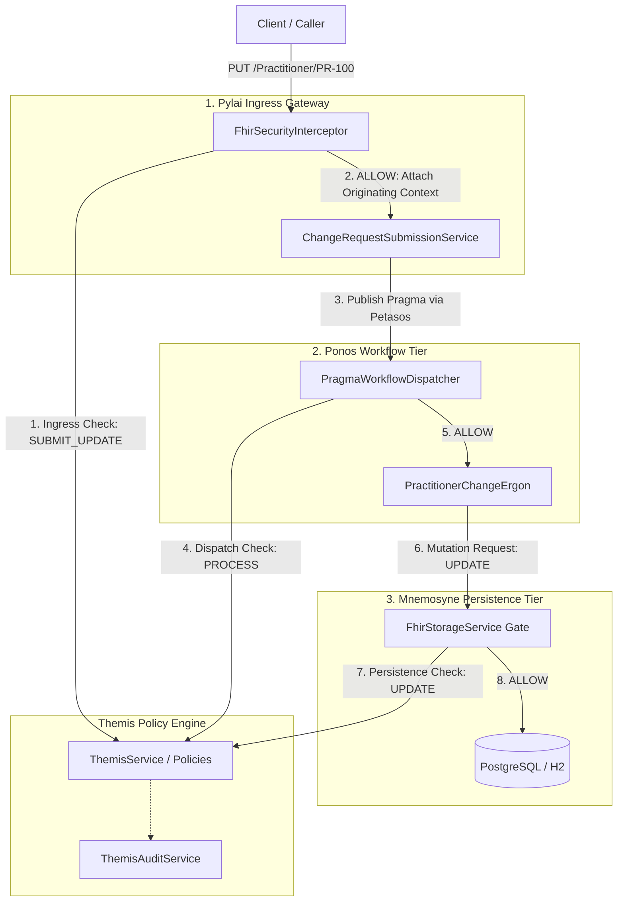

# Harmonia Provider Registry — Security & Authorization Architecture

## 1. Overview & Separation of Concerns

Security within the **Harmonia Provider Registry** is governed by **Themis**, Harmonia's centralized Policy and Authorisation Service. Access control enforces a strict separation between identity verification (Authentication) and granular policy enforcement (Authorization):

- **Authentication (AuthN)**: Handled upstream at the Pylai gateway or external Identity Provider (IDP). Identifies calling principals (human users, external systems, internal services) via OAuth2/OIDC Bearer tokens, mTLS certificates, or gateway headers.
- **Authorization (AuthZ)**: Handled deterministically by Themis. Evaluates whether the authenticated principal possesses the explicit granular authorities required to perform an action on a given resource within the `PROVIDER_REGISTRY` security domain.

### Foundational Invariant: Default Deny
The Provider Registry operates strictly under a **default-deny** security model. In the absence of an explicit policy rule granting permission, all read queries, search requests, task submissions, and database mutations are denied (`DENY`).

---

## 2. Role and Authority Decoupling

The Provider Registry decouples mnemonic roles assigned to callers from granular authorities evaluated by Themis policy engines.

### Provider Registry Mnemonic Roles (`HarmoniaRoleEnum`)

| Role Code | Role Name | Assigned Granular Authorities | Typical Use Case |
| :--- | :--- | :--- | :--- |
| `PRV_RDR` | Provider Registry Reader | `provider.read`, `provider.search` | Directory lookup, practitioner searches, client applications |
| `PRV_SUB` | Provider Registry Submitter | `provider.change.submit` | Submitting asynchronous practitioner or organization change requests |
| `PRV_PROC` | Provider Registry Processor | `provider.change.process`, `provider.resource.create`, `provider.resource.update`, `provider.read` | Background Ergon activity workers and workflow dispatchers |
| `PRV_APR` | Provider Registry Approver | `provider.change.approve`, `provider.read`, `provider.search` | Clinical supervisors approving pending credential changes |
| `PRV_ADM` | Provider Registry Administrator | `provider.admin`, `provider.read`, `provider.search`, `provider.change.submit`, `provider.change.process`, `provider.change.approve`, `provider.resource.create`, `provider.resource.update`, `provider.resource.delete` | Directory administration and governance overrides |

### Granular Authority Vocabulary (`HarmoniaAuthorityEnum`)

- `provider.read`: Read individual Provider Registry resources (`Practitioner`, `PractitionerRole`, `Organization`, `Location`, `HealthcareService`, `Endpoint`, `Group`).
- `provider.search`: Execute multi-parameter search queries across Provider Registry endpoints.
- `provider.change.submit`: Submit asynchronous change requests (`POST`, `PUT`) at the Pylai ingress gateway.
- `provider.change.process`: Dispatch and execute asynchronous Ergon change processing tasks within Ponos.
- `provider.change.approve`: Grant operational or clinical approval to governance-gated changes.
- `provider.resource.create`: Authorize direct persistence and creation of new directory records in storage.
- `provider.resource.update`: Authorize direct persistence and modification of existing directory records in storage.
- `provider.resource.delete`: Authorize soft deletion or deactivation of directory records in storage.
- `provider.admin`: Administrative authority overriding domain restrictions within the `PROVIDER_REGISTRY` domain.

---

## 3. Multi-Tier Boundary Enforcement & Defence-in-Depth

Every stage of a Provider Registry interaction independently evaluates authorization to prevent privilege escalation:



### Checkpoints:
1. **Ingress Gate (`FhirSecurityInterceptor`)**: Validates that the caller has `provider.change.submit` for write requests or `provider.read` / `provider.search` for read requests.
2. **Context Propagation (`Pragma`)**: The caller's principal and authorities are immutably attached to the `Pragma` task and serialized into FHIR R5 Task extensions.
3. **Dispatch Gate (`PragmaWorkflowDispatcher`)**: Validates that the task has valid submitter claims and that the executing worker possesses `provider.change.process`.
4. **Activity Execution (`PractitionerChangeErgon`)**: Executes business rules within the bounds of its `ErgonSecurityDefinition`.
5. **Persistence Gate (`FhirStorageService`)**: Evaluates Themis authorization before writing updates to the relational store, requiring `provider.resource.update`.

---

## 4. Data Security Labels & FHIR Mapping

All Provider Registry resources carry the authoritative security label `PROVIDER_REGISTRY` alongside classification `INTERNAL`. For FHIR R5 resources, labels are serialized in `Resource.meta.security`:

```json
{
  "resourceType": "Practitioner",
  "id": "PR-100",
  "meta": {
    "security": [
      {
        "system": "http://harmonia.net/security-label",
        "code": "PROVIDER_REGISTRY",
        "display": "Provider Registry Data"
      },
      {
        "system": "http://harmonia.net/security-label",
        "code": "INTERNAL",
        "display": "Internal Harmonia Data"
      }
    ]
  }
}
```

---

## 5. Decision Auditing & Security Documentation Index

Every authorization decision is recorded by `ThemisAuditService` as a structured, non-PHI `ThemisAuditEvent`.

For detailed specifications on the overall security framework, refer to:
- [Themis Security Architecture](../security/architecture.md)
- [Themis Core Subsystem](../security/themis.md)
- [Policy Model & Precedence](../security/policy-model.md)
- [Mnemonic Roles & Granular Authorities](../security/roles-authorities.md)
- [Service Identities Catalogue](../security/service-identities.md)
- [Security Labels & FHIR Mapping](../security/security-labels.md)
- [Pylai Ingress Security](../security/pylai-security.md)
- [Pragma Security Context](../security/pragma-security.md)
- [Ponos Execution Security](../security/ponos-security.md)
- [Ergon Security Governance](../security/ergon-security.md)
- [Provider Registry Security Detailed](../security/provider-registry-security.md)
- [Decision Auditing](../security/audit.md)
- [Fail-Closed Behaviour](../security/failure-behaviour.md)
- [Threat Model & Mitigations](../security/threat-model.md)
- [Security Gap Matrix](../security/security-gaps.md)
- [Testing & Verification Guide](../security/testing.md)
