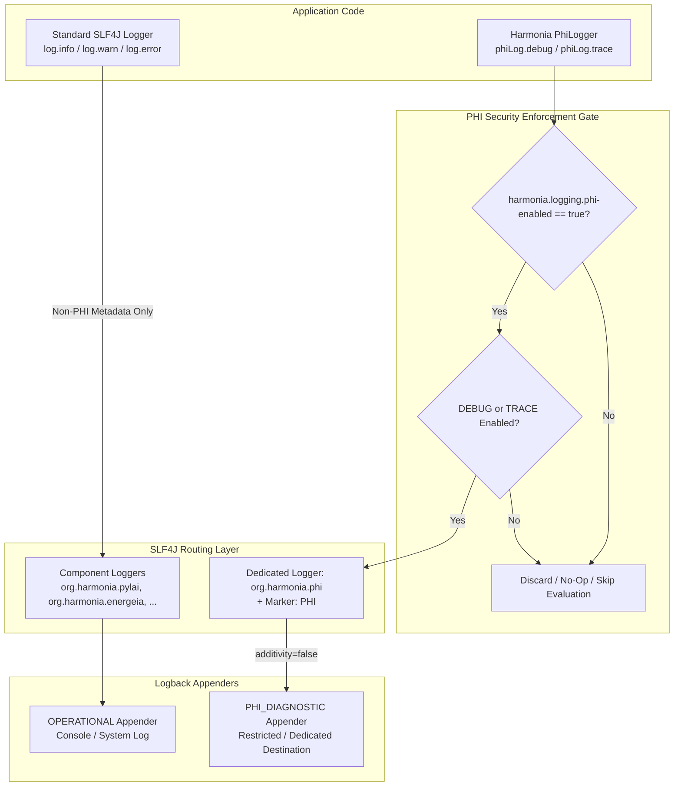

# Harmonia PHI-Aware Logging Architecture & Security Specification

## Overview

The Harmonia platform integrates distributed healthcare workflows processing HL7 v2.x messages and FHIR R5 resources across multiple clinical gateways and service tiers. To ensure compliance with HIPAA, GDPR, the Australian Privacy Act (APPs), and international data protection standards, Harmonia implements a platform-wide, architectural control mechanism for logging Patient Health Information (PHI).

Operational logs (`INFO`, `WARN`, `ERROR`) are guaranteed to remain strictly PHI-free. Diagnostic logging (`DEBUG`, `TRACE`) conditionally permits PHI only when an explicit global switch (`harmonia.logging.phi-enabled=true`) is active in conjunction with appropriate logger level configurations.

---

## Logging Policy Matrix

| Level | PHI Policy | Description |
| :--- | :--- | :--- |
| **TRACE** | **Conditional** | Deep protocol traces (e.g., raw HL7 segments, wire payloads). Permitted only when `harmonia.logging.phi-enabled=true` **AND** `TRACE` level is active. |
| **DEBUG** | **Conditional** | Granular diagnostic events (e.g., extracted patient demographics, FHIR resource representations). Permitted only when `harmonia.logging.phi-enabled=true` **AND** `DEBUG` level is active. |
| **INFO** | **Prohibited** | Standard operational lifecycle events, throughput metrics, task state transitions. Must **never** contain PHI. |
| **WARN** | **Prohibited** | Recoverable operational warnings, transient network retry notices. Must **never** contain PHI. |
| **ERROR** | **Prohibited** | Unhandled exceptions, routing failures, persistence errors. Must **never** contain PHI in messages, error codes, or attached throwable payloads. |

> **Definition of Conditional**: PHI diagnostic output is emitted **only** when both conditions are satisfied:
> 1. `harmonia.logging.phi-enabled=true` (or `HARMONIA_LOGGING_PHI_ENABLED=true`)
> 2. The underlying logger level is configured to `DEBUG` or `TRACE`

---

## Architectural Model & Security Gates



---

## Configuration & Environment Variables

| Configuration Property | Environment Variable | Default | Description |
| :--- | :--- | :--- | :--- |
| `harmonia.logging.phi-enabled` | `HARMONIA_LOGGING_PHI_ENABLED` | `false` | Global platform gate controlling whether PHI is evaluated and emitted in diagnostic logs. |

### Startup Notification Banner
When `harmonia.logging.phi-enabled=true`, the platform emits a single, prominent non-PHI warning banner to the operational log upon initialization:
```text
================================================================================
PHI diagnostic logging is ENABLED.
DEBUG/TRACE diagnostic logs may contain protected health information.
Ensure this setting is NOT active in untrusted or production environments without
appropriate PHI security controls and restricted destination appenders.
================================================================================
```

---

## Developer Guide & API Usage

### 1. Dual-Logger Pattern
In any Harmonia class that processes clinical messages or resources, instantiate two separate loggers:
```java
import net.fhirfactory.harmonia.logging.PhiLogger;
import net.fhirfactory.harmonia.logging.PhiLoggerFactory;
import org.slf4j.Logger;
import org.slf4j.LoggerFactory;

public class PatientIngressProcessor {

    // Standard SLF4J for operational non-PHI logging
    private static final Logger log = LoggerFactory.getLogger(PatientIngressProcessor.class);

    // Harmonia PhiLogger for conditionally permitted PHI diagnostics
    private static final PhiLogger phiLog = PhiLoggerFactory.getLogger(PatientIngressProcessor.class);

    public void process(Task task, Patient patient, String rawHl7) {
        // Operational logging: ONLY non-PHI identifiers, resource types, and task statuses
        log.info("Processing inbound patient ingress: taskId={}, status={}",
                task.getIdPart(), task.getStatus());

        // PHI Diagnostic logging: Patient names, MRNs, DOBs, and raw payloads
        phiLog.debug("Extracted patient demographics: id={}, name={}, mrn={}",
                patient.getIdPart(), patient.getNameFirstRep().getNameAsSingleString(), patient.getIdentifierFirstRep().getValue());

        phiLog.trace("Inbound raw HL7 payload: {}", rawHl7);
    }
}
```

### 2. Compile-Time Safety
`PhiLogger` intentionally exposes **only** `debug(...)` and `trace(...)` signatures. Methods for `info(...)`, `warn(...)`, or `error(...)` do not exist on the interface, preventing developers from accidentally emitting PHI at operational severity levels.

### 3. Lazy Evaluation with Suppliers
To prevent performance degradation and memory allocations when PHI logging is disabled, pass `Supplier<?>` lambdas for expensive transformations:
```java
phiLog.debug("FHIR Resource serialization: {}", () -> fhirContext.newJsonParser().encodeResourceToString(bundle));
```
Suppliers are executed **only** if both `harmonia.logging.phi-enabled=true` and `DEBUG`/`TRACE` level are active.

---

## Exception Handling & Stack Trace Sanitization

Exception messages and stack traces often propagate to operational error logs. Therefore, exceptions must never be constructed containing clinical data or patient names:

- **BAD**: `throw new ValidationException("Patient " + patient.getName() + " missing Medicare number");`
- **GOOD**: `throw new ValidationException("Patient demographic validation failure", "ERR_PAT_001");`

Diagnostic details can be recorded separately via `phiLog.debug(...)` before throwing or handling the exception.

---

## MDC (Mapped Diagnostic Context) Rules

MDC provides correlation and tracing context across threads and message boundaries.

- **Permitted Operational MDC Keys**:
  - `correlationId`
  - `praxisId`
  - `pragmaId`
  - `ergonId`
  - `taskId`
  - `messageControlId`
  - `interfaceId`
  - `component`

- **Strictly Prohibited in MDC**:
  - Patient names, initials, family names
  - Dates of birth (DOBs), ages
  - Medical Record Numbers (MRNs), Medicare numbers, SSNs
  - Clinical observations, lab results, diagnoses
  - Raw HL7 message strings or FHIR JSON payloads

---

## Secrets Prohibition (Always Prohibited)

PHI diagnostic mode conditionally allows clinical health information for troubleshooting, but **NEVER** permits security secrets. The following must never appear in logs at any level:
- Passwords and database credentials
- OAuth access tokens, refresh tokens, and JWTs
- API keys, client secrets, and bearer tokens
- Private keys, certificates, and keystore passwords
- ActiveMQ Artemis broker authentication credentials

---

## Appender Routing & Logback Configuration

### Dedicated Namespace & Marker
Under the hood, `PhiLogger` emits events with:
- **Namespace**: `org.harmonia.phi`
- **SLF4J Marker**: `PHI`

### Production Logback Configuration Template
```xml
<configuration>
    <!-- Operational Log Appender (Console / Central Log Aggregator) -->
    <appender name="OPERATIONAL_CONSOLE" class="ch.qos.logback.core.ConsoleAppender">
        <encoder>
            <pattern>%d{yyyy-MM-dd HH:mm:ss.SSS} [%thread] %-5level %logger{36} - %msg%n</pattern>
        </encoder>
    </appender>

    <!-- Dedicated PHI Diagnostic Appender (Restricted Storage / Encrypted Volume) -->
    <appender name="PHI_DIAGNOSTIC" class="ch.qos.logback.core.rolling.RollingFileAppender">
        <file>/var/log/harmonia/phi-diagnostic.log</file>
        <rollingPolicy class="ch.qos.logback.core.rolling.TimeBasedRollingPolicy">
            <fileNamePattern>/var/log/harmonia/phi-diagnostic-%d{yyyy-MM-dd}.log.gz</fileNamePattern>
            <!-- Strict retention: max 7 days -->
            <maxHistory>7</maxHistory>
            <totalSizeCap>10GB</totalSizeCap>
        </rollingPolicy>
        <encoder>
            <pattern>%d{yyyy-MM-dd HH:mm:ss.SSS} [%thread] %-5level [%marker] %logger{36} - %msg%n</pattern>
        </encoder>
    </appender>

    <!-- Root Operational Logger -->
    <root level="INFO">
        <appender-ref ref="OPERATIONAL_CONSOLE" />
    </root>

    <!-- PHI Logger: additivity="false" guarantees zero propagation to root/operational appenders -->
    <logger name="org.harmonia.phi" level="DEBUG" additivity="false">
        <appender-ref ref="PHI_DIAGNOSTIC" />
    </logger>
</configuration>
```

---

## Infrastructure & Operational Security Controls

PHI diagnostic log stores require elevated security controls:
1. **Encryption in Transit**: Forwarding to SIEM/storage destinations must use TLS 1.3 with mutual authentication.
2. **Encryption at Rest**: Storage volumes housing `phi-diagnostic.log` must use AES-256 disk or filesystem encryption.
3. **Access Controls & RBAC**: Access restricted exclusively to authorized Security Officers and compliance auditors.
4. **Retention & Expiry**: Maximum retention window of 7 days, enforced via automated purge policies.
5. **Fail-Safe Behavior**: If the PHI destination becomes unavailable, diagnostic logs are safely dropped; events are never redirected to operational logs.
