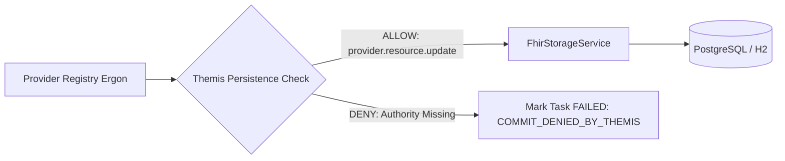

# Provider Registry & Persistence Security

## 1. Overview

The FHIR Provider Registry manages authoritative healthcare provider master data across 7 core resource types:
- `Practitioner`
- `PractitionerRole`
- `Organization`
- `Location`
- `HealthcareService`
- `Endpoint`
- `Group`

All resources in this domain carry the authoritative security label `PROVIDER_REGISTRY` alongside classification `INTERNAL`.

---

## 2. Independent Persistence Gate

`AbstractProviderRegistryChangeErgon` and `FhirStorageService` independently evaluate `ThemisService` before committing database mutations:

### Authorities Required for Persistence
- Direct Creation: `provider.resource.create`
- Direct Modification: `provider.resource.update`
- Soft Deletion: `provider.resource.delete`
- Administrative Override: `provider.admin`

---

## 3. Defense-in-Depth Validation
Removing or revoking persistence authorities from an Ergon worker or background processor halts state mutation at the storage boundary, even if the request was accepted by Pylai and dispatched by Ponos.
