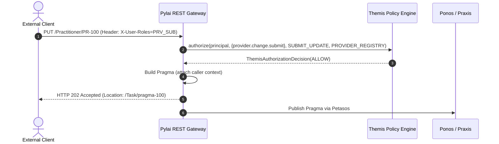

# Pylai Ingress Security Enforcement

## 1. Overview

**Pylai** hosts the external API boundaries of Harmonia, including the FHIR Provider Registry REST gateway.

`FhirSecurityInterceptor` intercepts incoming requests, derives the `ThemisPrincipal`, translates granted mnemonic roles (`X-User-Roles`) and scopes (`X-Security-Scopes`) into granular `ThemisAuthority` sets, and evaluates ingress policy via `ThemisService`.

---

## 2. Ingress Interaction Mapping

| HTTP Method | FHIR Interaction | Mapped `ThemisAction` | Evaluated Policy |
| :--- | :--- | :--- | :--- |
| `GET /Practitioner/{id}` | Read | `READ` | `ProviderRegistryReadPolicy` |
| `GET /Practitioner?...` | Search | `SEARCH` | `ProviderRegistryReadPolicy` |
| `POST /Practitioner` | Create Change Request | `SUBMIT_CREATE` | `ProviderRegistrySubmitPolicy` |
| `PUT /Practitioner/{id}` | Update Change Request | `SUBMIT_UPDATE` | `ProviderRegistrySubmitPolicy` |
| `GET /metadata` | Capability Statement | Unrestricted (Public) | Unrestricted |

---

## 3. Asynchronous Task Creation Flow

