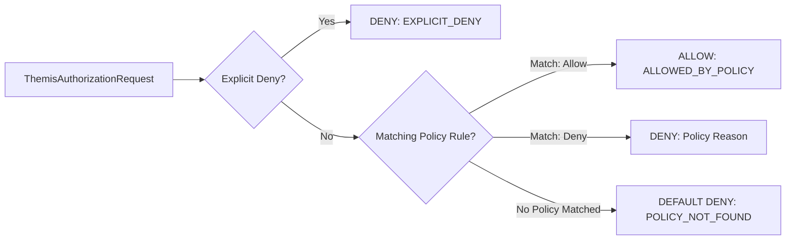

# Themis: Policy & Authorisation Service

## 1. Subsystem Overview

**Themis** is the Harmonia subsystem responsible for deterministic policy evaluation, role-to-authority mapping, data security label validation, and decision auditing.

Themis answers the question:
> **Are you permitted to perform this action on this resource in this security context?**

Themis is decoupled from authentication:
- **Authentication** answers: *"Who are you?"* (handled upstream at Pylai / IDP).
- **Themis** answers: *"Are you permitted to do this?"*

---

## 2. Module Structure

```
themis/
├── themis-api/       # Artemis/Spring/FHIR-independent domain contracts, reason codes, models
├── themis-core/      # Deterministic default-deny policy evaluator, role maps, built-in policies
└── themis-audit/     # Structured non-PHI security decision audit service and correlation logger
```

---

## 3. Core Contract: `ThemisService`

```java
public interface ThemisService {
    ThemisAuthorizationDecision authorize(ThemisAuthorizationRequest request);
    ThemisAuthorizationDecision evaluate(ThemisAuthorizationRequest request);
}
```

### Authorization Request
```java
public record ThemisAuthorizationRequest(
    ThemisPrincipal principal,
    Set<ThemisAuthority> authorities,
    ThemisAction action,
    ThemisResource target,
    ThemisSecurityContext context
) {}
```

### Authorization Decision
```java
public record ThemisAuthorizationDecision(
    String decisionId,
    ThemisDecision decision, // ALLOW, DENY
    ThemisDecisionReason reason,
    String policyId,
    Instant evaluatedAt,
    String correlationId,
    String message
) {}
```

---

## 4. Deterministic Predicate Pipeline

The evaluation pipeline follows an unambiguous, deterministic sequence:



1. **Explicit Denials First**: If any applicable policy evaluates to `DENY` or explicit deny is active, evaluation immediately terminates with `DENY`.
2. **Policy Rule Matching**: Registered policies sorted by order are evaluated against target domain, resource type, action, and required authorities.
3. **Default Deny Fallback**: If no policy explicitly grants `ALLOW`, Themis fails closed to `DENY` with reason `POLICY_NOT_FOUND` or `AUTHORITY_MISSING`.
