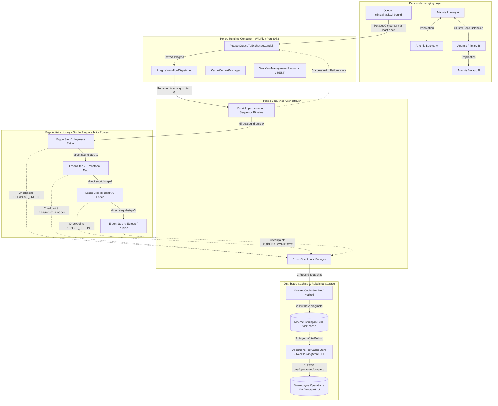
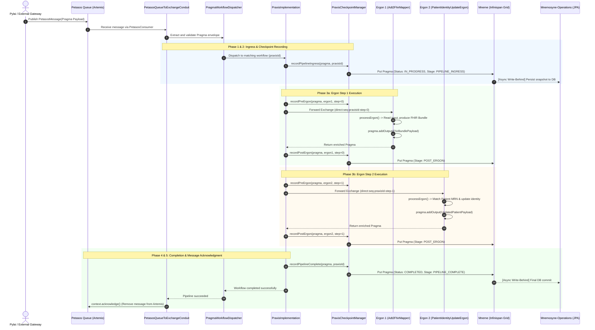

# Harmonia :: Energeia (Workflow Services)

**Energeia** (ἐνέργεια) is the high-performance workflow execution and task orchestration subsystem for the **Harmonia** Health Information Exchange (HIE) platform. It provides a modular, resilient, and event-driven pipeline architecture designed to ingest clinical messages, execute structured sequences of healthcare transformations, and maintain comprehensive state auditability across distributed caching and persistence tiers.

---

## 1. Overview & Classical Foundations

Harmonia grounds its architectural domain boundaries in Greek classical philosophy and mythology to clearly define operational responsibilities and maintain strict separation of concerns across the platform:

```
+---------------------------------------------------------------------------------------+
|                                    HARMONIA                                           |
|                     (Health Information Exchange Platform)                           |
+---------------------------------------------------------------------------------------+
|                                    ENERGEIA                                           |
|                           (Workflow Services Subsystem)                               |
|                                                                                       |
|   +-------------------+   +--------------------+   +------------------------------+   |
|   |       PONOS       |   |       PRAXIS       |   |             ERGA             |   |
|   | (Runtime Engine & |   | (Task Sequences &  |   | (Modular Task Activities &   |   |
|   | Camel Container)  |   | Workflow Pipelines)|   |  Camel Route Processors)     |   |
|   +-------------------+   +--------------------+   +------------------------------+   |
|             ^                       ^                             ^                   |
|             |                       |                             |                   |
|             +-----------------------+-----------------------------+                   |
|                                     |                                                 |
|                           [ PRAGMA TASK STATE ]                                       |
|                  (Canonical Model / FHIR Task Resource)                               |
+---------------------------------------------------------------------------------------+
        |                                                               |
        v                                                               v
+-------------------------------+                       +-------------------------------+
|            PETASOS            |                       |       MNEME / MNEMOSYNE       |
| (High-Availability Messaging  |                       | (Distributed Cache Grid &     |
|  & Transport Backbone)        |                       |  Operations Persistence)      |
+-------------------------------+                       +-------------------------------+
```

### Classical Nomenclature & System Meanings

| Concept / Module | Etymology & Classical Meaning | Platform Scope & Architectural Responsibility |
| :--- | :--- | :--- |
| **`Energeia`** (ἐνέργεια) | Aristotelian concept of *actuality*, *being-at-work*, *action*, and continuous operational energy. | The top-level workflow services aggregator module (`energeia/`) containing `erga`, `praxis`, `ponos`, and `ponos-cli`. Coordinates activity definitions, sequence orchestration, and runtime lifecycle. |
| **`Ponos`** (Πόνος) | Greek personification of *hard work*, *industrious toil*, *effort*, and continuous labor. | The WildFly Jakarta EE 10 runtime execution container (`energeia/ponos`) hosting Apache Camel contexts, Petasos queue consumers (`PetasosQueueToExchangeConduit`), workflow dispatchers, and health monitoring endpoints. |
| **`Praxis`** (πρᾶξις) | *Structured action*, *practice*, or the enactment of a theory through deliberate execution. | The workflow sequence orchestrator (`energeia/praxis`) that binds ordered sets of Ergon activities into a cohesive pipeline (`PraxisImplementation`), managing step transitions and checkpoint state. |
| **`Erga`** / **`Ergon`** / **`Ergo`** (ἔργα / ἔργον / ἔργῳ) | *Erga* (plural of *Ergon*): *works*, *tasks*, *actions*, or *deeds*. *Ergo* (dative): *by work* / *in action*. | The modular task activity framework (`energeia/erga`). An **`Ergon`** is a single-responsibility Camel route extending `ErgonBase` that inspects `Pragma.input`, executes a discrete transformation or enrichment, and populates `Pragma.output`. |
| **`Pragma`** (πρᾶγμα) | That which has been *done*, a *concrete deed*, *matter*, or *affair*. | The canonical task entity and state envelope (`calliope`) encapsulating inputs, outputs, execution checkpoints, metadata, and bidirectional mappings to FHIR R5 `Task` resources. |
| **`Petasos`** (πέτασος) | The winged hat worn by Hermes, messenger of the gods; symbol of swift, reliable dispatch. | The high-availability messaging backbone (`petasos/`) powered by clustered Apache ActiveMQ Artemis brokers, providing durable queue ingress, message redistribution, deduplication, and failover transport. |
| **`Mneme`** (Μνήμη) | Classical Muse of *active memory* and rapid recollection. | Distributed in-memory L1 cache grid (`hestia/mneme-cluster`) powered by Infinispan HotRod, providing low-latency `task-cache` and `tasksequence-cache` storage. |
| **`Mnemosyne`** (Μνημοσύνη) | Titaness of *memory* and enduring remembrance. | Durable L2 relational persistence tier (`hestia/mnemosyne-operations`) receiving asynchronous write-behind snapshots from Mneme via `OperationsRestCacheStore`. |
| **`Ponos CLI`** | Administrative and diagnostic tooling. | Command-line client (`energeia/ponos-cli`) for connecting to Ponos engines, triggering live reload of task sequences, verifying broker queues, and checking cluster readiness. |

---

## 2. Architecture & Subsystem Relationships

Energeia enforces a strict separation of concerns across message transport, engine hosting, sequence orchestration, task transformation, and distributed state persistence:



### Architectural Separation of Concerns

1. **Messaging Transport (`Petasos`)**: Transports opaque message envelopes with at-least-once delivery guarantees, journal replication, and server-side message distribution. Has zero knowledge of clinical payloads or internal transformation rules.
2. **Container Runtime (`Ponos`)**: Manages the Jakarta EE lifecycle, CDI dependency injection, Camel contexts, Petasos consumer threads, and REST administration endpoints.
3. **Workflow Orchestration (`Praxis`)**: Coordinates the ordered chaining of Ergon activities via synchronous Direct endpoints (`direct:seq-<praxisId>-step-<index>`), manages pipeline error handling, and orchestrates checkpoint lifecycle state.
4. **Task Activities (`Erga`)**: Pure, single-responsibility units of work extending `ErgonBase`. Each Ergon inspects its required inputs from `Pragma.getInput()`, executes its isolated transformation/enrichment logic, and appends resulting artifacts to `Pragma.getOutput()`.
5. **State & Caching (`Mneme`)**: High-throughput distributed L1 cache storing serialized `Pragma` instances in memory across clustered nodes for sub-millisecond checkpoint writes and instant failover recovery.
6. **Relational Operations Persistence (`Mnemosyne-Operations`)**: Durable L2 relational database receiving asynchronous write-behind updates from Mneme, enabling long-term audit logging and operational telemetry without blocking workflow execution.

---

## 3. End-to-End Workflow Execution Lifecycle

The journey of a clinical task through the Energeia workflow subsystem follows a deterministic 5-phase lifecycle:



### Execution Phase Details

1. **Phase 1: Ingress Consumption & Conduit Deserialization**:
   - `PetasosConsumer` polls the configured Artemis task queue (e.g. `clinical.tasks.inbound`).
   - `PetasosQueueToExchangeConduit` receives the `PetasosMessage`, decodes the payload, and instantiates or deserializes the canonical `Pragma` domain object.
   - Headers such as `PetasosMessageContext`, `correlationId`, `causationId`, and `pragmaId` are attached to the Apache Camel `Exchange`.

2. **Phase 2: Pipeline Initialization & Ingress Checkpoint**:
   - `PragmaWorkflowDispatcher` resolves the active `Praxis` workflow implementation matching the task's `praxisId` or `messageType`.
   - `PraxisCheckpointManager.recordPipelineIngress()` sets `PragmaStatus.IN_PROGRESS`, stamps a `PIPELINE_INGRESS` checkpoint, and synchronously writes the state to Mneme's `task-cache`.

3. **Phase 3: Sequential Ergon Activity Processing & Step Checkpoints**:
   - Praxis invokes Ergon routes sequentially over in-memory direct endpoints (`direct:seq-<praxisId>-step-<index>`).
   - Immediately prior to each step, a `PRE_ERGON` checkpoint is recorded.
   - The concrete `ErgonBase` implementation executes `processErgon(Pragma pragma, Exchange exchange)`:
     - Retrieves relevant input payloads using `pragma.getInput()` or outputs from prior steps via `pragma.getOutput()`.
     - Executes single-responsibility domain logic (e.g. HL7 v2 parsing, FHIR transformation, identifier cross-referencing).
     - Appends output payloads via `pragma.addOutput(ErgonPayload)`.
   - On exit from the Ergon route, a `POST_ERGON` checkpoint is recorded with step duration and output counts, updating the Mneme cache.

4. **Phase 4: Output Accumulation & Pipeline Completion**:
   - When all Ergon steps complete successfully, Praxis marks the task as `PragmaStatus.COMPLETED`.
   - `PraxisCheckpointManager.recordPipelineComplete()` writes the final state snapshot to Mneme.

5. **Phase 5: Petasos Acknowledgment & Error / DLQ Handling**:
   - Upon successful completion of Phase 4, `PetasosMessageContext.acknowledge()` is invoked, removing the durable message from Artemis.
   - If an unhandled exception or `ErgonException` occurs during any phase:
     - `PraxisCheckpointManager.recordPipelineFailed()` records a `PIPELINE_FAILED` checkpoint with stack trace and failure context to Mneme.
     - `PetasosMessageContext.reject(errorMessage)` is triggered, routing the message to the Dead Letter Queue (`DLQ`) or triggering Artemis redelivery based on the broker configuration.

---

## 4. Submodule Reference

Energeia is divided into four focused Maven submodules:

```
energeia/
  ├── pom.xml               # Multi-module parent aggregator
  ├── erga/                 # Modular Ergon task activity library & Camel routes
  ├── praxis/               # Workflow sequence orchestrator & checkpoint engine
  ├── ponos/                # WildFly Jakarta EE runtime container & Petasos conduits
  └── ponos-cli/            # Command-line interface for administration and sync
```

### 1. `energeia/erga` (Modular Task Activities)

`erga` provides the abstract base class and catalog of built-in, single-responsibility Camel route components.

* **Key Classes & Interfaces**:
  * `ErgonBase`: Abstract Camel `RouteBuilder` providing standard ingress validation, error handling, activity invocation (`processErgon`), and egress routing.
  * `ErgonException`: Standardized runtime exception capturing activity failure details, error codes, and source identifiers.
* **Built-in Erga Catalog**:
  * `Adt2FhirMapper`: Parses raw HL7 v2 ADT trigger event text and produces standard FHIR R5 resources (`Bundle`, `Patient`, `Encounter`).
  * `Mfn2FhirBundle`: Transforms HL7 v2 MFN master file notifications into FHIR `Practitioner`, `PractitionerRole`, and `Organization` bundles.
  * `ExtractPatientFromBundle`: Extracts and validates `Patient` resources from FHIR Bundles.
  * `ExtractPersonFromBundle` / `ExtractRelatedPersonFromBundle`: Extracts demographic entities from FHIR Bundles.
  * `PatientIdentityUpdateErgon`: Resolves and updates patient MRN, enterprise master patient indexes (EMPI), and identifier mappings.
  * `PatientDemographicsUpdateErgon`: Merges and updates patient demographic attributes (names, telecom, addresses, contact persons).

### 2. `energeia/praxis` (Workflow Sequence Orchestration)

`praxis` defines the workflow structures, sequential chaining mechanisms, and state snapshotting services.

* **Key Classes & Interfaces**:
  * `Praxis`: Core workflow interface defining sequence metadata, ordered Ergon step lists, and execution triggers.
  * `PraxisImplementation`: Concrete workflow orchestrator chaining Ergon routes over dynamic Camel direct endpoints (`direct:seq-<praxisId>-step-<stepIndex>`).
  * `PraxisCheckpointManager`: Thread-safe manager responsible for creating, stamping, and persisting the 5-phase Pragma checkpoints.
  * `PragmaCacheService`: Client interfacing with the Mneme Infinispan HotRod `task-cache`.
  * `TaskSequenceLoader`: Loads and registers workflow definitions from JSON/YAML descriptor files.
  * `TaskSequenceDefaultSeeder`: Seeds standard clinical integration workflows on startup.
  * `PraxisService`: CDI service providing workflow lifecycle operations, status queries, and cache synchronization.

### 3. `energeia/ponos` (Runtime Execution Container)

`ponos` packages the WildFly Jakarta EE 10 application runtime, hosting Camel contexts and messaging conduits.

* **Key Classes & Interfaces**:
  * `PetasosQueueToExchangeConduit`: Bridges Petasos Artemis queues to Camel exchanges using `PetasosConsumer` with lifecycle acknowledgements.
  * `PragmaWorkflowDispatcher`: Matches incoming task requests to their registered Praxis sequences and dispatches exchanges.
  * `CamelContextManager`: Manages the lifecycle of Apache Camel contexts, registering Ergon routes and starting consumers.
  * `TaskProcessorRouteBuilder`: Core routing engine consuming tasks from message queues and coordinating thread pools.
  * `WorkflowManagementResource`: JAX-RS REST management endpoint (`/api/workflow`) exposing runtime reload, synchronization, and health endpoints.
  * `ArtemisBrokerManager`: Manages local embedded or remote Artemis JMS broker connections.

### 4. `energeia/ponos-cli` (Operational CLI)

`ponos-cli` is a standalone command-line application for DevOps and integration engineers to inspect and control running Ponos instances.

* **Key Features**:
  * Picocli-based interactive and scriptable CLI with structured JSON/table outputs.
  * Commands:
    * `ponos-cli --status`: Queries broker connections, active Camel routes, and loaded workflow sequences.
    * `ponos-cli --reload` / `--sync`: Triggers live reload and synchronization of message queues and task sequences without restarting WildFly.
    * `ponos-cli --validate`: Validates queue names and task sequence definitions against the runtime environment.
    * `ponos-cli --list-modules`: Lists all cluster modules and operational readiness statuses.

---

## 5. State Management & Checkpointing Model

### Canonical Pragma Data Model

`Pragma` (`net.fhirfactory.harmonia.model.pragma.Pragma`) represents the single source of truth for task state during execution:

```
+---------------------------------------------------------------------------------------+
|                                    PRAGMA                                             |
+---------------------------------------------------------------------------------------+
| - pragmaId        : String (UUID)                                                     |
| - correlationId   : String (End-to-End Tracking ID)                                   |
| - causationId     : String (Parent Event / Message ID)                                |
| - praxisId        : String (Workflow Identifier)                                      |
| - status          : PragmaStatus (DRAFT, REQUESTED, IN_PROGRESS, COMPLETED, FAILED)   |
| - priority        : Integer (1-100)                                                   |
| - authoredOn      : Date                                                              |
| - lastModified    : Date                                                              |
| - source          : String (e.g. "pylai-mllp-gateway")                                |
| - destination     : String (e.g. "clinical.tasks.inbound")                            |
| - input           : List<ErgonPayload> (Original & upstream payloads)                 |
| - output          : List<ErgonPayload> (Accumulated activity outputs)                 |
| - checkpoints     : List<PragmaCheckpoint> (Audit trajectory)                         |
| - metadata        : Map<String, String>                                               |
+---------------------------------------------------------------------------------------+
```

### The 5-Phase Checkpoint Lifecycle

At each execution boundary, `PraxisCheckpointManager` records an immutable `PragmaCheckpoint`:

| Stage Constant | Trigger Point | Recorded Data | Target Status |
| :--- | :--- | :--- | :--- |
| `PIPELINE_INGRESS` | Task received by Ponos conduit from Petasos queue. | Step `0`, ingress timestamp, source queue, correlation ID. | `IN_PROGRESS` |
| `PRE_ERGON` | Immediately prior to invoking an individual Ergon step. | `stepIndex`, active `ergonId`, input payload count. | `IN_PROGRESS` |
| `POST_ERGON` | Immediately after an Ergon step returns successfully. | `stepIndex`, `ergonId`, generated output count, duration. | `IN_PROGRESS` |
| `PIPELINE_COMPLETE` | All Ergon activities in the sequence have completed. | Final step index, total outputs count, total execution time. | `COMPLETED` |
| `PIPELINE_FAILED` | Unhandled error or `ErgonException` raised by any Ergon. | Faulting step index, `ergonId`, exception class, stack trace. | `FAILED` |

### Dual-Tier Caching & Write-Behind Persistence

```
+--------------------+      Synchronous Put       +------------------------------+
| PraxisCheckpoint   | -------------------------> |        Mneme L1 Grid         |
|      Manager       |    (Sub-millisecond write) | (Infinispan 'task-cache')    |
+--------------------+                            +------------------------------+
                                                                 |
                                                                 | Async Queue (Write-Behind)
                                                                 v
                                                  +------------------------------+
                                                  |   OperationsRestCacheStore   |
                                                  |   (Custom NonBlockingStore)  |
                                                  +------------------------------+
                                                                 |
                                                                 | HTTP POST / PUT
                                                                 v
                                                  +------------------------------+
                                                  |    Mnemosyne Operations      |
                                                  |    REST Service / JPA DB     |
                                                  | (/api/operations/pragma/{id})|
                                                  +------------------------------+
```

1. **L1 In-Memory Cache (`Mneme`)**: Checkpoint operations write directly to the local Infinispan cache segment via HotRod. Writes complete in under `1ms`, ensuring that high-throughput clinical streams are not delayed by relational database locking or latency.
2. **L2 Relational Persistence (`Mnemosyne-Operations`)**: Infinispan's configured `OperationsRestCacheStore` asynchronously drains queued modifications via HTTP REST calls to `mnemosyne-operations`, persisting the full Pragma JSON document and checkpoint history into PostgreSQL tables for long-term auditing and reporting.

---

## 6. Developer How-To Guide

### 1. Creating a New Ergon Activity

To create a new task activity, extend `ErgonBase` and implement `processErgon`:

```java
package com.example.workflow.erga;

import jakarta.enterprise.context.ApplicationScoped;
import net.fhirfactory.harmonia.erga.base.ErgonBase;
import net.fhirfactory.harmonia.erga.base.ErgonException;
import net.fhirfactory.harmonia.model.ergon.ErgonPayload;
import net.fhirfactory.harmonia.model.pragma.Pragma;
import org.apache.camel.Exchange;
import org.hl7.fhir.r5.model.Patient;

@ApplicationScoped
public class PatientValidationErgon extends ErgonBase {

    public static final String ERGON_ID = "PatientValidationErgon";

    @Override
    public String getErgonId() {
        return ERGON_ID;
    }

    @Override
    public String getErgonDescription() {
        return "Validates patient identifiers and mandatory demographic attributes";
    }

    @Override
    protected void processErgon(Pragma pragma, Exchange exchange) throws Exception {
        // 1. Extract relevant payload from Pragma input or previous step output
        ErgonPayload patientPayload = pragma.getOutput().stream()
                .filter(p -> "Patient".equals(p.getPayloadType()))
                .findFirst()
                .orElseGet(() -> pragma.getInput().stream()
                        .filter(p -> "Patient".equals(p.getPayloadType()))
                        .findFirst()
                        .orElse(null));

        if (patientPayload == null) {
            throw new ErgonException(ERGON_ID, "MISSING_PAYLOAD", "No Patient payload found in Pragma input/output");
        }

        // 2. Perform domain processing / validation
        String patientJson = patientPayload.getPayload();
        Patient patient = getFhirContext().newJsonParser().parseResource(Patient.class, patientJson);

        if (!patient.hasIdentifier()) {
            throw new ErgonException(ERGON_ID, "INVALID_PATIENT", "Patient resource must contain at least one identifier");
        }

        // 3. Attach output artifacts to Pragma
        ErgonPayload validationResult = new ErgonPayload();
        validationResult.setPayloadType("ValidationReport");
        validationResult.setPayload("{\"status\":\"VALID\",\"identifierCount\":" + patient.getIdentifier().size() + "}");
        
        pragma.addOutput(validationResult);
        log.info("[{}] Successfully validated Patient/{}", ERGON_ID, patient.getId());
    }
}
```

### 2. Composing an Ordered Praxis Sequence

Workflows are composed by assembling Ergon beans in sequential order within a `PraxisImplementation`:

```java
package com.example.workflow.praxis;

import jakarta.annotation.PostConstruct;
import jakarta.enterprise.context.ApplicationScoped;
import jakarta.inject.Inject;
import net.fhirfactory.harmonia.erga.hl7v2x.Adt2FhirMapper;
import net.fhirfactory.harmonia.erga.patient.identity.PatientIdentityUpdateErgon;
import net.fhirfactory.harmonia.praxis.sequence.PraxisCheckpointManager;
import net.fhirfactory.harmonia.praxis.sequence.PraxisImplementation;
import org.apache.camel.CamelContext;

import java.util.List;

@ApplicationScoped
public class AdtProcessingPraxis extends PraxisImplementation {

    public static final String PRAXIS_ID = "AdtProcessingWorkflow";

    @Inject
    private Adt2FhirMapper adtMapper;

    @Inject
    private PatientValidationErgon patientValidator;

    @Inject
    private PatientIdentityUpdateErgon identityUpdater;

    @Inject
    private PraxisCheckpointManager checkpointManager;

    @Inject
    private CamelContext camelContext;

    @PostConstruct
    public void init() {
        setPraxisId(PRAXIS_ID);
        setPraxisName("HL7 ADT Ingestion and Identity Sync Workflow");
        setCheckpointManager(checkpointManager);
        setCamelContext(camelContext);

        // Define the sequential order of Ergon activities
        setErgonSequence(List.of(
                adtMapper,          // Step 0: HL7 v2 -> FHIR Bundle
                patientValidator,   // Step 1: Validate Patient Resource
                identityUpdater     // Step 2: Update EMPI / Identifiers
        ));

        // Build and register the dynamic Camel routes
        buildPipelineRoutes();
    }
}
```

### 3. Binding a Petasos Queue to a Workflow Conduit

Connect incoming messages from a Petasos Artemis queue to the workflow dispatcher:

```java
package com.example.workflow.conduit;

import jakarta.annotation.PostConstruct;
import jakarta.enterprise.context.ApplicationScoped;
import jakarta.inject.Inject;
import net.fhirfactory.harmonia.petasos.api.Petasos;
import net.fhirfactory.harmonia.petasos.api.destination.PetasosDestination;
import net.fhirfactory.harmonia.praxis.conduit.PetasosQueueToExchangeConduit;
import net.fhirfactory.harmonia.praxis.conduit.PragmaWorkflowDispatcher;

@ApplicationScoped
public class ClinicalTaskIngressConduit {

    @Inject
    private Petasos petasos;

    @Inject
    private PragmaWorkflowDispatcher workflowDispatcher;

    private PetasosQueueToExchangeConduit conduit;

    @PostConstruct
    public void start() {
        PetasosDestination queue = PetasosDestination.queue("clinical.tasks.inbound");
        
        conduit = new PetasosQueueToExchangeConduit(petasos, queue, workflowDispatcher);
        conduit.start();
    }
}
```

### 4. Writing Automated Camel Integration Tests

Unit and integration tests verify the end-to-end execution of Erga sequences:

```java
package com.example.workflow;

import net.fhirfactory.harmonia.model.ergon.ErgonPayload;
import net.fhirfactory.harmonia.model.pragma.Pragma;
import net.fhirfactory.harmonia.model.pragma.PragmaStatus;
import net.fhirfactory.harmonia.praxis.sequence.PraxisCheckpointManager;
import org.apache.camel.CamelContext;
import org.apache.camel.ProducerTemplate;
import org.apache.camel.impl.DefaultCamelContext;
import org.junit.jupiter.api.BeforeEach;
import org.junit.jupiter.api.Test;
import org.mockito.Mockito;

import static org.junit.jupiter.api.Assertions.*;

public class WorkflowIntegrationTest {

    private CamelContext context;
    private ProducerTemplate template;
    private PraxisCheckpointManager checkpointManager;

    @BeforeEach
    void setup() throws Exception {
        context = new DefaultCamelContext();
        checkpointManager = Mockito.mock(PraxisCheckpointManager.class);
        context.start();
        template = context.createProducerTemplate();
    }

    @Test
    void testSuccessfulWorkflowExecution() {
        // 1. Prepare input Pragma
        Pragma pragma = new Pragma();
        pragma.setPraxisId("AdtProcessingWorkflow");
        pragma.addInput(new ErgonPayload("HL7v2", "MSH|^~\\&|EPIC|HOSP|HARMONIA|HIE|20260914080000||ADT^A08|MSG001|P|2.4\rPID|1||MRN123^^^HOSP||DOE^JOHN||19800101|M"));

        // 2. Execute pipeline
        Pragma result = template.requestBody("direct:seq-AdtProcessingWorkflow-step-0", pragma, Pragma.class);

        // 3. Verify assertions
        assertNotNull(result);
        assertEquals(PragmaStatus.COMPLETED, result.getStatus());
        assertFalse(result.getOutput().isEmpty());
    }
}
```

---

## 7. Operations & Administration

### Running Ponos with Docker Compose

Ponos runs as part of the Harmonia 5-tier architecture:

```bash
# Start Ponos WorkEngine alongside Artemis, Infinispan, and PostgreSQL
docker compose up -d hie-task-processor

# Inspect container status and logs
docker compose ps hie-task-processor
docker compose logs -f hie-task-processor
```

### Using Ponos CLI for Diagnostics & Management

The `ponos-cli` tool provides runtime inspection and live synchronization:

```bash
# 1. Query runtime status (Artemis broker, Camel routes, loaded sequences)
ponos-cli --status --server-url http://localhost:8083

# 2. Trigger live reload of queue bindings and task sequences
ponos-cli --reload --server-url http://localhost:8083

# 3. Validate runtime configurations
ponos-cli --validate --output table

# 4. List registered cluster modules and operational readiness
ponos-cli --list-modules --output json --pretty
```

### Failure Recovery & Resilience

* **Broker HA Failover**: If the primary Artemis broker fails, Petasos client reconnection logic (`reconnectAttempts = -1`) automatically reconnects Ponos consumers to the active backup broker without losing in-flight task messages.
* **Checkpoint Recovery**: If a worker node crashes mid-pipeline, the task remains unacknowledged in Artemis. Upon redelivery or redistribution to another active Ponos node, the engine inspects the latest `PragmaCheckpoint` in Mneme's `task-cache` and resumes execution from the last successful stage.
* **Dead Letter Queue (`DLQ`)**: Tasks that fail validation or throw unrecoverable errors are logged to `PIPELINE_FAILED` in Mnemosyne and routed to the Artemis `DLQ` for manual inspection and replay.
