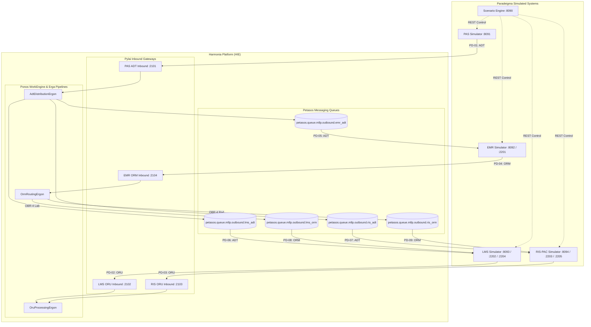

# Harmonia Paradeigma — HL7 v2 Reference Solution

**Harmonia Paradeigma** is an end-to-end runnable exemplar demonstrating representative HL7 v2.4 clinical workflows across simulated healthcare systems interacting with the Harmonia Health Integration Environment (HIE).

---

## Simulated Healthcare Applications

1. **PAS (Patient Administration System)** (`paradeigma-pas` :8091)
   - Generates stateful ADT lifecycle events: `A04` (Register) -> `A01` (Admit) -> `A02` (Transfer) -> `A08` (Update) -> `A03` (Discharge).
   - Ingests into Harmonia on MLLP port `2101` (PD-01).

2. **EMR (Electronic Medical Record)** (`paradeigma-emr` :8092)
   - Ingests fan-out ADT messages on MLLP port `2201` (PD-05).
   - Places Laboratory and Diagnostic Imaging `ORM^O01` orders to Harmonia on MLLP port `2104` (PD-04).

3. **LMS (Laboratory Management System)** (`paradeigma-lms` :8093)
   - Ingests fan-out ADT messages on MLLP port `2202` (PD-06) and routed Lab ORM orders on MLLP port `2204` (PD-08).
   - Produces synthetic `ORU^R01` pathology results (Haemoglobin, WBC, Potassium, Sodium, etc.) to Harmonia on MLLP port `2102` (PD-02).

4. **RIS-PAC (Diagnostic Imaging & PACS)** (`paradeigma-rispac` :8094)
   - Ingests fan-out ADT messages on MLLP port `2203` (PD-07) and routed Diagnostic Imaging ORM orders on MLLP port `2205` (PD-09).
   - Produces synthetic `ORU^R01` radiology reports (Chest X-Ray, CT Head, MRI Brain) to Harmonia on MLLP port `2103` (PD-03).

5. **Scenario Conductor Engine** (`paradeigma-scenarios` :8090)
   - Orchestrates automated multi-system patient journeys via REST management APIs across `DEMO`, `TEST`, and `LOAD` execution profiles.

---

## Architecture Overview

---

## Documentation Index

- [Architecture & Design](docs/architecture.md)
- [Interface Catalogue (PD-01 to PD-09)](docs/interfaces.md)
- [HL7 Event Specifications](docs/hl7-events.md)
- [PAS Simulator Guide](docs/pas-simulator.md)
- [EMR Simulator Guide](docs/emr-simulator.md)
- [LMS Simulator Guide](docs/lms-simulator.md)
- [RIS-PAC Simulator Guide](docs/rispac-simulator.md)
- [Scenario Engine & Patient Journey](docs/scenarios.md)
- [Failure Simulation & Resilience Testing](docs/failure-testing.md)
- [Running Paradeigma Locally & Docker Deployment](docs/running-paradeigma.md)
- [Troubleshooting Guide](docs/troubleshooting.md)
