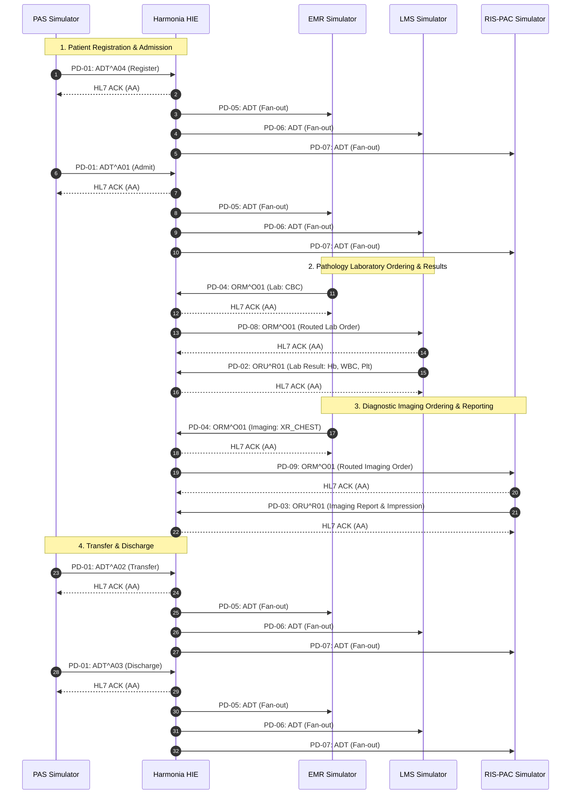

# Harmonia Paradeigma — Architecture & Design

### Architecture Principles
1. **Pylai receives and exposes interfaces**: All external ingress and egress traffic uses standard MLLP transport framing (`<VT>...<FS><CR>`) over TCP/IP with immediate HL7 ACK correlation (MSH-10/MSA).
2. **Petasos transports messages**: High-reliability message bus built on ActiveMQ Artemis and Infinispan, providing durable persistence, deduplication, and topic/queue delivery.
3. **Ponos performs the work**: Task execution engine routing tasks through `Praxis` workflows.
4. **Erga defines the work**: Modular, single-responsibility processing activities (`AdtDistributionErgon`, `OrmRoutingErgon`, `OruProcessingErgon`).
5. **Calliope defines shared canonical models**: Provides `Topic`, `ErgonPayload`, and `Pragma` domain structures.

---

### Sequence Diagram: Patient Journey Workflow

