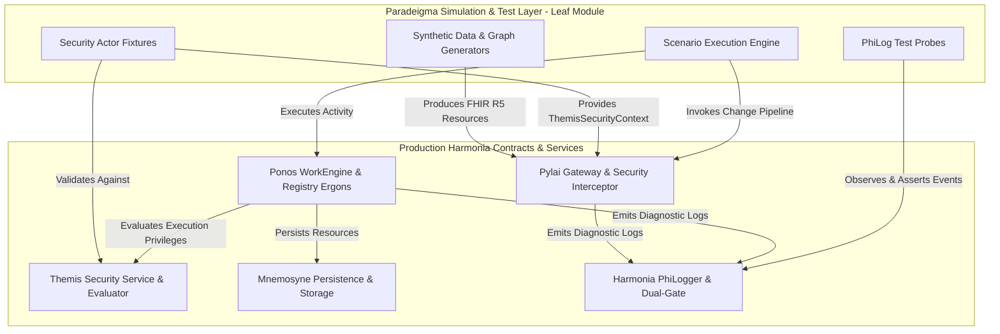
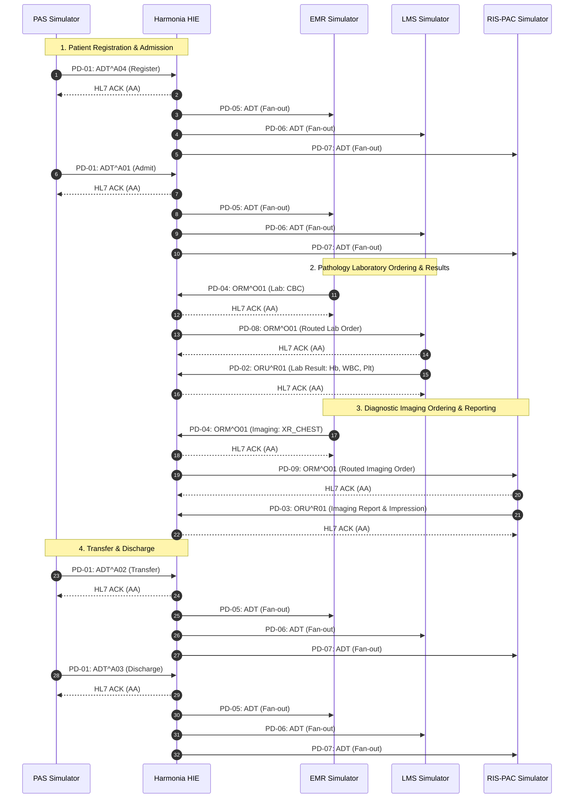

# Harmonia Paradeigma — Architecture & Design

### 1. Architectural Role & Isolation Principles

**Harmonia Paradeigma** acts strictly as a **simulation and test-support leaf module**. It exercises, tests, and observes public Harmonia production contracts without implementing production business logic or polluting production artifacts.



#### Mandatory Architectural Invariants
1. **Allowed Dependency Direction**: `Paradeigma -> Production Harmonia` (Allowed). `Production Harmonia -> Paradeigma` (Forbidden).
2. **Zero Production Contamination**: No production Java class may import `net.fhirfactory.harmonia.paradeigma.*`.
3. **No Simulation Flags in Production**: Production business logic contains no `if (isSimulation)` or `if (paradeigmaMode)` branches.
4. **Failure Injection via Seams**: Negative and failure scenarios use explicit architectural seams (interfaces, test repository fakes, mock storage), never runtime flags.
5. **Build-Time Enforcement**: Enforced by ArchUnit (`ParadeigmaIsolationArchitectureTest`) and Maven POM dependency validation.

---

### 2. Governed Provider Registry Write Lifecycle

Every Provider Registry write (POST/PUT) is processed as an asynchronous **Request for Change** governed by Themis and Ponos:

```mermaid
sequenceDiagram
    autonumber
    participant Actor as Paradeigma (Provider Steward)
    participant Pylai as Pylai REST Gateway
    participant Themis as Themis Security
    participant Ponos as Ponos / Ergon
    participant Mneme as Mnemosyne Storage
    participant PhiLog as Harmonia PhiLogger

    Actor->>Pylai: POST /Practitioner (FHIR R5 JSON + Bearer Token)
    Pylai->>Themis: Authorize Request (ThemisSecurityContext, Action=CREATE)
    Themis-->>Pylai: ThemisDecision.ALLOW
    Pylai->>PhiLog: Diagnostic Ingress Trace (org.harmonia.phi + Marker PHI)
    Pylai-->>Actor: HTTP 202 Accepted (Location: /Task/{pragmaId}, X-Correlation-Id)

    Pylai->>Ponos: Dispatch Pragma (Status: RECEIVED -> VALIDATING)
    Ponos->>Themis: Authorize Async Execution (Submitter + Ergon Authorities)
    Themis-->>Ponos: ThemisDecision.ALLOW
    Ponos->>Ponos: Validate Identifiers (HPI-I) & References
    Ponos->>Ponos: Transition to APPROVED -> COMMITTING
    Ponos->>Mneme: Persist Practitioner & Increment Version (v1)
    Mneme-->>Ponos: Committed
    Ponos->>Ponos: Transition to COMPLETED (Store Result in Task.output)

    Actor->>Pylai: GET /Task/{pragmaId}
    Pylai-->>Actor: HTTP 200 OK (Task status=completed)
    Actor->>Pylai: GET /Practitioner/{id}
    Pylai-->>Actor: HTTP 200 OK (ETag: W/"1", Practitioner resource)
```

---

### 3. Patient Journey Clinical Workflow


