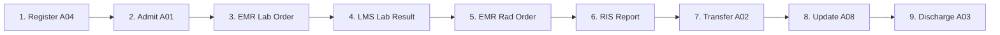

# Harmonia Paradeigma — Scenario Engine & Patient Journeys

### Overview
The `ParadeigmaScenarioEngine` (`paradeigma-scenarios` :8090) coordinates multi-system clinical scenarios across the four simulated healthcare applications by communicating with their REST management APIs while all clinical messaging traverses Harmonia via MLLP/TCP.

---

### Patient Journey Workflow Steps

1. **`PAS Register Patient (ADT^A04)`**: Creates synthetic patient demographics and initiates encounter.
2. **`PAS Admit Patient (ADT^A01)`**: Formally admits patient to hospital inpatient ward (`WARD-3A`).
3. **`EMR Place Pathology Order (ORM^O01 CBC)`**: Orders Full Blood Count.
4. **`LMS Produce Pathology Result (ORU^R01 CBC)`**: Generates numeric observations (Hb, WBC, Plt, Hct).
5. **`EMR Place Diagnostic Imaging Order (ORM^O01 XR_CHEST)`**: Orders Chest Radiograph.
6. **`RIS-PAC Produce Diagnostic Imaging Result (ORU^R01 XR_CHEST)`**: Produces structured radiology report.
7. **`PAS Transfer Patient (ADT^A02)`**: Transfers patient from `WARD-3A` to `WARD-4B` / `ICU`.
8. **`PAS Update Patient Information (ADT^A08)`**: Updates patient contact information.
9. **`PAS Discharge Patient (ADT^A03)`**: Discharges patient from encounter.

---

### Execution Profiles
- **`TEST` Profile**: High-speed deterministic execution (10–50 ms pacing) tailored for automated unit and CI integration tests.
- **`DEMO` Profile**: Observable human pacing (2–10 seconds between steps) suited for live platform demonstrations.
- **`LOAD` Profile**: Concurrent execution of multiple simultaneous patient journeys to exercise system concurrency and queue buffering.

---

### REST Control API
- `POST /api/scenarios/journey`: Executes a single end-to-end patient journey.
- `POST /api/scenarios/concurrent?count=5&profile=TEST`: Executes N concurrent patient journeys.
- `GET /api/scenarios/status`: Returns aggregated performance and success metrics.
